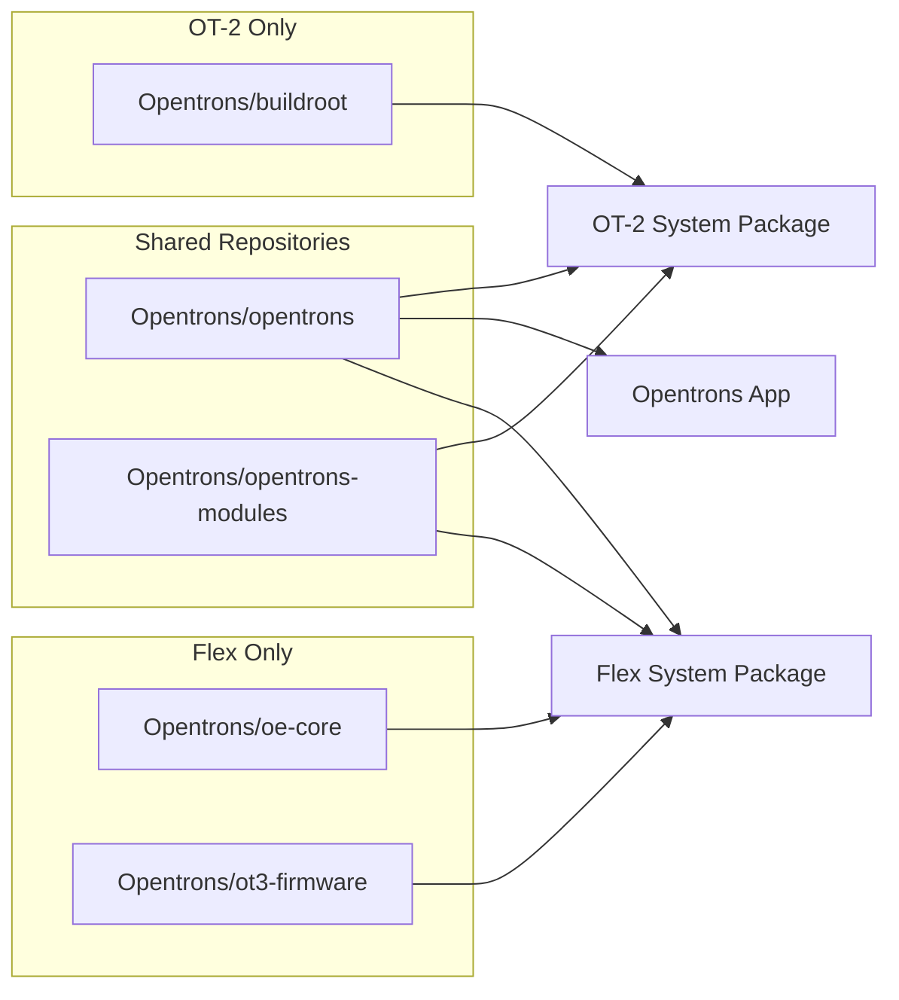

# Releasing Software (for Opentrons developers)

Below you will find instructions for the release processes for projects within this monorepo.

## Releasing Robot Software Stacks

### Overview

The robot release process has 3 main outputs:

- Opentrons App
- OT-2 system package
- Flex system package

The robot software stack is composed of the following repositories:

- [opentrons]("https://github.com/Opentrons/opentrons") (this repository)
- [opentrons_modules]("https://github.com/Opentrons/opentrons-modules") (module firmware)
- [oe_core]("https://github.com/Opentrons/oe-core") (Flex OS)
- [ot3_firmware]("https://github.com/Opentrons/ot3-firmware") (Flex firmware)
- [buildroot]("https://github.com/Opentrons/buildroot") (OT-2 OS)



These are all versioned and released together. These assets are produced in 2 possible channels:

- Release (External facing releases - stable, beta, alpha)
- Internal Release (Internal facing releases - stable, beta, alpha)

> [!TIP]
> using `git config remote.origin.tagOpt --tags` ensures that when you fetch and pull, you get all the tags from the origin remote.

### Steps to release the changes in `edge`

1. Checkout `edge` and make a chore release branch, without any new changes. The branch name should match `chore_release-${version}`.

   ```shell
   git switch edge
   git pull
   git switch -c chore_release-${version}
   git push --set-upstream origin chore_release-${version}
   ```

2. Open a PR targeting `release` from `chore_release-${version}`; this should contain all the changes that were in `edge` and not yet in `release`. This PR will not be merged in GitHub. Apply the `DO NOT MERGE` label. When we are ready, approval and passing checks on this PR allows the bypass of the branch protection on `release` that prevents direct pushes. Step 8 will resolve this PR.

3. Evaluate changes on our dependent repositories. If there have been changes to `opentrons-modules`, `oe-core`, `ot3-firmware`, or `buildroot`, ensure that the changes are in the correct branches. Tags will need to be pushed to repositories with changes. Further exact tagging instructions for each of the repositories are TODO.

4. Check out and pull `chore_release-${version}` locally. Create a tag for a new alpha version. The alpha versions end with an `-alpha.N` prerelease tag, where `N` increments by 1 from 0 over the course of the QA process. You don't need a PR or a commit to create a new version. Pushing tags in the formats prescribed here are the triggers of the release process. Let's call the alpha version you're about to create `${alphaVersion}`:

> [!IMPORTANT]
> Use annotated tag (`-a`) with a message (`-m`) for all tags.

```shell
git switch chore_release-${version}
git pull
git tag -a v${alphaVersion} -m 'chore(release): ${alphaVersion}
```

5. Review the tag with `git log v${alphaVersion} --oneline -n10`. Double check that the commit displayed is the one you want - it should probably be the latest commit in your release branch, and you should double check that with the Github web UI. If the tag looks good, push it - this starts the build process. This is a release candidate that will undergo QA. Changelogs for the release are automatically generated when the tag is pushed and sent to the release page in github.

   ```shell
   git push origin v${alphaVersion}
   ```

6. Run QA on this release. If issues are found, create PRs targeting `chore_release-${version}`. To create a new alpha releases, repeat steps 4-6.

7. Once QA is complete, do a final check that the release notes are complete and proof-read.

8. We are ready to `merge -ff-only` the `chore_release-${version}` into `release`.

> [!CAUTION]
> Do **NOT** squash or rebase <br></br>
> Do **NOT** yet push a tag

This should be done from your local command line. Here we make use of the PR in step 2 to bypass the branch protection on `release`. The PR checks must be passing and the PR must have approval:

```shell
git switch chore_release-${version}
git pull
git checkout release
git pull
# now do the merge
git merge --ff-only chore_release-${version}
git push origin release
```

9. Make a tag for the release. This tag will have the actual target release version, no alpha prerelease tags involved. It should be the same as the `${version}` part of your release branch:

   ```shell
   git tag -a v${version} -m 'chore(release): ${version}'
   git log v${version} --oneline -n10
   ```

   The `git log` should reveal that the tag is on what was, pre-merge, the last commit of your release branch and is, post-merge, the last commit of `release`. You should double-check this with the github web UI.

   Once the tag looks good, you can push it. The tag push will kick off release builds and deploy the results to customers. It will also create a release page where those builds and automatically generated in-depth changelogs will be posted.

   ```shell
   git push origin v${version}
   ```

10. Ensure package deployments succeed by validating the version in our release dockets. The examples below are for the release channel. Internal Release channel looks a little different but are similar and documented elsewhere.

- Flex <https://builds.opentrons.com/ot3-oe/releases.json>
- OT-2 <https://builds.opentrons.com/ot2-br/releases.json>
- App Stable
  - <https://builds.opentrons.com/app/latest.yml> Windows
  - <https://builds.opentrons.com/app/latest-mac.yml>
  - <https://builds.opentrons.com/app/latest-linux.yml>
- App Alpha
  - <https://builds.opentrons.com/app/alpha.yml> Windows
  - <https://builds.opentrons.com/app/alpha-mac.yml>
  - <https://builds.opentrons.com/app/alpha-linux.yml>
- Python `opentrons` package <https://pypi.org/project/opentrons>
- Python `opentrons-shared-data` package <https://pypi.org/project/opentrons-shared-data>
- The Opentrons App should be prompting people to update to the new version given their current channel.

11. Release the Python Protocol API docs for this version (see below under Releasing Web Projects).

12. Open a PR of `release` into `edge`. Give the PR a name like `chore(release): Merge changes from ${version} into edge`. Once it passes and has approval, on the command line merge it into `edge`:

    ```shell
    git checkout edge
    git pull
    git merge --no-ff release
    ```

13. Use the PR title for the merge commit title. You can then `git push origin edge`, which will succeed as long as the PR is approved and status checks pass.

## Releasing Robot Software Stack Isolated changes

If critical bugfixes or isolated features need to be released, the process is the same as above, but the `chore_release-${version}` branch is not created from `edge`. We would likely base the `chore_release-${version}` branch on `release` then create bug fix PRs targeting `chore_release-${version}`. Or we might cherry pick in commits and/or merge in a feature branch to `chore_release-${version}`.

### tag usage

We specify the version of a release artifact through a specifically-formatted git tag. We consider our monorepo to support several projects: robot stack, ot3, protocol-designer, etc.

#### Tags look like this:

```shell
${projectPrefix}${projectVersion}
```

`${projectPrefix}` is the project name plus `@` for everything but robot stack, where it is `v`.

##### Examples

- the tag for 6.2.1-alpha.3 of the robot stack is `v6.2.1-alpha.3`
- the tag for 0.1.2-beta.1 of an internal release or robot stack is `ot3@0.1.2-beta.1`
- the tag for 4.0.0 of protocol designer is `protocol-designer@4.0.0`

Versions follow [semver.inc][semver-inc]. QA is done on alpha builds, and only alpha tags should be pushed until you're ready to release the project.

## Releasing Web Projects

While our web projects also take their versions from appropriately-prefixed git tags, they will not be automatically deployed.

See [scripts/deploy/README.md](./scripts/deploy/README.md) for the release process of these projects.
