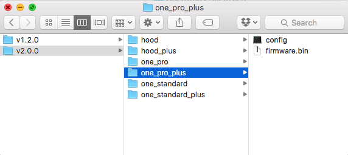

.. _firmware:

================
Firmware Updates
================

The motorcontroller inside all Opentrons liquid handlers (called Smoothieboard or just Smoothie) will need it's firmware updated if you are planning to use the Opentrons API and accompanying 2.0 app. The process is simple, and can be done from your computer in under a minute.

To summarize, there are two files on your Smoothie that must be replaced; ``FIRMWARE.CUR`` and ``config``. 

Download Files
----------------------

Download the zipped files from here:

https://github.com/OpenTrons/smoothie-config/archive/2.0.0.zip

After downloading, unpack the zip file to view its contents.

Open the Smoothie's microSD Card
---------------------------------

Power off your Opentrons liquid handler, remove the microSD card from the Smoothieboard. You will notice the microSD card shows up on the computer as a Mass Storage Device, like an external hard drive or flash drive.

.. image:: img/update-firmware/firmware_files.png

Open the microSD card drive on your computer to see it's ``FIRMWARE.CUR`` and ``config`` files. There might be other files there, but the two you need to worry about are ``FIRMWARE.CUR`` and ``config``, because these are what we will be replacing.

Select Your Robot's Model
----------------------------------

Opentrons `come in three models`__, the Standard, Pro, and Hood. Also, Opentrons has release the "plus" models which have faster motors than our previous robots. The "plus" models have an all black Z motor (up/down), while the original versions have a Z motor that looks similar to the rest of the robot's motors.

If you received an OT-One after April 2015, then you have a "plus" model.

__ https://opentrons.com/robots

Drag both the ``config`` and ``firmware.bin`` files from the correct folder and to the Smoothie's microSD card driver. You will be overwriting the old ``config`` file, so your computer may ask if you would like to proceed with replacing it.

.. image:: img/update-firmware/replaceConfig.png

Your microSD card drive should now look like the following:

.. image:: img/update-firmware/dragFirmwareBin.png

Update Robot
---------------

With the robot powered off, connect the microSD card. When the robots powers on, it will read the ``firmware.bin`` file, then save it as `FIRMWARE.CUR`. It will then read the new ``config`` file, and your liquid handler now has updated firmware. Celebrate with a cold beverage!
