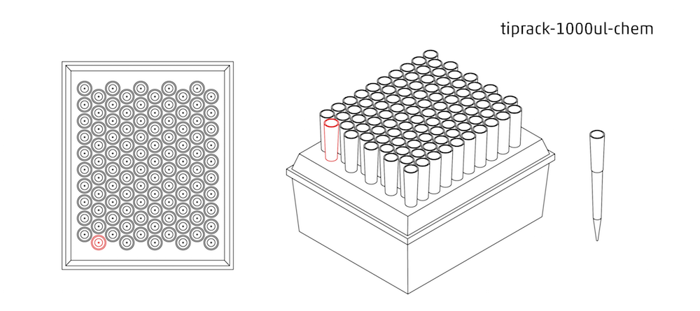
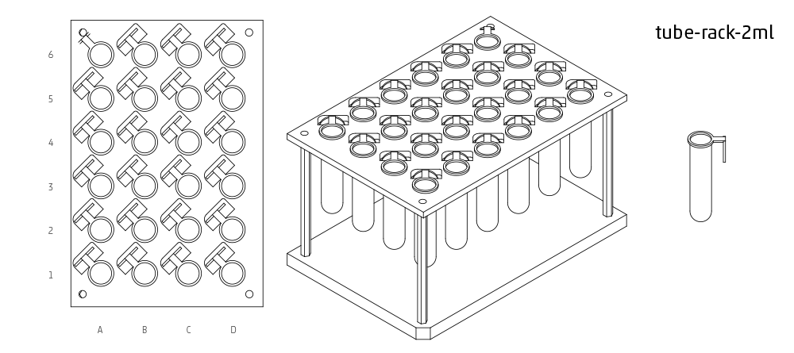
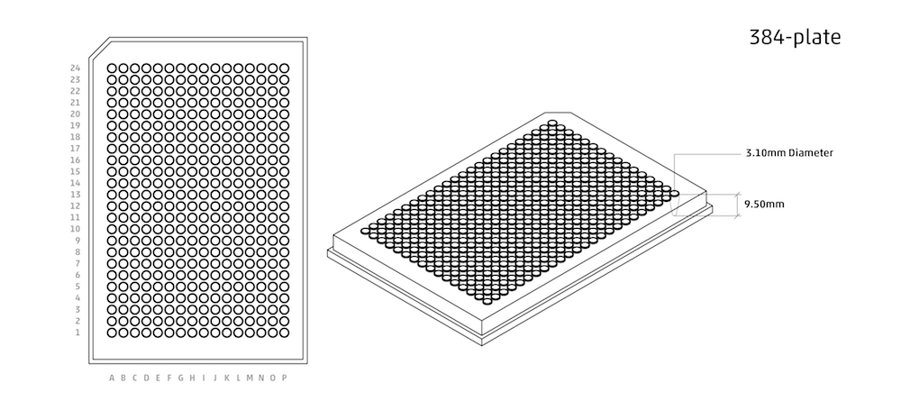

.. _labware:

######################
Labware
######################

We spend a fair amount of time organizing and counting wells when writing Python protocols. This section describes the different ways we can access wells and groups of wells.

************************************

******************
Labware Library
******************

The Opentrons API comes with many common labware containers built in. These containers can be loaded into you Python protocol using the ``labware.load()`` method, and the specific name of the labware you need.

`Check out this webpage`__ to see a visualization of all the API's current built-in containers.

__ https://andysigler.github.io/ot-api-containerviz/

Below are a list of some of the most commonly used containers in the API, as well as images for how they look.

If you are interested in using your own container that is not included in the API, please take a look at how to create custom containers using ``labware.create()``, or contact Opentrons Support.

.. note::

    All names are case-sensitive, copying and pasting from this list into the protocol editor will ensure no errors are made.

**********************

Placing labware on the robot deck
=====

The robot deck is made up of slots labeled 1, 2, 3, 4, and so on.

.. image:: img/DeckMapEmpty.png

To tell the robot what labware will be on the deck for your protocol, use `labware.load`
after importing labware as follows:

.. code-block:: python

   from opentrons import labware

.. code-block:: python

  samples_rack = labware.load('tube-rack-2ml', slot='1')

Putting multiple containers in the same slot
-----

Some containers might only take up half a slot. You must explicitly say `share=True`, indicating that it is okay to share the slot.

.. code-block:: python

  tubes = labware.load('T25-flask', slot='2')
  more_tubes = labware.load('T25-flask', slot='2', share=True)

**********************

Point
=====

Use ``point`` when there is only one position per container, such as a scale.

.. code-block:: python

    my_container = labware.load('point', slot)

You can access the point position as ``my_container.wells('A1')`` or ``my_container.container.wells(0)``.

**********************

Tipracks
==========

tiprack-10ul
-------------

Tip rack for a 10 uL pipette (single or 8-channel)

.. code-block:: python

    labware.load('tiprack-10ul', slot)

**Accessing Tips:** *single channel* ``['A1']-['H12']``, *8-channel* ``['A1']-['A12']``

.. image:: img/labware_lib/Tiprack-10ul.png

tiprack-200ul
-------------

Tip rack for a 200 or 300 uL pipette (single or 8-channel)

.. code-block:: python

    labware.load('tiprack-200ul', slot)

**Accessing Tips:** *single channel* ``['A1']-['H12']``, *8-channel* ``['A1']-['A12']``

.. image:: img/labware_lib/Tiprack-200ul.png

GEB-tiprack-300
---------------

This is a custom-made 300ul tiprack for the OT 2 model (single or 8-channel)

.. code-block:: python

    labware.load('GEB-tiprack-300', slot)

**Accessing Tips:** *single channel* ``['A1']-['H12']``, *8-channel* ``['A1']-['A12']``

`Check out our available tipracks here`__

__ https://shop.opentrons.com/collections/opentrons-tips

tiprack-1000ul
--------------

Tip rack for a 1000 uL pipette (single or 8-channel)

.. code-block:: python

    labware.load('tiprack-1000ul', slot)

**Accessing Tips:** *single channel* ``['A1']-['H12']``, *8-channel* ``['A1']-['A12']``

.. image:: img/labware_lib/Tiprack-1000.png

tiprack-1000ul-chem
-------------------

Tip rack for 1000ul chem (10x10)

.. code-block:: python

    labware.load('tiprack-1000ul-chem', slot)

**Accessing Tips:** *single channel* ``[0]-[99]``

**********************

Troughs
========

trough-12row
-------------

12 row reservoir

.. code-block:: python

    labware.load('trough-12row', slot)

**Accessing Rows:** *single channel* or *8-channel* ``['A1']-['A12']``

.. image:: img/labware_lib/Trough-12row.png

**********************

Tube Racks
==========

tube-rack-.75ml
-------------

4x6 rack that holds .75 mL microcentrifuge tubes

.. code-block:: python

    labware.load('tube-rack-.75ml', slot)

**Accessing Tubes:** *single channel* ``['A1']-['D6']``

.. image:: img/labware_lib/Tuberack-075ml.png

tube-rack-2ml
-------------

4x6 rack that holds 1.5 mL microcentrifuge tubes and 2 mL microcentrifuge tubes

.. code-block:: python

    labware.load('tube-rack-2ml', slot)

**Accessing Tubes:** *single channel* ``['A1']-['D6']``

tube-rack-15_50ml
------------------

rack that holds 6 15 mL tubes and 4 50 mL tubes

.. code-block:: python

    labware.load('tube-rack-15_50ml', slot)

**Accessing Tubes:** *single channel* ``['A1']-['A3'], ['B1']-['B3'], ['C1']-['C2'], ['D1']-['D2']``

.. image:: img/labware_lib/Tuberack-15-50ml.png

Plates
=======

96-deep-well
-------------

See dimensions in diagram below.

.. code-block:: python

    labware.load('96-deep-well', slot)

**Accessing Wells:** *single channel* ``['A1']-['H12']``, *8-channel* ``['A1']-['A12']``

.. image:: img/labware_lib/96-Deep-Well.png

96-PCR-tall
-------------

See dimensions in diagram below.

.. code-block:: python

    labware.load('96-PCR-tall', slot)

**Accessing Wells:** *single channel* ``['A1']-['H12']``, *8-channel* ``['A1']-['A12']``

.. image:: img/labware_lib/96-PCR-Tall.png

96-PCR-flat
-------------

See dimensions in diagram below.

.. code-block:: python

    labware.load('96-PCR-flat', slot)

**Accessing Wells:** *single channel* ``['A1']-['H12']``, *8-channel* ``['A1']-['A12']``

.. image:: img/labware_lib/96-PCR-Flatt.png

PCR-strip-tall
----------------

See dimensions in diagram below.

.. code-block:: python

    labware.load('PCR-strip-tall', slot)

**Accessing Wells:** *single channel* ``['A1']-['A8']``, *8-channel* ``['A1']``

.. image:: img/labware_lib/96-PCR-Strip.png

384-plate
----------

See dimensions in diagram below.

.. code-block:: python

    labware.load('384-plate', slot)

**Accessing Wells:** *single channel* ``['A1']-['P24']``, *multi-channel* ``['A1']-['A24]``

**************
Containers
**************

The containers module allows you to load common labware into your protocol. `Go here`__ to see a visualization of all built-in containers.

__ https://andysigler.github.io/ot-api-containerviz/

.. code-block:: python

    '''
    Examples in this section require the following
    '''
    from opentrons import labware

List
====

Once the labware module is loaded, you can see a list of all containers currently inside the API by calling ``labware.list()``

.. code-block:: python

    labware.list()

Load
====

Labware is loaded with two arguments: 1) the labware type, and 2) the deck slot it will be placed in on the robot.

.. code-block:: python

    p = labware.load('96-flat', '1')

A third optional argument can be used to give a labware a unique name.

.. code-block:: python

    p = labware.load('96-flat', '2', 'any-name-you-want')

Unique names are useful in a few scenarios. First, they allow the container to have independent calibration data from other containers in the same slot. In the example above, the container named 'any-name-you-want' will assume different calibration data from the unnamed plate, even though they are the same type and in the same slot.

.. note::

    Calibration data refers to the saved positions for each container on deck, and is a part of the `Opentrons App calibration procedure`__.

__ https://support.opentrons.com/ot-2/getting-started-software-setup/running-your-first-ot-2-protocol

Names can also be used to place multiple containers in the same slot all at once, using the `share=True` argument. For example, the flasks below are all placed in slot 3. So in order for the Opentrons API to tell them apart, we have given them each a unique name.

.. code-block:: python

    fa = labware.load('T25-flask', '3', 'flask_a')
    fb = labware.load('T25-flask', '3', 'flask_b', share=True)
    fc = labware.load('T25-flask', '3', 'flask_c', share=True)

Create
======

In addition to the default containers that come with the Opentrons API, you can create your own custom containers.

Through the API's call labware.create(), you can create simple grid containers, which consist of circular wells arranged in columns and rows.

.. code-block:: python

    custom_plate = labware.create(
        '3x6_plate',                    # name of you container
        grid=(3, 6),                    # specify amount of (rows, columns)
        spacing=(12, 12),               # distances (mm) between each (row, column)
        diameter=5,                     # diameter (mm) of each well on the plate
        depth=10,                       # depth (mm) of each well on the plate
        volume=200)

When you create your custom container it will return the custom plate. You should only need to run
this once among all of your protocols for the same custom container because the data is automatically saved on the robot.

.. code-block:: python

    for well in custom_plate.wells():
        print(well)

will print out...

.. code-block:: python

    <Well A1>
    <Well B1>
    <Well C1>
    <Well A2>
    <Well B2>
    <Well C2>
    <Well A3>
    <Well B3>
    <Well C3>
    <Well A4>
    <Well B4>
    <Well C4>
    <Well A5>
    <Well B5>
    <Well C5>
    <Well A6>
    <Well B6>
    <Well C6>

**********************

.. code-block:: python

    from opentrons import labware, robot

    plate = labware.load('96-flat', 'A1')

******************
Accessing Wells
******************

Individual Wells
================

When writing a protocol using the API, you will be spending most of your time selecting which wells to transfer liquids to and from.

The OT-One deck and containers are all set up with the same coordinate system - lettered rows ``['A']-['END']`` and numbered columns ``['1']-['END']``.

.. image:: img/well_iteration/Well_Iteration.png

.. code-block:: python

    '''
    Examples in this section expect the following
    '''
    from opentrons import labware

    plate = labware.load('96-flat', '1')

Wells by Name
-------------

Once a container is loaded into your protocol, you can easily access the many wells within it using ``wells()`` method. ``wells()`` takes the name of the well as an argument, and will return the well at that location.

.. code-block:: python

    plate.wells('A1')
    plate.wells('H12')

Wells by Index
--------------

Wells can be referenced by their "string" name, as demonstrated above. However, they can also be referenced with zero-indexing, with the first well in a container being at position 0.

.. code-block:: python

    plate.wells(0)   # well A1
    plate.wells(95)  # well H12

Columns and Rows
----------------

A container's wells are organized within a series of columns and rows, which are also labelled on standard labware. In the API, rows are given letter names (``'A'`` through ``'H'`` for example) and go left to right, while columns are given numbered names (``'1'`` through ``'12'`` for example) and go from front to back.
You can access a specific row or column by using the ``rows()`` and ``cols()`` methods on a container. These will return all wells within that row or column.

.. code-block:: python

    row = plate.rows('A')
    column = plate.cols('1')

    print('Column "A" has', len(column), 'wells')
    print('Row "1" has', len(row), 'wells')

will print out...

.. code-block:: python

    Column "A" has 8 wells
    Row "1" has 12 wells

The ``rows()`` or ``cols()`` methods can be used in combination with the ``wells()`` method to access wells within that row or column. In the example below, both lines refer to well ``'A1'``.

.. code-block:: python

    plate.cols('1').wells('A')
    plate.rows('A').wells('1')

**********************

.. code-block:: python

    from opentrons import labware, robot

    plate = labware.load('96-flat', '1')

Multiple Wells
==============

If we had to reference each well one at a time, our protocols could get very very long.

When describing a liquid transfer, we can point to groups of wells for the liquid's source and/or destination. Or, we can get a group of wells that we want to loop through.

.. code-block:: python

    '''
    Examples in this section expect the following
    '''
    from opentrons import labware

    plate = labware.load('96-flat', '2')

Wells
-----

The ``wells()`` method can return a single well, or it can return a list of wells when multiple arguments are passed.

Here is an example or accessing a list of wells, each specified by name:

.. code-block:: python

    w = plate.wells('A1', 'B2', 'C3', 'H12')

    print(w)

will print out...

.. code-block:: python

    <WellSeries: <Well A1><Well B2><Well C3><Well H12>>

Multiple wells can be treated just like a normal Python list, and can be iterated through:

.. code-block:: python

    for w in plate.wells('A1', 'B2', 'C3', 'H12'):
        print(w)

will print out...

.. code-block:: python

    <Well A1>
    <Well B2>
    <Well C3>
    <Well H12>

Wells To
--------
 
Instead of having to list the name of every well, we can also create a range of wells with a start and end point. The first argument is the starting well, and the ``to=`` argument is the last well.

.. code-block:: python

    for w in plate.wells('A1', to='H1'):
        print(w)

will print out...

.. code-block:: python

    <Well A1>
    <Well B1>
    <Well C1>
    <Well D1>
    <Well E1>
    <Well F1>
    <Well G1>
    <Well H1>

These lists of wells can also move in the reverse direction along your container. For example, setting the ``to=`` argument to a well that comes before the starting position is allowed:

.. code-block:: python

    for w in plate.wells('H1', to='A1'):
        print(w)

will print out...

.. code-block:: python

    <Well H1>
    <Well G1>
    <Well F1>
    <Well E1>
    <Well C1>
    <Well B1>
    <Well A1>

Wells Length
------------

Another way you can create a list of wells is by specifying the length= of the well list you need, in addition to the starting point. The example below will return eight wells, starting at well ``'A1'``:

.. code-block:: python

    for w in plate.wells('A1', length=8):
        print(w)

will print out...

.. code-block:: python

    <Well A1>
    <Well B1>
    <Well C1>
    <Well D1>
    <Well E1>
    <Well F1>
    <Well G1>
    <Well H1>

Columns and Rows
----------------

Columns and Rows
The same arguments described above can be used with ``rows()`` and ``cols()`` to create lists of rows or columns.

Here is an example of iterating through rows:

.. code-block:: python

    for r in plate.rows('A', length=3):
        print(r)

will print out...

.. code-block:: python

<WellSeries:
    <WellSeries: <Well A1><Well A2><Well A3><Well A4><Well A5><Well A6><Well A7><Well A8><Well A9><Well A10><Well A11><Well A12>>
    <WellSeries: <Well B1><Well B2><Well B3><Well B4><Well B5><Well B6><Well B7><Well B8><Well B9><Well B10><Well B11><Well B12>>
    <WellSeries: <Well C1><Well C2><Well C3><Well C4><Well C5><Well C6><Well C7><Well C8><Well C9><Well C10><Well C11><Well C12>>
>

And here is an example of iterating through columns:

.. code-block:: python

    for c in plate.cols('1', to='10'):
        print(c)

will print out...

.. code-block:: python

<WellSeries:
    <WellSeries: <Well A1><Well B1><Well C1><Well D1><Well E1><Well F1><Well G1><Well H1>>
    <WellSeries: <Well A2><Well B2><Well C2><Well D2><Well E2><Well F2><Well G2><Well H2>>
    <WellSeries: <Well A3><Well B3><Well C3><Well D3><Well E3><Well F3><Well G3><Well H3>>
    <WellSeries: <Well A4><Well B4><Well C4><Well D4><Well E4><Well F4><Well G4><Well H4>>
    <WellSeries: <Well A5><Well B5><Well C5><Well D5><Well E5><Well F5><Well G5><Well H5>>
    <WellSeries: <Well A6><Well B6><Well C6><Well D6><Well E6><Well F6><Well G6><Well H6>>
    <WellSeries: <Well A7><Well B7><Well C7><Well D7><Well E7><Well F7><Well G7><Well H7>>
    <WellSeries: <Well A8><Well B8><Well C8><Well D8><Well E8><Well F8><Well G8><Well H8>>
    <WellSeries: <Well A9><Well B9><Well C9><Well D9><Well E9><Well F9><Well G9><Well H9>>
    <WellSeries: <Well A10><Well B10><Well C10><Well D10><Well E10><Well F10><Well G10><Well H10>>
>

Slices
------

Containers can also be treating similarly to Python lists, and can therefore handle slices.

.. code-block:: python

    for w in plate[0:8:2]:
        print(w)

will print out...

.. code-block:: python

    <Well A1>
    <Well C1>
    <Well E1>
    <Well G1>

The API's containers are also prepared to take string values for the slice's ``start`` and ``stop`` positions.

.. code-block:: python

    for w in plate['A1':'A2':2]:
        print(w)

will print out...

.. code-block:: python

    <Well A1>
    <Well C1>
    <Well E1>
    <Well G1>

.. code-block:: python

    for w in plate.rows['B']['1'::2]:
        print(w)

will print out...

.. code-block:: python

    <Well B1>
    <Well B3>
    <Well B5>
    <Well B7>
    <Well B9>
    <Well B11>
