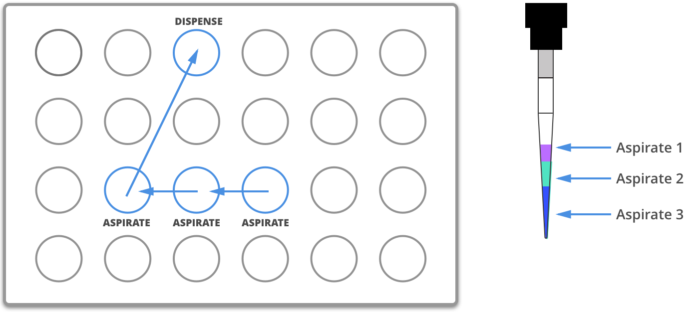

.. _v2-complex-commands:

########################
Complex Commands
########################

.. _overview:

Overview
========

The difference between this section and :ref:`v2-atomic-commands` is ease of use. With complex liquid handling commands, you can more easily handle larger
groups of wells to perform repetitive actions. The main downside to using complex liquid handling commands is that you cannot control the
order in which operations are executed. In this section we will order in which operations are executed. In this section we explain when and how specific actions are executed.

The examples in this section will use the following set-up:

.. code-block:: python

    from opentrons import protocol_api

    def run(protocol: protocol_api.ProtocolContext):
        plate = protocol.load_labware('corning_96_wellplate_360ul_flat', 1)
        tiprack = protocol.load_labware('opentrons_96_tiprack_300ul', 2)
        pipette = protocol.load_instrument('p300_single', mount='left', tip_racks=[tiprack])

        # The code used in the rest of the examples goes here

This loads a `Corning 96 Well Plate <https://labware.opentrons.com/corning_96_wellplate_360ul_flat>`_ in slot 1 and a `Opentrons 300ul Tiprack <https://labware.opentrons.com/opentrons_96_tiprack_300ul>`_ in slot 2, and uses a P300 Single pipette.

You can follow along and simulate the protocol using our protocol simulator, which can be installed by following the instructions at :ref:`writing`.

There are three general complex liquid handling commands. The differences can be found in the table below

+------------------------------------------+----------------------------------------------------+------------------------------------------------------+-------------------------------------------+
|    Method                                |   One source well to a group of destination wells  |   Many source wells to a group of destination wells  | Many source wells to one destination well |
+==========================================+====================================================+======================================================+===========================================+
| :py:meth:`.InstrumentContext.transfer`   |                   Yes                              |                      Yes                             |                   Yes                     |
+------------------------------------------+----------------------------------------------------+------------------------------------------------------+-------------------------------------------+
| :py:meth:`.InstrumentContext.distribute` |                   Yes                              |                       No                             |                    No                     |
+------------------------------------------+----------------------------------------------------+------------------------------------------------------+-------------------------------------------+
| :py:meth:`.InstrumentContext.consolidate`|                   No                               |                       No                             |                    No                     |
+------------------------------------------+----------------------------------------------------+------------------------------------------------------+-------------------------------------------+

You can also refer to these images for further clarification.

.. _transfer:

Transfer
--------

.. image:: ../img/complex_commands/transfer.png
   :scale: 75 %
   :name: Transfer
   :align: center

.. _distribute:

Distribute
----------

.. image:: ../img/complex_commands/robot_distribute.png
   :scale: 50 %
   :name: Distribute
   :align: center

.. _consolidate:

Consolidate
-----------

**********************

.. _params_table:

Parameters
----------

Parameters for our complex liquid handling listed in order of operation. Check out the :ref:`complex_params` section for examples on how to use these parameters.

+--------------------------------+------------------------------------------------------+----------------------------+------------------------------------+------------------------------------+
|          Parameter(s)          |                     Options                          |     Transfer Defaults      |        Distribute Defaults         |       Consolidate Defaults         |
+================================+======================================================+============================+====================================+====================================+
|          ``new_tip``           |      ``'always'``, ``'never'``, ``'once'``           |        ``'once'``          |            ``'once'``              |           ``'once'``               |
+--------------------------------+------------------------------------------------------+----------------------------+------------------------------------+------------------------------------+
| ``mix_before``, ``mix_after``  |  ``mix_before`` and ``mix_after`` require a tuple    |  No mixing either before   |  No mixing before aspirate,        | Mixing before aspirate is ignored, |
|                                |  of (repetitions, volume)                            | aspirate or after dispense |  mixing after dispense is ignored  | no mix after dispense by default   |
+--------------------------------+------------------------------------------------------+----------------------------+------------------------------------+------------------------------------+
|         ``touch_tip``          |  ``True`` or ``False``, if true touch tip on both    |  No touch tip by default   |   No touch tip by default          |    No touch tip by default         |
|                                |  source and destination wells                        |                            |                                    |                                    |
+--------------------------------+------------------------------------------------------+----------------------------+------------------------------------+------------------------------------+
|          ``air_gap``           |                Volume in microliters                 |           0                |                 0                  |               0                    |
+--------------------------------+------------------------------------------------------+----------------------------+------------------------------------+------------------------------------+
|         ``blow_out``           |  ``True`` or ``False``, if true blow out at dispense |        ``False``           |              ``False``             |           ``False``                |
+--------------------------------+------------------------------------------------------+----------------------------+------------------------------------+------------------------------------+
|          ``trash``             | ``True`` or ``False``, if false return tip to tiprack|         ``True``           |              ``True``              |            ``True``                |
+--------------------------------+------------------------------------------------------+----------------------------+------------------------------------+------------------------------------+
|        ``carryover``           | ``True`` or ``False``, if true split volumes that    |         ``True``           |              ``False``             |            ``False``               |
|                                | exceed max volume of pipette into smaller quantities |                            |                                    |                                    |
+--------------------------------+------------------------------------------------------+----------------------------+------------------------------------+------------------------------------+
|       ``disposal_volume``      | Extra volume in microliters to hold in tip while     |             0              |     10% of pipette max volume      |                0                   |
|                                | dispensing; better accuracies in multi-dispense      |                            |                                    |                                    |
+--------------------------------+------------------------------------------------------+----------------------------+------------------------------------+------------------------------------+

Transfer
========

The most versatile of the complex liquid handling functions is :py:meth:`.InstrumentContext.transfer`. For a majority of use-cases you will most likely want to use this complex command.
Below you will find a few scenarios utilizing the :py:meth:`.InstrumentContext.transfer` command.

Basic
-----

The example below will transfer 100 uL from well ``'A1'`` to well ``'B1'``, automatically picking up a new tip and then disposing of it when finished.

.. code-block:: python

    pipette.transfer(100, plate.wells_by_name()['A1'], plate.wells_by_name()['B1'])

Transfer commands will automatically create entire series of :py:meth:`.InstrumentContext.aspirate`, :py:meth:`.InstrumentContext.dispense`, and other :py:meth:`.InstrumentContext` commands.

Large Volumes
-------------

Volumes larger than the pipette's ``max_volume`` :ref:`defaults` will automatically divide into smaller transfers.

.. code-block:: python

    pipette.transfer(700, plate.wells_by_name()['A2'], plate.wells_by_name()['B2'])

will have the steps...

.. code-block:: python

    Transferring 700 from well A2 in "1" to well B2 in "1"
    Picking up tip well A1 in "2"
    Aspirating 300.0 uL from well A2 in "1" at 1 speed
    Dispensing 300.0 uL into well B2 in "1"
    Aspirating 200.0 uL from well A2 in "1" at 1 speed
    Dispensing 200.0 uL into well B2 in "1"
    Aspirating 200.0 uL from well A2 in "1" at 1 speed
    Dispensing 200.0 uL into well B2 in "1"
    Dropping tip well A1 in "12"

One to One
-----------

Transfer commands are most useful when moving liquid between multiple wells. Notice this will be a one to one transfer
from where well ``A1``'s contents are transferred to well ``A2``, and so on and so forth. Refer to :ref:`transfer` for better visualization.

.. code-block:: python

    pipette.transfer(100, plate.columns_by_name()['1'], plate.columns_by_name()['2'])

will have the steps...

.. code-block:: python

    Transferring 100 from wells A1...H1 in "1" to wells A2...H2 in "1"
    Picking up tip well A1 in "2"
    Aspirating 100.0 uL from well A1 in "1" at 1 speed
    Dispensing 100.0 uL into well A2 in "1"
    Aspirating 100.0 uL from well B1 in "1" at 1 speed
    Dispensing 100.0 uL into well B2 in "1"
    Aspirating 100.0 uL from well C1 in "1" at 1 speed
    Dispensing 100.0 uL into well C2 in "1"
    Aspirating 100.0 uL from well D1 in "1" at 1 speed
    Dispensing 100.0 uL into well D2 in "1"
    Aspirating 100.0 uL from well E1 in "1" at 1 speed
    Dispensing 100.0 uL into well E2 in "1"
    Aspirating 100.0 uL from well F1 in "1" at 1 speed
    Dispensing 100.0 uL into well F2 in "1"
    Aspirating 100.0 uL from well G1 in "1" at 1 speed
    Dispensing 100.0 uL into well G2 in "1"
    Aspirating 100.0 uL from well H1 in "1" at 1 speed
    Dispensing 100.0 uL into well H2 in "1"
    Dropping tip well A1 in "12"

One to Many
------------

You can transfer from a single source to multiple destinations, and the other way around (many sources to one destination).

.. code-block:: python

    pipette.transfer(100, plate.wells_by_name()['A1'], plate.columns_by_name()['2'])

will have the steps...

.. code-block:: python

    Transferring 100 from well A1 in "1" to wells A2...H2 in "1"
    Picking up tip well A1 in "2"
    Aspirating 100.0 uL from well A1 in "1" at 1 speed
    Dispensing 100.0 uL into well A2 in "1"
    Aspirating 100.0 uL from well A1 in "1" at 1 speed
    Dispensing 100.0 uL into well B2 in "1"
    Aspirating 100.0 uL from well A1 in "1" at 1 speed
    Dispensing 100.0 uL into well C2 in "1"
    Aspirating 100.0 uL from well A1 in "1" at 1 speed
    Dispensing 100.0 uL into well D2 in "1"
    Aspirating 100.0 uL from well A1 in "1" at 1 speed
    Dispensing 100.0 uL into well E2 in "1"
    Aspirating 100.0 uL from well A1 in "1" at 1 speed
    Dispensing 100.0 uL into well F2 in "1"
    Aspirating 100.0 uL from well A1 in "1" at 1 speed
    Dispensing 100.0 uL into well G2 in "1"
    Aspirating 100.0 uL from well A1 in "1" at 1 speed
    Dispensing 100.0 uL into well H2 in "1"
    Dropping tip well A1 in "12"

List of Volumes
---------------

Instead of applying a single volume amount to all source/destination wells, you can instead pass a list of volumes.

.. code-block:: python

    pipette.transfer(
        [20, 40, 60],
        plate['A1'],
        [plate.wells_by_name()[well_name] for well_name in ['B1', 'B2', 'B3']])

will have the steps...

.. code-block:: python

    Transferring [20, 40, 60] from well A1 in "1" to wells B1...B3 in "1"
    Picking up tip well A1 in "2"
    Aspirating 20.0 uL from well A1 in "1" at 1 speed
    Dispensing 20.0 uL into well B1 in "1"
    Aspirating 40.0 uL from well A1 in "1" at 1 speed
    Dispensing 40.0 uL into well B2 in "1"
    Aspirating 60.0 uL from well A1 in "1" at 1 speed
    Dispensing 60.0 uL into well B3 in "1"
    Dropping tip well A1 in "12"

**********************

Distribute and Consolidate
==========================

Save time and tips with the :py:meth:`.InstrumentContext.distribute` and :py:meth:`.InstrumentContext.consolidate` commands. These are nearly identical to :py:meth:`.InstrumentContext.transfer`, except that they will combine multiple transfers into a single tip.

Consolidate
-----------

Volumes going to the same destination well are combined within the same tip, so that multiple aspirates can be combined to a single dispense. Refer to :ref:`consolidate` for better visualization.

.. code-block:: python

    pipette.consolidate(30, plate.columns_by_name()['2'], plate.wells_by_name()['A1'])

will have the steps...

.. code-block:: python

    Consolidating 30 from wells A2...H2 in "1" to well A1 in "1"
    Transferring 30 from wells A2...H2 in "1" to well A1 in "1"
    Picking up tip well A1 in "2"
    Aspirating 30.0 uL from well A2 in "1" at 1 speed
    Aspirating 30.0 uL from well B2 in "1" at 1 speed
    Aspirating 30.0 uL from well C2 in "1" at 1 speed
    Aspirating 30.0 uL from well D2 in "1" at 1 speed
    Aspirating 30.0 uL from well E2 in "1" at 1 speed
    Aspirating 30.0 uL from well F2 in "1" at 1 speed
    Aspirating 30.0 uL from well G2 in "1" at 1 speed
    Aspirating 30.0 uL from well H2 in "1" at 1 speed
    Dispensing 240.0 uL into well A1 in "1"
    Dropping tip well A1 in "12"

If there are multiple destination wells, the pipette will never combine their volumes into the same tip.

.. code-block:: python

    pipette.consolidate(
      30,
      plate.columns_by_name()['1'],
      [plate.wells_by_name()[well_name] for well_name in ['A1', 'A2']])

will have the steps...

.. code-block:: python

    Consolidating 30 from wells A1...H1 in "1" to wells A1...A2 in "1"
    Transferring 30 from wells A1...H1 in "1" to wells A1...A2 in "1"
    Picking up tip well A1 in "2"
    Aspirating 30.0 uL from well A1 in "1" at 1 speed
    Aspirating 30.0 uL from well B1 in "1" at 1 speed
    Aspirating 30.0 uL from well C1 in "1" at 1 speed
    Aspirating 30.0 uL from well D1 in "1" at 1 speed
    Dispensing 120.0 uL into well A1 in "1"
    Aspirating 30.0 uL from well E1 in "1" at 1 speed
    Aspirating 30.0 uL from well F1 in "1" at 1 speed
    Aspirating 30.0 uL from well G1 in "1" at 1 speed
    Aspirating 30.0 uL from well H1 in "1" at 1 speed
    Dispensing 120.0 uL into well A2 in "1"
    Dropping tip well A1 in "12"

Distribute
-----------

Volumes from the same source well are combined within the same tip, so that one aspirate can provide for multiple dispenses.

.. code-block:: python

    pipette.distribute(55, plate.wells_by_name()['A1'], plate.rows_by_name()['A'])

will have the steps...

.. code-block:: python

    Distributing 55 from well A1 in "1" to wells A1...A12 in "1"
    Transferring 55 from well A1 in "1" to wells A1...A12 in "1"
    Picking up tip well A1 in "2"
    Aspirating 250.0 uL from well A1 in "1" at 1 speed
    Dispensing 55.0 uL into well A1 in "1"
    Dispensing 55.0 uL into well A2 in "1"
    Dispensing 55.0 uL into well A3 in "1"
    Dispensing 55.0 uL into well A4 in "1"
    Blowing out at well A1 in "12"
    Aspirating 250.0 uL from well A1 in "1" at 1 speed
    Dispensing 55.0 uL into well A5 in "1"
    Dispensing 55.0 uL into well A6 in "1"
    Dispensing 55.0 uL into well A7 in "1"
    Dispensing 55.0 uL into well A8 in "1"
    Blowing out at well A1 in "12"
    Aspirating 250.0 uL from well A1 in "1" at 1 speed
    Dispensing 55.0 uL into well A9 in "1"
    Dispensing 55.0 uL into well A10 in "1"
    Dispensing 55.0 uL into well A11 in "1"
    Dispensing 55.0 uL into well A12 in "1"
    Blowing out at well A1 in "12"
    Dropping tip well A1 in "12"

If there are multiple source wells, the pipette will never combine their volumes into the same tip.

.. code-block:: python

    pipette.distribute(
      30,
      [plate.wells_by_name()[well_name] for well_name in ['A1', 'A2']],
      plate.rows()['A'])

will have the steps...

.. code-block:: python

    Distributing 30 from wells A1...A2 in "1" to wells A1...A12 in "1"
    Transferring 30 from wells A1...A2 in "1" to wells A1...A12 in "1"
    Picking up tip well A1 in "2"
    Aspirating 210.0 uL from well A1 in "1" at 1 speed
    Dispensing 30.0 uL into well A1 in "1"
    Dispensing 30.0 uL into well A2 in "1"
    Dispensing 30.0 uL into well A3 in "1"
    Dispensing 30.0 uL into well A4 in "1"
    Dispensing 30.0 uL into well A5 in "1"
    Dispensing 30.0 uL into well A6 in "1"
    Blowing out at well A1 in "12"
    Aspirating 210.0 uL from well A2 in "1" at 1 speed
    Dispensing 30.0 uL into well A7 in "1"
    Dispensing 30.0 uL into well A8 in "1"
    Dispensing 30.0 uL into well A9 in "1"
    Dispensing 30.0 uL into well A10 in "1"
    Dispensing 30.0 uL into well A11 in "1"
    Dispensing 30.0 uL into well A12 in "1"
    Blowing out at well A1 in "12"
    Dropping tip well A1 in "12"

Re-Visiting Order of Operations
===============================

Given this sample code, what is the order of operations?

.. code-block:: python

    pipette.transfer(
        100,
        [plate.wells_by_name()[well_name] for well_name in ['A1', 'A2', 'A3']],
        [plate.wells_by_name()[well_name] for well_name in ['B1', 'B2', 'B3']],
        new_tip='always',
        disposal_volume=10,
        touch_tip=True,
        air_gap=10,
        mix_before=(2, 50),
        mix_after=(2, 50),
        blow_out=True)

The order in which the parameters are listed inside of a complex method are irrelevant. Instead, the order in which
parameters are executed is as follows:

1. Tip logic
2. Mix at source location
3. Aspirate + Any disposal volume
4. Touch tip
5. Air gap
6. Dispense
7. Touch tip

<------Repeat above for all wells------>

8. Empty disposal volume into trash
9. Blow Out

Notice how blow out only occurs after getting rid of disposal volume. If you want blow out to occur after every dispense, you should not
include a disposal volume.

****************************

Which Command Should I Use?
===========================

Now that you know a little more about the different complex liquid handling options, which one should you use?

Each method handles groups of wells differently. We tried to encapsulate the different options you might encounter when utilizing complex commands in the table below.

+------------------------------------------+----------------------------------------------------+------------------------------------------------------+-------------------------------------------+
|    Method                                |   One source well to a group of destination wells  |   Many source wells to a group of destination wells  | Many source wells to one destination well |
+==========================================+====================================================+======================================================+===========================================+
| :py:meth:`.InstrumentContext.transfer`   |                   Yes                              |                      Yes                             |                   Yes                     |
+------------------------------------------+----------------------------------------------------+------------------------------------------------------+-------------------------------------------+
| :py:meth:`.InstrumentContext.distribute` |                   Yes                              |                       No                             |                    No                     |
+------------------------------------------+----------------------------------------------------+------------------------------------------------------+-------------------------------------------+
| :py:meth:`.InstrumentContext.consolidate`|                   No                               |                       No                             |                    No                     |
+------------------------------------------+----------------------------------------------------+------------------------------------------------------+-------------------------------------------+

You can also check out this other table below on how each method compares for things such as contamination or speed. If a method is intended for a particular category,
it is marked with an ``X``.

+------------+----------+---------+-----------------+---------------+
|            | Accuracy |  Speed  | Waste Reduction | Contamination |
+============+==========+=========+=================+===============+
| Transfer   |     X    |         |                 |       X       |
+------------+----------+---------+-----------------+---------------+
| Distribute |          |    X    |        X        |               |
+------------+----------+---------+-----------------+---------------+
| Consolidate|          |    X    |        X        |               |
+------------+----------+---------+-----------------+---------------+

**********************

.. _complex_params:

Complex Liquid Handling Parameters
==================================

Below are some examples of the parameters described in :ref:`params_table`.

new_tip
-------

This parameter handles tip logic. You have options of ``always``, ``once`` and ``never``. The default for every complex command is ``once``.

If you want to avoid cross-contamination and increase accuracy, you should set this parameter to ``always``.

Always Get a New Tip
^^^^^^^^^^^^^^^^^^^^

Transfer commands will by default use the same one tip for each well, then finally drop it in the trash once finished.

The pipette can optionally get a new tip at the beginning of each aspirate, to help avoid cross contamination.

.. code-block:: python

    pipette.transfer(
        100,
        [plate.wells_by_name()[well_name] for well_name in ['A1', 'A2', 'A3']],
        [plate.wells_by_name()[well_name] for well_name in ['B1', 'B2', 'B3']],
        new_tip='always')    # always pick up a new tip

will have the steps...

.. code-block:: python

    Transferring 100 from wells A1...A3 in "1" to wells B1...B3 in "1"
    Picking up tip well A1 in "2"
    Aspirating 100.0 uL from well A1 in "1" at 1 speed
    Dispensing 100.0 uL into well B1 in "1"
    Dropping tip well A1 in "12"
    Picking up tip well B1 in "2"
    Aspirating 100.0 uL from well A2 in "1" at 1 speed
    Dispensing 100.0 uL into well B2 in "1"
    Dropping tip well A1 in "12"
    Picking up tip well C1 in "2"
    Aspirating 100.0 uL from well A3 in "1" at 1 speed
    Dispensing 100.0 uL into well B3 in "1"
    Dropping tip well A1 in "12"

Never Get a New Tip
^^^^^^^^^^^^^^^^^^^

For scenarios where you instead are calling ``pick_up_tip()`` and ``drop_tip()`` elsewhere in your protocol, the transfer command can ignore picking up or dropping tips.

.. code-block:: python

    pipette.pick_up_tip()
    ...
    pipette.transfer(
        100,
        [plate.wells_by_name()[well_name] for well_name in ['A1', 'A2', 'A3']],
        [plate.wells_by_name()[well_name] for well_name in ['B1', 'B2', 'B3']],
        new_tip='never')    # never pick up or drop a tip
    ...
    pipette.drop_tip()

will have the steps...

.. code-block:: python

    Picking up tip well A1 in "2"
    ...
    Transferring 100 from wells A1...A3 in "1" to wells B1...B3 in "1"
    Aspirating 100.0 uL from well A1 in "1" at 1 speed
    Dispensing 100.0 uL into well B1 in "1"
    Aspirating 100.0 uL from well A2 in "1" at 1 speed
    Dispensing 100.0 uL into well B2 in "1"
    Aspirating 100.0 uL from well A3 in "1" at 1 speed
    Dispensing 100.0 uL into well B3 in "1"
    ...
    Dropping tip well A1 in "12"

trash
-----

By default, the transfer command will drop the pipette's tips in the trash container. However, if you wish to instead return the tip to its tip rack, you can set ``trash=False``.

.. code-block:: python

    pipette.transfer(
        100,
        plate['A1'],
        plate['B1'],
        trash=False)       # do not trash tip

will have the steps...

.. code-block:: python

    Transferring 100 from well A1 in "1" to well B1 in "1"
    Picking up tip well A1 in "2"
    Aspirating 100.0 uL from well A1 in "1" at 1 speed
    Dispensing 100.0 uL into well B1 in "1"
    Returning tip
    Dropping tip well A1 in "2"

touch_tip
---------

A :ref:`touch-tip` can be performed after every aspirate and dispense by setting ``touch_tip=True``.

.. code-block:: python

    pipette.transfer(
        100,
        plate['A1'],
        plate['A2'],
        touch_tip=True)     # touch tip to each well's edge

will have the steps...

.. code-block:: python

    Transferring 100 from well A1 in "1" to well A2 in "1"
    Picking up tip well A1 in "2"
    Aspirating 100.0 uL from well A1 in "1" at 1 speed
    Touching tip
    Dispensing 100.0 uL into well A2 in "1"
    Touching tip
    Dropping tip well A1 in "12"

blow_out
--------

A :ref:`blow-out` can be performed after every dispense that leaves the tip empty by setting ``blow_out=True``.

.. code-block:: python

    pipette.transfer(
        100,
        plate['A1'],
        plate['A2'],
        blow_out=True)      # blow out droplets when tip is empty

will have the steps...

.. code-block:: python

    Transferring 100 from well A1 in "1" to well A2 in "1"
    Picking up tip well A1 in "2"
    Aspirating 100.0 uL from well A1 in "1" at 1 speed
    Dispensing 100.0 uL into well A2 in "1"
    Blowing out
    Dropping tip well A1 in "12"

mix_before, mix_after
---------------------

A :ref:`mix` can be performed before every aspirate by setting ``mix_before=``. The value of ``mix_before=`` must be a tuple, the 1st value is the number of repetitions, the 2nd value is the amount of liquid to mix.

.. code-block:: python

    pipette.transfer(
        100,
        plate['A1'],
        plate['A2'],
        mix_before=(2, 50), # mix 2 times with 50uL before aspirating
        mix_after=(3, 75))  # mix 3 times with 75uL after dispensing

will have the steps...

.. code-block:: python

    Transferring 100 from well A1 in "1" to well A2 in "1"
    Picking up tip well A1 in "2"
    Mixing 2 times with a volume of 50ul
    Aspirating 50 uL from well A1 in "1" at 1.0 speed
    Dispensing 50 uL into well A1 in "1"
    Aspirating 50 uL from well A1 in "1" at 1.0 speed
    Dispensing 50 uL into well A1 in "1"
    Aspirating 100.0 uL from well A1 in "1" at 1 speed
    Dispensing 100.0 uL into well A2 in "1"
    Mixing 3 times with a volume of 75ul
    Aspirating 75 uL from well A2 in "1" at 1.0 speed
    Dispensing 75.0 uL into well A2 in "1"
    Aspirating 75 uL from well A2 in "1" at 1.0 speed
    Dispensing 75.0 uL into well A2 in "1"
    Aspirating 75 uL from well A2 in "1" at 1.0 speed
    Dispensing 75.0 uL into well A2 in "1"
    Dropping tip well A1 in "12"

air_gap
-------

An :ref:`air-gap` can be performed after every aspirate by setting ``air_gap=int``, where the value is the volume of air in microliters to aspirate after aspirating the liquid.

.. code-block:: python

    pipette.transfer(
        100,
        plate['A1'],
        plate['A2'],
        air_gap=20)         # add 20uL of air after each aspirate

will have the steps...

.. code-block:: python

    Transferring 100 from well A1 in "1" to well A2 in "1"
    Picking up tip well A1 in "2"
    Aspirating 100.0 uL from well A1 in "1" at 1 speed
    Air gap
    Aspirating 20 uL from well A1 in "1" at 1.0 speed
    Dispensing 20 uL into well A2 in "1"
    Dispensing 100.0 uL into well A2 in "1"
    Dropping tip well A1 in "12"

disposal_volume
---------------

When dispensing multiple times from the same tip, it is recommended to aspirate an extra amount of liquid to be disposed of after distributing. This added ``disposal_vol`` can be set as an optional argument.

There is a default disposal volume (equal to the pipette's minimum volume :ref:`Defaults`), which will be blown out at the trash after the dispenses.

.. code-block:: python

    pipette.distribute(
        30,
        [plate.wells_by_name()[well_name] for well_name in ['A1', 'A2']],
        plate.columns_by_name()['2'],
        disposal_volume=60)   # include extra liquid to make dispenses more accurate, 20% of total volume

will have the steps...

.. code-block:: python

    Distributing 30 from wells A1...A2 in "1" to wells A2...H2 in "1"
    Transferring 30 from wells A1...A2 in "1" to wells A2...H2 in "1"
    Picking up tip well A1 in "2"
    Aspirating 130.0 uL from well A1 in "1" at 1 speed
    Dispensing 30.0 uL into well A2 in "1"
    Dispensing 30.0 uL into well B2 in "1"
    Dispensing 30.0 uL into well C2 in "1"
    Dispensing 30.0 uL into well D2 in "1"
    Blowing out at well A1 in "12"
    Aspirating 130.0 uL from well A2 in "1" at 1 speed
    Dispensing 30.0 uL into well E2 in "1"
    Dispensing 30.0 uL into well F2 in "1"
    Dispensing 30.0 uL into well G2 in "1"
    Dispensing 30.0 uL into well H2 in "1"
    Blowing out at well A1 in "12"
    Dropping tip well A1 in "12"

See this image for example,

.. image:: ../img/complex_commands/distribute_illustration_tip.png
   :scale: 50 %
   :align: center
