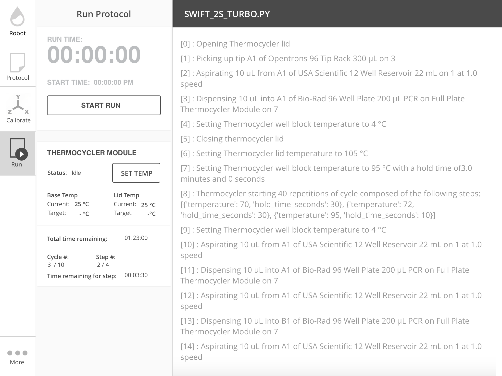

.. _new_modules:

################
Hardware Modules
################

Modules are peripherals that attach to the OT-2 to extend its capabilities.

Modules currently supported are the Temperature, Magnetic and Thermocycler Module.

This is not an exhaustive list of functionality for modules. Check :ref:`protocol-api-modules` or on
our github for full explanations of methods.

Loading your Module onto a deck
===============================
Just like labware, you will also need to load in your module in order to use it
within a protocol. To do this, you call the following *inside* the run function:

.. code-block:: python

    from opentrons import protocol_api

    def run(protocol: protocol_api.ProtocolContext):
         module = protocol.load_module('Module Name', slot)

You can reference your module in a few different ways. The valid names can be found below. They are not case-sensitive.

+--------------------------+-----------------------------------------------+
|        Module Type       |               Nickname(s)                     |
+==========================+===============================================+
| ``Temperature Module``   | ``'Temperature Module'``, ``'tempdeck'``      |
+--------------------------+-----------------------------------------------+
| ``Magnetic Module``      | ``'Magnetic Module'``, ``'magdeck'``          |
+--------------------------+-----------------------------------------------+
| ``Thermocycler Module``  | ``'Thermocycler Module'``, ``'thermocycler'`` |
+--------------------------+-----------------------------------------------+

Loading Labware onto your Module
================================
If you want to interact with labware on top of your Module, you must load labware
onto the module. You can do this via:

.. code-block:: python

    from opentrons import protocol_api

    def run(protocol: protocol_api.ProtocolContext):
         module = protocol.load_module('Module Name', slot)
         my_labware = module.load_labware('labware_definition_name')

Where ``module`` is the variable name you saved your module to. You do not need to specify the slot.

Checking the status of your Module
==================================
All modules have the ability to check what state they are currently in. To do this run the following:

.. code-block:: python

    from opentrons import protocol_api

    def run(protocol: protocol_api.ProtocolContext):
         module = protocol.load_module('Module Name', slot)
         status = module.status

For the temperature module this will return a string stating whether it's ``'heating'``, ``'cooling'``, ``'holding at target'`` or ``'idle'``.
For the magnetic module this will return a string stating whether it's ``'engaged'`` or ``'disengaged'``.
For the Thermocycler Module this will return ``'holding at target'`` or ``'idle'``. There are more detailed status checks which can be found in at :ref:`thermocycler-section`

******************
Temperature Module
******************

Our temperature module acts as both a cooling and heating device. The range
of temperatures this module can reach goes from 4 to 95 degrees celsius with a resolution of 1 degree celcius.

The temperature module has the following methods that can be accessed during a protocol. For the purposes of this
section, assume we have the following already:

.. code-block:: python

    from opentrons import protocol_api

    def run(protocol: protocol_api.ProtocolContext):
        temp_mod = protocol.load_module('temperature module', '1')
        plate = temp_mod.load_labware('corning_96_wellplate_360ul_flat')
        # The code from the rest of the examples in this section goes here

Set Temperature
^^^^^^^^^^^^^^^
To set the temperature module to 4 degrees celsius do the following:

.. code-block:: python

    temp_mod.set_temperature(4)

Wait Until Setpoint Reached
^^^^^^^^^^^^^^^^^^^^^^^^^^^
This function will pause your protocol until your target temperature is reached.

.. code-block:: python

    temp_mod.set_temperature(4)
    temp_mod.wait_for_temp()

Before using ``wait_for_temp()`` you must set a target temperature with ``set_temperature()``.
Once the target temperature is set, when you want the protocol to wait until the module
reaches the target you can call ``wait_for_temp().``

If no target temperature is set via ``set_temperature()``, the protocol will be stuck in
an indefinite loop.

Read the Current Temperature
^^^^^^^^^^^^^^^^^^^^^^^^^^^^
You can read the current real-time temperature of the module by the following:

.. code-block:: python

    temp_mod.temperature

Read the Target Temperature
^^^^^^^^^^^^^^^^^^^^^^^^^^^
We can read the target temperature of the module by the following:

.. code-block:: python

    temp_mod.target

Deactivate
^^^^^^^^^^
This function will stop heating or cooling and will turn off the fan on the module.
You would still be able to call ``set_temperature()`` function to initiate a heating
or cooling phase again.

.. code-block:: python

    temp_mod.deactivate()

** Note**
You can also deactivate your temperature module through our Run App by
clicking on the ``Pipettes & Modules`` tab. Your temperature module will automatically
deactivate if another protocol is uploaded to the app. Your temperature module will
not deactivate automatically upon protocol end, cancel or re-setting a protocol.

***************
Magnetic Module
***************

The magnetic module has two actions:

- ``engage``: The magnetic stage rises to a default height unless an *offset* or a custom *height* is specified
- ``disengage``: The magnetic stage moves down to its home position

You can also specify a custom engage height for the magnets so you can use a different labware with the magdeck.
In the future, we will have adapters to support tuberacks as well as deep well plates.

The magnetic module has the following methods that can be accessed during a protocol. For the purposes of this
section, assume we have the following already:

.. code-block:: python

    from opentrons import protocol_api

    def run(protocol: protocol_api.ProtocolContext):
        mag_mod = protocol.load_module('magnetic module', '1')
        plate = mag_mod.load_labware('nest_96_wellplate_100ul_pcr_full_skirt')
        # The code from the rest of the examples in this section goes here

Engage
^^^^^^

The destination of the magnets can be specified in several different
ways, based on internally stored default heights for labware:

   - If neither ``height`` nor ``offset`` is specified **and** the labware is support on the magnetic module,
     the magnets will raise to a reasonable default height based on the specified
     labware.

     .. code-block:: python

         mag_mod.engage()

   - If ``height`` is specified, it should be a distance in mm from the
     home position of the magnets.

     .. code-block:: python

        mag_mod.engage(height=18.5)

**Note** Only certain labwares have defined engage heights for the Magnetic
Module. If a labware that does not have a defined engage height is
loaded on the Magnetic Module (or if no labware is loaded), then
``height`` must be specified.

Disengage
^^^^^^^^^
.. code-block:: python

   mag_mod.disengage()

The magnetic modules will disengage on power cycle of the device. It will not auto-disengage otherwise
unless you specify in your protocol.

.. _thermocycler-section:

*******************
Thermocycler Module
*******************

The Thermocycler Module is still under active development. The commands are subject to change. A valid operational range has not been determined yet.

The Thermocycler Module allows users to perform complete experiments that require temperature sensitive reactions
such as PCR, restriction enzyme etc. Below is a description of a few ways you can control this module.

There are two heating mechanisms in the Thermocycler module which the user has access to. One is the bottom plate (`block`) in which samples are located,
the other is the lid heating pad.

For the purposes of this section, assume we have the following already:

.. code-block:: python

    from opentrons import protocol_api

    def run(protocol: protocol_api.ProtocolContext):
        tc_mod = protocol.load_module('Thermocycler Module')
        plate = tc_mod.load_labware('nest_96_wellplate_100ul_pcr_full_skirt')

.. note::

    When loading the Thermocycler Module, it is not necessary to specify a slot.
    This is because the Thermocycler Module has a default position that covers Slots 7, 8, 10, and 11.
    This is the only valid location for the Thermocycler Module on the OT2 deck.

Run App Control
^^^^^^^^^^^^^^^
Certain functionality of the Thermocycler Module can be controlled in the Opentrons App.

Setting a Target Temperature
++++++++++++++++++++++++++++
Before the run of the protocol, when you navigate to the `Run` tab of the Opentrons App, you will
see a Thermocycler Module card on the left-hand side like the image below.

If you wish to set a target temperature for the Thermocycler Module `block` before a protocol run, you may do so.
When you run your actual protocol, the steps will not proceed until the target temperature that was set is reached.
We recommend using this if you want to pre-heat or pre-cool samples located on your Thermocycler Module.

Deactivating the Module
+++++++++++++++++++++++
Sometimes you may wish to deactivate the Thermocycler Module, such as removing samples from the module or shutting the
module off after use. Before or after a protocol run, you can press `deactivate` to ensure that your Thermocycler Module is off before
opening the lid.

.. image:: ../img/modules/deactivate_tc.png

.. note::

    The thermocycler will hold at whatever temperature it was last told to hold at (whether through the
    Opentrons App or through the protocol), regardless of the status of an ongoing (or not) run.
    This allows you to cancel a run and be sure that your samples will be held at the temperature specified previously,
    until you decide to deactivate the module from the Opentrons App as described above.

Lid Motor Control
^^^^^^^^^^^^^^^^^
The Thermocycler Module supports temperature control with the lid open and closed. When the lid of the Thermocycler Module is open, the pipettes can access the contained 96-well labware.
You can control the lid with the methods below.

Open Lid
++++++++

.. code-block:: python

    tc_mod.open_lid()

Close Lid
+++++++++

.. code-block:: python

    tc_mod.close_lid()

Lid Temperature Control
^^^^^^^^^^^^^^^^^^^^^^^
As mentioned before, users have access to controlling when a lid temperature is set. It is recommended that you set
the lid temperature before executing a Thermocycler Module profile, described later. The range of the Thermocycler Module lid is
37°C to 110°C.

Set Lid Temperature
+++++++++++++++++++
:py:meth:`.ThermocyclerContext.set_lid_temperature` takes in one parameter which is the temperature you wish the lid to be set to. The protocol will only proceed
once the lid temperature has been reached.

.. code-block:: python

    tc_mod.set_lid_temperature(temperature)

Block Temperature Control
^^^^^^^^^^^^^^^^^^^^^^^^^
To set the aluminum block temperature inside the Thermocycler Module, you can use the method :py:meth:`.ThermocyclerContext.set_block_temperature`. It takes in four parameters
``temperature``, ``hold_time_seconds``, ``hold_time_minutes`` and ``ramp_rate`` respectively. Only temperature is required, both the hold time parameters and ramp rate are not required.

Temperature
+++++++++++

If you only specify a temperature in celsius, the Thermocycler Module will hold this temperature indefinitely until powered off.

.. code-block:: python

        tc_mod.set_block_temperature(4)

Hold Time
+++++++++

If you set a temperature and a hold time, the Thermocycler Module will hold the temperature for the specified amount of time. Time can be passed in as minutes or seconds.
In the example below, the Thermocycler Module will hold the the specified temperature for 45 minutes and 15 seconds. If you do not specify a hold time the protocol will
proceed once the temperature specified is reached.

.. code-block:: python

        tc_mod.set_block_temperature(4, hold_time_seconds=15, hold_time_minutes=45)

Ramp Rate
+++++++++

Lastly, you can modify the ramp rate in degC/sec for a given temperature.

.. code-block:: python

        tc_mod.set_block_temperature(4, hold_time_seconds=60, ramp_rate=0.5)

.. warning::

  Do not change this parameter unless you know what you're doing.

Thermocycler Module Profiles
^^^^^^^^^^^^^^^^^^^^^^^^^^^^
Unlike the temperature module, the Thermocycler Module can rapidly cycle through temperatures to accomplish heat-sensitive reactions. To set up a Thermocycler Module
profile, like you might on the UI of other Thermocycler Modules, use :py:meth:`.ThermocyclerContext.execute_profile`. A profile requires one or more
steps, each of which must contain a temperature and a hold time. As with the :py:meth:`.ThermocyclerContext.set_block_temperature` method, you have the option of specifying your hold time in seconds or
minutes with ``hold_time_seconds`` and ``hold_time_minutes``. **Note** This is *only* for controlling the temperature of the `block` in the Thermocycler Module.

.. code-block:: python

        profile = [
          {temperature: 10, hold_time_seconds: 30},
          {temperature: 10, hold_time_seconds: 30},
          {temperature: 10, hold_time_seconds: 30}]

        tc_mod.execute_profile(steps=profile, repetitions=30)

Thermocycler Module Status
^^^^^^^^^^^^^^^^^^^^^^^^^^
Throughout your protocol, you may want particular information on the current status of your Thermocycler Module. Below are
a few methods that allow you to do that.

Lid Position
++++++++++++
Returns the current status of the lid position. It can be one of the strings ``'open'``, ``'closed'`` or ``'in_between'``.

.. code-block:: python

    tc_mod.lid_position

Heated Lid Temperature Status
++++++++++++++++++++++
Returns the current status of the heated lid temperature. It can be one of the strings ``'holding at target'`` or ``'idle'``.

.. code-block:: python

    tc_mod.lid_temperature_status

Block Temperature Status
++++++++++++++++++++++++
Returns the current status of the well block temperature controller. It can be one of the strings ``'holding at target'``, ``'cooling'``, or ``'heating'``.

.. code-block:: python

    tc_mod.block_temperature_status

Thermocycler Module Deactivate
^^^^^^^^^^^^^^^^^^^^^^^^^^^^^^
At some points in your protocol, you may want to deactivate certain aspects of your Thermocycler Module. This can be done with three methods,
:py:meth:`.ThermocyclerContext.deactivate`, :py:meth:`.ThermocyclerContext.deactivate_lid`, :py:meth:`.ThermocyclerContext.deactivate_block`
that will be able to turn off certain functionalities of the Thermocycler Module.

Deactivate
++++++++++
This deactivates both the well block and the heated lid of the Thermocycler Module.

.. code-block:: python

  tc_mod.deactivate()

Deactivate Lid
++++++++++++++
This deactivates only the heated lid of the Thermocycler Module.

.. code-block:: python

  tc_mod.deactivate_lid()

Deactivate Block
++++++++++++++++
This deactivates only the well block of the Thermocycler Module.

.. code-block:: python

  tc_mod.deactivate_block()
