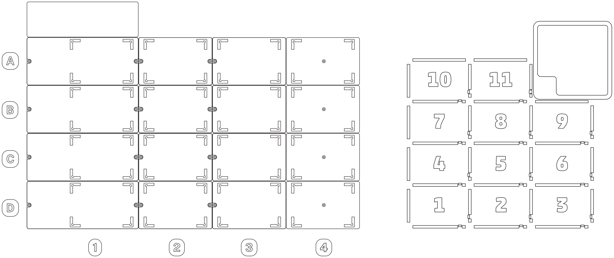

:og:description: How to specify deck slots in the Python Protocol API.

..
    Allow concise cross-referencing to ProtocolContext.load_labware() et. al., without barfing out the whole import path.
.. py:currentmodule:: opentrons.protocol_api

.. _deck-slots:

**********
Deck Slots
**********

When you load an item onto the robot's deck, like with :py:obj:`ProtocolContext.load_labware()` or :py:obj:`ProtocolContext.load_module()`, you need to specify which slot to put it in. The API accepts values that correspond to the physical deck slot labels on an OT-2 or Flex robot.

Physical Deck Labels
====================

The Opentrons Flex uses a coordinate labeling system for slots A1 (back left) through D3 (front right).

The Opentrons OT-2 uses a numeric labeling system for slots 1 (front left) through 11 (back center). The back right slot is occupied by the fixed trash.

API Deck Labels
===============

Specify a slot in either the Flex or OT-2 format:

* A coordinate like ``"A1"``. This format must be a string.
* A number like ``"10"`` or ``10``. This format can be a string or an integer.

As of API version 2.15, the Flex and OT-2 formats are interchangeable. You can use either format, regardless of which robot your protocol is for. You could even mix and match formats within a protocol, although this is not recommended.

For example, these two ``load_labware()`` commands are equivalent:

.. code-block:: python

    protocol.load_labware("nest_96_wellplate_200ul_flat", "A1")
    
.. versionadded:: 2.0

.. code-block:: python

    protocol.load_labware("nest_96_wellplate_200ul_flat", 10)
    
.. versionadded:: 2.15

Both of these commands would require you to load the well plate in the back left slot of the robot.

The correspondence between deck labels is based on the relative locations of the slots. The full list of slot equivalencies is as follows:

.. list-table::
    :stub-columns: 1

    * - Flex
      - A1
      - A2
      - A3
      - B1
      - B2
      - B3
      - C1
      - C2
      - C3
      - D1
      - D2
      - D3
    * - OT-2
      - 10
      - 11
      - Trash
      - 7
      - 8
      - 9
      - 4
      - 5
      - 6
      - 1
      - 2
      - 3

.. TODO staging slots and error handling of A4–D4 in OT-2 protocols
