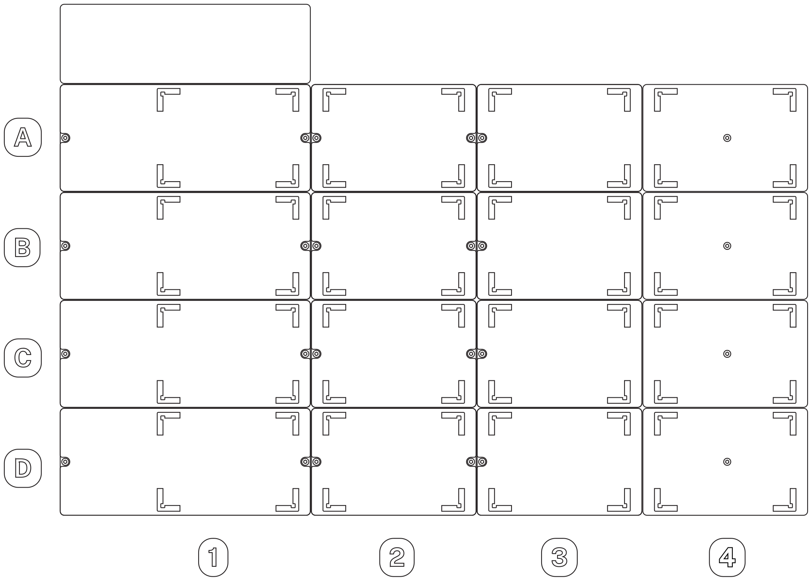

:og:description: How to specify deck slots in the Python Protocol API.

.. _deck-slots:

**********
Deck Slots
**********

Deck slots are where you place hardware items on the deck surface of your Opentrons robot. In the API, you load the corresponding items into your protocol with methods like :py:obj:`.ProtocolContext.load_labware`, :py:obj:`.ProtocolContext.load_module`, or :py:obj:`.ProtocolContext.load_trash_bin`. When you call these methods, you need to specify which slot to load the item in. 

Physical Deck Labels
====================

Flex uses a coordinate labeling system for slots A1 (back left) through D4 (front right). Columns 1 through 3 are in the *working area* and are accessible by pipettes and the gripper. Column 4 is in the *staging area* and is only accessible by the gripper. For more information on staging area slots, see :ref:`deck-configuration` below.

OT-2 uses a numeric labeling system for slots 1 (front left) through 11 (back center). The back right slot is occupied by the fixed trash.

API Deck Labels
===============

The API accepts values that correspond to the physical deck slot labels on a Flex or OT-2 robot. Specify a slot in either format:

* A coordinate like ``"A1"``. This format must be a string.
* A number like ``"10"`` or ``10``. This format can be a string or an integer.

As of API version 2.15, the Flex and OT-2 formats are interchangeable. You can use either format, regardless of which robot your protocol is for. You could even mix and match formats within a protocol, although this is not recommended.

For example, these two ``load_labware()`` commands are equivalent:

.. code-block:: python

    protocol.load_labware("nest_96_wellplate_200ul_flat", "A1")
    
.. versionadded:: 2.15

.. code-block:: python

    protocol.load_labware("nest_96_wellplate_200ul_flat", 10)
    
.. versionadded:: 2.0

Both of these commands would require you to load the well plate in the back left slot of the robot.

The correspondence between deck labels is based on the relative locations of the slots. The full list of slot equivalencies is as follows:

.. list-table::
    :stub-columns: 1

    * - Flex
      - A1
      - A2
      - A3
      - B1
      - B2
      - B3
      - C1
      - C2
      - C3
      - D1
      - D2
      - D3
    * - OT-2
      - 10
      - 11
      - Trash
      - 7
      - 8
      - 9
      - 4
      - 5
      - 6
      - 1
      - 2
      - 3

.. TODO staging slots and error handling of A4–D4 in OT-2 protocols

Slots A4, B4, C4, and D4 on Flex have no equivalent on OT-2. 

.. _deck-configuration:

Deck Configuration
==================

A Flex running robot system version 7.1.0 or higher lets you specify its deck configuration on the touchscreen or in the Opentrons App. This tells the robot the positions of unpowered *deck fixtures*: items that replace standard deck slots. The following table lists currently supported deck fixtures and their allowed deck locations.

.. list-table::
    :header-rows: 1
    
    * - Fixture
      - Slots
    * - Staging area slots
      - A3–D3
    * - Trash bin
      - A1–D1, A3-D3
    * - Waste chute
      - D3
      
Which fixtures you need to configure depend on both load methods and the effects of other methods called in your protocol. The following sections explain how to configure each type of fixture.

.. _configure-staging-area-slots:

Staging Area Slots
------------------

Slots A4 through D4 are the staging area slots. Pipettes can't reach the staging area, but these slots are always available in the API for loading and moving labware. Using a slot in column 4 as the ``location`` argument of :py:meth:`~.ProtocolContext.load_labware` or the ``new_location`` argument of :py:meth:`.move_labware` will require the corresponding staging area slot in the robot's deck configuration::

    plate_1 = protocol.load_labware(
        load_name="corning_96_wellplate_360ul_flat", location="C3"
    )  # no staging slots required
    plate_2 = protocol.load_labware(
        load_name="corning_96_wellplate_360ul_flat", location="D4"
    )  # one staging slot required
    protocol.move_labware(
        labware=plate_1, new_location="C4"
    )  # two staging slots required
    
.. versionadded:: 2.16

Since staging area slots also include a standard deck slot in column 3, they are physically incompatible with powered modules in the same row of column 3. For example, if you try to load a module in C3 and labware in C4, the API will raise an error::

    temp_mod = protocol.load_module(
        module_name="temperature module gen2",
        location="C3"
    )
    staging_plate = protocol.load_labware(
        load_name="corning_96_wellplate_360ul_flat", location="C4"
    )  # deck conflict error

It is possible to use slot D4 along with the waste chute. See the :ref:`Waste Chute <configure-waste-chute>` section below for details. 

.. _configure-trash-bin:
    
Trash Bin
---------

In version 2.15 of the API, Flex can only have a single trash bin in slot A3. You do not have to (and cannot) load the trash in version 2.15 protocols. 

Starting in API version 2.16, you must load trash bin fixtures in your protocol in order to use them. Use :py:meth:`.load_trash_bin` to load a movable trash bin. This example loads a single bin in the default location::

    default_trash = protocol.load_trash_bin(location = "A3")

.. versionadded:: 2.16

.. note::
    The ``TrashBin`` class doesn't have any callable methods, so you don't have to save the result of ``load_trash_bin()`` to a variable, especially if your protocol only loads a single trash container. Being able to reference the trash bin by name is useful when dealing with multiple trash containers.

Call ``load_trash_bin()`` multiple times to add more than one bin. See :ref:`pipette-trash-containers` for more information on using pipettes with multiple trash bins.

.. _configure-waste-chute:

Waste Chute
-----------

The waste chute accepts various materials from Flex pipettes or the Flex Gripper and uses gravity to transport them outside of the robot for disposal. Pipettes can dispose of liquid or drop tips into the chute. The gripper can drop tip racks and other labware into the chute.

To use the waste chute, first use :py:meth:`.load_waste_chute` to load it in slot D3::

    chute = protocol.load_waste_chute()
    
.. versionadded:: 2.16

The ``load_waste_chute()`` method takes no arguments, since D3 is the only valid location for the chute. However, there are multiple variant configurations of the waste chute, depending on how other methods in your protocol use it.

The waste chute is installed either on a standard deck plate adapter or on a deck plate adapter with a staging area. If any :py:meth:`~.ProtocolContext.load_labware` or :py:meth:`.move_labware` calls in your protocol reference slot D4, you have to use the deck plate adapter with staging area.

The waste chute has a removable cover with a narrow opening which helps prevent aerosols and droplets from contaminating the working area. 1- and 8-channel pipettes can dispense liquid, blow out, or drop tips through the opening in the cover. Any of the following require you to remove the cover. 

    - :py:meth:`.dispense`, :py:meth:`.blow_out`, or :py:meth:`.drop_tip` with a 96-channel pipette.
    - :py:meth:`.move_labware` with the chute as ``new_location`` and ``use_gripper=True``.
    
If your protocol *does not* call any of these methods, your deck configuration should include the cover.

In total, there are four possible deck configurations for the waste chute.
    - Waste chute only
    - Waste chute with cover
    - Waste chute with staging area slot
    - Waste chute with staging area slot and cover

Deck Conflicts
==============

A deck conflict check occurs when preparing to run a Python protocol on a Flex running robot system version 7.1.0 or higher. The Opentrons App and touchscreen will prevent you from starting the protocol run until any conflicts are resolved. You can resolve them one of two ways:

    - Physically move hardware around the deck, and update the deck configuration.
    - Alter your protocol to work with the current deck configuration, and resend the protocol to your Flex.
