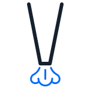

:og:description: How to select and apply transfer behavior optimized for liquid classes in Opentrons protocols. 

.. _liquid-classes: 

****************
Liquid Classes
****************

Accounting for properties of liquids in your protocol can increase pipetting accuracy on the Flex. For example, a slower flow rate can improve pipetting for a viscous liquid, and an air gap can prevent a volatile liquid from dripping onto the deck. 

This section covers:
* Opentrons-verified liquid classes and their optimized properties, like flow rate.
* Selecting and using a liquid class in a Flex protocol.
* Customizing a liquid class for your workflow. 

.. _opentrons-verified-liquid-classes: 

Opentrons-verified Liquid Classes
=================================

Opentrons-verified liquid classes are based on the properties of common liquids: 

.. list-table::
    :header-rows: 1

    * - Opentrons-verified liquid class
      - Description
      - Load name
    * - Aqueous
      -
        * Based on deionized water
        * The system default
      - ``water``
    * - Volatile
      - Based on 80% ethanol
      - ``ethanol_80``
    * - Viscous
      - Based on 50% glycerol
      - ``glycerol_50``

Use an Opentrons-verified liquid class in your transfers to automatically apply optimized behavior. For example, choosing the ``glycerol_50`` liquid class changes *properties*, like flow rate, to accurately transfer viscous liquid. 

.. _liquid-class-properties: 

Liquid Class Properties
========================

When you select a liquid class to use in transfers on the the Flex, properties like submerge speed, flow rate, touch tip, and air gap are automatically applied. These changes might help prevent splashing or dripping of a volatile liquid, or reduce air bubbles forming in a viscous liquid. 

Each Opentrons-verified liquid class is defined by a set of properties: 

    
    The pipette begins at this position above the liquid and submerges into the liquid at this speed.

.. figure:: ../img/lc_icons/delay_after_submerge.png
    :name: Delay after submerging
    :scale: 35%
    :align: center

    The pipette delays a specified amount of time: 
    * before submerging into or retracting from liquid.
    * before or after an aspirate or dispense.
    * after a push out. 

    The pipette mixes liquid inside the well before an aspirate or after a dispense. 

    The pipette pre-wets the attached tip before aspirating liquid. 

    The pipette aspirates or dispense liquid at this speed. 

.. figure:: ../img/lc_icons/retract_position.png
    :name: Retract position
    :scale: 35%
    :align: left

.. figure:: ../img/lc_icons/retract_speed.png
    :name: Retract speed
    :scale: 35%
    :align: right

    The pipette: 
    * retracts from the liquid and moves to this position. 
    * retracts from the liquid at the specified speed. 
  
.. figure:: ../img/lc_icons/push_out.png
    :name: Push out
    :scale: 35%
    :align: center

    The pipette dispenses a small amount of air to ensure all liquid leaves the tip. 

.. figure:: ../img/lc_icons/touch_tip.png
    :name: Touch tip
    :scale: 35%
    :align: center

    The pipette touches the attached tip the sides of a well to remove droplets. 

    The pipette aspirates a small amount of air after an aspirate or dispense.

    The pipette dispenses a larger amount of air to ensure all liquid leaves the tip. 

A :ref:`liquid class definition <liquid-class-definitions>` specifies values for each property. When your Flex protocol includes a liquid class, these property values automatically define transfer behavior. For example, if you use `.InstrumentContext.transfer_with_liquid_class` to transfer a viscous liquid, the pipette submerges into the liquid and aspirates more slowly to prevent air bubbles from forming. 

Properties marked with an asterisk, as shown above, are determined by your pipette, tip, and volumbe combinations. For more information, see :ref:`liquid-class-definitions`. 

.. _selecting-a-liquid-class:

Selecting a Liquid Class
=========================

You'll use a :ref:`liquid class definition <liquid-class-definitions>` in your protocol to optimize transfer behavior based on liquid properties, along with your chosen Flex pipettes and tips. 

Start by definining the tips, trash, pipette, and labware used in your transfers. Then, use :py:meth:`.ProtocolContext.get_liquid_class` to select an Opentrons-verified liquid class.

.. code-block:: python
    :substitutions: 

    from opentrons import protocol_api

    requirements = {"robotType": "Flex", "apiLevel": "|2.23|"}

    # define tips, trash, and pipette
    def run(protocol: protocol_api.ProtocolContext):
        tiprack1 = protocol_context.load_labware("opentrons_flex_96_tiprack_50ul", "D3")
        trash = protocol_context.load_trash_bin("A3")
        pipette_50 = protocol_context.load_instrument("flex_1channel_50", "left, tip_racks=[tiprack1]")
    
    # load source and destination labware
        nest_plate = protocol_context.load_labware("nest_96_wellplate_200ul_flat", "C3")
        arma_plate = protocol_context.load_labware("armadillo_96_wellplate_200ul_pcr_full_skirt","C2")

    # select liquid classes to use in your protocol
        liquid_1 = protocol_context.get_liquid_class("glycerol_50")
        liquid_2 = protocol_context.get_liquid_class("ethanol_80")
        liquid_3 = protocol_context.get_liquid_class("glycerol_50")

You'll need to add a label, like ``liquid_1``, to liquid classes in your protocol. This helps you keep track of multiple liquids of the same class in a protocol. It's also required by ``transfer_with_liquid_class()``, instead of a liquid class load name like ``glycerol_50``. 

.. _liquid-class-transfers:

Liquid Class Transfers
=======================

Use the :py:meth:`.InstrumentContext.transfer_with_liquid_class` method to transfer an aqueous, volatile, or viscous liquid defined in a Flex protocol. This method accepts arguments that let you specify your liquid, volume, source and destination wells, tip handling preferences, and trash location. 

Opentrons-verified liquid class definitions are based on Flex pipette and tip combinations. The API will raise an error if you try to perform a liquid class transfer with an OT-2 pipette and tips. 

In the example below, a Flex P50 1-channel pipette will transfer 50 µL of your viscous ``liquid_1`` from each well of the  source plate to each well of the destination plate. A new tip is used for each well transfer, and each tip is dropped in the trash bin loaded in slot A3. 

.. code-block:: python

    pipette_50.transfer_with_liquid_class(
        liquid_class=liquid_1,
        volume=50,
        source=nest_plate.rows()[0],
        dest=arma_plate.rows()[0],
        new_tip="always",
        trash_location=trash
    )

Here, the ``glycerol_50`` viscous liquid class definition accounts for all other transfer behavior, like flow rate, whether or not to add an air gap or delay, and submerge and retract speeds. For each aspirate, the pipette: 

* Moves to the submerge start position of 2 mm above the top of the source well at 4 mm/sec.
* Submerges into ``liquid_1`` at 4 mm/sec to the aspirate start position of 2 mm above the bottom of the well. 
* Aspirates 50 µL of ``liquid_1`` at 50 µL/sec with a correction by volume of -0.2 µL. 
* Delays for 1 sec after aspirating. 
* Moves to the retract position of 2 mm above the top of the well at 4 mm/sec. 

And for each dispense, the pipette: 

* Moves to the submerge start position of 2 mm above the top of the destination well at 4 mm/sec. 
* Moves to the dispense position of 2 mm above the top of the destination well at 4 mm/sec. 
* Dispense 50 µL of ``liquid_1`` at 25 µL/sec with a correction by volume of -0.2 µL. 
* Pushes out a volume of air equivalent to 3.9 µL to ensure all liquid leaves the tip, and delays for 0.5 sec afterward. 
* Moves to the retract position of 2 mm above the top of the well at 4 mm/sec. 

In many cases, the liquid class definition represents fine-tuned changes optimized for each liquid class. If you instead use the Flex P50 1-channel pipette to transfer 50 µL of the volatile ``liquid_2``, transfer behavior would include: 
* Submerging into and retracting from the volatile ``liquid_2`` at 100 mm/sec.
* Adding larger air gaps after aspirating *and* dispensing to prevent dripping onto the deck.
* Aspirating and dispensing at 30 µL/sec with a larger correction by volume. 
* Pushing out a larger volume of air to ensure all liquid leaves the tip. 

Not all transfer behavior is easily visible. See :ref:`liquid-class-definitions` for a full list of changes based on liquid class, pipette, and tip combination. For more detail on individual transfer settings, see :ref:`liquid-control`. 

.. _customizing-liquid-classes:

Customizing Liquid Classes
===========================

You can create your own liquid class to customize transfer behavior for any liquid in a Flex protocol. To make changes, you can:
* Edit individual properties of an existing liquid class, or 
* Add properties to a new liquid class. 

To customize an Opentrons-verified liquid class, use :py:meth:`InstrumentContext.define_liquid_class` to define your custom liquid class after adding your pipettes, tips, trash, and labware::

    requirements = {"robotType": "Flex", "apiLevel": "2.24"}

    def run(protocol_context):
       tiprack = protocol_context.load_labware("opentrons_96_tiprack_20ul", "A2")
       pipette_20 = protocol_context.load_instrument("p20_single_gen2", mount="left", tip_racks=[tiprack])
       trash = protocol_context.load_trash_bin("A3")
       nest_plate = protocol_context.load_labware("nest_96_wellplate_200ul_flat", "B1")
       arma_plate = protocol_context.load_labware("armadillo_96_wellplate_200ul_pcr_full_skirt", "B2")

    ## customize based on the aqueous liquid class
    custom_water = protocol_context.define_liquid_class(
        name="custom_water",
        properties=custom_liquid_class_properties,
        base_liquid_class="aqueous",
        display_name="Custom Water",
    )

Next, edit indivual liquid class properties based on your Flex pipette and tip combination. 

.. code-block:: python

    # access aqueous liquid class properties for the Flex 1-ch. pipette and tips
    custom_water_props = custom_water.get_for(pipette_20, tiprack)
    
    # edit aspirate submerge speed
    custom_water_props.aspirate.submerge.speed = 80

    # edit aspirate flow rate by volume for 10 μL and 20 μL volumes
    custom_water_props.aspirate.flow_rate_by_volume = [(10.0, 40.0), (20.0, 30.0)]

    # edit to delay before an aspirate
    custom_water_props.aspirate.delay = {"enabled": True} 

You can also create a new liquid class for your Flex protocols. Instead of using an Opentrons-verified ``base_liquid_class``, you'll start from scratch, providing a value for `every required property <https://github.com/Opentrons/opentrons/blob/edge/shared-data/liquid-class/schemas/1.json>` in your liquid class. 

.. code-block:: python

 # add all required properties, like aspirate properties, for the pipette, tip rack, and liquid class
    custom_liquid_class_properties = {
       "p20_single_gen2": {
          "opentrons/opentrons_96_tiprack_20ul/1": {
              "aspirate": {
                 "aspirate_position": {
                    "offset": {"x": 1, "y": 2, "z": 3},
                    "position_reference": "well-bottom",
                }
    
    # create a new liquid class
    custom_viscous = protocol_context.define_liquid_class(
        name="custom_viscous",
        properties=custom_liquid_class_properties,
        display_name="Custom Viscous",
    )

The example above only includes aspirate position properties. To create your liquid class, you'll need to define values for `required properties <https://github.com/Opentrons/opentrons/blob/edge/shared-data/liquid-class/schemas/1.json>` like submerging before aspirating or after dispensing, speeds and flow rates, and position offsets. 

.. note:: 

    The :py:meth:`.InstrumentContext.get_liquid_class` method only accepts Opentrons-verified liquid classes, like ``glycerol_50``. You'll need to use :py:meth:`.InstrumentContext.define_liquid_class` in each Flex protocol that uses a custom liquid class.

