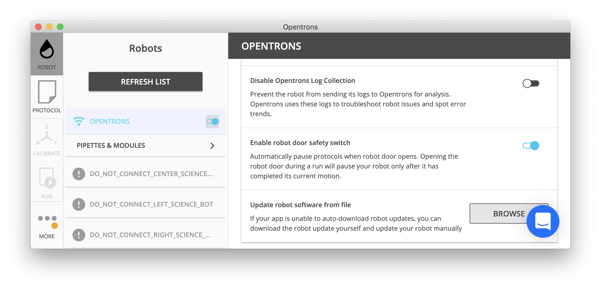

:og:description: Building block commands are the smallest individual actions that Opentrons robots can perform.

.. adding a comment to make this different from edge to open a PR
.. github won't allow PRs if the upstream resource is the same
.. could do an empty pull request, but that seems wrong
.. delete these comments when done with the project

.. _v2-atomic-commands:

***********************
Building Block Commands
***********************

Building block commands execute some of the most basic actions that your robot can complete. But basic doesn’t mean these commands lack capabilities. They perform important tasks in your protocols. They're also foundational to the :ref:`complex commands <v2-complex-commands>` that help you write and run longer, more intricate procedures. In this section, we'll look at building block commands that let you work with pipette tips, liquids, and robot utility features.

.. I wonder if this should start w/ an H2 like "Getting Started" and make the
.. 3 following H3 headers (code samples, instruments and labware, sample file)

Using These Examples
====================

These code samples are designed for anyone using an Opentrons Flex or OT-2 liquid handling robot. For our users with little to no Python experience, we’ve taken some liberties with the syntax and structure of the code to make it easier to understand. For example, we'll try to show code samples without horizontal scrolling and use `named arguments <https://en.wikipedia.org/wiki/Named_parameter>`_ instead of positional arguments. For example::

    # This code uses named arguments
    tiprack_1 = protocol.load_labware(
        load_name="opentrons_flex_96_tiprack_1000ul", location="D2"
    )

    # This code uses positional arguments
    tiprack_1 = protocol.load_labware("opentrons_flex_96_tiprack_1000ul", "D2")   

Both examples instantiate the variable ``tiprack_1`` with a Flex tip rack, but the former is more explicit. It shows the parameter name and its value together (e.g. ``location="D2"``), which may be helpful when you're unsure about what's going on in a protocol code sample.

Python developers with more experience should feel free to ignore the code styling used here and work with these examples as you like.

Instruments and Labware
=======================

The sample protocols all use the following pipettes:

* Flex 1-Channel Pipette (5–1000 µL). The API load name for this pipette is ``flex_1channel_1000``. 
* P300 Single-Channel GEN2 pipette for the OT-2. The API load name for this pipette is ``p300_single_gen2``. 

They also use the labware listed below: 

.. list-table::
    :header-rows: 1

    * - Labware type
      - Labware name
      - API load name
    * - Well plate
      - Corning 96 Well Plate 360 µL Flat
      - ``corning_96_wellplate_360ul_flat``
    * - Flex tip rack
      - Opentrons Flex 96 Tip Rack 1000 µL
      - ``opentrons_flex_96_tiprack_1000ul``
    * - OT-2 tip rack
      - Opentrons 96 Tip Rack 300 µL
      - ``opentrons_96_tiprack_300ul``

.. _atomic-file:

Sample Protocol File 
====================

Depending on your robot model and/or API version, the foundation of a basic protocol file could look similar to the following examples. For information about variations in the code before the ``run()`` function, see the :ref:`Metadata <tutorial-metadata>` and :ref:`Requirements <tutorial-requirements>` sections of the :ref:`tutorial <tutorial>`. The examples in this section are based on and work with this starting code.

.. tabs::

    .. tab:: Flex 

        .. code-block:: python
            :substitutions:

            from opentrons import protocol_api

            requirements = {"robotType": "Flex", "apiLevel": "|apiLevel|"}

            def run(protocol: protocol_api.ProtocolContext):
                # load well plate in deck slot D2
                plate = protocol.load_labware(
                    load_name="corning_96_wellplate_360ul_flat", location="D2"
                )
                # load tip rack in deck slot D3
                tiprack_1 = protocol.load_labware(
                    load_name="opentrons_flex_96_tiprack_1000ul", location="D3"
                )
                # attach pipette to left mount
                pipette = protocol.load_instrument(
                    instrument_name="flex_1channel_1000",
                    mount="left",
                    tip_racks=[tip_rack_1],
                )
                # Put other protocol commands here
    
    .. tab:: OT-2 

        .. code-block:: python
            :substitutions:

            from opentrons import protocol_api

            metadata = {'apiLevel': '|apiLevel|'}

            def run(protocol: protocol_api.ProtocolContext):
                # load well plate in deck slot 2
                plate = protocol.load_labware(
                    load_name="corning_96_wellplate_360ul_flat", location=2
                )
                # load tip rack in deck slot 3
                tiprack_1 = protocol.load_labware(
                    load_name="opentrons_96_tiprack_300ul", location=3
                )
                # attach pipette to left mount
                pipette = protocol.load_instrument(
                    instrument_name="p300_single_gen2",
                    mount="left",
                    tip_racks=[tip_rack_1]
                )  
                # Put other protocol commands here

************
Tip Handling
************

By default, the robot constantly exchanges old, used tips for new ones to prevent cross-contamination between wells. Tip handling uses the functions :py:meth:`.InstrumentContext.pick_up_tip`, :py:meth:`.InstrumentContext.drop_tip`, and :py:meth:`.InstrumentContext.return_tip`.

Pick Up Tip
===========

Before any liquid handling can be done, your pipette must have a tip on it. The command :py:meth:`.InstrumentContext.pick_up_tip` will move the pipette over to the specified tip, then press down into it to create a vacuum seal. The below example picks up the tip at location ``'A1'`` of the tiprack previously loaded in slot 3.

.. code-block:: python

   pipette.pick_up_tip(tiprack['A1'])

If you have associated a tiprack with your pipette such as in the :ref:`new-pipette` or :ref:`protocol_api-protocols-and-instruments` sections, then you can simply call

.. code-block:: python

    pipette.pick_up_tip()

This will use the next available tip from the list of tipracks passed in to the ``tip_racks`` argument of :py:meth:`.ProtocolContext.load_instrument`.

.. versionadded:: 2.0

Drop Tip
========

Once finished with a tip, the pipette will remove the tip when we call :py:meth:`.InstrumentContext.drop_tip`. You can specify where to drop the tip by passing in a location. The below example drops the tip back at its original location on the tip rack.
If no location is specified, the OT-2 will drop the tip in the fixed trash in slot 12 of the deck.

.. code-block:: python

    pipette.pick_up_tip()
    pipette.drop_tip(tiprack['A1'])  # drop back in A1 of the tiprack
    pipette.pick_up_tip()
    pipette.drop_tip()  # drop in the fixed trash on the deck

.. versionadded:: 2.0

.. _pipette-return-tip:

Return Tip
===========

To return the tip to the original location, you can call :py:meth:`.InstrumentContext.return_tip`. The example below will automatically return the tip to ``'A3'`` on the tip rack.

.. code-block:: python

    pipette.pick_up_tip(tiprack['A3'])
    pipette.return_tip()

.. note:

    In API versions 2.0 and 2.1, the returned tips are added back into the tip-tracker and thus treated as `unused`. If you make a subsequent call to `pick_up_tip` then the software will treat returned tips as valid locations.
    In API version 2.2, returned tips are no longer added back into the tip tracker. This means that returned tips are no longer valid locations and the pipette will not attempt to pick up tips from these locations.
    Also in API Version 2.2, the return tip height was corrected to utilize values determined by hardware testing. This is more in-line with return tip behavior from Python Protocol API Version 1.

In API version 2.2 or above:

.. code-block:: python

    tip_rack = protocol.load_labware(
            'opentrons_96_tiprack_300ul', 1)
    pipette = protocol.load_instrument(
        'p300_single_gen2', mount='left', tip_racks=[tip_rack])

    pipette.pick_up_tip() # picks up tip_rack:A1
    pipette.return_tip()
    pipette.pick_up_tip() # picks up tip_rack:B1

In API version 2.0 and 2.1:

.. code-block:: python

    tip_rack = protocol.load_labware(
            'opentrons_96_tiprack_300ul', 1)
    pipette = protocol.load_instrument(
        'p300_single_gen2', mount='left', tip_racks=[tip_rack])

    pipette.pick_up_tip() # picks up tip_rack:A1
    pipette.return_tip()
    pipette.pick_up_tip() # picks up tip_rack:A1

Iterating Through Tips
----------------------

For this section, instead of using the protocol defined above, consider this setup:

.. code-block:: python
    :substitutions:

    from opentrons import protocol_api

    metadata = {'apiLevel': '|apiLevel|'}

    def run(protocol: protocol_api.ProtocolContext):
        plate = protocol.load_labware(
            'corning_96_wellplate_360ul_flat', 2)
        tip_rack_1 = protocol.load_labware(
            'opentrons_96_tiprack_300ul', 3)
        tip_rack_2 = protocol.load_labware(
            'opentrons_96_tiprack_300ul', 4)
        pipette = protocol.load_instrument(
            'p300_single_gen2', mount='left', tip_racks=[tip_rack_1, tip_rack_2])

This loads a `Corning 96 Well Plate <https://labware.opentrons.com/corning_96_wellplate_360ul_flat>`_ in slot 2 and two `Opentrons 300ul Tiprack <https://labware.opentrons.com/opentrons_96_tiprack_300ul>`_ in slots 3 and 4 respectively, and uses a P300 Single GEN2 pipette.

When a list of tip racks is associated with a pipette in its ``tip_racks`` argument, the pipette will automatically pick up the next unused tip in the list whenever you call :py:meth:`.InstrumentContext.pick_up_tip`. The pipette will first use all tips in the first tiprack, then move on to the second, and so on:

.. code-block:: python

    pipette.pick_up_tip()  # picks up tip_rack_1:A1
    pipette.return_tip()
    pipette.pick_up_tip()  # picks up tip_rack_1:A2
    pipette.drop_tip()     # automatically drops in trash

    # use loop to pick up tips tip_rack_1:A3 through tip_rack_2:H12
    tips_left = 94 + 96 # add up the number of tips leftover in both tipracks
    for _ in range(tips_left):
        pipette.pick_up_tip()
        pipette.return_tip()

If you try to :py:meth:`.InstrumentContext.pick_up_tip()` again when all the tips have been used, the Protocol API will show you an error:

.. code-block:: python

    # this will raise an exception if run after the previous code block
    pipette.pick_up_tip()

To change the location of the first tip used by the pipette, you can use :py:obj:`.InstrumentContext.starting_tip`:

.. code-block:: python

    pipette.starting_tip = tip_rack_1.well('C3')
    pipette.pick_up_tip()  # pick up C3 from "tip_rack_1"
    pipette.return_tip()

To reset the tip tracking, you can call :py:meth:`.InstrumentContext.reset_tipracks`:

.. code-block:: python

    # Use up all tips
    for _ in range(96+96):
         pipette.pick_up_tip()
         pipette.return_tip()

    # Reset the tip tracker
    pipette.reset_tipracks()

    # Picks up a tip from well A1 of the first tip rack
    pipette.pick_up_tip()

.. versionadded:: 2.0

To check whether you should pick up a tip or not, you can utilize :py:meth:`.InstrumentContext.has_tip`:

.. code-block:: python

    for block in range(3):
        if block == 0 and not pipette.has_tip:
            pipette.pick_up_tip()
        else:
            m300.mix(mix_repetitions, 250, d)
            m300.blow_out(s.bottom(10))
            m300.return_tip()

.. versionadded:: 2.7

**********************

Liquid Control
==============

After attaching a tip, your robot is ready to aspirate, dispense, and perform other liquid handling tasks. The API includes methods that help you perform these actions and the following sections show how to use them. The examples used here assume that you've loaded the pipettes and labware from the basic :ref:`protocol template <protocol-template>`. 

.. _new-aspirate:

Aspirate
--------

To draw liquid up into a pipette tip, call the :py:meth:`.InstrumentContext.aspirate` method. This method lets you specify the aspiration volume in µL, the well location, and pipette flow rate. Other parameters let you position the pipette within a well. For example, this snippet tells the robot to aspirate 200 µL from well location A1.

.. code-block:: python

    pipette.pick_up_tip()
    pipette.aspirate(200, plate['A1'])

If the pipette doesn't move, you can also specify an additional aspiration action without including a location. To demonstrate, lets pause the protocol, automatically resume it, and aspirate a second time from ``plate['A1'])``.

.. code-block:: python

    pipette.pick_up_tip()
    pipette.aspirate(200, plate['A1'])
    protocol.delay(seconds=5) # pause for 5 seconds
    pipette.aspirate(100)     # aspirate 100 µL at current position

Now our pipette holds 300 µL.

Aspirate by Well or Location
^^^^^^^^^^^^^^^^^^^^^^^^^^^^

The :py:meth:`~.InstrumentContext.aspirate` method includes a ``location`` parameter that accepts either a ``Well`` or a ``Location``. 

If you specify a well, like ``plate['A1']``, the pipette will aspirate from a default position 1 mm above the bottom center of that well. To change the default clearance, you would call :py:obj:`.well_bottom_clearance`:: 

    pipette.pick_up_tip
    pipette.well_bottom_clearance.aspirate = 2 # tip is 2 mm above well bottom
    pipette.aspirate(200, plate['A1'])

You can also aspirate from a location along the center vertical axis within a well using the :py:meth:`.Well.top` and :py:meth:`.Well.bottom` methods. These methods move the pipette to a specified distance relative to the top or bottom center of a well::

    pipette.pick_up_tip()
    depth = plate['A1'].bottom(z=2) # tip is 2 mm above well bottom
    pipette.aspirate(200, depth)

See also:

- :ref:`new-default-op-positions` for information about controlling pipette height for a particular pipette.
- :ref:`position-relative-labware` for formation about controlling pipette height from within a well.
- :ref:`move-to` for information about moving a pipette to any reachable deck location.

Aspiration Flow Rates
^^^^^^^^^^^^^^^^^^^^^

Flex and OT-2 pipettes aspirate at :ref:`default flow rates <new-plunger-flow-rates>` measured in µL/s. Adding a number to the ``rate`` parameter multiplies the flow rate by that value. As a best practice, don't set the flow rate higher than 3x the default. For example, this code causes the pipette to aspirate at twice its normal rate::

    pipette.aspirate(200, plate['A1'], rate=2.0)

.. Removed note related to API v1

.. Removed note because pipette clearance defaults and locations are now covered

.. versionadded:: 2.0

.. _new-dispense:

Dispense
--------

To dispense liquid from a pipette tip, call the :py:meth:`.InstrumentContext.dispense` method. This method lets you specify the dispense volume in µL, the well location, and pipette flow rate. Other parameters let you position the pipette within a well. For example, this snippet tells the robot to dispense 200 µL into well location B1.

.. code-block:: python

    pipette.dispense(200, plate['B1'])

If the pipette doesn’t move, you can also specify an additional dispense action without including a location. To demonstrate, lets pause the protocol, automatically resume it, and dispense a second time from location B1.

.. code-block:: python
    
    pipette.dispense(100, plate['B1'])
    protocol.delay(seconds=5) # pause for 5 seconds
    pipette.dispense(100)     # dispense 100 µL at current position
    
Dispense by Well or Location
^^^^^^^^^^^^^^^^^^^^^^^^^^^^

The :py:meth:`~.InstrumentContext.dispense` method includes a ``location`` parameter that accepts either a ``Well`` or a ``Location``.

If you specify a well, like ``plate['B1']``, the pipette will dispense from a default position 1 mm above the bottom center of that well. To change the default clearance, you would call :py:obj:`.well_bottom_clearance`::

    pipette.well_bottom_clearance.dispense=2 # tip is 2 mm above well bottom
    pipette.dispense(200, plate['B1'])

You can also dispense from a location along the center vertical axis within a well using the :py:meth:`.Well.top` and :py:meth:`.Well.bottom` methods. These methods move the pipette to a specified distance relative to the top or bottom center of a well::

    depth = plate['B1'].bottom(z=2) # tip is 2 mm above well bottom
    pipette.dispense(200, depth)

See also:

- :ref:`new-default-op-positions` for information about controlling pipette height for a particular pipette.
- :ref:`position-relative-labware` for formation about controlling pipette height from within a well.
- :ref:`move-to` for information about moving a pipette to any reachable deck location.

Dispense Flow Rates
^^^^^^^^^^^^^^^^^^^

Flex and OT-2 pipettes dispense at :ref:`default flow rates <new-plunger-flow-rates>` measured in µL/s. Adding a number to the ``rate`` parameter multiplies the flow rate by that value. As a best practice, don't set the flow rate higher than 3x the default. For example, this code causes the pipette to dispense at twice its normal rate::

    pipette.dispense(200, plate['B1'], rate=2.0)

.. Removing the 2 notes here from the original. Covered by new revisions.

.. versionadded:: 2.0

.. _new-blow-out:

.. _blow-out:

Blow Out
--------

To blow an extra amount of air through the pipette's tip, call the :py:meth:`.InstrumentContext.blow_out` method. You can use a specific well in a well plate or reservoir as the blowout location. If no location is specified, the pipette will blowout from its current well position::

    pipette.blow_out()

You can also specify a particular well as the blowout location::

    pipette.blow_out(plate['B1'])

Many protocols use trash bin for blowing out the pipette. You can specify the trash bin as the blowout location by using the :py:meth:`.ProtocolContext.fixed_trash` method::

    pipette.blow_out(protocol.fixed_trash['A1'])  

.. versionadded:: 2.0

.. _touch-tip:

Touch Tip
---------

The :py:meth:`.InstrumentContext.touch_tip` method moves the pipette so the tip touches each wall of a well. A touch tip procedure helps knock off any droplets that might cling to the pipette's tip. This method includes optional arguments that let you specify where the tip will touch the inner walls of a well and the touch speed. Calling :py:meth:`~.InstrumentContext.touch_tip` without arguments causes the pipette to touch the well walls from its current location::

    pipette.touch_tip() 

Touch Location
^^^^^^^^^^^^^^

These optional location arguments give you control over where the tip will touch the side of a well.

This example demonstrates touching the tip in a specific well::

    pipette.touch_tip(plate['B1'])
    
This example uses an offset to set the touch tip location 2mm below the top of the current well::

    pipette.touch_tip(v_offset=-2) 

This example moves the pipette 75% of well's total radius and 2 mm below the top of well::

    pipette.touch_tip(plate['B1'], 
                      radius=0.75,
                      v_offset=-2)

When ``radius=1``, the robot moves the centerline of the pipette’s plunger axis to the exact edge of the well. Sometimes this means a pipette tip may hit the well wall or edge first and bends inwards. Setting the radius to < 1 helps avoid hitting the well wall prematurely. If you need to use it, test the radius argument first before starting a protocol production run.

.. warning::
    *Do not* set the ``radius`` value greater than ``1.0``. When ``radius`` is > ``1.0``, the robot will forcibly move the pipette tip across a well wall or edge. This type of aggressive movement can damage the pipette tip and the pipette.

Touch Speed
^^^^^^^^^^^

Touch speed controls how fast the pipette moves in mm/s during a touch tip step. The default movement speed is 60 mm/s, the minimum is 20 mm/s, and the maximum is 80 mm/s. Calling ``touch_tip`` without any arguments moves a tip at the default speed in the current well::

    pipette.touch_tip()

This example specifies a well location and sets the speed to 20 mm/s::

    pipette.touch_tip(plate['B1'], speed=20)

This example uses the current well and sets the speed to 80 mm/s::

    pipette.touch_tip(speed=80)

.. versionadded:: 2.0

.. there was a recommendation to remove the note

.. _mix:

Mix
---

The :py:meth:`~.InstrumentContext.mix` method aspirates and dispenses repeatedly in a single location. It's designed to help mix the contents of a well together using a single command rather than using multiple ``aspirate()`` and ``dispense()`` calls. This method includes arguments that let you specify the number of times to mix, the volume (in µL) of liquid, and the well that contains the liquid you want to mix.

This example draws 100 µL from the current well and mixes it three times::

    pipette.mix(repetitions=3, volume=100)

This example draws 100 µL from well B1 and mixes it three times:: 

    pipette.mix(3, 100, plate['B1'])

This example draws an amount equal to the pipette's maximum rated volume and mixes it three times::

    pipette.mix(repetitions=3)

.. note::

    In API versions 2.2 and earlier, during a mix, the pipette moves up and out of the target well. In API versions 2.3 and later, the pipette does not move while mixing. 

.. versionadded:: 2.0

.. _air-gap:

Air Gap
-------

The :py:meth:`.InstrumentContext.air_gap` method tells the pipette to draw in air before or after a liquid. Creating an air gap helps keep liquids from seeping out of a pipette after drawing it from a well. This method includes arguments that let you control the amount of air to aspirate and the pipette's height (in mm) above the well. By default, the pipette moves 5 mm above a well before aspirating air. Calling :py:meth:`~.InstrumentContext.air_gap` with no arguments uses the entire remaining volume in the pipette.

This example aspirates 200 µL of air 5 mm above the current well::

    pipette.air_gap(volume=200)

This example aspirates 200 µL of air 20 mm above the the current well::

    pipette.air_gap(volume=200, height=20)

This example aspirates enough air to fill the remaining volume in a pipette::

    pipette.air_gap()

.. versionadded:: 2.0

.. _new-utility-commands:

****************
Utility Commands
****************

Delay for an Amount of Time
===========================

Sometimes you need to wait as a step in your protocol, for instance to wait for something to incubate. You can use :py:meth:`.ProtocolContext.delay` to wait your protocol for a specific amount of time. ``delay`` is a method of :py:class:`.ProtocolContext` since it concerns the protocol as a whole.

The values passed into ``delay()`` specify the number of minutes and seconds that the robot will wait until moving on to the next command.

.. code-block:: python

    protocol.delay(seconds=2)             # delay for 2 seconds
    protocol.delay(minutes=5)             # delay for 5 minutes
    protocol.delay(minutes=5, seconds=2)  # delay for 5 minutes and 2 seconds

Pause Until Resumed
===================

The method :py:meth:`.ProtocolContext.pause` will pause protocol execution at a specific step.
You can resume by pressing 'resume' in your Opentrons App. You can optionally specify a message that
will be displayed in the Opentrons App when protocol execution pauses.

.. code-block:: python
    :substitutions:

    from opentrons import protocol_api

    metadata = {'apiLevel': '|apiLevel|'}

    def run(protocol: protocol_api.ProtocolContext):
        # The start of your protocol goes here...

        # The protocol stops here until you press resume. The optional message appears in
        # the Opentrons App. You do not need to specify a message, but it makes things
        # more clear.
        protocol.pause('Time to take a break')

.. versionadded:: 2.0

Homing
======

You can manually request for the robot to home during protocol execution. This is typically
not necessary; however, if at any point you will disengage motors or move
the gantry with your hand, you may want to command a home afterwards.

To home the all axes, you can call :py:meth:`.ProtocolContext.home`.

To home a specific pipette's Z axis and plunger, you can call :py:meth:`.InstrumentContext.home`.

To home a specific pipette's plunger only, you can call :py:meth:`.InstrumentContext.home_plunger`.

None of these functions take any arguments:

.. code-block:: python
    :substitutions:

    from opentrons import protocol_api, types

    metadata = {'apiLevel': '|apiLevel|'}

    def run(protocol: protocol_api.ProtocolContext):
        pipette = protocol.load_instrument('p300_single', 'right')
        protocol.home() # Homes the gantry, z axes, and plungers
        pipette.home()  # Homes the right z axis and plunger
        pipette.home_plunger() # Homes the right plunger

.. versionadded:: 2.0

Comment
=======

The method :py:meth:`.ProtocolContext.comment` lets you display messages in the Opentrons App during protocol execution:

.. code-block:: python
    :substitutions:

    from opentrons import protocol_api, types

    metadata = {'apiLevel': '|apiLevel|'}

    def run(protocol: protocol_api.ProtocolContext):
        protocol.comment('Hello, world!')

.. versionadded:: 2.0

Control and Monitor Robot Rail Lights
=====================================

You can turn the robot rail lights on or off in the protocol using :py:meth:`.ProtocolContext.set_rail_lights`:

.. code-block:: python
    :substitutions:

    from opentrons import protocol_api

    metadata = {'apiLevel': '|apiLevel|'}

    def run(protocol: protocol_api.ProtocolContext):
        # turn on robot rail lights
        protocol.set_rail_lights(True)

        # turn off robot rail lights
        protocol.set_rail_lights(False)

.. versionadded:: 2.5

You can also check whether the rail lights are on or off in the protocol using :py:obj:`.ProtocolContext.rail_lights_on`:

.. code-block:: python

    protocol.rail_lights_on  # returns True when the lights are on,
                             # False when the lights are off

.. versionadded:: 2.5

.. TODO clarify that this is specific to OT-2 (Flex always pauses when door open) or remove this section if OT-2 will also always pause in the future

Monitor Robot Door
==================

The door safety switch feature flag has been added to the OT-2 software since the 3.19.0 release. Enabling the feature flag allows your robot to pause a running protocol and prohibit the protocol from running when the robot door is open.

You can also check whether or not the robot door is closed at a specific point in time in the protocol using :py:obj:`.ProtocolContext.door_closed`:

.. code-block:: python

    protocol.door_closed  # return True when the door is closed,
                          # False when the door is open

.. note::

    Both the top window and the front door must be closed in order for the robot to report the door is closed.

.. warning::

    If you chose to enable the door safety switch feature flag, you should only use :py:obj:`.ProtocolContext.door_closed` as a form of status check, and should not use it to control robot behavior. If you wish to implement custom method to pause or resume protocol using :py:obj:`.ProtocolContext.door_closed`, make sure you have first disabled the feature flag.

.. versionadded:: 2.5

