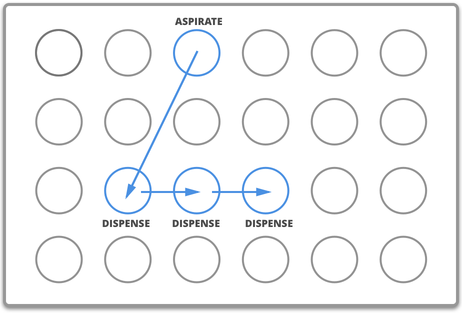
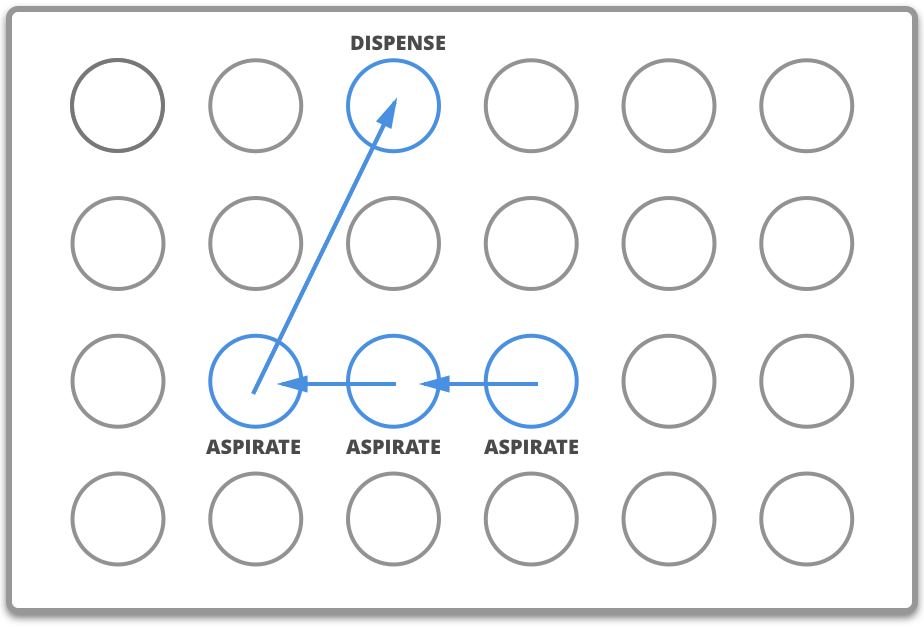

.. _v2-complex-commands:

########################
Complex Commands
########################

.. _overview:

Overview
========

The commands in this section execute long or complex series of the commands described in the :ref:`v2-atomic-commands` section. These advanced commands make it easier to handle larger groups of wells and repetitive actions.

The examples in this section will use the following set up:

.. substitution-code-block:: python

    from opentrons import protocol_api

    metadata = {'apiLevel': '|apiLevel|'}

    def run(protocol: protocol_api.ProtocolContext):
        plate = protocol.load_labware('corning_96_wellplate_360ul_flat', 1)
        tiprack = protocol.load_labware('opentrons_96_tiprack_300ul', 2)
        tiprack_multi = protocol.load_labware('opentrons_96_tiprack_300ul', 3)
        pipette = protocol.load_instrument('p300_single', mount='left', tip_racks=[tiprack])
        pipette_multi = protocol.load_instrument('p300_multi', mount='right', tip_racks=[tiprack_multi])

        # The code used in the rest of the examples goes here

This loads a `Corning 96 Well Plate <https://labware.opentrons.com/corning_96_wellplate_360ul_flat>`_ in slot 1 and a `Opentrons 300 µL Tiprack <https://labware.opentrons.com/opentrons_96_tiprack_300ul>`_ in slot 2 and 3, and uses a P300 Single pipette and a P300 Multi pipette.

You can follow along and simulate the protocol using our protocol simulator, which can be installed by following the instructions at :ref:`writing`.

There are three complex liquid handling commands:

+------------------------------------------+----------------------------------------------------+------------------------------------------------------+-------------------------------------------+
|    Method                                |   One source well to a group of destination wells  |   Many source wells to a group of destination wells  | Many source wells to one destination well |
+==========================================+====================================================+======================================================+===========================================+
| :py:meth:`.InstrumentContext.transfer`   |                   Yes                              |                      Yes                             |                   Yes                     |
+------------------------------------------+----------------------------------------------------+------------------------------------------------------+-------------------------------------------+
| :py:meth:`.InstrumentContext.distribute` |                   Yes                              |                       Yes                            |                    No                     |
+------------------------------------------+----------------------------------------------------+------------------------------------------------------+-------------------------------------------+
| :py:meth:`.InstrumentContext.consolidate`|                   No                               |                       Yes                            |                    Yes                    |
+------------------------------------------+----------------------------------------------------+------------------------------------------------------+-------------------------------------------+

You can also refer to these images for further clarification.

.. _transfer-image:

Transfer
--------

.. image:: ../img/complex_commands/transfer.png
   :scale: 75 %
   :name: Transfer
   :align: center

.. _distribute-image:

Distribute
----------

.. _consolidate-image:

Consolidate
-----------

**********************

.. _params_table:

Parameters
----------

Parameters for the complex liquid handling are listed here in order of operation. Check out the :ref:`complex_params` section for examples on how to use these parameters.

+--------------------------------+------------------------------------------------------+----------------------------+------------------------------------+------------------------------------+
|          Parameter(s)          |                     Options                          |     Transfer Defaults      |        Distribute Defaults         |       Consolidate Defaults         |
+================================+======================================================+============================+====================================+====================================+
|          ``new_tip``           |      ``'always'``, ``'never'``, ``'once'``           |        ``'once'``          |            ``'once'``              |           ``'once'``               |
+--------------------------------+------------------------------------------------------+----------------------------+------------------------------------+------------------------------------+
| ``mix_before``, ``mix_after``  |  ``mix_before`` and ``mix_after`` require a tuple    | No mixing either before    |  No mixing before aspirate,        | Mixing before aspirate is ignored, |
|                                |  of (repetitions, volume)                            | aspirate or after dispense |  mixing after dispense is ignored  | no mix after dispense by default   |
+--------------------------------+------------------------------------------------------+----------------------------+------------------------------------+------------------------------------+
|         ``touch_tip``          |  ``True`` or ``False``, if true touch tip on both    |  No touch tip by default   |   No touch tip by default          |    No touch tip by default         |
|                                |  source and destination wells                        |                            |                                    |                                    |
+--------------------------------+------------------------------------------------------+----------------------------+------------------------------------+------------------------------------+
|          ``air_gap``           |                Volume in µL                          |           0                |                 0                  |               0                    |
+--------------------------------+------------------------------------------------------+----------------------------+------------------------------------+------------------------------------+
|         ``blow_out``           |  ``True`` or ``False``, if true blow out at dispense |        ``False``           |              ``False``             |           ``False``                |
+--------------------------------+------------------------------------------------------+----------------------------+------------------------------------+------------------------------------+
|          ``trash``             | ``True`` or ``False``, if false return tip to tiprack|         ``True``           |              ``True``              |            ``True``                |
+--------------------------------+------------------------------------------------------+----------------------------+------------------------------------+------------------------------------+
|        ``carryover``           | ``True`` or ``False``, if true split volumes that    |         ``True``           |              ``False``             |            ``False``               |
|                                | exceed max volume of pipette into smaller quantities |                            |                                    |                                    |
+--------------------------------+------------------------------------------------------+----------------------------+------------------------------------+------------------------------------+
|       ``disposal_volume``      | Extra volume in µL to hold in tip while              |             0              |     10% of pipette max volume      |                0                   |
|                                | dispensing; better accuracies in multi-dispense      |                            |                                    |                                    |
+--------------------------------+------------------------------------------------------+----------------------------+------------------------------------+------------------------------------+

Transfer
========

The most versatile complex liquid handling function is :py:meth:`.InstrumentContext.transfer`. For a majority of use cases you will most likely want to use this complex command.

Below you will find a few scenarios using the :py:meth:`.InstrumentContext.transfer` command.

.. versionadded:: 2.0

Basic
-----

This example below transfers 100 µL from well ``'A1'`` to well ``'B1'`` using the P300 Single pipette, automatically picking up a new tip and then disposing of it when finished.

.. substitution-code-block:: python

    pipette.transfer(100, plate.wells_by_name()['A1'], plate.wells_by_name()['B1'])

When you are using a multi-channel pipette, you can transfer the entire column (8 wells) in the plate to another using:

.. substitution-code-block:: python

    pipette.transfer(100, plate.wells_by_name()['A1'], plate.wells_by_name()['A2'])

.. note::
        
        In API Versions 2.0 and 2.1, multichannel pipettes could only access the first row of a 384 well plate, and access to the second row would be ignored. If you need to transfer from all wells of a 384-well plate, please make sure to use API Version 2.2

.. note::

        Multichannel pipettes can only access a limited number of rows in a plate during `transfer`, `distribute` and `consolidate`: the first row (wells A1 - A12) of a 96-well plate, and (since API Version 2.2) the first two rows (wells A1 - B24) for a 384-well plate. Wells specified outside of the limit will be ignored. 

Transfer commands will automatically create entire series of :py:meth:`.InstrumentContext.aspirate`, :py:meth:`.InstrumentContext.dispense`, and other :py:obj:`.InstrumentContext` commands.

Large Volumes
-------------

Volumes larger than the pipette's ``max_volume`` (see :ref:`defaults`) will automatically divide into smaller transfers.

.. substitution-code-block:: python

    pipette.transfer(700, plate.wells_by_name()['A2'], plate.wells_by_name()['B2'])

will have the steps...

.. substitution-code-block:: python

    Transferring 700 from well A2 in "1" to well B2 in "1"
    Picking up tip well A1 in "2"
    Aspirating 300.0 uL from well A2 in "1" at 1 speed
    Dispensing 300.0 uL into well B2 in "1"
    Aspirating 200.0 uL from well A2 in "1" at 1 speed
    Dispensing 200.0 uL into well B2 in "1"
    Aspirating 200.0 uL from well A2 in "1" at 1 speed
    Dispensing 200.0 uL into well B2 in "1"
    Dropping tip well A1 in "12"

One to One
-----------

Transfer commands are most useful when moving liquid between multiple wells. This will be a one to one transfer
from where well ``A1``'s contents are transferred to well ``A2``, well ``B1``'s contents to ``B2``,and so on. This is the scenario displayed in the :ref:`transfer-image` visualization.

.. substitution-code-block:: python

    pipette.transfer(100, plate.columns_by_name()['1'], plate.columns_by_name()['2'])

will have the steps...

.. substitution-code-block:: python

    Transferring 100 from wells A1...H1 in "1" to wells A2...H2 in "1"
    Picking up tip well A1 in "2"
    Aspirating 100.0 uL from well A1 in "1" at 1 speed
    Dispensing 100.0 uL into well A2 in "1"
    Aspirating 100.0 uL from well B1 in "1" at 1 speed
    Dispensing 100.0 uL into well B2 in "1"
    Aspirating 100.0 uL from well C1 in "1" at 1 speed
    Dispensing 100.0 uL into well C2 in "1"
    Aspirating 100.0 uL from well D1 in "1" at 1 speed
    Dispensing 100.0 uL into well D2 in "1"
    Aspirating 100.0 uL from well E1 in "1" at 1 speed
    Dispensing 100.0 uL into well E2 in "1"
    Aspirating 100.0 uL from well F1 in "1" at 1 speed
    Dispensing 100.0 uL into well F2 in "1"
    Aspirating 100.0 uL from well G1 in "1" at 1 speed
    Dispensing 100.0 uL into well G2 in "1"
    Aspirating 100.0 uL from well H1 in "1" at 1 speed
    Dispensing 100.0 uL into well H2 in "1"
    Dropping tip well A1 in "12"

.. versionadded:: 2.0

One to Many
------------

You can transfer from a single source to multiple destinations, and the other way around (many sources to one destination).

.. substitution-code-block:: python

    pipette.transfer(100, plate.wells_by_name()['A1'], plate.columns_by_name()['2'])

will have the steps...

.. substitution-code-block:: python

    Transferring 100 from well A1 in "1" to wells A2...H2 in "1"
    Picking up tip well A1 in "2"
    Aspirating 100.0 uL from well A1 in "1" at 1 speed
    Dispensing 100.0 uL into well A2 in "1"
    Aspirating 100.0 uL from well A1 in "1" at 1 speed
    Dispensing 100.0 uL into well B2 in "1"
    Aspirating 100.0 uL from well A1 in "1" at 1 speed
    Dispensing 100.0 uL into well C2 in "1"
    Aspirating 100.0 uL from well A1 in "1" at 1 speed
    Dispensing 100.0 uL into well D2 in "1"
    Aspirating 100.0 uL from well A1 in "1" at 1 speed
    Dispensing 100.0 uL into well E2 in "1"
    Aspirating 100.0 uL from well A1 in "1" at 1 speed
    Dispensing 100.0 uL into well F2 in "1"
    Aspirating 100.0 uL from well A1 in "1" at 1 speed
    Dispensing 100.0 uL into well G2 in "1"
    Aspirating 100.0 uL from well A1 in "1" at 1 speed
    Dispensing 100.0 uL into well H2 in "1"
    Dropping tip well A1 in "12"

.. versionadded:: 2.0

List of Volumes
---------------

Instead of applying a single volume amount to all source/destination wells, you can instead pass a list of volumes.

.. substitution-code-block:: python

    pipette.transfer(
        [20, 40, 60],
        plate['A1'],
        [plate.wells_by_name()[well_name] for well_name in ['B1', 'B2', 'B3']])

will have the steps...

.. substitution-code-block:: python

    Transferring [20, 40, 60] from well A1 in "1" to wells B1...B3 in "1"
    Picking up tip well A1 in "2"
    Aspirating 20.0 uL from well A1 in "1" at 1 speed
    Dispensing 20.0 uL into well B1 in "1"
    Aspirating 40.0 uL from well A1 in "1" at 1 speed
    Dispensing 40.0 uL into well B2 in "1"
    Aspirating 60.0 uL from well A1 in "1" at 1 speed
    Dispensing 60.0 uL into well B3 in "1"
    Dropping tip well A1 in "12"

.. versionadded:: 2.0

**********************

Distribute and Consolidate
==========================

:py:meth:`.InstrumentContext.distribute` and :py:meth:`.InstrumentContext.consolidate` are similar to :py:meth:`.InstrumentContext.transfer`, but optimized for specific uses. :py:meth:`.InstrumentContext.distribute` is optimized for taking a large volume from a single (or a small number) of source wells, and distributing it to many smaller volumes in destination wells. Rather than using one-to-one transfers, it dispense many times for each aspirate. :py:meth:`.InstrumentContext.consolidate` is optimized for taking small volumes from many source wells and consolidating them into one (or a small number) of destination wells, aspirating many times for each dispense.

Consolidate
-----------

Volumes going to the same destination well are combined within the same tip, so that multiple aspirates can be combined to a single dispense. This is the scenario described by the :ref:`consolidate-image` graphic.

.. substitution-code-block:: python

    pipette.consolidate(30, plate.columns_by_name()['2'], plate.wells_by_name()['A1'])

will have the steps...

.. substitution-code-block:: python

    Consolidating 30 from wells A2...H2 in "1" to well A1 in "1"
    Transferring 30 from wells A2...H2 in "1" to well A1 in "1"
    Picking up tip well A1 in "2"
    Aspirating 30.0 uL from well A2 in "1" at 1 speed
    Aspirating 30.0 uL from well B2 in "1" at 1 speed
    Aspirating 30.0 uL from well C2 in "1" at 1 speed
    Aspirating 30.0 uL from well D2 in "1" at 1 speed
    Aspirating 30.0 uL from well E2 in "1" at 1 speed
    Aspirating 30.0 uL from well F2 in "1" at 1 speed
    Aspirating 30.0 uL from well G2 in "1" at 1 speed
    Aspirating 30.0 uL from well H2 in "1" at 1 speed
    Dispensing 240.0 uL into well A1 in "1"
    Dropping tip well A1 in "12"

If there are multiple destination wells, the pipette will not combine the transfers - it will aspirate from one source, dispense into the target, then aspirate from the other source.

.. substitution-code-block:: python

    pipette.consolidate(
      30,
      plate.columns_by_name()['1'],
      [plate.wells_by_name()[well_name] for well_name in ['A1', 'A2']])

will have the steps...

.. substitution-code-block:: python

    Consolidating 30 from wells A1...H1 in "1" to wells A1...A2 in "1"
    Transferring 30 from wells A1...H1 in "1" to wells A1...A2 in "1"
    Picking up tip well A1 in "2"
    Aspirating 30.0 uL from well A1 in "1" at 1 speed
    Aspirating 30.0 uL from well B1 in "1" at 1 speed
    Aspirating 30.0 uL from well C1 in "1" at 1 speed
    Aspirating 30.0 uL from well D1 in "1" at 1 speed
    Dispensing 120.0 uL into well A1 in "1"
    Aspirating 30.0 uL from well E1 in "1" at 1 speed
    Aspirating 30.0 uL from well F1 in "1" at 1 speed
    Aspirating 30.0 uL from well G1 in "1" at 1 speed
    Aspirating 30.0 uL from well H1 in "1" at 1 speed
    Dispensing 120.0 uL into well A2 in "1"
    Dropping tip well A1 in "12"

.. versionadded:: 2.0

Distribute
----------

Volumes from the same source well are combined within the same tip, so that one aspirate can provide for multiple dispenses. This is the scenario in the :ref:`distribute-image` graphic.

.. substitution-code-block:: python

    pipette.distribute(55, plate.wells_by_name()['A1'], plate.rows_by_name()['A'])

will have the steps...

.. substitution-code-block:: python

    Distributing 55 from well A1 in "1" to wells A1...A12 in "1"
    Transferring 55 from well A1 in "1" to wells A1...A12 in "1"
    Picking up tip well A1 in "2"
    Aspirating 250.0 uL from well A1 in "1" at 1 speed
    Dispensing 55.0 uL into well A1 in "1"
    Dispensing 55.0 uL into well A2 in "1"
    Dispensing 55.0 uL into well A3 in "1"
    Dispensing 55.0 uL into well A4 in "1"
    Blowing out at well A1 in "12"
    Aspirating 250.0 uL from well A1 in "1" at 1 speed
    Dispensing 55.0 uL into well A5 in "1"
    Dispensing 55.0 uL into well A6 in "1"
    Dispensing 55.0 uL into well A7 in "1"
    Dispensing 55.0 uL into well A8 in "1"
    Blowing out at well A1 in "12"
    Aspirating 250.0 uL from well A1 in "1" at 1 speed
    Dispensing 55.0 uL into well A9 in "1"
    Dispensing 55.0 uL into well A10 in "1"
    Dispensing 55.0 uL into well A11 in "1"
    Dispensing 55.0 uL into well A12 in "1"
    Blowing out at well A1 in "12"
    Dropping tip well A1 in "12"

The pipette will aspirate more liquid than it intends to dispense by the minimum volume of the pipette. This is called the ``disposal_volume``, and can be specified in the call to ``distribute``.

If there are multiple source wells, the pipette will never combine their volumes into the same tip.

.. substitution-code-block:: python

    pipette.distribute(
      30,
      [plate.wells_by_name()[well_name] for well_name in ['A1', 'A2']],
      plate.rows()['A'])

will have the steps...

.. substitution-code-block:: python

    Distributing 30 from wells A1...A2 in "1" to wells A1...A12 in "1"
    Transferring 30 from wells A1...A2 in "1" to wells A1...A12 in "1"
    Picking up tip well A1 in "2"
    Aspirating 210.0 uL from well A1 in "1" at 1 speed
    Dispensing 30.0 uL into well A1 in "1"
    Dispensing 30.0 uL into well A2 in "1"
    Dispensing 30.0 uL into well A3 in "1"
    Dispensing 30.0 uL into well A4 in "1"
    Dispensing 30.0 uL into well A5 in "1"
    Dispensing 30.0 uL into well A6 in "1"
    Blowing out at well A1 in "12"
    Aspirating 210.0 uL from well A2 in "1" at 1 speed
    Dispensing 30.0 uL into well A7 in "1"
    Dispensing 30.0 uL into well A8 in "1"
    Dispensing 30.0 uL into well A9 in "1"
    Dispensing 30.0 uL into well A10 in "1"
    Dispensing 30.0 uL into well A11 in "1"
    Dispensing 30.0 uL into well A12 in "1"
    Blowing out at well A1 in "12"
    Dropping tip well A1 in "12"

.. versionadded:: 2.0

Order of Operations In Complex Commands
=======================================

Parameters to complex commands add behaviors to the generated complex command in a specific order which cannot be changed. Specifically, advanced commands execute their atomic commands in this order:

1. Tip logic
2. Mix at source location
3. Aspirate + Any disposal volume
4. Touch tip
5. Air gap
6. Dispense
7. Touch tip

<------Repeat above for all wells------>

8. Empty disposal volume into trash, if any
9. Blow Out

Notice how blow out only occurs after getting rid of disposal volume. If you want blow out to occu  after every dispense, you should not include a disposal volume.

**********************

.. _complex_params:

Complex Liquid Handling Parameters
==================================

Below are some examples of the parameters described in the :ref:`params_table` table.

``new_tip``
-----------

This parameter handles tip logic. You have options of the strings ``'always'``, ``'once'`` and ``'never'``. The default for every complex command is ``'once'``.

If you want to avoid cross-contamination and increase accuracy, you should set this parameter to ``'always'``.

.. versionadded:: 2.0

Always Get a New Tip
^^^^^^^^^^^^^^^^^^^^

Transfer commands will by default use the same tip for each well, then finally drop it in the trash once finished.

The pipette can optionally get a new tip at the beginning of each aspirate, to help avoid cross contamination.

.. substitution-code-block:: python

    pipette.transfer(
        100,
        [plate.wells_by_name()[well_name] for well_name in ['A1', 'A2', 'A3']],
        [plate.wells_by_name()[well_name] for well_name in ['B1', 'B2', 'B3']],
        new_tip='always')    # always pick up a new tip

will have the steps...

.. substitution-code-block:: python

    Transferring 100 from wells A1...A3 in "1" to wells B1...B3 in "1"
    Picking up tip well A1 in "2"
    Aspirating 100.0 uL from well A1 in "1" at 1 speed
    Dispensing 100.0 uL into well B1 in "1"
    Dropping tip well A1 in "12"
    Picking up tip well B1 in "2"
    Aspirating 100.0 uL from well A2 in "1" at 1 speed
    Dispensing 100.0 uL into well B2 in "1"
    Dropping tip well A1 in "12"
    Picking up tip well C1 in "2"
    Aspirating 100.0 uL from well A3 in "1" at 1 speed
    Dispensing 100.0 uL into well B3 in "1"
    Dropping tip well A1 in "12"

Never Get a New Tip
^^^^^^^^^^^^^^^^^^^

For scenarios where you instead are calling ``pick_up_tip()`` and ``drop_tip()`` elsewhere in your protocol, the transfer command can ignore picking up or dropping tips.

.. substitution-code-block:: python

    pipette.pick_up_tip()
    ...
    pipette.transfer(
        100,
        [plate.wells_by_name()[well_name] for well_name in ['A1', 'A2', 'A3']],
        [plate.wells_by_name()[well_name] for well_name in ['B1', 'B2', 'B3']],
        new_tip='never')    # never pick up or drop a tip
    ...
    pipette.drop_tip()

will have the steps...

.. substitution-code-block:: python

    Picking up tip well A1 in "2"
    ...
    Transferring 100 from wells A1...A3 in "1" to wells B1...B3 in "1"
    Aspirating 100.0 uL from well A1 in "1" at 1 speed
    Dispensing 100.0 uL into well B1 in "1"
    Aspirating 100.0 uL from well A2 in "1" at 1 speed
    Dispensing 100.0 uL into well B2 in "1"
    Aspirating 100.0 uL from well A3 in "1" at 1 speed
    Dispensing 100.0 uL into well B3 in "1"
    ...
    Dropping tip well A1 in "12"

Use One Tip
^^^^^^^^^^^

The default behavior of complex commands is to use one tip:

.. substitution-code-block:: python

    pipette.transfer(
        100,
        [plate.wells_by_name()[well_name] for well_name in ['A1', 'A2', 'A3']],
        [plate.wells_by_name()[well_name] for well_name in ['B1', 'B2', 'B3']],
        new_tip='once')    # use one tip (default behavior)

will have the steps...

.. substitution-code-block:: python

    Picking up tip well A1 in "2"
    Transferring 100 from wells A1...A3 in "1" to wells B1...B3 in "1"
    Aspirating 100.0 uL from well A1 in "1" at 1 speed
    Dispensing 100.0 uL into well B1 in "1"
    Aspirating 100.0 uL from well A2 in "1" at 1 speed
    Dispensing 100.0 uL into well B2 in "1"
    Aspirating 100.0 uL from well A3 in "1" at 1 speed
    Dispensing 100.0 uL into well B3 in "1"
    Dropping tip well A1 in "12"

``trash``
---------

By default, compelx commands will drop the pipette's tips in the trash container. However, if you wish to instead return the tip to its tip rack, you can set ``trash=False``.

.. substitution-code-block:: python

    pipette.transfer(
        100,
        plate['A1'],
        plate['B1'],
        trash=False)       # do not trash tip

will have the steps...

.. substitution-code-block:: python

    Transferring 100 from well A1 in "1" to well B1 in "1"
    Picking up tip well A1 in "2"
    Aspirating 100.0 uL from well A1 in "1" at 1 speed
    Dispensing 100.0 uL into well B1 in "1"
    Returning tip
    Dropping tip well A1 in "2"

.. versionadded:: 2.0

``touch_tip``
-------------

A :ref:`touch-tip` can be performed after every aspirate and dispense by setting ``touch_tip=True``.

.. substitution-code-block:: python

    pipette.transfer(
        100,
        plate['A1'],
        plate['A2'],
        touch_tip=True)     # touch tip to each well's edge

will have the steps...

.. substitution-code-block:: python

    Transferring 100 from well A1 in "1" to well A2 in "1"
    Picking up tip well A1 in "2"
    Aspirating 100.0 uL from well A1 in "1" at 1 speed
    Touching tip
    Dispensing 100.0 uL into well A2 in "1"
    Touching tip
    Dropping tip well A1 in "12"

.. versionadded:: 2.0

``blow_out``
------------

A :ref:`blow-out` can be performed after every dispense that leaves the tip empty by setting ``blow_out=True``.

.. substitution-code-block:: python

    pipette.transfer(
        100,
        plate['A1'],
        plate['A2'],
        blow_out=True)      # blow out droplets when tip is empty

will have the steps...

.. substitution-code-block:: python

    Transferring 100 from well A1 in "1" to well A2 in "1"
    Picking up tip well A1 in "2"
    Aspirating 100.0 uL from well A1 in "1" at 1 speed
    Dispensing 100.0 uL into well A2 in "1"
    Blowing out
    Dropping tip well A1 in "12"

.. versionadded:: 2.0

``mix_before``, ``mix_after``
-----------------------------

A :ref:`mix` can be performed before every aspirate by setting ``mix_before=``, and after every dispense by setting ``mix_after=``. The value of ``mix_before=`` or ``mix_after=`` must be a tuple; the first value is the number of repetitions, the second value is the amount of liquid to mix.

.. substitution-code-block:: python

    pipette.transfer(
        100,
        plate['A1'],
        plate['A2'],
        mix_before=(2, 50), # mix 2 times with 50uL before aspirating
        mix_after=(3, 75))  # mix 3 times with 75uL after dispensing

will have the steps...

.. substitution-code-block:: python

    Transferring 100 from well A1 in "1" to well A2 in "1"
    Picking up tip well A1 in "2"
    Mixing 2 times with a volume of 50ul
    Aspirating 50 uL from well A1 in "1" at 1.0 speed
    Dispensing 50 uL into well A1 in "1"
    Aspirating 50 uL from well A1 in "1" at 1.0 speed
    Dispensing 50 uL into well A1 in "1"
    Aspirating 100.0 uL from well A1 in "1" at 1 speed
    Dispensing 100.0 uL into well A2 in "1"
    Mixing 3 times with a volume of 75ul
    Aspirating 75 uL from well A2 in "1" at 1.0 speed
    Dispensing 75.0 uL into well A2 in "1"
    Aspirating 75 uL from well A2 in "1" at 1.0 speed
    Dispensing 75.0 uL into well A2 in "1"
    Aspirating 75 uL from well A2 in "1" at 1.0 speed
    Dispensing 75.0 uL into well A2 in "1"
    Dropping tip well A1 in "12"

.. versionadded:: 2.0

``air_gap``
-----------

An :ref:`air-gap` can be performed after every aspirate by setting ``air_gap=volume``, where the value is the volume of air in µL to aspirate after aspirating the liquid. The entire volume in the tip, air gap and the liquid volume, will be dispensed all at once at the destination specified in the complex command.

.. substitution-code-block:: python

    pipette.transfer(
        100,
        plate['A1'],
        plate['A2'],
        air_gap=20)         # add 20uL of air after each aspirate

will have the steps...

.. substitution-code-block:: python

    Transferring 100 from well A1 in "1" to well A2 in "1"
    Picking up tip well A1 in "2"
    Aspirating 100.0 uL from well A1 in "1" at 1.0 speed
    Air gap
    Aspirating 20 uL from well A1 in "1" at 1.0 speed
    Dispensing 120.0 uL into well A2 in "1"
    Dropping tip well A1 in "12"

.. versionadded:: 2.0

``disposal_volume``
-------------------

When dispensing multiple times from the same tip in :py:meth:`.InstrumentContext.distribute`, it is recommended to aspirate an extra amount of liquid to be disposed of after distributing. This added ``disposal_volume`` can be set as an optional argument.

The default disposal volume is the pipette's minimum volume (see :ref:`Defaults`), which will be blown out at the trash after the dispenses.

.. substitution-code-block:: python

    pipette.distribute(
        30,
        [plate.wells_by_name()[well_name] for well_name in ['A1', 'A2']],
        plate.columns_by_name()['2'],
        disposal_volume=60)   # include extra liquid to make dispenses more accurate, 20% of total volume

will have the steps...

.. substitution-code-block:: python

    Distributing 30 from wells A1...A2 in "1" to wells A2...H2 in "1"
    Transferring 30 from wells A1...A2 in "1" to wells A2...H2 in "1"
    Picking up tip well A1 in "2"
    Aspirating 130.0 uL from well A1 in "1" at 1 speed
    Dispensing 30.0 uL into well A2 in "1"
    Dispensing 30.0 uL into well B2 in "1"
    Dispensing 30.0 uL into well C2 in "1"
    Dispensing 30.0 uL into well D2 in "1"
    Blowing out at well A1 in "12"
    Aspirating 130.0 uL from well A2 in "1" at 1 speed
    Dispensing 30.0 uL into well E2 in "1"
    Dispensing 30.0 uL into well F2 in "1"
    Dispensing 30.0 uL into well G2 in "1"
    Dispensing 30.0 uL into well H2 in "1"
    Blowing out at well A1 in "12"
    Dropping tip well A1 in "12"

See this image for example,

.. image:: ../img/complex_commands/distribute_illustration_tip.png
   :scale: 50 %
   :align: center

.. versionadded:: 2.0
