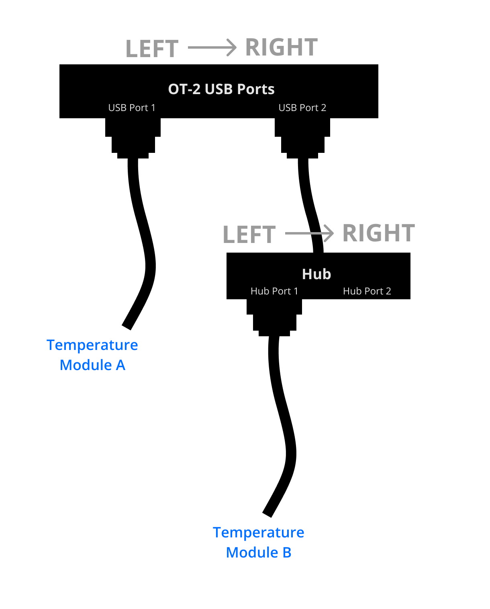

.. _new_modules:

################
Hardware Modules
################

Modules are peripherals that attach to the OT-2 to extend its capabilities.

We currently support the Temperature, Magnetic and Thermocycler Modules.

************
Module Setup
************

Loading Your Module Onto the Deck
=================================

Like labware and pipettes, you must inform the Protocol API of the modules you will use in your protocol.

Use :py:meth:`.ProtocolContext.load_module` to load a module.  It will return an object representing the module.

.. code-block:: python
    :substitutions:

    from opentrons import protocol_api

    metadata = {'apiLevel': '|apiLevel|'}

    def run(protocol: protocol_api.ProtocolContext):
         # Load a Magnetic Module GEN2 in deck slot 1.
         magnetic_module = protocol.load_module('magnetic module gen2', 1)
         
         # Load a Temperature Module GEN1 in deck slot 3.
         temperature_module = protocol.load_module('temperature module', 3)

.. note::

    When you load a module in a protocol, you inform the OT-2 that you want the specified module to be present. Even if you do not use the module anywhere else in your protocol, the Opentrons App and the OT-2 will not let your protocol proceed until all modules loaded with ``load_module`` are attached to the OT-2.

.. versionadded:: 2.0

Available Modules
-----------------

The first parameter to :py:meth:`.ProtocolContext.load_module`, the module's *load name,* specifies the kind of module to load.
Check the table below for the proper load name to use for each kind of module.

Some modules were added to the Protocol API later than others.
Make sure you use a :ref:`Protocol API version <v2-versioning>` high enough to support all the modules you want to use.

.. table::
   :widths: 2 1 3 3
   
   +--------------------+-------------------------------+------------------------------------+
   | Module             | Load name                     | Minimum                            |
   |                    |                               | :ref:`API version <v2-versioning>` |
   +=============+======+===============================+====================================+
   | Temperature | GEN1 | ``'temperature module'``      | 2.0                                |
   | Module      |      | or ``'tempdeck'``             |                                    |
   |             +------+-------------------------------+------------------------------------+
   |             | GEN2 | ``'temperature module gen2'`` | 2.3                                |
   +-------------+------+-------------------------------+------------------------------------+
   | Magnetic    | GEN1 | ``'magnetic module'``         | 2.0                                |
   | Module      |      | or ``'magdeck'``              |                                    |
   |             +------+-------------------------------+------------------------------------+
   |             | GEN2 | ``'magnetic module gen2'``    | 2.3                                |
   +-------------+------+-------------------------------+------------------------------------+
   | Thermocycler       | ``'thermocycler module'``     | 2.0                                |
   | Module             | or ``'thermocycler'``         |                                    |
   +--------------------+-------------------------------+------------------------------------+

GEN1 vs. GEN2 Modules
=====================

GEN2 modules are newer.
They have improvements that make them more reliable and easier to use.

Identifying a GEN2 Module
-------------------------

You can determine if your module is a GEN2 model by inspecting the sides of the device for a label that specifies `GEN2`.

Changes with the GEN2 Temperature Module
----------------------------------------

The GEN2 Temperature Module has a plastic insulating rim around the plate, and plastic insulating shrouds designed to fit over our aluminum blocks.
This mitigates an issue where the GEN1 Temperature Module would have trouble cooling to very low temperatures, especially if it shared the deck with a running Thermocycler.

Changes with the GEN2 Magnetic Module
-------------------------------------

The GEN2 Magnetic Module uses smaller magnets than the GEN1 version.
This mitigates an issue where beads would be attracted even when the magnets were retracted.

This means it will take longer for the GEN2 module to attract beads.

Recommended Magnetic Module GEN2 bead attraction time:
    - Total liquid volume <= 50 uL: 5 minutes
    - Total liquid volume > 50 uL: 7 minutes

Loading Labware Onto Your Module
================================

Like specifying labware that will be present on the deck of the OT-2, you must specify labware that will be present on the module you have just loaded.
You do this using ``module.load_labware()``. For instance, to load a Temperature Module and specify an `aluminum block for 2 mL tubes <https://labware.opentrons.com/opentrons_24_aluminumblock_generic_2ml_screwcap?category=aluminumBlock>`_, you would do:

.. code-block:: python
    :substitutions:

    from opentrons import protocol_api

    metadata = {'apiLevel': '|apiLevel|'}

    def run(protocol: protocol_api.ProtocolContext):
         module = protocol.load_module('Temperature Module', slot)
         my_labware = module.load_labware('opentrons_24_aluminumblock_generic_2ml_screwcap',
                                          label='Temperature-Controlled Tubes')

See
:py:meth:`.MagneticModuleContext.load_labware`,
:py:meth:`.TemperatureModuleContext.load_labware`,
or :py:meth:`.ThermocyclerContext.load_labware`.

Notice that when you load labware on a module, you don't specify the labware's deck slot.  The labware is loaded on the module, on whichever deck slot the module occupies.

.. versionadded:: 2.0

Module and Labware Compatibility
--------------------------------

It's up to you to make sure that the labware and module you chose make sense together.
The Protocol API won't stop you from making nonsensical combinations, like a tube rack on a Thermocycler.

See: `What labware can I use with my modules? <https://support.opentrons.com/en/articles/3540964-what-labware-can-i-use-with-my-modules>`__

Loading Custom Labware Into Your Module
---------------------------------------

Any custom labware added to your Opentrons App (see :ref:`v2-custom-labware`) is accessible when loading labware onto a module.

.. versionadded:: 2.1

.. note::

    In API version 2.0, ``module.load_labware()`` only took a ``load_name`` argument. In API version 2.1 (introduced in Robot Software version 3.15.2) or higher you can now specify a label, version, and namespace (though most of the time you won't have to).

**************************
Using a Temperature Module
**************************

The Temperature Module acts as both a cooling and heating device. It can control the temperature
of its deck between 4 °C and 95 °C with a resolution of 1 °C.

Temperature Modules are represented in code by :py:class:`.TemperatureModuleContext` objects.

The Temperature Module has the following methods that can be accessed during a protocol. For the purposes of this
section, assume we have the following already:

.. code-block:: python
    :substitutions:

    from opentrons import protocol_api

    metadata = {'apiLevel': '|apiLevel|'}

    def run(protocol: protocol_api.ProtocolContext):
        temp_mod = protocol.load_module('temperature module', '1')
        plate = temp_mod.load_labware('corning_96_wellplate_360ul_flat')
        # The code from the rest of the examples in this section goes here

.. versionadded:: 2.0

Set Temperature
===============

To set the Temperature Module to 4 °C do the following:

.. code-block:: python

    temp_mod.set_temperature(4)

This function will pause your protocol until your target temperature is reached.

.. note::

     This is unlike version 1 of the Python API, in which you would have to use the separate function ``wait_for_temperature`` to block protocol execution until the Temperature Module was ready.

.. versionadded:: 2.0

Read the Current Temperature
============================

You can read the current real-time temperature of the Temperature Module using the :py:obj:`.TemperatureModuleContext.temperature` property:

.. code-block:: python

    temp_mod.temperature

.. versionadded:: 2.0

Read the Target Temperature
===========================

You can read the current target temperature of the Temperature Module using the :py:obj:`.TemperatureModuleContext.target` property:

.. code-block:: python

    temp_mod.target

.. versionadded:: 2.0

Check the Status
================

The :py:obj:`.TemperatureModuleContext.status` property is a string that is one of  ``'heating'``, ``'cooling'``, ``'holding at target'`` or ``'idle'``.

.. code-block:: python

    temp_mod.status

Deactivate
==========

This function will stop heating or cooling and will turn off the fan on the Temperature Module.

.. code-block:: python

    temp_mod.deactivate()

.. note::

    You can also deactivate your temperature module through the Opentrons App by
    clicking on the ``Pipettes & Modules`` tab. Your Temperature Module will automatically
    deactivate if another protocol is uploaded to the app. Your Temperature Module will
    *not* deactivate automatically when the protocol ends, is cancelled, or is reset.

After deactivating your Temperature module, you can later call :py:meth:`.TemperatureModuleContext.set_temperature` to heat or cool phase again.

.. versionadded:: 2.0

***********************
Using a Magnetic Module
***********************

The Magnetic Module controls a set of permanent magnets which can move vertically. When the magnets are raised or engaged, they induce a magnetic field in the labware on the module. When they are lowered or disengaged, they do not.

The Magnetic Module is represented by a :py:class:`.MagneticModuleContext` object.

For the purposes of this section, assume we have the following already:

.. code-block:: python
    :substitutions:

    from opentrons import protocol_api

    metadata = {'apiLevel': '|apiLevel|'}

    def run(protocol: protocol_api.ProtocolContext):
        mag_mod = protocol.load_module('magnetic module', '1')
        plate = mag_mod.load_labware('nest_96_wellplate_100ul_pcr_full_skirt')
        # The code from the rest of the examples in this section goes here

.. versionadded:: 2.0

.. _magnetic-module-engage:

Engage
======

The :py:meth:`.MagneticModuleContext.engage` function raises the magnets to induce a magnetic field in the labware on top of the Magnetic Module. The height of the magnets can be specified in several different ways, based on internally stored default heights for labware:

- If neither ``height_from_base``, ``height`` nor ``offset`` is specified **and** the labware is supported on the Magnetic Module, the magnets will raise to a reasonable default height based on the specified labware.

  .. code-block:: python

      mag_mod.engage()

  .. versionadded:: 2.0

- The recommended way to specify the magnets' position is to utilize the ``height_from_base`` parameter, which allows you to raise the height of the magnets relative to the base of the labware.

  .. code-block:: python

      mag_mod.engage(height_from_base=13.5)

  A ``mag_mod.engage(height_from_base=0)`` call should move the tops of the magnets to level with base of the labware.

  .. versionadded:: 2.2

.. note::
    There is a +/- 1 mm variance across magnetic module units, using ``height_from_base=0`` might not be able to get the magnets to completely flush with base of the labware. Please test before carrying out your experiment to ensure the desired engage height for your labware.

- You can also specify ``height``, which should be a distance from the home position of the magnets.

  .. code-block:: python

      mag_mod.engage(height=18.5)

  .. versionadded:: 2.0

- An ``offset`` can be applied to move the magnets relatively from the default engage height of the labware, **if** the labware is supported on the Magnetic Module.

  .. code-block:: python

      mag_mod.engage(offset=-2)

  .. versionadded:: 2.0

.. note::

    Only certain labwares have defined engage heights for the Magnetic Module. If a labware that does not have a defined engage height is loaded on the Magnetic Module (or if no labware is loaded), then ``height_from_labware`` (since version 2.2) or ``height``, must be specified.

.. versionadded:: 2.0

Disengage
=========

.. code-block:: python

   mag_mod.disengage()

The Magnetic Module will disengage when the device is turned on. It will not auto-disengage otherwise unless you call :py:meth:`.MagneticModuleContext.disengage` in your protocol.

.. versionadded:: 2.0

Check the Status
================

The :py:obj:`.MagneticModuleContext.status` property is a string that is one of ``'engaged'`` or ``'disengaged'``.

.. code-block:: python

    mag_mod.status

.. _thermocycler-section:

***************************
Using a Thermocycler Module
***************************

The Thermocycler Module allows users to perform complete experiments that require temperature sensitive reactions such as PCR.

There are two heating mechanisms in the Thermocycler. One is the block in which samples are located; the other is the lid heating pad.

The block can control its temperature between 4 °C and 99 °C to the nearest 1 °C.

The lid can control its temperature between 37 °C to 110 °C. Please see our `support article <https://support.opentrons.com/en/articles/3469797-thermocycler-module>`_ on controlling the Thermocycler in the Opentrons App.

For the purposes of this section, assume we have the following already:

.. code-block:: python
    :substitutions:

    from opentrons import protocol_api

    metadata = {'apiLevel': '|apiLevel|'}

    def run(protocol: protocol_api.ProtocolContext):
        tc_mod = protocol.load_module('Thermocycler Module')
        plate = tc_mod.load_labware('nest_96_wellplate_100ul_pcr_full_skirt')

.. note::

    When loading the Thermocycler, it is not necessary to specify a slot.
    This is because the Thermocycler has a default position that covers Slots 7, 8, 10, and 11.
    This is the only valid location for the Thermocycler on the OT-2 deck.

.. versionadded:: 2.0

Lid Motor Control
=================

The Thermocycler can control its temperature with the lid open or closed. When the lid of the Thermocycler is open, the pipettes can access the loaded labware. You can control the lid position with the methods below.

Open Lid
--------

.. code-block:: python

    tc_mod.open_lid()

.. versionadded:: 2.0

Close Lid
---------

.. code-block:: python

    tc_mod.close_lid()

.. versionadded:: 2.0

Lid Temperature Control
=======================

You can control when a lid temperature is set. It is recommended that you set
the lid temperature before executing a Thermocycler profile (see :ref:`thermocycler-profiles`). The range of the Thermocycler lid is
37 °C to 110 °C.

Set Lid Temperature
-------------------

:py:meth:`.ThermocyclerContext.set_lid_temperature` takes one parameter: the ``temperature`` you wish the lid to be set to. The protocol will only proceed once the lid temperature has been reached.

.. code-block:: python

    tc_mod.set_lid_temperature(temperature)

.. versionadded:: 2.0

Block Temperature Control
=========================

To set the block temperature inside the Thermocycler, you can use the method :py:meth:`.ThermocyclerContext.set_block_temperature`. It takes five parameters:
``temperature``, ``hold_time_seconds``, ``hold_time_minutes``, ``ramp_rate`` and ``block_max_volume``. Only ``temperature`` is required; the two ``hold_time`` parameters, ``ramp_rate``, and ``block_max_volume`` are optional.

Temperature
-----------

If you only specify a ``temperature`` in °C, the Thermocycler will hold this temperature indefinitely until powered off.

.. code-block:: python

        tc_mod.set_block_temperature(4)

.. versionadded:: 2.0

Hold Time
---------

If you set a ``temperature`` and a ``hold_time``, the Thermocycler will hold the temperature for the specified amount of time. Time can be passed in as minutes or seconds.

With a hold time, it is important to also include the ``block_max_volume`` parameter. This is to ensure that the sample reaches the target temperature before the hold time counts down.

In the example below, the Thermocycler will hold the 50 µl samples at the specified temperature for 45 minutes and 15 seconds.

If you do not specify a hold time the protocol will proceed once the temperature specified is reached.

.. code-block:: python

        tc_mod.set_block_temperature(4, hold_time_seconds=15, hold_time_minutes=45, block_max_volume=50)

.. versionadded:: 2.0

Block Max Volume
----------------

The Thermocycler's block temperature controller varies its behavior based on the amount of liquid in the wells of its labware. Specifying an accurate volume allows the Thermocycler to precisely track the temperature of the samples. The ``block_max_volume`` parameter is specified in µL and is the volume of the most-full well in the labware that is loaded on the Thermocycler's block. If not specified, it defaults to 25 µL.

.. code-block:: python

        tc_mod.set_block_temperature(4, hold_time_seconds=20, block_max_volume=80)

.. versionadded:: 2.0

Ramp Rate
---------

Lastly, you can modify the ``ramp_rate`` in °C/sec for a given ``temperature``.

.. code-block:: python

        tc_mod.set_block_temperature(4, hold_time_seconds=60, ramp_rate=0.5)

.. warning::

  Do not modify the ``ramp_rate`` unless you know what you're doing.

.. versionadded:: 2.0

.. _thermocycler-profiles:

Thermocycler Profiles
=====================

The Thermocycler can rapidly cycle through temperatures to execute heat-sensitive reactions. These cycles are defined as profiles.

Thermocycler profiles are defined for the Protocol API as lists of dicts. Each dict should have a ``temperature`` key, which specifies the temperature of a profile step, and either or both of ``hold_time_seconds`` or ``hold_time_minutes``, which specify the duration of the step. For instance, this profile commands the Thermocycler to drive its temperature to 10 °C for 30 seconds, and then 60 °C for 45 seconds:

.. code-block:: python

        profile = [
          {'temperature': 10, 'hold_time_seconds': 30},
          {'temperature': 60, 'hold_time_seconds': 45}]

Once you have written your profile, you command the Thermocycler to execute it using :py:meth:`.ThermocyclerContext.execute_profile`. This function executes your profile steps multiple times depending on the ``repetitions`` parameter. It also takes a ``block_max_volume`` parameter, which is the same as that of the :py:meth:`.ThermocyclerContext.set_block_temperature` function.

For instance, you can execute the profile defined above 100 times for a 30 µL-per-well volume like this:

.. code-block:: python

        profile = [
          {'temperature': 10, 'hold_time_seconds': 30},
          {'temperature': 60, 'hold_time_seconds': 30}]

        tc_mod.execute_profile(steps=profile, repetitions=100, block_max_volume=30)

.. note::

    Temperature profiles only control the temperature of the `block` in the Thermocycler. You should set a lid temperature before executing the profile using :py:meth:`.ThermocyclerContext.set_lid_temperature`.

.. versionadded:: 2.0

Thermocycler Status
===================

Throughout your protocol, you may want particular information on the current status of your Thermocycler. Below are
a few methods that allow you to do that.

Basic Status
------------

..
    TODO(mm, 2021-09-30): We should be able to cross-reference to ThermocyclerContext.status, but it appears to not actually exist?

The ``ThermocyclerContext.status`` property is one of the strings ``‘holding at target’``, ``‘cooling’``, ``‘heating’``, or ``‘idle’``.

.. code-block:: python

    tc_mod.status

.. versionadded:: 2.0

Lid Position
------------

The current status of the lid position. It can be one of the strings ``'open'``, ``'closed'`` or ``'in_between'``.

.. code-block:: python

    tc_mod.lid_position

.. versionadded:: 2.0

Heated Lid Temperature Status
-----------------------------

The current status of the heated lid temperature controller. It can be one of the strings ``'holding at target'``, ``'heating'``, ``'idle'``,  or ``'error'``.

.. code-block:: python

    tc_mod.lid_temperature_status

.. versionadded:: 2.0

Block Temperature Status
------------------------

The current status of the well block temperature controller. It can be one of the strings ``'holding at target'``, ``'cooling'``, ``'heating'``, ``'idle'``, or ``'error'``.

.. code-block:: python

    tc_mod.block_temperature_status

.. versionadded:: 2.0

.. _thermocycler-deactivation:

Thermocycler Deactivate
=======================

At some points in your protocol, you may want to deactivate specific temperature controllers of your Thermocycler. This can be done with three methods,
:py:meth:`.ThermocyclerContext.deactivate`, :py:meth:`.ThermocyclerContext.deactivate_lid`, :py:meth:`.ThermocyclerContext.deactivate_block`.

Deactivate
----------

This deactivates both the well block and the heated lid of the Thermocycler.

.. code-block:: python

  tc_mod.deactivate()

Deactivate Lid
--------------

This deactivates only the heated lid of the Thermocycler.

.. code-block:: python

  tc_mod.deactivate_lid()

.. versionadded:: 2.0

Deactivate Block
----------------

This deactivates only the well block of the Thermocycler.

.. code-block:: python

  tc_mod.deactivate_block()

.. versionadded:: 2.0

****************************
Using a Heater-Shaker Module
****************************

The Heater-Shaker Module provides on-deck heating and orbital shaking. The module can heat from 37 to 95 °C, and can shake samples from 200 to 3000 rpm.

The Heater-Shaker Module is represented in code by a :py:class:`.HeaterShakerContext` object. The examples in this section will use a Heater-Shaker loaded in slot 1:

.. code-block:: python

    from opentrons import protocol_api

    metadata = {'apiLevel': '2.13'}

    def run(protocol: protocol_api.ProtocolContext):
         hs_mod = protocol.load_module('heaterShakerModuleV1', 1)

.. versionadded:: 2.13

Placement Restrictions
======================

To allow for proper anchoring and cable routing, the Heater-Shaker should only be loaded in slots 1, 3, 4, 6, 7, and 10. 

In general, it is best to leave all slots adjacent to the Heater-Shaker empty, in both directions. If your protocol requires filling those slots, you’ll need to observe certain restrictions to avoid physical crashes involving the Heater-Shaker.

First, you can’t place any other modules adjacent to the Heater-Shaker in any direction. This prevents collisions both while shaking and while opening the labware latch. Attempting to load a module next to the Heater-Shaker will raise a ``DeckConflictError``.

Next, you can’t place tall labware (defined as >53 mm) to the left or right of the Heater-Shaker. This prevents the Heater-Shaker’s latch from colliding with the adjacent labware. Attempting to load tall labware to the right or left of the Heater-Shaker will also raise a ``DeckConflictError``. Common labware that exceed the height limit include tube racks and Opentrons 1000 µL Tip Racks.

Finally, if you are using an 8-channel pipette, you should avoid performing pipetting actions in `any` adjacent slots, with few exceptions:

- To the front or back of the Heater-Shaker, an 8-channel pipette can access tip racks, but will crash on other labware.
- To the right of the Heater-Shaker, an 8-channel pipette can access most columns but will crash on column 1.
- To the left of the Heater-Shaker, an 8-channel pipette can access most columns but will crash on column 12.

.. warning::

    Failure to observe these restrictions with an 8-channel pipette will result in a physical crash and may damage your module, pipette, or both. The Python Protocol API will not raise exceptions to prevent restricted pipetting actions. You may want to perform a dry run of your protocol without the Heater-Shaker installed to ensure that none of your pipetting actions violate these restrictions.

Latch Control
=============

To easily add and remove labware from the Heater-Shaker, you can control its labware latch within your protocol using :py:meth:`.open_labware_latch` and :py:meth:`.close_labware_latch`. Shaking requires the labware latch to be closed, so you may want to issue a close command before the first shake command in your protocol:

.. code-block:: python

    hs_mod.close_labware_latch()
    hs_mod.set_and_wait_for_shake_speed(500)

If the labware latch is already closed, ``close_labware_latch()`` will succeed immediately; you don’t have to check the status of the latch before opening or closing it.

For preparing the deck before running a protocol, run these methods in Jupyter notebook or use the labware latch controls in the Opentrons App.

Loading Labware
===============

Like with all modules, use the Heater-Shaker’s :py:meth:`~.HeaterShakerContext.load_labware` method to specify what you will place on the module. For the Heater-Shaker, the you must use a definition that describes the combination of a thermal adapter and labware that fits it. Currently, only the following combinations are supported in the Opentrons Labware Library:

+-------------------------+-------------------------------------------+----------------------------------------------------------------------+
| Adapter                 | Labware                                   | Definition                                                           |
+=========================+===========================================+======================================================================+
| Deep Well Adapter       | NEST 96 Deep Well Plate 2mL               | ``opentrons_96_deep_well_adapter_nest_wellplate_2ml_deep``           |
+-------------------------+-------------------------------------------+----------------------------------------------------------------------+
| 96 Flat Bottom Adapter  | NEST 96 Well Plate 200 µL Flat            | ``opentrons_96_flat_bottom_adapter_nest_wellplate_200ul_flat``       |
+-------------------------+-------------------------------------------+----------------------------------------------------------------------+
| PCR Adapter             | NEST 96 Well Plate 100 µL PCR Full Skirt  | ``opentrons_96_pcr_adapter_nest_wellplate_100ul_pcr_full_skirt``     |
+-------------------------+-------------------------------------------+----------------------------------------------------------------------+
| PCR Adapter             | Thermo Scientific Armadillo PCR Plate     | ``opentrons_96_pcr_adapter_armadillo_wellplate_200ul``               |
+-------------------------+-------------------------------------------+----------------------------------------------------------------------+
| Universal Flat Adapter  | Corning 384 Well Plate 112 µL Flat        | ``opentrons_universal_flat_adapter_corning_384_wellplate_112ul_flat``|
+-------------------------+-------------------------------------------+----------------------------------------------------------------------+

Custom flat-bottom labware can be used with the Universal Flat Adapter. `Contact Opentrons Support <mailto:support@opentrons.com>`_ for assistance creating custom labware definitions for the Heater-Shaker.

Heating and Shaking
===================

Heating and shaking operations are started and deactivate independently, and are treated differently due to the amount of time they take. Speeding up or slowing down the shaker takes at most a few seconds, so it is treated as a *blocking* command — all other command execution must wait until it is complete. In contrast, heating the module or letting it passively cool can take much longer, so the Python API gives you the flexibility to perform other pipetting actions while waiting to reach a target temperature. When holding at a target, you can design your protocol to run in a blocking or non-blocking manner.

Blocking commands
-----------------

Here is an example of how to shake a sample for one minute in a blocking manner — no other commands will execute until the minute has elapsed. This can be done with three commands, which start the shake, wait the minute, and stop the shake:

.. code-block:: python

    hs_mod.set_and_wait_for_shake_speed(500)
    protocol.delay(minutes=1)
    hs_mod.deactivate_shaker()

These actions will take about 65 seconds total. Compare this with similar-looking commands for holding a sample at a temperature for one minute:

.. code-block:: python

    hs_mod.set_and_wait_for_temperature(75)
    protocol.delay(minutes=1)
    hs_mod.deactivate_heater()

This may take much longer, depending on the thermal block used, the volume and type of liquid contained in the labware, and the initial temperature of the module. 

Non-blocking commands
---------------------

To pipette while the Heater-Shaker is heating, use :py:meth:`~.HeaterShakerContext.set_target_temperature` and :py:meth:`~.HeaterShakerContext.wait_for_temperature` instead of :py:meth:`~.HeaterShakerContext.set_and_wait_for_temperature`:

.. code-block:: python

    hs_mod.set_target_temperature(75)
    pipette.pick_up_tip()   
    pipette.aspirate(50, plate['A1'])
    pipette.dispense(50, plate['B1'])
    pipette.drop_tip()
    hs_mod.wait_for_temperature()
    protocol.delay(minutes=1)
    hs_mod.deactivate_heater()

This example would likely take just as long as the blocking version above; it’s unlikely that one aspirate and one dispense action would take longer than the time for the module to heat. However, be careful when putting a lot of commands between a ``set_target_temperature()`` call and a ``delay()`` call. In this situation, you’re relying on ``wait_for_temperature()`` to resume execution of commands once heating is complete. But if the temperature has already been reached, the delay will begin later than expected the Heater-Shaker will hold at its target temperature longer than intended.

Additionally, if you want to pipette while the module is holding at a speed and/or temperature, you need to parallelize the commands yourself. One of the simplest ways to do this is with Python’s ``time`` library. Add ``import time`` at the start of your protocol, and then use :py:meth:`time.time` to compare the current time to a reference time set when the target is reached:

.. code-block:: python

    hs_mod.set_and_wait_for_target_temperature(75)
    start_time = time.time()  # set reference time
    pipette.pick_up_tip()   
    pipette.aspirate(50, plate['A1'])
    pipette.dispense(50, plate['B1'])
    pipette.drop_tip()
    if not protocol.is_simulating()
        # check if 60 seconds have elapsed since reference time
        while time.time() - start_time < 60
            time.sleep(1)
    hs_mod.deactivate_heater()

Provided that the parallel pipetting actions don’t take more than one minute, this code will deactivate the heater one minute after its target was reached. 

You’ll also notice that the timing ``while`` loop has been embedded in an ``if`` statement. Without this, the protocol will wait the entire duration, even in simulation and when loading the protocol onto a robot. This is because the Python API’s :py:meth:`.ProtocolContext.delay` method is designed to run instantaneously in simulation, but the methods from the ``time`` module (or any other module) run as they ordinarily would. Skipping these steps when simulating — yet performing them when ``not protocol.is_simulating()`` — saves considerable time.

Deactivation
============

As with setting targets, deactivating the heater and shaker are done separately, with :py:meth:`~.HeaterShakerContext.deactivate_heater` and :py:meth:`~.HeaterShakerContext.deactivate_shaker` respectively. There is no method to deactivate both simultaneously, so call the two methods in sequence if you need to stop both heating and shaking.

.. note:: 

    The OT-2 will not automatically deactivate the Heater-Shaker at the end of a protocol. If you need to deactivate the module after a protocol is completed or canceled, you can use the Heater-Shaker module controls on the device detail page in the Opentrons App.

***************************************
Using Multiple Modules of the Same Type
***************************************

To use this feature, you must be running software version 4.3 or higher. Currently, you can only use multiple Magnetic Modules or multiple Temperature Modules.
You won’t be able to load multiple Thermocycler Modules.

The following diagram shows the mapping of two Temperature Modules on the robot.

In a protocol, the diagram would map to your modules as found below.

.. code-block:: python
    :substitutions:

    from opentrons import protocol_api

    metadata = {'apiLevel': '|apiLevel|'}

    def run(protocol: protocol_api.ProtocolContext):
        # Load Temperature Module 1 in deck slot 1 on port 1 of the robot.
        temperature_module_1 = protocol.load_module('temperature module gen2', 1)

        # Load Temperature Module 2 in deck slot 3 on port 2 of the robot.
        temperature_module_2 = protocol.load_module('temperature module gen2', 3)

Referencing the diagram, you should make sure that Temperature Module 1 in slot 1 is plugged into port 1 of the robot and Temperature Module 1 in slot 3 is plugged into port 2 of the robot.
If for whatever reason you want to plug Temperature Module 2 into a port to the left of Temperature Module 1, you should switch the modules physically on your robot.

For detailed information, please refer to `Using Multiple Modules of the Same Type <https://support.opentrons.com/en/articles/5167312-using-modules-of-the-same-type-on-the-ot-2>`_ in our help center.
