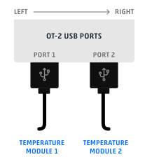

:og:description: How to load and work with Opentrons hardware modules in a Python protocol.

.. _new_modules:

################
Hardware Modules
################

Hardware modules are first-party peripherals that attach to the OT-2 to extend its capabilities. The Python API currently supports four modules that attach to the OT-2 deck and are controlled over a USB connection: the :ref:`Temperature <temperature-module>`, :ref:`Magnetic <magnetic-module>`, :ref:`Thermocycler <thermocycler-module>`, and :ref:`Heater-Shaker <heater-shaker-module>` Modules.

************
Module Setup
************

Loading a Module onto the Deck
==============================

Like labware and pipettes, you must inform the Protocol API of the modules you will use in your protocol.

Use :py:meth:`.ProtocolContext.load_module` to load a module.  It will return an object representing the module.

.. code-block:: python
    :substitutions:

    from opentrons import protocol_api

    metadata = {'apiLevel': '|apiLevel|'}

    def run(protocol: protocol_api.ProtocolContext):
         # Load a Magnetic Module GEN2 in deck slot 1.
         magnetic_module = protocol.load_module('magnetic module gen2', 1)
         
         # Load a Temperature Module GEN1 in deck slot 3.
         temperature_module = protocol.load_module('temperature module', 3)

When you load a module in a protocol, you inform the OT-2 that you want the specified module to be present. Even if you don't use the module anywhere else in your protocol, the Opentrons App and the OT-2 won't let you start the protocol run until all loaded modules are connected to the OT-2 and powered on.

.. versionadded:: 2.0

.. _available_modules

Available Modules
-----------------

The first parameter of :py:meth:`.ProtocolContext.load_module`, the module's *load name*, specifies the kind of module to load. The table below lists the load names for each kind of module.

Some modules were added to the Protocol API later than others, and some modules have multiple hardware generations (GEN2 modules have a "GEN2" label on the device). Make sure your protocol's metadata specifies a :ref:`Protocol API version <v2-versioning>` high enough to support all the modules you want to use.

.. table::
   :widths: 4 5 2
   
   +--------------------+-------------------------------+---------------------------+
   | Module             | Load Name                     | Introduced in API Version |
   +====================+===============================+===========================+
   | Temperature Module | ``temperature module``        | 2.0                       |
   | GEN1               | or ``tempdeck``               |                           |
   +--------------------+-------------------------------+---------------------------+
   | Temperature Module | ``temperature module gen2``   | 2.3                       |
   | GEN2               |                               |                           |
   +--------------------+-------------------------------+---------------------------+
   | Magnetic Module    | ``magnetic module``           | 2.0                       |
   | GEN1               | or ``magdeck``                |                           |
   +--------------------+-------------------------------+---------------------------+
   | Magnetic Module    | ``magnetic module gen2``      | 2.3                       |
   | GEN2               |                               |                           |
   +--------------------+-------------------------------+---------------------------+
   | Thermocycler       | ``thermocycler module``       | 2.0                       |
   | Module GEN1        | or ``thermocycler``           |                           |
   +--------------------+-------------------------------+---------------------------+
   | Thermocycler       | ``thermocycler module gen2``  | 2.13                      |
   | Module GEN2        | or ``thermocyclerModuleV2``   |                           |
   +--------------------+-------------------------------+---------------------------+
   | Heater-Shaker      | ``heaterShakerModuleV1``      | 2.13                      |
   | Module             |                               |                           |
   +--------------------+-------------------------------+---------------------------+

Loading Labware onto a Module
=============================

Like specifying labware that will be placed directly on the deck of the OT-2, you must specify labware that will be present on the module you have just loaded, using ``load_labware()``. For instance, to load an `aluminum block for 2 mL tubes <https://labware.opentrons.com/opentrons_24_aluminumblock_generic_2ml_screwcap?category=aluminumBlock>`_ on top of a Temperature Module:

.. code-block:: python

    from opentrons import protocol_api

    metadata = {'apiLevel': '2.3'}

    def run(protocol: protocol_api.ProtocolContext):
        temp_mod = protocol.load_module("temperature module gen2", 1)
        temp_labware = temp_mod.load_labware(
            "opentrons_24_aluminumblock_generic_2ml_screwcap",
            label="Temperature-Controlled Tubes",
        )

.. versionadded:: 2.0

Notice that when you load labware on a module, you don't need to specify the labware's deck slot.  The labware is loaded on the module, on whichever deck slot the module occupies.

Any :ref:`v2-custom-labware` added to your Opentrons App is also accessible when loading labware onto a module. You can find and copy its load name by going to its card on the Labware page.

.. versionadded:: 2.1

Module and Labware Compatibility
--------------------------------

It's up to you to make sure that the labware and modules you load make sense together. The Protocol API won't raise a warning or error if you load a nonsensical combination, like a tube rack on a Thermocycler.

For further information on what combinations are possible, see the support article `What labware can I use with my modules? <https://support.opentrons.com/s/article/What-labware-can-I-use-with-my-modules>`_

Additional Labware Parameters
-----------------------------

In addition to the mandatory ``load_name`` argument, you can also specify additional parameters. If you specify a ``label``, this name will appear in the Opentrons App and the run log instead of the load name. For labware that has multiple definitions, you can specify ``version`` and ``namespace`` (though most of the time you won't have to). See :py:meth:`.MagneticModuleContext.load_labware`, :py:meth:`.TemperatureModuleContext.load_labware`, :py:meth:`.ThermocyclerContext.load_labware`, or :py:meth:`.HeaterShakerContext.load_labware` for more details.

.. _temperature-module:

**************************
Using a Temperature Module
**************************

The Temperature Module acts as both a cooling and heating device. It can control the temperature of its deck between 4 °C and 95 °C with a resolution of 1 °C.

The Temperature Module is represented in code by a :py:class:`.TemperatureModuleContext` object, which has methods for setting target temperatures and reading the module's status.

The examples in this section will use a Temperature Module loaded in slot 3:

.. code-block:: python
    :substitutions:

    from opentrons import protocol_api

    metadata = {'apiLevel': '2.3'}

    def run(protocol: protocol_api.ProtocolContext):
        temp_mod = protocol.load_module('temperature module gen2', '3')
        plate = temp_mod.load_labware('corning_96_wellplate_360ul_flat')

In order to prevent physical obstruction of other slots, it's best to load the Temperature Module in a slot on the horizontal edges of the deck (1, 4, 7, or 10 on the left or 3, 6, or 9 on the right), with the USB cable and power cord pointing away from the deck.

.. versionadded:: 2.0

Temperature Control
===================

The primary function of the module is to control the temperature of its deck, using :py:meth:`~.TemperatureModuleContext.set_temperature`, which takes one parameter: ``celsius``. For example, to set the Temperature Module to 4 °C:

.. code-block:: python

    temp_mod.set_temperature(celsius=4)

When using ``set_temperature``, your protocol will wait until the target temperature is reached before proceeding to further commands. In other words, you can pipette to or from the Temperature Module when it is holding at a temperature or idle, but not while it is actively changing temperature. Whenever the module reaches its target temperature, it will hold the temperature until you set a different target or call :py:meth:`~.TemperatureModuleContext.deactivate`, which will stop heating or cooling and will turn off the fan.

.. note::

    The OT-2 will not automatically deactivate the Temperature Module at the end of a protocol. If you need to deactivate the module after a protocol is completed or canceled, use the Temperature Module controls on the device detail page in the Opentrons App or run ``deactivate()`` in Jupyter notebook.

.. versionadded:: 2.0

Temperature Status
==================

If you need to confirm in software whether the Temperature Module is holding at a temperature or is idle, use the :py:obj:`~.TemperatureModuleContext.status` property:

.. code-block:: python

    temp_mod.set_temperature(celsius=90)
    temp_mod.status  # 'holding at target'
    temp_mod.deactivate()
    temp_mod.status  # 'idle'
    
If you don't need to use the status value in your code, and you have physical access to the module, you can read its status and temperature from the LED and display on the module.
    
.. versionadded:: 2.0

Changes with the GEN2 Temperature Module
========================================

All methods of :py:class:`.TemperatureModuleContext` work with both the GEN1 and GEN2 Temperature Module. Physically, the GEN2 module has a plastic insulating rim around the plate, and plastic insulating shrouds designed to fit over Opentrons aluminum blocks. This mitigates an issue where the GEN1 module would have trouble cooling to very low temperatures, especially if it shared the deck with a running Thermocycler.

.. _magnetic-module:

***********************
Using a Magnetic Module
***********************

The Magnetic Module controls a set of permanent magnets which can move vertically to induce a magnetic field in the labware loaded on the module.

The Magnetic Module is represented by a :py:class:`.MagneticModuleContext` object, which has methods for engaging (raising) and disengaging (lowering) its magnets.

The examples in this section will use a Magnetic Module loaded in slot 6:

.. code-block:: python
    :substitutions:

    from opentrons import protocol_api

    metadata = {'apiLevel': '2.3'}

    def run(protocol: protocol_api.ProtocolContext):
        mag_mod = protocol.load_module('magnetic module gen2', '6')
        plate = mag_mod.load_labware('nest_96_wellplate_100ul_pcr_full_skirt')

.. versionadded:: 2.0

Loading Labware
===============

Like with all modules, use the Magnetic Module’s :py:meth:`~.MagneticModuleContext.load_labware` method to specify what you will place on the module. The Magnetic Module supports 96-well PCR plates and deep well plates. For the best compatibility, use a labware definition that specifies how far the magnets should move when engaging with the labware. The following plates in the Opentrons Labware Library include this measurement:

- ``biorad_96_wellplate_200ul_pcr``
- ``nest_96_wellplate_100ul_pcr_full_skirt``
- ``nest_96_wellplate_2ml_deep``
- ``thermoscientificnunc_96_wellplate_1300ul``
- ``thermoscientificnunc_96_wellplate_2000ul``
- ``usascientific_96_wellplate_2.4ml_deep``

To check whether a custom labware definition specifies this measurement, load the labware and query its :py:attr:`~.Labware.magdeck_engage_height` property. If has a numerical value, the labware is ready for use with the Magnetic Module.

.. _magnetic-module-engage:

Engaging and Disengaging
========================

Raising and lowering the module's magnets are done with the  :py:meth:`~.MagneticModuleContext.engage` and :py:meth:`~.MagneticModuleContext.disengage` functions, respectively.

If your loaded labware is fully compatible with the Magnetic Module, you can call ``engage()`` with no argument:

  .. code-block:: python

      mag_mod.engage()

  .. versionadded:: 2.0

This will move the magnets upward to the default height for the labware, which should be close to the bottom of the labware's wells. If your loaded labware doesn't specify a default height, this will raise an ``ExceptionInProtocolError``.

For certain applications, you may want to move the magnets to a different height. The recommended way is to use the ``height_from_base`` parameter, which represents the distance above the base of the labware (its lowest point, where it rests on the module). Setting ``height_from_base=0`` should move the tops of the magnets level with the base of the labware. Alternatively, you can use the ``offset`` parameter, which represents the distance above *or below* the labware's default position (close to the bottom of its wells). Like using ``engage()`` with no argument, this will raise an error if there is no default height for the loaded labware.

.. note::
    There is up to 1 mm of manufacturing variance across Magnetic Module units, so observe the exact position and adjust as necessary before running your protocol.

Here are some examples of where the magnets will move when using the different parameters in combination with the loaded NEST PCR plate, which specifies a default height of 20 mm:

  .. code-block:: python

      mag_mod.engage(height_from_base=13.5)  # 13.5 mm
      mag_mod.engage(offset=-2)              # 15.5 mm

Note that ``offset`` takes into account the fact that the magnets' home position is measured as −2.5 mm for GEN2 modules.

  .. versionadded:: 2.0
  .. versionchanged:: 2.2
     Added the ``height_from_base`` parameter.

When you need to retract the magnets back to their home position, call :py:meth:`~.MagneticModuleContext.disengage`. 

  .. code-block:: python

      mag_mod.disengage()  # -2.5 mm

.. versionadded:: 2.0

If at any point you need to check whether the magnets are engaged or not, use the :py:obj:`~.MagneticModuleContext.status` property. This will return either the string ``engaged`` or ``disengaged``, not the exact height of the magnets.

.. note:: 

    The OT-2 will not automatically deactivate the Magnetic Module at the end of a protocol. If you need to deactivate the module after a protocol is completed or canceled, use the Magnetic Module controls on the device detail page in the Opentrons App or run ``deactivate()`` in Jupyter notebook.
    
Changes with the GEN2 Magnetic Module
=====================================

The GEN2 Magnetic Module uses smaller magnets than the GEN1 version to mitigate an issue with the magnets attracting beads even from their retracted position. This means it takes longer for the GEN2 module to attract beads. The recommended attraction time is 5 minutes for liquid volumes up to 50 µL and 7 minutes for volumes greater than 50 µL. If your application needs additional magnetic strength to attract beads within  these timeframes, use the available `Adapter Magnets <https://support.opentrons.com/s/article/Adapter-magnets>`_.

.. _thermocycler-module:

***************************
Using a Thermocycler Module
***************************

The Thermocycler Module provides on-deck, fully automated thermocycling and can heat and cool very quickly during operation. The module's block can heat and cool between 4 and 99 °C, and the module's lid can heat up to 110 °C.

The Thermocycler is represented in code by a :py:class:`.ThermocyclerContext` object, which has methods for controlling the lid, controlling the block, and setting *profiles* — timed heating and cooling routines that can be automatically repeated. 

The examples in this section will use a Thermocycler loaded as follows:

.. code-block:: python
    :substitutions:

    from opentrons import protocol_api

    metadata = {'apiLevel': '2.13'}

    def run(protocol: protocol_api.ProtocolContext):
        tc_mod = protocol.load_module('thermocyclerModuleV2')
        plate = tc_mod.load_labware('nest_96_wellplate_100ul_pcr_full_skirt')
        
The ``location`` parameter of :py:meth:`.load_module` isn't required for the Thermocycler. It only has one valid deck location, which covers :ref:`slots <deck-slots>` 7, 8, 10, and 11 on an OT-2 or A1 and B1 on a Flex. Attempting to load any other modules or labware in these slots while a Thermocycler is there will raise an error.

.. versionadded:: 2.0

Lid Control
===========

The Thermocycler can control the position and temperature of its lid. 

To change the lid position, use :py:meth:`~.ThermocyclerContext.open_lid` and :py:meth:`~.ThermocyclerContext.close_lid`. When the lid is open, the pipettes can access the loaded labware. 

You can also control the temperature of the lid. Acceptable target temperatures are between 37 and 110 °C. Use :py:meth:`~.ThermocyclerContext.set_lid_temperature`, which takes one parameter: the target ``temperature`` (in degrees Celsius) as an integer. For example, to set the lid to 50 °C:

.. code-block:: python

    tc_mod.set_lid_temperature(temperature=50)

The protocol will only proceed once the lid temperature reaches 50 °C. This is the case whether the previous temperature was lower than 50 °C (in which case the lid will actively heat) or higher than 50 °C (in which case the lid will passively cool).

You can turn off the lid heater at any time with :py:meth:`~.ThermocyclerContext.deactivate_lid`.

.. note::

    Lid temperature is not affected by Thermocycler profiles. Therefore you should set an appropriate lid temperature to hold during your profile *before* executing it. See :ref:`thermocycler-profiles` for more information on defining and executing profiles.

.. versionadded:: 2.0

Block Control
=============

The Thermocycler can control its block temperature, including holding at a temperature and adjusting for the volume of liquid held in its loaded plate.

Temperature
-----------

To set the block temperature inside the Thermocycler, use :py:meth:`~.ThermocyclerContext.set_block_temperature`. At minimum you have to specify a ``temperature`` in degrees Celsius:

.. code-block:: python

        tc_mod.set_block_temperature(temperature=4)
        
If you don't specify any other parameters, the Thermocycler will hold this temperature until a new temperature is set, :py:meth:`~.ThermocyclerContext.deactivate_block` is called, or the module is powered off.

.. versionadded:: 2.0

Hold Time
---------

You can optionally instruct the Thermocycler to hold its block temperature for a specific amount of time. You can specify ``hold_time_minutes``, ``hold_time_seconds``, or both (in which case they will be added together). For example, this will set the block to 4 °C for 4 minutes and 15 seconds:

.. code-block:: python

        tc_mod.set_block_temperature(temperature=4, hold_time_minutes=4,
                                     hold_time_seconds=15)

.. note ::

    Your protocol will not proceed to further commands while holding at a temperature. If you don't specify a hold time, the protocol will proceed as soon as the target temperature is reached.

.. versionadded:: 2.0

Block Max Volume
----------------

The Thermocycler's block temperature controller varies its behavior based on the amount of liquid in the wells of its labware. Accurately specifying the liquid volume allows the Thermocycler to more precisely control the temperature of the samples. You should set the ``block_max_volume`` parameter to the amount of liquid in the *fullest* well, measured in µL. If not specified, the Thermocycler will assume samples of 25 µL.

It is especially important to specify ``block_max_volume`` when holding at a temperature. For example, say you want to hold larger samples at a temperature for a short time:

.. code-block:: python

        tc_mod.set_block_temperature(temperature=4, hold_time_seconds=20,
                                     block_max_volume=80)

If the Thermocycler assumes these samples are 25 µL, it may not cool them to 4 °C before starting the 20-second timer. In fact, with such a short hold time they may not reach 4 °C at all!

.. versionadded:: 2.0

.. _thermocycler-profiles:

Thermocycler Profiles
=====================

In addition to executing individual temperature commands, the Thermocycler can automatically cycle through a sequence of block temperatures to perform heat-sensitive reactions. These sequences are called *profiles*, which are defined in the Protocol API as lists of dicts. Each dict should have a ``temperature`` key, which specifies the temperature of the step, and either or both of ``hold_time_seconds`` and ``hold_time_minutes``, which specify the duration of the step. 

For example, this profile commands the Thermocycler to reach 10 °C and hold for 30 seconds, and then to reach 60 °C and hold for 45 seconds:

.. code-block:: python

        profile = [
            {'temperature': 10, 'hold_time_seconds': 30},
            {'temperature': 60, 'hold_time_seconds': 45}
        ]

Once you have written the steps of your profile, execute it with :py:meth:`~.ThermocyclerContext.execute_profile`. This function executes your profile steps multiple times depending on the ``repetitions`` parameter. It also takes a ``block_max_volume`` parameter, which is the same as that of the :py:meth:`~.ThermocyclerContext.set_block_temperature` function.

For instance, a PCR prep protocol might define and execute a profile like this:

.. code-block:: python

        profile = [
            {'temperature': 95, 'hold_time_seconds': 30},
            {'temperature': 57, 'hold_time_seconds': 30},
            {'temperature': 72, 'hold_time_seconds': 60}
        ]
        tc_mod.execute_profile(steps=profile, repetitions=20, block_max_volume=32)

In terms of the actions that the Thermocycler performs, this would be equivalent to nesting ``set_block_temperature`` commands in a ``for`` loop:

.. code-block:: python

        for i in range(20):
            tc_mod.set_block_temperature(95, hold_time_seconds=30, block_max_volume=32)
            tc_mod.set_block_temperature(57, hold_time_seconds=30, block_max_volume=32)
            tc_mod.set_block_temperature(72, hold_time_seconds=60, block_max_volume=32)
            
However, this code would generate 60 lines in the protocol's run log, while executing a profile is summarized in a single line. Additionally, you can set a profile once and execute it multiple times (with different numbers of repetitions and maximum volumes, if needed).

.. note::

    Temperature profiles only control the temperature of the `block` in the Thermocycler. You should set a lid temperature before executing the profile using :py:meth:`~.ThermocyclerContext.set_lid_temperature`.

.. versionadded:: 2.0

Changes with the GEN2 Thermocycler Module
=========================================

All methods of :py:class:`.ThermocyclerContext` work with both the GEN1 and GEN2 Thermocycler. One practical difference is that the GEN2 module has a plate lift feature to make it easier to remove the plate manually or with a robotic gripper. To activate the plate lift, press the button on the Thermocycler for three seconds while the lid is open. If you need to do this in the middle of a run, call :py:meth:`~.ProtocolContext.pause`, lift and move the plate, and then resume the run from the Opentrons App.

.. _heater-shaker-module:

****************************
Using a Heater-Shaker Module
****************************

The Heater-Shaker Module provides on-deck heating and orbital shaking. The module can heat from 37 to 95 °C, and can shake samples from 200 to 3000 rpm.

The Heater-Shaker Module is represented in code by a :py:class:`.HeaterShakerContext` object. The examples in this section will use a Heater-Shaker loaded in slot 1:

.. code-block:: python

    from opentrons import protocol_api

    metadata = {'apiLevel': '2.13'}

    def run(protocol: protocol_api.ProtocolContext):
         hs_mod = protocol.load_module('heaterShakerModuleV1', 1)

.. versionadded:: 2.13

Placement Restrictions
======================

To allow for proper anchoring and cable routing, the Heater-Shaker should only be loaded in slot 1, 3, 4, 6, 7, or 10. 

In general, it's best to leave all slots adjacent to the Heater-Shaker empty, in both directions. If your protocol requires filling those slots, you’ll need to observe certain restrictions put in place to avoid physical crashes involving the Heater-Shaker.

First, you can’t place any other modules adjacent to the Heater-Shaker in any direction. This prevents collisions both while shaking and while opening the labware latch. Attempting to load a module next to the Heater-Shaker will raise a ``DeckConflictError``.

Next, you can’t place tall labware (defined as >53 mm) to the left or right of the Heater-Shaker. This prevents the Heater-Shaker’s latch from colliding with the adjacent labware. Attempting to load tall labware to the right or left of the Heater-Shaker will also raise a ``DeckConflictError``. Common labware that exceed the height limit include Opentrons tube racks and Opentrons 1000 µL tip racks.

Finally, if you are using an 8-channel pipette, you can't perform pipetting actions in `any` adjacent slots. Attempting to do so will raise a ``PipetteMovementRestrictedByHeaterShakerError``. This prevents the pipette ejector from crashing on the module housing or labware latch. There is one exception: to the front or back of the Heater-Shaker, an 8-channel pipette can access tip racks only. Attempting to pipette to non-tip-rack labware will also raise a ``PipetteMovementRestrictedByHeaterShakerError``.

Latch Control
=============

To easily add and remove labware from the Heater-Shaker, you can control its labware latch within your protocol using :py:meth:`.open_labware_latch` and :py:meth:`.close_labware_latch`. Shaking requires the labware latch to be closed, so you may want to issue a close command before the first shake command in your protocol:

.. code-block:: python

    hs_mod.close_labware_latch()
    hs_mod.set_and_wait_for_shake_speed(500)

If the labware latch is already closed, ``close_labware_latch()`` will succeed immediately; you don’t have to check the status of the latch before opening or closing it.

To prepare the deck before running a protocol, use the labware latch controls in the Opentrons App or run these methods in Jupyter notebook.

Loading Labware
===============

Like with all modules, use the Heater-Shaker’s :py:meth:`~.HeaterShakerContext.load_labware` method to specify what you will place on the module. For the Heater-Shaker, you must use a definition that describes the combination of a thermal adapter and labware that fits it. Currently, only the following combinations are supported in the Opentrons Labware Library:

+-------------------------+-------------------------------------------+----------------------------------------------------------------------+
| Adapter                 | Labware                                   | Definition                                                           |
+=========================+===========================================+======================================================================+
| Deep Well Adapter       | NEST 96 Deep Well Plate 2mL               | ``opentrons_96_deep_well_adapter_nest_wellplate_2ml_deep``           |
+-------------------------+-------------------------------------------+----------------------------------------------------------------------+
| 96 Flat Bottom Adapter  | NEST 96 Well Plate 200 µL Flat            | ``opentrons_96_flat_bottom_adapter_nest_wellplate_200ul_flat``       |
+-------------------------+-------------------------------------------+----------------------------------------------------------------------+
| PCR Adapter             | NEST 96 Well Plate 100 µL PCR Full Skirt  | ``opentrons_96_pcr_adapter_nest_wellplate_100ul_pcr_full_skirt``     |
+-------------------------+-------------------------------------------+----------------------------------------------------------------------+
| PCR Adapter             | Thermo Scientific Armadillo PCR Plate     | ``opentrons_96_pcr_adapter_armadillo_wellplate_200ul``               |
+-------------------------+-------------------------------------------+----------------------------------------------------------------------+
| Universal Flat Adapter  | Corning 384 Well Plate 112 µL Flat        | ``opentrons_universal_flat_adapter_corning_384_wellplate_112ul_flat``|
+-------------------------+-------------------------------------------+----------------------------------------------------------------------+

Custom flat-bottom labware can be used with the Universal Flat Adapter. If you need assistance creating custom labware definitions for the Heater-Shaker, `submit a request <https://support.opentrons.com/s/article/Requesting-a-custom-labware-definition>`_.

Heating and Shaking
===================

Heating and shaking operations are controlled independently, and are treated differently due to the amount of time they take. Speeding up or slowing down the shaker takes at most a few seconds, so it is treated as a *blocking* command — all other command execution must wait until it is complete. In contrast, heating the module or letting it passively cool can take much longer, so the Python API gives you the flexibility to perform other pipetting actions while waiting to reach a target temperature. When holding at a target, you can design your protocol to run in a blocking or non-blocking manner.

.. note::

	As of version 2.13 of the API, only the Heater-Shaker Module supports non-blocking command execution. All other modules' methods are blocking commands.

Blocking commands
-----------------

Here is an example of how to shake a sample for one minute in a blocking manner — no other commands will execute until the minute has elapsed. This can be done with three commands, which start the shake, wait the minute, and stop the shake:

.. code-block:: python

    hs_mod.set_and_wait_for_shake_speed(500)
    protocol.delay(minutes=1)
    hs_mod.deactivate_shaker()

These actions will take about 65 seconds total. Compare this with similar-looking commands for holding a sample at a temperature for one minute:

.. code-block:: python

    hs_mod.set_and_wait_for_temperature(75)
    protocol.delay(minutes=1)
    hs_mod.deactivate_heater()

This may take much longer, depending on the thermal block used, the volume and type of liquid contained in the labware, and the initial temperature of the module. 

Non-blocking commands
---------------------

To pipette while the Heater-Shaker is heating, use :py:meth:`~.HeaterShakerContext.set_target_temperature` and :py:meth:`~.HeaterShakerContext.wait_for_temperature` instead of :py:meth:`~.HeaterShakerContext.set_and_wait_for_temperature`:

.. code-block:: python

    hs_mod.set_target_temperature(75)
    pipette.pick_up_tip()   
    pipette.aspirate(50, plate['A1'])
    pipette.dispense(50, plate['B1'])
    pipette.drop_tip()
    hs_mod.wait_for_temperature()
    protocol.delay(minutes=1)
    hs_mod.deactivate_heater()

This example would likely take just as long as the blocking version above; it’s unlikely that one aspirate and one dispense action would take longer than the time for the module to heat. However, be careful when putting a lot of commands between a ``set_target_temperature()`` call and a ``delay()`` call. In this situation, you’re relying on ``wait_for_temperature()`` to resume execution of commands once heating is complete. But if the temperature has already been reached, the delay will begin later than expected and the Heater-Shaker will hold at its target temperature longer than intended.

Additionally, if you want to pipette while the module holds at a target for a certain length of time, you need to track the holding time yourself. One of the simplest ways to do this is with Python’s ``time`` module. First, add ``import time`` at the start of your protocol. Then, use :py:func:`time.monotonic` to set a reference time when the target is reached. Finally, add a delay that calculates how much holding time is remaining after the pipetting actions:

.. code-block:: python

    hs_mod.set_and_wait_for_temperature(75)
    start_time = time.monotonic()  # set reference time
    pipette.pick_up_tip()   
    pipette.aspirate(50, plate['A1'])
    pipette.dispense(50, plate['B1'])
    pipette.drop_tip()
    # delay for the difference between now and 60 seconds after the reference time
    protocol.delay(max(0, start_time+60 - time.monotonic()))
    hs_mod.deactivate_heater()

Provided that the parallel pipetting actions don’t take more than one minute, this code will deactivate the heater one minute after its target was reached. If more than one minute has elapsed, the value passed to ``protocol.delay`` will equal 0, and the protocol will continue immediately.

Deactivating
============

As with setting targets, deactivating the heater and shaker are done separately, with :py:meth:`~.HeaterShakerContext.deactivate_heater` and :py:meth:`~.HeaterShakerContext.deactivate_shaker` respectively. There is no method to deactivate both simultaneously, so call the two methods in sequence if you need to stop both heating and shaking.

.. note:: 

    The OT-2 will not automatically deactivate the Heater-Shaker at the end of a protocol. If you need to deactivate the module after a protocol is completed or canceled, use the Heater-Shaker module controls on the device detail page in the Opentrons App or run these methods in Jupyter notebook.

***************************************
Using Multiple Modules of the Same Type
***************************************

It's possible to use multiples of most module types within a single protocol. The exception is the Thermocycler Module, which only has one supported deck location due to its size. Running protocols with multiple modules of the same type requires version 4.3 or newer of the Opentrons App and OT-2 robot server. 

In order to send commands to the correct module on the deck, you need to load the modules in your protocol in a specific order. Whenever you call :py:meth:`.load_module` for a particular module type, the OT-2 will initialize the matching module attached to the lowest-numbered USB port. Deck slot numbers play no role in the ordering of modules; you could load a Temperature Module in slot 4 first, followed by another one in slot 3:

.. code-block:: python

    from opentrons import protocol_api

    metadata = {'apiLevel': '2.3'}

    def run(protocol: protocol_api.ProtocolContext):
        # Load Temperature Module 1 in deck slot 4 on USB port 1
        temperature_module_1 = protocol.load_module('temperature module gen2', 4)

        # Load Temperature Module 2 in deck slot 3 on USB port 2
        temperature_module_2 = protocol.load_module('temperature module gen2', 3)
        
For this code to work as expected, ``temperature_module_1`` should be plugged into a lower-numbered USB port than ``temperature_module_2``. Assuming there are no other modules used in this protocol, it's simplest to use ports 1 and 2, like this:

Before running your protocol, it's a good idea to use the module controls in the Opentrons App to check that commands are being sent where you expect.

For additional information, including using modules with USB hubs, see our `support article on Using Multiple Modules of the Same Type <https://support.opentrons.com/s/article/Using-modules-of-the-same-type-on-the-OT-2>`_.
