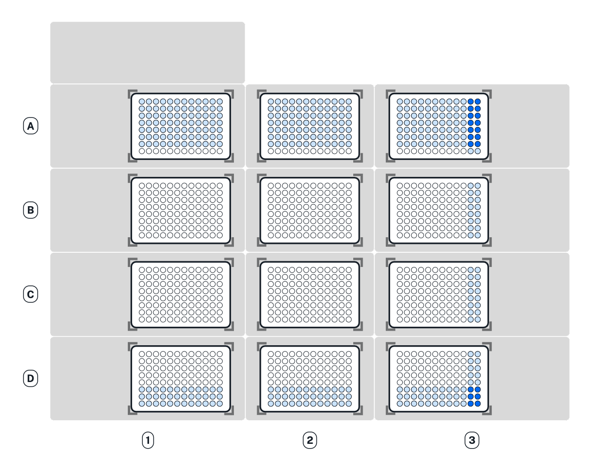

:og:description: How to change the number of tips an Opentrons pipette uses.

.. _partial-tip-pickup:

******************
Partial Tip Pickup
******************

By default, multi-channel pipettes always use all of their nozzles to pick up tips and handle liquids: an 8-channel pipette picks up 8 tips at once, and a 96-channel pipette picks up 96 tips at once. Partial tip pickup lets you configure a multi-channel pipette to use fewer tips. This expands the liquid handling capabilities of your robot without having to physically switch pipettes, and is especially useful for the Flex 96-Channel Pipette, which occupies both pipette mounts.

Before getting started with partial tip pickup, make sure your protocol specifies an API version that supports the configuration you need.

.. list-table::
    :header-rows: 1

    * - Pipette
      - Partial configuration
      - Minimum API version
    * - Flex 96-Channel Pipette
      - Column
      - 2.16
    * - Flex 96-Channel Pipette
      - Single, row
      - 2.20
    * - Flex 8-Channel Pipettes
      - Single, partial column
      - 2.20
    * - OT-2 Multi-Channel Pipettes
      - Single, partial column
      - 2.20

.. _nozzle-layouts:

Nozzle Layouts
==============

Use the :py:meth:`.configure_nozzle_layout` method to choose how many tips a pipette will pick up. The method's required ``style`` parameter only accepts special layout constants. You must import these constants at the top of your protocol, or you won't be able to configure the pipette for partial tip pickup.

At minimum, import the API from the ``opentrons`` package::

    from opentrons import protocol_api

This import statement lets you configure a layout with a parameter like ``style=protocol_api.COLUMN``.

For greater convenience, also import the individual layout constants that you plan to use in your protocol::

    from opentrons.protocol_api import COLUMN, ALL

This more specific import statement lets you configure a layout with a parameter like ``style=COLUMN``. However, you wouldn't be able to set ``style=ROW`` without also importing that constant.

The examples in the sections below use the shorter style and show the other required parameters of ``configure_nozzle_layout()``.

Column Layout
-------------

Here is the start of a protocol that imports the ``COLUMN`` and ``ALL`` layout constants, loads a 96-channel pipette, and sets it to pick up a single column of tips.

.. code-block:: python
    :substitutions:

    from opentrons import protocol_api
    from opentrons.protocol_api import COLUMN, ALL

    requirements = {"robotType": "Flex", "apiLevel": "|apiLevel|"}

    def run(protocol: protocol_api.ProtocolContext):
        partial_rack = protocol.load_labware(
            load_name="opentrons_flex_96_tiprack_1000ul",
            location="D3"
        )
        trash = protocol.load_trash_bin("A3")
        pipette = protocol.load_instrument("flex_96channel_1000")
        pipette.configure_nozzle_layout(
            style=COLUMN,
            start="A12",
            tip_racks=[partial_rack]
        )

.. versionadded:: 2.16

Let's unpack some of the details of this code.

First, we've given a special name to the tip rack, ``partial_rack``. You can name your tip racks whatever you like, but if you're using a 96-channel pipette for full pickup and partial pickup in the same protocol, you'll need to keep them separate. See :ref:`partial-tip-rack-adapters` below.

Next, we load the 96-channel pipette. Note that :py:meth:`.load_instrument` only has a single argument. The 96-channel pipette occupies both mounts, so ``mount`` is omissible. The ``tip_racks`` argument is always optional. But it would have no effect to declare it here, because every call to ``configure_nozzle_layout()`` resets the pipette's :py:obj:`.InstrumentContext.tip_racks` property.

Finally, we configure the nozzle layout, with three arguments.

    - The ``style`` parameter directly accepts the ``COLUMN`` constant, since we imported it at the top of the protocol.
    - The ``start`` parameter accepts a nozzle name, representing the primary nozzle in the layout, as a string. ``"A12"`` tells the pipette to use its rightmost column of nozzles for pipetting.
    - The ``tip_racks`` parameter tells the pipette which racks to use for tip tracking, just like :ref:`adding tip racks <pipette-tip-racks>` when loading a pipette.

In this configuration, pipetting actions will use a single column::

    pipette.pick_up_tip()  # picks up A1-H1 from tip rack
    pipette.drop_tip()
    pipette.pick_up_tip()  # picks up A2-H2 from tip rack

.. warning::

    :py:meth:`.InstrumentContext.pick_up_tip` always accepts a ``location`` argument, regardless of nozzle configuration. Do not pass a value that would lead the pipette to line up over more unused tips than specified by the current layout. For example, setting ``COLUMN`` layout and then calling ``pipette.pick_up_tip(tip_rack["A2"])`` on a full tip rack will lead to unexpected pipetting behavior and potential crashes.

Row Layout
----------

Here is the start of a protocol that imports the ``ROW`` and ``ALL`` layout constants, loads a 96-channel pipette, and sets it to pick up a single row of tips.

.. code-block:: python
    :substitutions:

    from opentrons import protocol_api
    from opentrons.protocol_api import ROW, ALL

    requirements = {"robotType": "Flex", "apiLevel": "|apiLevel|"}

    def run(protocol: protocol_api.ProtocolContext):
        partial_rack = protocol.load_labware(
            load_name="opentrons_flex_96_tiprack_1000ul",
            location="D3"
        )
        trash = protocol.load_trash_bin("A3")
        pipette = protocol.load_instrument("flex_96channel_1000")
        pipette.configure_nozzle_layout(
            style=ROW,
            start="H1",
            tip_racks=[partial_rack]
        )

.. versionadded:: 2.20

Setting ``start="H1"`` means the pipette will use its frontmost nozzles to pick up tips, starting from the back of the tip rack::

    pipette.pick_up_tip()  # picks up A1-A12 from tip rack
    pipette.drop_tip()
    pipette.pick_up_tip()  # picks up B1-B12 from tip rack

You can also set ``start="A1"`` to use the backmost nozzles and pick up from the front of the tip rack.

.. note::

    Consider the placement of your tip rack when choosing the ``start`` value for row pickup. The pipette cannot pick up from back to front (``start="H1"``) on tip racks in row A of the deck, nor can it pick up from front to back (``start="A1"``) on tip racks in row D of the deck. This is because the pipette can't move far enough backward or forward, respectively, to align over those tips.

    Use a different ``start`` value, or load the tip rack in row B or C.

Single Layout
-------------

Single-tip pickup is available on both 8-channel and 96-channel pipettes. 8-channel pipettes can pick up a single tip with either the front or back nozzle. 96-channel pipettes can pick up a single tip with any of the corner nozzles.

.. note::
    Remember that only the A1 and H12 nozzles of the 96-channel pipette contain pressure sensors. Avoid using the A12 and H1 nozzles for single-tip pickup if you need to detect liquid presence within wells.

The ``start`` parameter sets the first and only nozzle used in the configuration. It also affects the order in which the pipette picks up tips. When using automatic tip tracking, single-tip configurations always consume all tips within a single column before proceeding to another column.

.. list-table::
    :header-rows: 1

    * - Pipette type
      - ``start`` well
      - Pickup order
    * - 8-channel
      - A1
      - | Front to back, left to right
        | (H1 through A1, H2 through A2, …)
    * - 8-channel
      - H1
      - | Back to front, left to right
        | (A1 through H1, A2 through H2, …)
    * - 96-channel
      - A1
      - | Front to back, right to left
        | (H12 through A12, H11 through A11, …)
    * - 96-channel
      - H1
      - | Back to front, right to left
        | (A12 through H12, A11 through H11, …)
    * - 96-channel
      - A12
      - | Front to back, left to right
        | (H1 through A1, H2 through A2, …)
    * - 96-channel
      - H12
      - | Back to front, left to right
        | (A1 through H1, A2 through H2, …)

.. warning::
    In certain conditions, tips in adjacent columns may cling to empty nozzles during single-tip pickup. You can avoid this by overriding automatic tip tracking to pick up tips row by row, rather than column by column. The code sample below demonstrates how to pick up tips this way.

    However, as with all partial tip layouts, be careful that you don't place the pipette in a position where it overlaps more tips than intended.

Here is the start of a protocol that imports the ``SINGLE`` and ``ALL`` layout constants, loads an 8-channel pipette, and sets it to pick up a single tip.

.. code-block:: python
    :substitutions:

    from opentrons import protocol_api
    from opentrons.protocol_api import SINGLE, ALL

    requirements = {"robotType": "Flex", "apiLevel": "|apiLevel|"}

    def run(protocol: protocol_api.ProtocolContext):
        partial_rack = protocol.load_labware(
            load_name="opentrons_flex_96_tiprack_1000ul",
            location="D3"
        )
        trash = protocol.load_trash_bin("A3")
        pipette = protocol.load_instrument(
            instrument_name="flex_8channel_1000",
            mount="left"
        )
        pipette.configure_nozzle_layout(
            style=SINGLE,
            start="H1"
        )

.. versionadded:: 2.20

To pick up tips row by row, first construct a list of all wells in the tip rack ordered from A1, A2 … H11, H12. One way to do this is to use :py:func:`sum` to flatten the list of lists returned by :py:meth:`.Labware.rows`::

    tips_by_row = sum(partial_rack.rows(), [])

Then ``pop`` items from the front of the list (index 0) and pass them as the ``location`` of :py:meth:`.pick_up_tip`::

    # pick up A1 from tip rack
    pipette.pick_up_tip(location=tips_by_row.pop(0))
    pipette.drop_tip()
    # pick up A2 from tip rack
    pipette.pick_up_tip(location=tips_by_row.pop(0))

Partial Column Layout
---------------------

Partial column pickup is available on 8-channel pipettes only. Partial columns contain 2 to 7 consecutive tips in a single column. The pipette always picks up partial columns with its frontmost nozzles (``start="H1"``).

To specify the number of tips to pick up, add the ``end`` parameter when calling :py:meth:`.configure_nozzle_layout`. Use the chart below to determine the ending nozzle (G1 through B1) for your desired number of tips.

.. list-table::
    :stub-columns: 1

    * - Number of tips
      - 2
      - 3
      - 4
      - 5
      - 6
      - 7
    * - ``end`` nozzle
      - G1
      - F1
      - E1
      - D1
      - C1
      - B1

When picking up 3, 5, 6, or 7 tips, extra tips will be left at the front of each column. You can use these tips with a different nozzle configuration, or you can manually re-rack them at the end of your protocol for future use.

.. warning::
    In certain conditions, tips in adjacent columns may cling to empty nozzles during partial-column pickup. You can avoid this by overriding automatic tip tracking to pick up tips row by row, rather than column by column. The code sample below demonstrates how to pick up tips this way.

    However, as with all partial tip layouts, be careful that you don't place the pipette in a position where it overlaps more tips than intended.

Here is the start of a protocol that imports the ``PARTIAL_COLUMN`` and ``ALL`` layout constants, loads an 8-channel pipette, and sets it to pick up four tips:

.. code-block:: python
    :substitutions:

    from opentrons import protocol_api
    from opentrons.protocol_api import PARTIAL_COLUMN, ALL

    requirements = {"robotType": "Flex", "apiLevel": "|apiLevel|"}

    def run(protocol: protocol_api.ProtocolContext):
        partial_rack = protocol.load_labware(
            load_name="opentrons_flex_96_tiprack_1000ul",
            location="B2"
        )
        trash = protocol.load_trash_bin("A3")
        pipette = protocol.load_instrument("flex_8channel_1000", mount="left")
        pipette.configure_nozzle_layout(
            style=PARTIAL_COLUMN,
            start="H1",
            end="E1"
        )

.. versionadded:: 2.20

When pipetting in partial column configuration, remember that *the frontmost channel of the pipette is its primary channel*. To pick up tips across the back half of the rack, then across the front half of the rack, construct a list of that includes all and only the wells in row D and row H::

    tips_by_row = partial_rack.rows_by_name()["D"] + partial_rack.rows_by_name()["H"]

Then ``pop`` items from the front of the list (index 0) and pass them as the ``location`` of :py:meth:`.pick_up_tip`::

    # pick up A1-D1 from tip rack
    pipette.pick_up_tip(location=tips_by_row.pop(0))
    pipette.drop_tip()
    # pick up A2-D2 from tip rack
    pipette.pick_up_tip(location=tips_by_row.pop(0))

To use the same configuration as above to transfer liquid from wells A1–D1 to wells A2–D2 on a plate, you must use the wells in row D as the source and destination targets::

    # pipette in 4-nozzle partial column layout
    pipette.transfer(
        volume=100,
        source=plate["D1"],  # aspirate from A1-D1
        dest=plate["D2"],    # dispense into A2-D2
    )

.. warning::

    Do not move the pipette to row A of labware when in ``PARTIAL_COLUMN`` configuration! This is different than when pipetting to a full column, either with the 8-channel pipette in ``ALL`` configuration or with the 96-channel pipette in ``COLUMN`` configuration.

    If you pipette to row A, the frontmost tip will move to row A and the other tips — further back in the layout — will hang over the back edge of the labware. They will not enter the correct wells and they will likely cause a crash.

.. _partial-tip-rack-adapters:

Tip Rack Adapters
=================

You can use both partial and full tip pickup in the same protocol. When using both with a 96-channel pipette, you must load some tip racks directly on the deck, and some tip racks in a tip rack adapter.

Do not use a tip rack adapter when performing partial tip pickup with a 96-channel pipette. Instead, place the tip rack on the deck. During partial tip pickup, the 96-channel pipette lowers onto the tip rack in an offset position. If the tip rack were in its adapter, the pipette could collide with the adapter's posts, which protrude above the top of the tip rack. If you configure the 96-channel pipette for partial pickup and then call ``pick_up_tip()`` on a tip rack that's loaded onto an adapter, the API will raise an error.

On the other hand, you must use the tip rack adapter for full rack pickup. If the 96-channel pipette is in a full layout, either by default or by configuring ``style=ALL``, and you then call ``pick_up_tip()`` on a tip rack that's not in an adapter, the API will raise an error.

When switching between full and partial pickup, you may want to organize your tip racks into lists, depending on whether they're loaded on adapters or not.

.. code-block:: python

    tips_1 = protocol.load_labware(
        "opentrons_flex_96_tiprack_1000ul", "C1"
    )
    tips_2 = protocol.load_labware(
        "opentrons_flex_96_tiprack_1000ul", "D1"
    )
    tips_3 = protocol.load_labware(
        "opentrons_flex_96_tiprack_1000ul", "C3",
        adapter="opentrons_flex_96_tiprack_adapter"
    )
    tips_4 = protocol.load_labware(
        "opentrons_flex_96_tiprack_1000ul", "D3",
        adapter="opentrons_flex_96_tiprack_adapter"
    )

    partial_tip_racks = [tips_1, tips_2]
    full_tip_racks = [tips_3, tips_4]

.. Tip::

    It's also good practice to keep separate lists of tip racks when using multiple partial tip pickup configurations (e.g., using both column 1 and column 12 in the same protocol). This improves positional accuracy when picking up tips. Additionally, use Labware Position Check in the Opentrons App to ensure that the partial configuration is well-aligned to the rack.

Now, when you configure the nozzle layout, you can reference the appropriate list as the value of ``tip_racks``::

    pipette.configure_nozzle_layout(
        style=COLUMN,
        start="A12",
        tip_racks=partial_tip_racks
    )
    # partial pipetting commands go here

    pipette.configure_nozzle_layout(
        style=ALL,
        tip_racks=full_tip_racks
    )
    pipette.pick_up_tip()  # picks up full rack in C3

This keeps tip tracking consistent across each type of pickup. And it reduces the risk of errors due to the incorrect presence or absence of a tip rack adapter.

Tip Pickup and Conflicts
========================

During partial tip pickup, the pipette moves into spaces above adjacent slots. To avoid crashes, the API prevents you from performing partial tip pickup in locations where the pipette could collide with the outer edges of the robot or labware in the working area. The current nozzle layout, pickup or pipetting location, and adjacent labware determine whether a particular pipetting action is safe to perform.

The API will raise errors for potential crashes when using a partial nozzle configuration. Nevertheless, it's a good idea to do the following when working with partial tip pickup:

    - Plan your deck layout carefully. Make a diagram and visualize everywhere the pipette will travel.
    - Simulate your protocol and compare the output to your expectations of where the pipette will travel.
    - Perform a dry run with only tip racks on the deck. Have the Emergency Stop Pendant handy in case you see an impending crash.

Deck Extents
------------

When using partial nozzle configurations around the back, right, and front edges of the deck, there are limitations on how far the pipette can move beyond the outer edge of the deck slot. The API will raise an error if you try to pipette beyond these outer `extents` of the working area.

.. tip::
    There are no extents-related limitations on slots B1, B2, C1, and C2. When performing partial pickup and pipetting in these slots, you only have to consider :ref:`possible labware conflicts <partial-labware-conflicts>`.

One way to think of deck extents is in terms of where you can pick up tips or pipette to a 96-well plate loaded in a given slot. These limitations only apply when using a layout that places the pipette further towards the windows of the robot than an ``ALL`` layout would. For example, using a ``ROW`` layout with the frontmost nozzles of the 96-channel pipette, it will never move farther forward than the H row of a labware in slots D1–D3. But using a ``ROW`` layout with the backmost nozzles would bring it farther forward — it could collide with the front window, except that the API prevents it.

The following table summarizes the limitations in place along each side of the deck.

.. list-table::
    :header-rows: 1

    * - Deck slots
      - Nozzle configuration
      - Inaccessible wells
    * - A1–D1 (left edge)
      - Rightmost column
      - None (all wells accessible)
    * - A1–D3 (back edge)
      - Frontmost row
      - Rows A–G
    * - A3–D3 (right edge)
      - Leftmost column
      - Columns 11–12
    * - D1–D3 (front edge)
      - Backmost row
      - Rows F–H

To visualize these limitations, the below deck map shades all wells that have a single limitation in light blue, and all wells that have two limitations in dark blue.

Multiple limitations occur when you use a ``SINGLE`` configuration that uses the innermost corner nozzle, with respect to the pipette's position on the deck. For example, using nozzle A1 on the 96-channel pipette has multiple limitations in slot D3.

Additionally, column A of plates loaded on a Thermocycler Module is inaccessible by the rightmost nozzles of the 96-channel pipette. Although the API treats such plates as being in slot A1, the physical location of a plate on the Thermocycler is slightly further left than a plate loaded directly on the slot.

.. _partial-labware-conflicts:

Arranging Labware
-----------------

For column pickup, Opentrons recommends using the nozzles in column 12 of the pipette::

    pipette.configure_nozzle_layout(
        style=COLUMN,
        start="A12",
    )

.. note::

    When using a column 1 layout, the pipette can't reach the rightmost portion of labware in slots A3–D3. Any well that is within 29 mm of the right edge of the slot may be inaccessible. Use a column 12 layout if you need to pipette in that area.

When using column 12, the pipette overhangs space to the left of wherever it is picking up tips or pipetting. For this reason, it's a good idea to organize tip racks front to back on the deck. If you place them side by side, the rack to the right will be inaccessible. For example, let's load three tip racks in the front left corner of the deck::

    tips_C1 = protocol.load_labware("opentrons_flex_96_tiprack_1000ul", "C1")
    tips_D1 = protocol.load_labware("opentrons_flex_96_tiprack_1000ul", "D1")
    tips_D2 = protocol.load_labware("opentrons_flex_96_tiprack_1000ul", "D2")

Now the pipette will be able to access the racks in column 1 only. ``pick_up_tip(tips_D2["A1"])`` will raise an error due to the tip rack immediately to its left, in slot D1. There a couple of ways to avoid this error:

    - Load the tip rack in a different slot, with no tall labware to its left.
    - Use all the tips in slot D1 first, and then use :py:meth:`.move_labware` to make space for the pipette before picking up tips from D2.

You would get a similar error trying to aspirate from or dispense into a well plate in slot D3, since there is a tip rack to the left.

.. tip::

    When using column 12 nozzles for partial tip pickup and pipetting, generally organize your deck with the shortest labware on the left side of the deck, and the tallest labware on the right side.

    Similarly, when using the frontmost row of nozzles for partial tip pickup and pipetting, organize your deck with the shortest labware towards the back of the deck, and the tallest labware towards the front of the deck.
