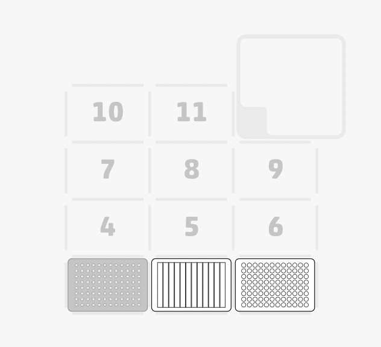
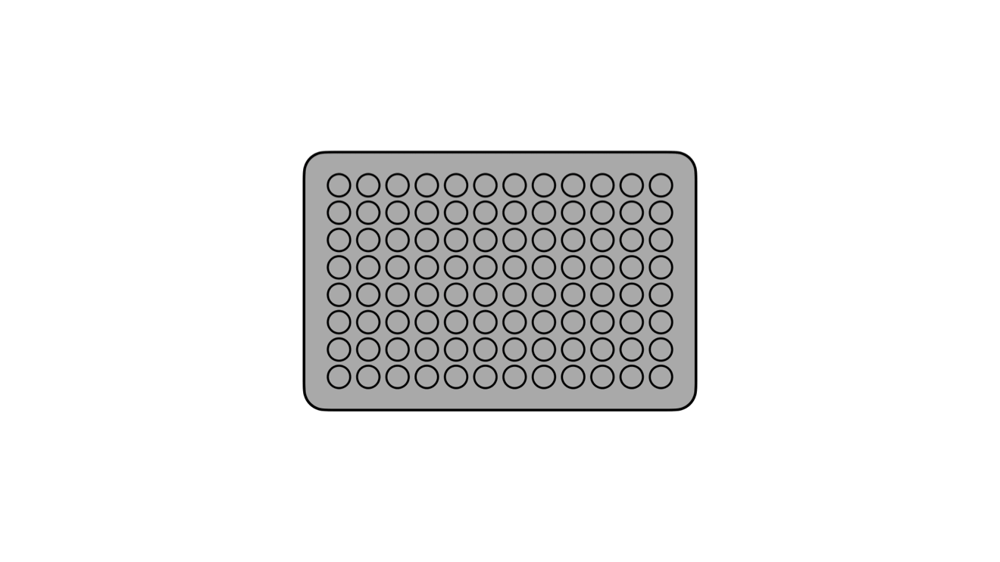
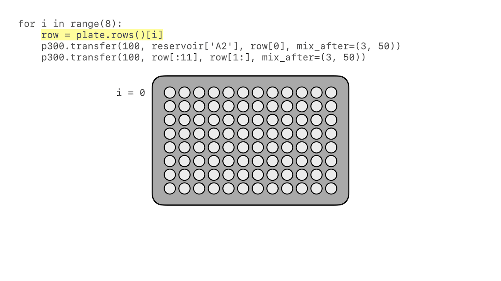
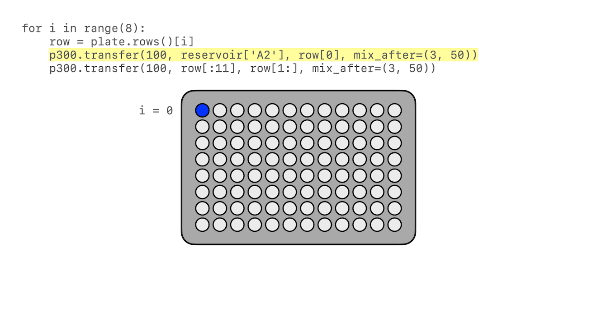
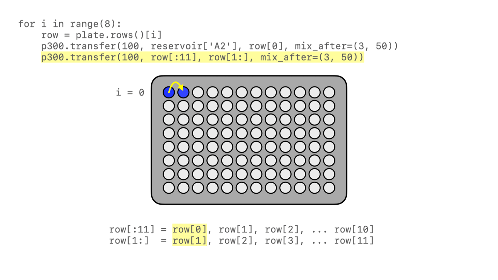
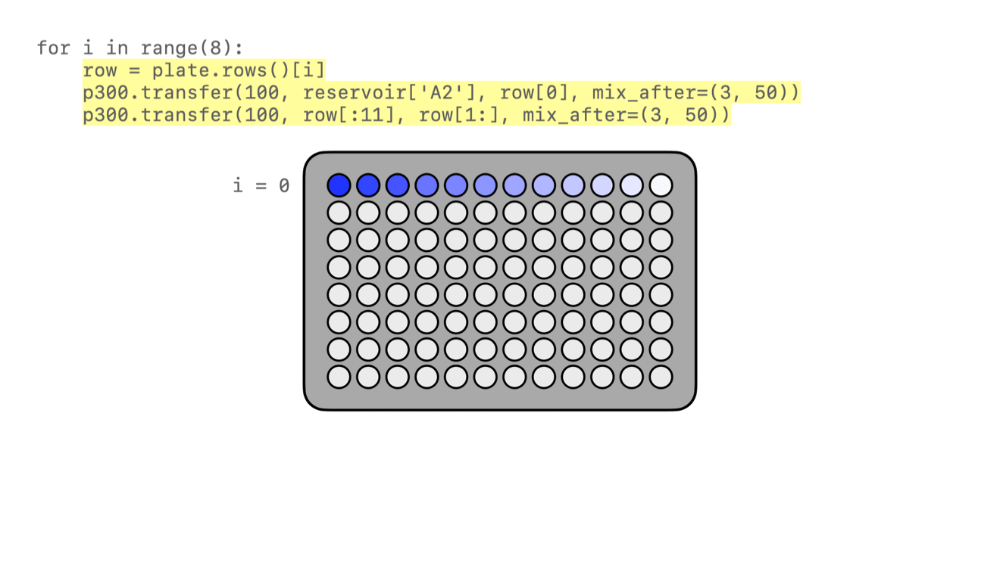
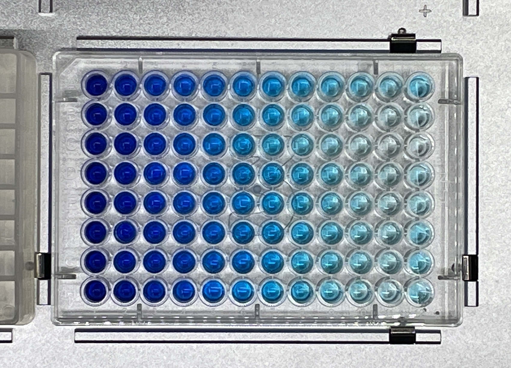

.. _tutorial:

########
Tutorial
########

************
Introduction
************

This tutorial will guide you through creating a Python protocol file from scratch. At the end of this process you’ll have a complete protocol that can run on an OT-2 robot. If you don’t have an OT-2 yet (or if you’re away from your lab, or if your robot is in use) you can use the same file to simulate the protocol on your computer instead. 

What You’ll Automate
^^^^^^^^^^^^^^^^^^^^

The lab task that you’ll automate in this tutorial is `serial dilution`: taking a solution and progressively diluting it by transferring it stepwise across a plate from column 1 to column 12. With just a dozen or so lines of code, you can instruct your robot to perform the hundreds of individual pipetting actions necessary to fill an entire 96-well plate. And all of those liquid transfers will be done automatically, so you’ll have more time to do other work in your lab.

Before You Begin
^^^^^^^^^^^^^^^^

You're going to write some Python code, but by no means do you need to be a Python expert to get started writing Opentrons protocols. You should know some basic Python syntax, like how it uses `indentation <https://docs.python.org/3/reference/lexical_analysis.html#indentation>`_ to group blocks of code, dot notation for `calling methods <https://docs.python.org/3/tutorial/classes.html#method-objects>`_, and the format of `lists <https://docs.python.org/3/tutorial/introduction.html#lists>`_ and `dictionaries <https://docs.python.org/3/tutorial/datastructures.html#dictionaries>`_. You’ll also be using `common control structures <https://docs.python.org/3/tutorial/controlflow.html#if-statements>`_ like ``if`` statements and ``for`` loops. 

To run your code, make sure that you've installed `Python 3 <https://wiki.python.org/moin/BeginnersGuide/Download>`_ and the `pip package installer <https://pip.pypa.io/en/stable/getting-started/>`_. You should write your code in your favorite plaintext editor or IDE and save it in a file with a ``.py`` extension, like ``dilution-tutorial.py``.

If you plan to run your protocol on an OT-2, you’ll want to have it ready with the right kind of hardware and labware:

- `Set up your OT-2 <https://support.opentrons.com/s/ot2-get-started>`_, including `attaching pipettes <https://support.opentrons.com/s/article/Get-started-Attach-pipettes>`_ and `initial calibration <https://support.opentrons.com/s/article/Get-started-Calibrate-the-deck>`_. You can use either a single-channel or 8-channel pipette for this tutorial. Most code examples will use a `P300 Single-Channel GEN2 <https://shop.opentrons.com/single-channel-electronic-pipette-p20/>`_ pipette.

- Prepare the labware you need for serial dilution. The code examples will use the following labware definitions, but as long as you have labware of each type you can modify the code to run with your labware.

    - **Reservoir**: `NEST 12 Well Reservoir 15 mL <https://labware.opentrons.com/nest_12_reservoir_15ml>`_ ``nest_12_reservoir_15ml``
    - **Well plate**: `NEST 96 Well Plate 200 µL Flat <https://labware.opentrons.com/nest_96_wellplate_200ul_flat>`_ ``nest_96_wellplate_200ul_flat``
    - **Tip rack**: An `Opentrons 96 Tip Rack <https://labware.opentrons.com/?category=tipRack&manufacturer=Opentrons>`_ of the correct size for your pipette, e.g. ``opentrons_96_tiprack_300ul``
    - **Liquids**: For demonstration purposes, you can use plain water as the diluent and water dyed with food coloring as the solution.

**********************
Create a Protocol File
**********************

Let’s start from scratch to create your serial dilution protocol. Open up a new file in your editor and start with the line: 

.. code-block:: python

    from opentrons import protocol_api

Throughout this documentation you’ll see protocols that begin this way. It’s not strictly necessary to include this ``import`` statement — you could leave it out and your protocol would still run fine — but it indicates clearly that this is an Opentrons protocol and, depending on your editor, it may provide you with autocomplete suggestions or other niceties.

Everything else in the protocol file will be required. Next, you’ll specify the version of the API you’re using. Then comes the core of the protocol: defining a single ``run()`` function that provides the locations of your labware, states which kind of pipettes you’ll use, and finally issues the commands that the robot will perform.

For this tutorial, you’ll write very little Python outside of the ``run()`` function. But for more complex applications it’s worth remembering that your protocol file *is* a Python script, so any Python code that can run on the OT-2 can be a part of a protocol. 

.. For more information, see Protocol Structure.

Metadata
^^^^^^^^

Every protocol needs to have a metadata dictionary with information about the protocol. At minimum, you need to specify what :ref:`version <version-table>` of the API the protocol requires. The `scripts <https://github.com/Opentrons/opentrons/blob/edge/api/docs/v2/example_protocols/>`_ for this tutorial were validated against API version 2.13, so specify:

.. code-block:: python

    metadata = {'apiLevel': '2.13'}

You can include any other information you like in the metadata dictionary. The fields ``protocolName``, ``description``, and ``author`` are all displayed in the Opentrons App, so it’s a good idea to expand the dictionary to include them:

.. code-block:: python
    :substitutions:

    metadata = {
        'apiLevel': '2.13',
        'protocolName': 'Serial Dilution Tutorial',
        'description': '''This protocol is the outcome of following the 
                       Python Protocol API Tutorial located at 
                       https://docs.opentrons.com/v2/tutorial.html. It takes a 
                       solution and progressively dilutes it by transferring it 
                       stepwise across a plate.''',
        'author': 'New API User'
        }

With your metadata defined, you can move on to creating the ``run()`` function for your protocol.

The ``run()`` function
^^^^^^^^^^^^^^^^^^^^^^

Now it’s time to actually instruct the OT-2 how to perform serial dilution. All of this information is contained in a single Python function, which has to be named ``run``. This function takes one argument, which is the *protocol context*. Many examples in these docs use the argument name ``protocol``, and sometimes they specify the argument’s type:

.. code-block:: python

    def run(protocol: protocol_api.ProtocolContext):

With the protocol context argument named and typed, you can start calling methods on ``protocol`` to add labware and hardware.

Labware
-------

For serial dilution, you need to load a tip rack, reservoir, and 96-well plate on the deck of your OT-2. Loading labware is done with the :py:meth:`~.ProtocolContext.load_labware` method of the protocol context, which takes two arguments: the standard labware name as defined in the `Opentrons Labware Library <https://labware.opentrons.com/>`_, and the position where you'll place the labware on the OT-2’s deck. Here’s how to load the labware into slots 1, 2, and 3 (repeating the ``def`` statement from above to show proper indenting):

.. code-block:: python

    def run(protocol: protocol_api.ProtocolContext):
        tips = protocol.load_labware('opentrons_96_tiprack_300ul', 1)
        reservoir = protocol.load_labware('nest_12_reservoir_15ml', 2)
        plate = protocol.load_labware('nest_96_wellplate_200ul_flat', 3)
        
If you’re using a different model of labware, find its name in the Labware Library and replace it in your code.

Now the robot will expect to find labware in a configuration that looks like this:

You may notice that this deck map doesn’t show where the liquids will be at the start of the protocol. Liquid definitions aren’t required in Python protocols, unlike protocols made in `Protocol Designer <https://designer.opentrons.com/>`_. (Sneak peek: you’ll put the diluent in column 1 of the reservoir and the solution in column 2 of the reservoir.)

Pipettes
--------

Next you’ll specify what pipette to use in the protocol. Loading a pipette is done with the :py:meth:`.load_instrument` method, which takes three arguments: the name of the pipette, the mount it’s installed in, and the tip racks it should use when performing transfers. Load whatever pipette you have installed in your robot by using its :ref:`standard pipette name <new-pipette-models>`. Here’s how to load a P300 Single-Channel GEN2 pipette that’s installed in the left mount:

.. code-block:: python

        p300 = protocol.load_instrument('p300_single_gen2', 'left', tip_racks=[tips])

Since the pipette is so fundamental to the protocol, it might seem like you should have specified it first. But there’s a good reason why pipettes are loaded after labware: you need to have already loaded ``tips`` in order to tell the pipette to use it. And now you won’t have to reference ``tips`` again in your code — it’s assigned to the ``p300`` pipette and the robot will know to use it when commanded to pick up tips.

.. note::

    You may notice that the value of ``tip_racks`` is in brackets, indicating that it’s a list. This serial dilution protocol only uses one tip rack, but some protocols require more tips, so you can assign them to a pipette all at once, like ``tip_racks=[tips1, tips2]``.

.. _tutorial-commands:
Commands
--------

Finally, all of your labware and hardware is in place, so it’s time to give the robot pipetting commands. The required steps of the serial dilution process break down into three main phases:

1. Measure out equal amounts of diluent from the reservoir to every well on the plate.
2. Measure out equal amounts of solution from the reservoir into wells in the first column of the plate.
3. Move a portion of the combined liquid from column 1 to 2, then from column 2 to 3, and so on all the way to column 12.

Thanks to the flexibility of the API's :py:meth:`.transfer` method, which combines many :ref:`building block commands <v2-atomic-commands>` into one call, each of these phases can be accomplished with a single line of code! You’ll just have to write a few more lines of code to repeat the process for as many rows as you want to fill.

Let’s start with the diluent. This phase takes a larger quantity of liquid and spreads it equally to many wells. ``transfer()`` can handle this all at once, because it accepts either a single well or a list of wells for its source and destination:

.. code-block:: python

        p300.transfer(100, reservoir['A1'], plate.wells())

Breaking down this single line of code shows the power of :ref:`complex commands <v2-complex-commands>`. The first argument is the amount to transfer to each destination, 100 µL. The second argument is the source, column 1 of the reservoir (which is still specified with grid-style coordinates as ``A1`` — a reservoir only has an A row). The third argument is the destination. Here, calling the :py:meth:`.wells` method of ``plate`` returns a list of *every well*, and the command will apply to all of them. 

In plain English, you've instructed the robot, “For every well on the plate, aspirate 100 µL of fluid from column 1 of the reservoir and dispense it in the well.” That’s how we understand this line of code as scientists, yet the robot will understand and execute it as nearly 200 discrete actions.

Now it’s time to start mixing in the solution. To do this row by row, nest the commands in a ``for`` loop: 

.. code-block:: python

        for i in range(8):
            row = plate.rows()[i]

Using Python's built-in :py:class:`range` class is an easy way to repeat this block 8 times, once for each row. This also lets you use the repeat index ``i`` with ``plate.rows()`` to keep track of the current row.

In each row, you first need to add solution. This will be similar to what you did with the diluent, but putting it only in column 1 of the plate. It’s best to mix the combined solution and diluent thoroughly, so add the optional ``mix_after`` argument to ``transfer()``:

.. code-block:: python

            p300.transfer(100, reservoir['A2'], row[0], mix_after=(3, 50))

As before, the first argument specifies to transfer 100 µL. The second argument is the source, column 2 of the reservoir. The third argument is the destination, the element at index 0 of the current ``row``. Since Python lists are zero-indexed, but columns on labware start numbering at 1, this will be well A1 on the first time through the loop, B1 the second time, and so on. The fourth argument specifies to mix 3 times with 50 µL of fluid each time.

Finally, it’s time to dilute the solution down the row. One approach would be to nest another ``for`` loop here, but instead let’s use another feature of the ``transfer()`` method, taking lists as the source and destination arguments: 

.. code-block:: python

            p300.transfer(100, row[:11], row[1:], mix_after=(3, 50))

There’s some Python shorthand here, so let’s unpack it. You can get a range of indices from a list using the colon ``:`` operator, and omitting it at either end means “from the beginning” or “until the end” of the list. So the source is ``row[:11]``, from the beginning of the row until its 11th item. And the destination is ``row[1:]``, from index 1 (column 2!) until the end. Since both of these lists have 11 items, ``transfer()`` will *step through them in parallel*, and they’re constructed so when the source is 0, the destination is 1; when the source is 1, the destination is 2; and so on. This condenses all of the subsequent transfers down the row into a single line of code.

    
All that remains is for the loop to repeat these steps, filling each row down the plate.

That’s it! If you’re using a single-channel pipette, you’re ready to try out your protocol. 

8-Channel Pipette
-----------------

If you’re using an 8-channel pipette, you’ll need to make a couple tweaks to the single-channel code from above. Most importantly, whenever you target a well in row A of a plate with an 8-channel pipette, it will move its topmost tip to row A, lining itself up over the entire column.

Thus, when adding the diluent, instead of targeting every well on the plate, you should only target the top row:

.. code-block:: python

		p300.transfer(100, reservoir['A1'], plate.rows()[0])  

And by accessing an entire column at once, the 8-channel pipette effectively implements the ``for`` loop in hardware, so you’ll need to remove it: 

.. code-block:: python

        row = plate.rows()[0]
        p300.transfer(100, reservoir['A2'], row[0], mix_after=(3, 50))
        p300.transfer(100, row[:11], row[1:], mix_after=(3, 50))

Instead of tracking the current row in the ``row`` variable, this code sets it to always be row A (index 0). 

*****************
Try Your Protocol
*****************

There are two ways to try out your protocol: simulation on your computer, or a live run on an OT-2. Even if you plan to run your protocol on a robot, it’s a good idea to check the simulation output first.

If you get any errors in simulation, or you don't get the outcome you expected when running your protocol, you can check your code against these reference protocols on GitHub:

- `Single-channel serial dilution <https://github.com/Opentrons/opentrons/blob/edge/api/docs/v2/example_protocols/dilution_tutorial.py>`_
- `8-channel serial dilution <https://github.com/Opentrons/opentrons/blob/edge/api/docs/v2/example_protocols/dilution_tutorial_multi.py>`_

.. _tutorial-simulate:

In Simulation
^^^^^^^^^^^^^

Simulation doesn’t require having an OT-2 connected to your computer. You just need to install the ``opentrons`` Python module using ``pip``. This will give you access to the ``opentrons_simulate`` command-line utility (``opentrons_simulate.exe`` on Windows). To see a text preview of the steps the OT-2 will take, ``cd`` to the directory where you saved your protocol file and run:

.. prompt:: bash

    opentrons_simulate dilution-tutorial.py

This should generate a lot of output! As written, the protocol has about 1000 steps. If you’re curious how long that will take, you can use an experimental feature to estimate the time:

.. prompt:: bash

    opentrons_simulate dilution-tutorial.py -e -o nothing

The ``-e`` flag estimates duration, and ``-o nothing`` suppresses printing the run log. This indicates that using a single-channel pipette for serial dilution across the whole plate will take about half an hour — plenty of time to grab a coffee while your robot pipettes for you! ☕️ 

If that’s too long, you can always cancel your run partway through or modify ``for i in range(8)`` to loop through fewer rows.

On a Robot
^^^^^^^^^^

The simplest way to run your protocol on an OT-2 is to use the `Opentrons App <https://opentrons.com/ot-app>`_. Once you’ve installed the app and connected to your robot, navigate to the **Protocol** tab. Click **Choose File…** and open your protocol from the file picker. You should see “Protocol - Serial Dilution Tutorial” (or whatever ``protocolName`` you entered in the metadata) in a banner at the top of the page. 

If you have any remaining calibration tasks to do, you can finish them up here. Below the calibration section is a preview of the initial deck state. Optionally you can run Labware Position Check, or you can go ahead and click **Proceed to Run**.

On the Run tab, you can double-check the Protocol Steps, which are similar to the command-line simulation output. Make sure all your labware and liquids are in the right place, and then click **Start run**. The run log will update in real time as your robot proceeds through the steps. 

When it’s all done, check the results of your serial dilution procedure — you should have a beautiful dye gradient running across the plate!

**********
Next Steps
**********

This tutorial has relied heavily on the ``transfer()`` method, but there's much more that the Python Protocol API can do. Many advanced applications use :ref:`building block commands <v2-atomic-commands>` for finer control over the robot. These commands let you aspirate and dispense separately, add air gaps, blow out excess liquid, move the pipette to any location, and more. For protocols that use Opentrons :ref:`new_modules`, there are methods to control their behavior. And all of the API's classes and methods are catalogued in the :ref:`protocol-api-reference`.