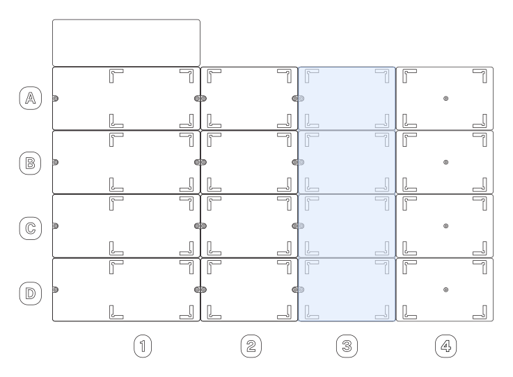

# Deck Placement

You can put the plate reader in deck slots A3–D3 only. The module comes pre-installed in its own caddy, which attaches the unit to the deck.

!!!note
    Other deck components may need one of these slots. For example, the default location for the internal trash bin is slot A3, but this component can go in any one of multiple deck locations. The external waste chute requires slot D3 so you’ll have to remove it (if installed) to put the plate reader in this location.
