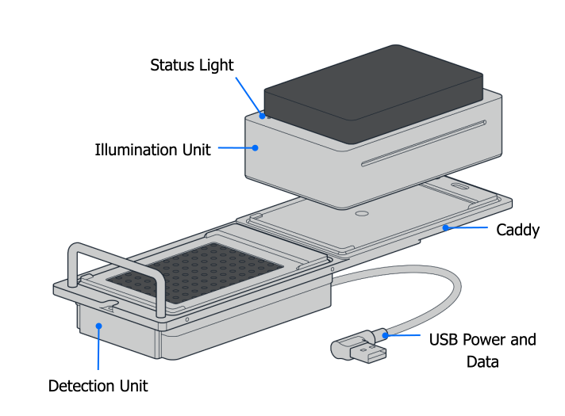

# Product Specifications

## Included Parts

(1) Absorbance Plate Reader Module 
(1) Caddy for deck mounting 
(1) USB cable 
(2) Spare deck slot screws (M4x10 mm socket head) 
(1) Cleaning cloth 
(1) Test certificate

## Physical Specifications

| Specification | Description |
|:--------------|:------------|
| Module dimensions | 155.3 mm L x 95.5 mm W x 57 mm H |
| Module weight | 790 g |
| Composition | Aluminum |
| Pollution degree | 2 |
| Service life | 10 years with average use of 4 hours per day |

## Measurement Specifications

<table>
  <tbody>
    <tr>
      <th>Measurement method</th>
      <td>Absorbance</td>
    </tr>
    <tr>
      <th>Measurement techniques</th>
      <td>Endpoint and kinetic</td>
    </tr>
    <tr>
      <th>Detection</th>
      <td>96 photodiodes</td>
    </tr>
    <tr>
      <th>Measurement range</th>
      <td>0–4.0 optical density (OD)</td>
    </tr>
    <tr>
      <th>Resolution</th>
      <td>0.001 OD</td>
    </tr>
    <tr>
      <th>Accuracy</th>
      <td>
        
The maximum deviation between the determined value and the true value.

        
At 405 nm:

            <ul>
                <li>≤1.5% + 0.010 OD from 0.0–2.0 OD</li>
                <li>≤3% + 0.010 OD from 2.0–3.0 OD</li>
            </ul>
        
At or above 450 nm:

            <ul>
                <li>≤1% + 0.010 OD from 0.0–2.0 OD</li>
                <li>≤1.5% + 0.010 OD from 2.0–3.0 OD</li>
            </ul>
      </td>
    </tr>
    <tr>
      <th>Reproducibility</th>
      <td>
        
The maximum deviation between the determined values when the measurement is repeated directly.

            <ul>
                <li>≤0.5% + 0.005 OD from 0.0–2.0 OD</li>
                <li>≤1% + 0.010 OD from 2.0–3.0 OD</li>
            </ul>
      </td>
    </tr>
    <tr>
      <th>Linearity</th>
      <td>
        
The maximum deviation between the true and the determined increase of the value.

        
At 405 nm:

            <ul>
                <li>≤1.5% from 0.0–2.0 OD</li>
                <li>≤3% from 2.0–3.0 OD</li>
            </ul>
        
At or above 450 nm:

            <ul>
                <li>≤1% from 0.0–2.0 OD</li>
                <li>≤1.5% from 2.0–3.0 OD</li>
            </ul>
      </td>
    </tr>
  </tbody>
</table>

## Detection Wavelengths

The Absorbance Plate Reader emits light in the visible spectrum at 450 nm (blue), 562 nm (green), 600 nm (orange), and 650 nm (red).

## Status Light

The Absorbance Plate Reader has a single status light on the lid. It illuminates in different colors and patterns to indicate various operating conditions.

<table>
  <thead>
    <tr>
      <th>Color</th>
      <th>Pattern</th>
      <th>Status</th>
    </tr>
  </thead>
  <tbody>
    <tr>
      <td rowspan="2"> White</td>
      <td>Solid</td>
      <td>The module is on and ready.</td>
    </tr>
    <tr>
      <td>Pulsing</td>
      <td>Self-test after connecting to power.</td>
    </tr>
    <tr>
      <td> Various</td>
      <td>Solid</td>
      <td>Initialization/measurement in progress. The status light color corresponds to the selected light wavelength used for analysis.</td>
    </tr>
    <tr>
      <td> Yellow</td>
      <td>Pulsing</td>
      <td>A well plate is inside the reader.</td>
    </tr>
    <tr>
      <td> Red</td>
      <td>Blinking</td>
      <td>An error has occurred.</td>
    </tr>
  </tbody>
</table>

## Input and Output Connections

The Absorbance Plate Reader has the following power input requirements, which are met by its USB connection to a Flex robot.

- **Input:** Power from a USB port with 5 VDC and a maximum of 3 A.
- **Power consumption:** 2.5 W
- **Fuse:** 1 A (very fast acting)
