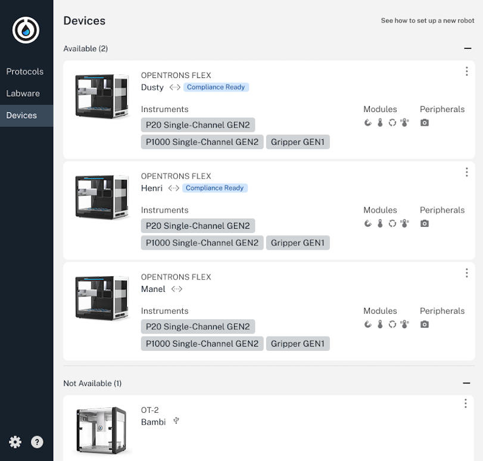

Flex Compliance-Ready software is installed by an Opentrons-trained representative. The price of the software includes this installation, activation, and training. 

Activating Compliance-Ready software on your Flex is permanent and irreversible. Installation changes the way you interact with your Flex on a daily basis. You'll also lose access to some Flex features: 

* [**Jupyter Notebook**](../../../flex/docs/advanced-operation/jupyter-notebook.md) and [**Secure Shell (SSH)**](../../../flex/docs/advanced-operation/command-line.md) connections: You won't be able to control your Flex through web server or terminal connections.
* **Run any valid Python file**: Before installation, your Flex can run any valid Python file developed using the Opentrons Python Protocol API. A compliance-ready Flex can only run verified Python protocols approved and added by an administrator.
* **Factory resets**: A reset of your Flex will delete calibrations, run history, and protocols, but cannot remove compliance-ready software. 

Compliance-ready software makes changes to both the Flex touchscreen and the Opentrons App on your computer.

!!! note
    Remember that you can control multiple robots through the same Opentrons App, including those that don't have compliance-ready software. The way you use the app to interact with a compliance-ready Flex will be different, including logins, protocol runs, and required documentation.

<!--------

TODO: 
- confirm factory reset language + "valid Python" language with Nick and anyone else

----->

## Installation

An Opentrons-trained representative will install and activate compliance-ready software on your Flex during an onsite visit. 

During installation, your Opentrons representative will create service and administrator [accounts](../features/features.md#roles), including a recovery account in case you're ever locked out of your Flex.

After software activation, a "Compliance Ready" badge appears next to your Flex in the app.

<figure class="screenshot" markdown>
  
  <figcaption>Your Opentrons App can control multiple robots, including a mix of Flex, compliance-ready Flex, and OT-2 robots.</figcaption>
</figure>

<!--------

TODO and comments: 
- add ticket for service PIN mention in service manual? does the lab retain this, or we retain this after setup? is it ever used again? 
- not mentioning the encryption key here (in general, not detailing the setup process because I don't want to imply anything/leave an impression about what users are paying for)
- is the recovery account a separate account, or is it a designated administrator account?

----->

## Log storage location

When you run protocols, a compliance-ready Flex locally generates robot and protocol logs. These log files are yours to store, and are never viewed or stored by Opentrons. Read more about [log files](../files.md) in this manual.

During activation, the Opentrons App will be configured to save these logs in a secure storage location. As soon as the compliance-ready software is installed, a log should be exported, placed in the secure storage location, and viewed in the log viewer to officially authorize the process. 

<figure class="screenshot" markdown>

</figure>
<figcaption>Choose a secure, authorized storage location for your log files.</figcaption>

If robot settings, like your Flex's name, are ever changed, you may need to repeat this process.

<!--------

TODO and comments: 
- confirm language around the process of blessing the robot identity
- how do users officially authorize this without the log viewer at launch?
- can't find this image in designs...but may not need it. 

----->

