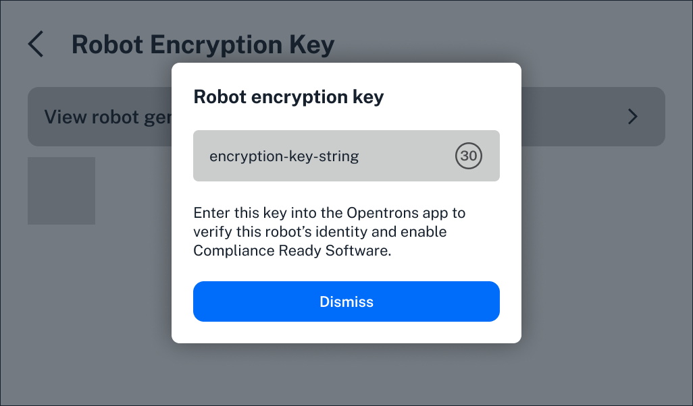
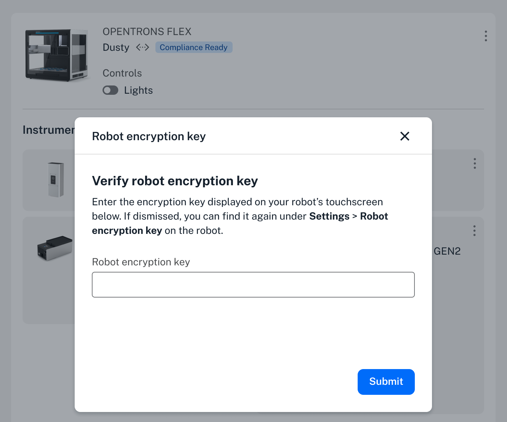
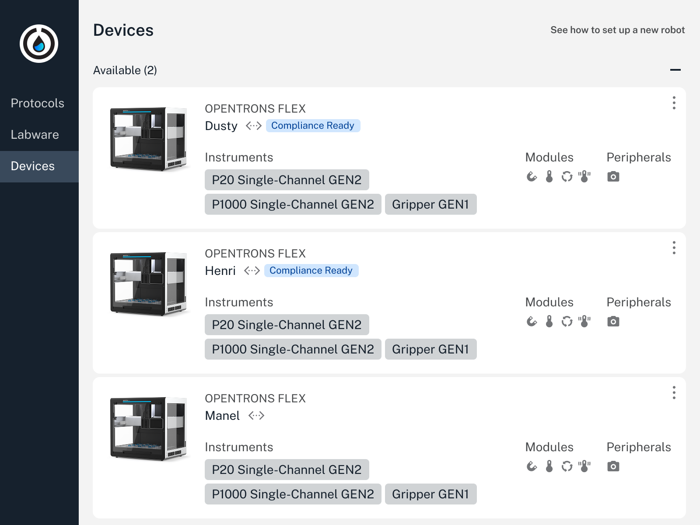

Activating Opentrons Flex Compliance Ready Software permanently adds technical controls, like required documentation and user access, for FDA regulation 21 CFR part 11–ready operation.

An Opentrons-trained representative will install and activate Compliance Ready Software during an on-site visit. The price of the software includes installation, activation, and training.

During activation, your representative will first install the software using a *service PIN* unique to your robot. This is only used for activation, and your lab will never need to access it again. 

## Encryption key

Next, they'll use an *encryption key* to establish a connection between your unique Flex and the Opentrons App. This ensures that only approved users can control the Flex and access its records through your app. 

The encryption key is a three-word string, and your Flex generates a new one every 30 seconds. On the Flex touchscreen, choose **Settings**, then tap **Robot encryption key**. Tap **View encryption key** to see the current key and the countdown to a new one.

<figure class="screenshot" markdown>
  
  <figcaption>The robot-generated encryption key changes every 30 seconds.</figcaption>
</figure>

In your Opentrons App, click the three-dot menu to the right of your robot's name to access its settings. Select the **Advanced** tab, then click to **Enter encryption key**.

If a certificate expires, or if you make updates to device settings like the robot's name, you may need to enter the encryption key again to re-establish the connection between your Flex and Opentrons App. You'll be prompted to do this in the app. 

<figure class="screenshot" markdown>
  
  <figcaption>Enter your robot encryption key in the Opentrons App.</figcaption>
</figure>

## Completing activation

Finally, your representative will create accounts for your lab to use, assigned either an administrator or user [role](roles.md). You'll also be able to customize Compliance Ready Software [settings](settings.md).

After setup, a "Compliance Ready" badge appears next to your Flex in the Opentrons App.

<figure class="screenshot" markdown>
  
  <figcaption>An Opentrons App connected to compliance ready Flex robots.</figcaption>
</figure>

!!! note
    Remember that you can control multiple robots through the same Opentrons App, including those that don't have Compliance Ready Software. The way you use the app to interact with a compliance ready Flex will be different, including logins, protocol runs, and required documentation.

After activation, you'll need to add your own protocols and data management practices to use your Flex into a fully audit-ready workflow.

