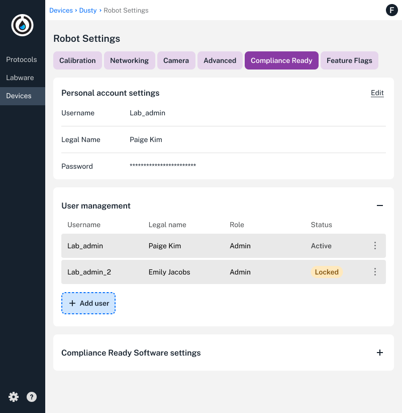
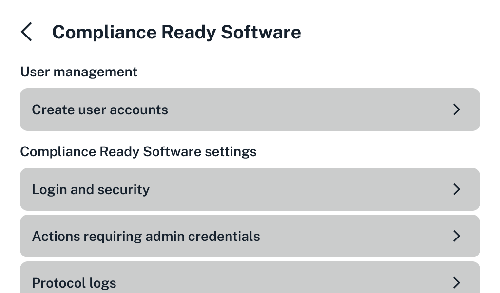
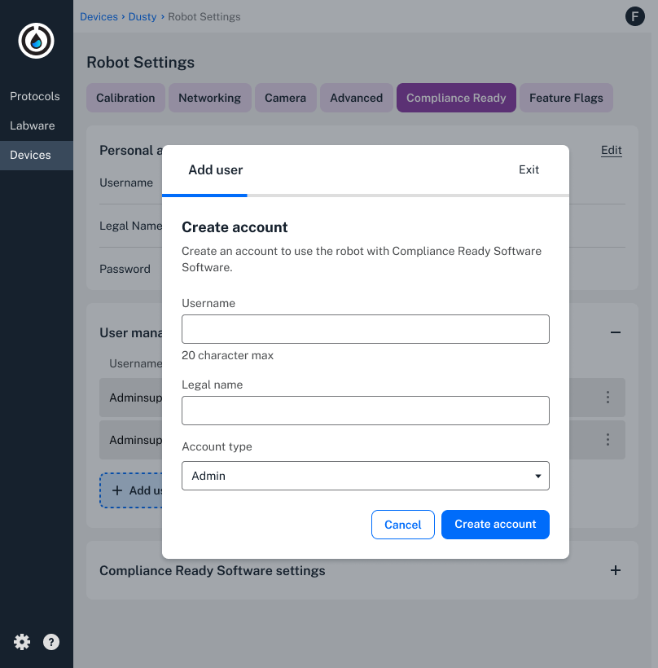
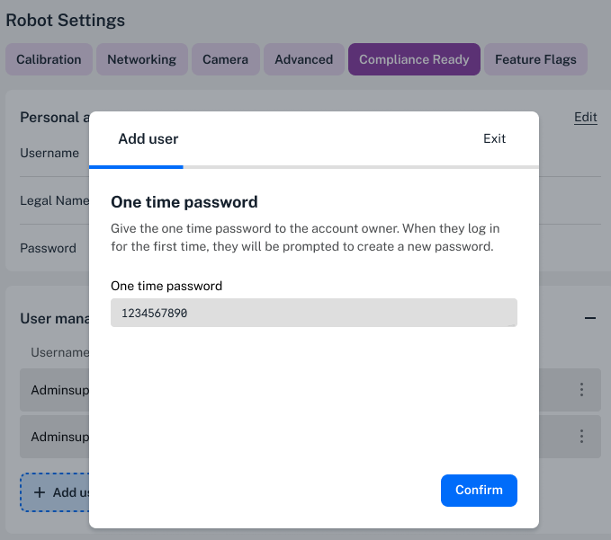
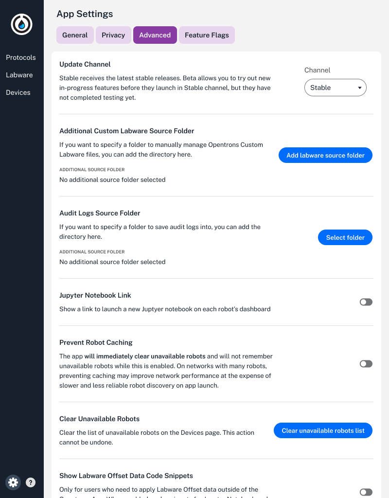

Administrators can customize compliance ready settings in the Opentrons App and on the Flex touchscreen.

For a complete list of Flex robot settings, see the [Flex Instruction Manual]. 

<!---------

TODO + comments: 
- properly link flex manual
-------------->

## Access settings

In the Opentrons App, click the **Devices** page on the left side, then choose **Robot Settings**. Click the **Compliance Ready** tab to view available settings.

<figure class="screenshot" markdown>
  
  <figcaption>Use the keyboard to enter documentation on the Flex touchscreen.</figcaption>
</figure>

On the Flex touchscreen, tap the **Settings** tab, then **Compliance Ready Software**. 

<figure class="screenshot" markdown>
  
  <figcaption>Use the keyboard to enter documentation on the Flex touchscreen.</figcaption>
</figure>

Not all Compliance Ready Software settings are available from the Flex touchscreen. For example, administrators can only create accounts, and aren't able to delete accounts or reset passwords. 

The sections below cover every Compliance Ready Software setting available in the Opentrons App. 

## Personal account settings 

In personal account settings, every user can update their username, legal name, and password. Usernames are restricted to 20 characters on the Flex.

Administrators can customize password settings, like character length, whether to include special characters, and how often users will need to update their passwords.

Users can only make changes to their personal account settings, and can't view or customize settings in User Management or Compliance Ready Software settings. 

## User management

Administrators can unlock or delete users accounts, reset passwords, or edit user permissions. 

<figure class="screenshot" markdown>
  
  <figcaption>Administrators can manage user accounts in compliance-ready settings.</figcaption>
</figure>

All accounts are locked by default after 5 failed login attempts. After unlocking an account, users will receive a one-time password, and can choose a new one after logging in.

<figure class="screenshot" markdown>
  
  <figcaption>Administrators can unlock user accounts with a one-time password.</figcaption>
</figure>

If your lab [loses access](roles.md#account-recovery) to all administrator accounts, Opentrons offers a paid on-site recovery service.

## Compliance Ready Software settings

Administrators can make changes to security, documentation, and storage settings to customize your lab's daily user experience.

| **Setting** | **Options** | 
| :--------|---------------- |
| **Login attempts** | <ul><li>Maximum login attempts before the account locks.</li><li>Default: 5.</li></ul> |
| **Passwords** | <ul><li>Time before user passwords must be changed (default: 30 days).</li></li><li>Password complexity, like minimum length (default: 20 characters) or special character requirements</li></ul> |
| **Screen timeout** | <ul><li>Time before the Opentrons App or Flex touchscreen lock due to inactivity.</li><li>Default: 3 minutes.</li></ul> |
| **User permissions** | <ul><li>Whether administrator credentials are required for updating the Flex, sending protocols to the Flex, or signing run protocol run records.</li></ul> |
| **Documentation** | <ul><li>Whether to require documentation for robot actions, like dropping attached tips or homing the gantry.</li><li>Set minimum character length (default: 20 characters).</li></ul> |
| **Files** | <ul><li>Whether to require protocol logs to be signed and saved in the Opentrons App.</li><li>Automatically delete protocol logs when the Flex reaches its storage limit (20 logs).</li></ul> |
<!---------

TODO and comments: 
- I chose a better name for these categories that I'll have to revert. sigh. example: "user permissions" instead of "Actions requiring admin credentials"
- do both the app and ODD lock upon screen timeout? 
------->

## File source folder

You can choose a location to automatically download and save [files](files.md) from the Opentrons App.

Choose **App Settings** in the Opentrons App, then click the **Advanced** tab and click to select a folder.

<figure class="screenshot" markdown>
  
  <figcaption> Set a location on your computer to download files to from the Opentrons App.</figcaption>
</figure>

<!---------

TODO + comments: 
- do you need to enter documentation when setting or changing this storage location?
-------------->

