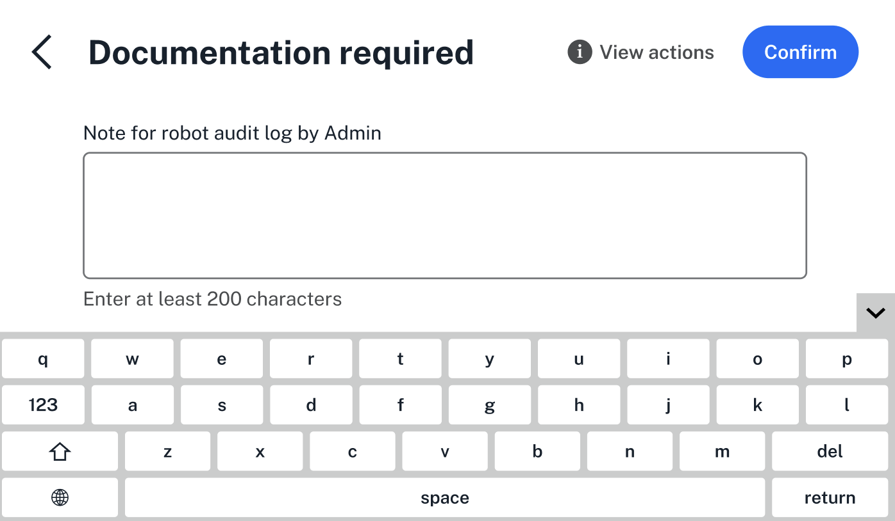
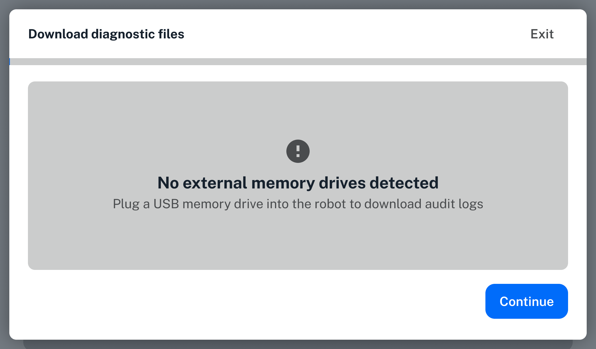

## Devices

User actions, like setting up and running a protocol, require [documentation](using/documentation.md) on a compliance ready Flex. You can use a built-in or external keyboard to make adding documentation easier on the Flex touchscreen.

<figure class="screenshot" markdown>
  
  <figcaption>Use the keyboard to enter documentation on the Flex touchscreen.</figcaption>
</figure>

The keyboard is available in English and in Mandarin. Change your preferred langauge in the Flex's settings. Click the gray arrow on the right side of the Flex touchscreen to collapse the keyboard.

The Flex also supports external keyboards connect via the [front USB port]. When you use an external keyboard, the keyboard on the Flex touchscreen is hidden by default.

If you choose to download [files](using/files.md) from the Flex touchscreen, you'll need to use an external storage device. 

<figure class="screenshot" markdown>
  
  <figcaption>Add an external storage device to download files directly from the Flex.</figcaption>
</figure>

You can connect a USB storage device using the Flex's front USB port.