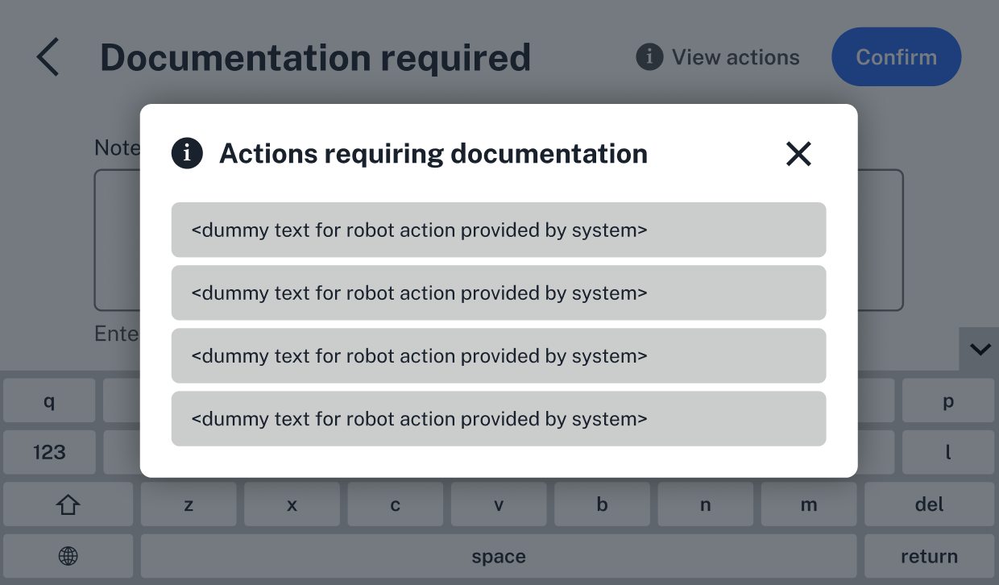

Required documentation is an important part of the Flex's compliance-ready software.  Whenever administrators and users make changes to modules, set up a protocol, detach a pipette, run a protocol, or complete other robot actions, they'll need to document their reason for doing so. 

Their documentation, along with their name and user ID, become a part of the [files](../files.md) your compliance-ready Flex generates.

This section covers when and where documentation is required, on the Flex touchscreen and in the Opentrons App, and how users will document their actions on the Flex. For a closer look at day-to-day operation, see [Using Compliance-Ready Software](../using.md).

!!! note
    Opentrons Flex Compliance-Ready software adds documentation checkpoints while you interact with the Flex. It's up to your lab to decide what suffient documentation looks like for you.

<!---------

TODO: 
- "other robot actions" above is a bit clunky; can work on this
- check list at end of features notes (Google doc; the list of actions that require documentation) against my current list in this file
-------------->

## Setting up a protocol

Your compliance-ready Flex will prompt all users to document their actions when setting up a protocol. You'll add documentation for the first time before protocol setup, after choosing the protocol and any runtime parameters.

<figure class="screenshot" markdown>
  
  <figcaption>Add documentation before beginning protocol setup.</figcaption>
</figure>

You'll see the same screen every time you need to add documentation, no matter which step you're on. During protocol setup, you'll need to document a reason for:

* Attaching or detaching pipettes or the Flex Gripper. 
* Calibrating pipettes or modules.
* Changing the deck slot locations of modules or labware, including resolving deck location conflicts. 
* Changing a module's state, like opening a labware latch or setting temperature.
* Applying [labware offsets](../../../flex/docs/touchscreen/protocol-setup#labware-offsets) or starting a labware position check.
* Confirming labware and liquid placements on the Flex deck.
* Updating settings for the protocol run, like camera preferences. Choose whether to enable the Flex's camera, live video, and automatic image capture for errors.

<!---------

TODO: 
- not included here for now: intervention modals (what kind of modals pop up during setup, if any?)
- sample image can be updated. should we ever include some text in the documentation field, or is this dangerous territory? 
- in general: confirm that users are prompted to enter documentation AFTER completing any action
- any other Flex settings for the last bullet point; camera and? 
- "deck location conflicts" is kind of jargon-y. can I link somewhere for this? add more links to other parts of the Flex manual, too. 
- these sections will all be light on the images to start. How do we feel about this? 
- for every section...how much to emphasize the differences between the app and ODD? many (most) of this can be completed in either. show a representative example (screenshot) of each?
-------------->

## Running a protocol

During a protocol run, the Flex touchscreen or Opentrons App will prompt all users to document: 

* Starting, pausing or canceling a protocol run.
* [Taking an image](../../../flex/docs/opentrons-app/camera.md) during a run.
* Using [error recovery](../../../flex/docs/touchscreen/protocol-run#error-recovery):
    * Beginning or completing error recovery.
    * Skipping or rerunning the protocol step causing the error.
* Signing for and completing the protocol run.

When the protocol run is complete, you'll need to [sign for and complete](../using.md#completing-a-protocol-run) the run in the Opentrons App.

<!---------

TODO: 
- link out to Flex manual when relevant
- is it true that all users are prompted to enter the same level of documentation? 99.9% sure but check this
- this syntax is probably wrong (list within a list; revisit)
- confirm the run is signed for in the app and not the ODD? think I'm wrong on this one, go back to designs
-------------->

## Updating robot settings

Users will need to document the reason for their changes when updating robot settings, like:

* Changing the Flex's network connection (Ethernet or WiFi) or robot name.
* Updating the robot software.
* Changing Flex touchscreen language, LED light, camera, privacy, recovery mode, Flex Stacker sensor, or other settings.
* Making changes to error recovery mode settings. 
* Resetting the Flex.
* Homing the Flex gantry. 

By default, administrator credentials are required to update robot software. Adminstrators can update those permissions in [settings](../features/settings.md).

<!---------

TODO and comments: 
- confirm network connection info
- check whether the following advanced settings are disabled in CRS: update the channel to stable/beta/alpha releases; turning on dev tools
- do you need to enter documentation for an incorrect wifi password? this is a lingering old note I had written down from who knows where, but check this
- maybe this section should go first? it feels like a strong start to begin with protocol setup, but does this then make sense here? 
- add some text here about what happens (incl. screenshot) about what it looks like when users don't have the relevant credentials to complete an action (and, is this applicable in other sections?)
- be sure to link to the admin settings... read more about admin settings and customizing users permissions [here]
-------------->

## Other Flex actions

From the Instruments tab on the Flex [touchscreen](../../../flex/docs/touchscreen/instruments.md) or in the [Opentrons App], any user can make changes to the Flex deck or attached hardware outside of a protocol run. They'll need to add documentation when: 

* Attaching, detaching, or calibrating pipettes or the Flex Gripper.
* Dropping attached tips.
* Changing module states, like updating temperature, labware latch or lid state, or deactivating the module.
* Updating deck slot locations on the Flex.

<!---------

TODO: 
- link relevant sections of Flex manual so users can read more
- is this just on the devices page in the app? confirm
- can add side by side images here as is relevant (app and ODD)
-------------->

## Adding documentation

Installing compliance-ready software on your Flex slows down your lab's workflows on purpose. It adds checkpoints to document nearly every robot and protocol action. 

Your compliance-ready Flex prompts users to document every action covered in the sections above. Each time, they'll have the option to use an on-screen, collapsible keyboard, or attach an [external keyboard](../features/features.md#devices) to the Flex.

Users have the option to add documentation later. Click **View Actions** in the upper right to open a list of actions still requiring documentation. 

When you're finished, click [x].

<figure class="screenshot" markdown>
  
  <figcaption>View the list of actions you'll need to enter documentation for.</figcaption>
</figure>

Here, click each action to add documentation. When you're finished, click **Confirm** to save your text and move to the next action.

Administrators can customize documentation [settings](../features/settings.md) like minimum character requirements.

<!---------

TODO and comments: 
- the explainer for the "view actions" > list shown in the image was that users can add documentation for every action they've completed "since the last time they entered documentation. how do users delay adding documentation? what can they click to move on from the documentation required screen? a swipe? 
- what screen(s) is View Actions available from? looks like "documentation required"?
- not included for now: double click to cut/copy/past text selections? is this included in the feature?
- need to view the flow inside the view actions list
- any other documentation-related settings admins can customize, besides character limits (covered in settings) 
- minimum character requirements might be the only docs setting admins have control over. 
- need to confirm how this list works app vs ODD
- might be relevant to add something here at the end about signing for the run, but leaving that to using.md and the log files page for now.
-------------->