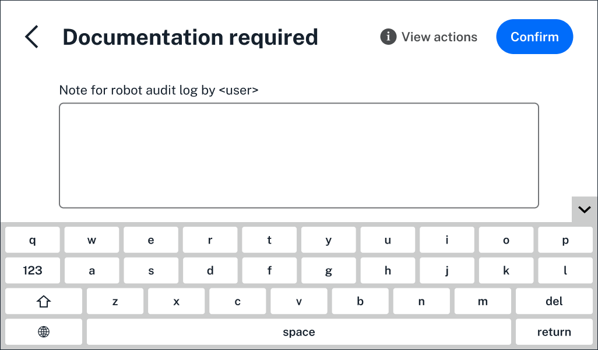

Required documentation is an important part of the Flex's compliance-ready software.  Whenever administrators and users make changes to modules, set up a protocol, detach a pipette, run a protocol, or complete other robot actions, they'll need to document their reason for doing so. 

Their documentation, along with their name and user ID, become a part of the [files](../files.md) your compliance-ready Flex generates.

This section covers when and where documentation is required, on the Flex touchscreen and in the Opentrons App, and how users will document their actions on the Flex. For a closer look at day-to-day operation, see [Using Compliance-Ready Software](../using.md).

!!! note
    Opentrons Flex Compliance-Ready software adds documentation checkpoints while you interact with the Flex. It's up to your lab to decide what suffient documentation looks like for you.

<!---------

TODO: 
- "other robot actions" above is a bit clunky; can work on this
- check list at end of features notes (Google doc; the list of actions that require documentation) against my current list in this file
-------------->

## Setting up a protocol

Your compliance-ready Flex will prompt all users to document their actions when setting up a protocol. You'll add documentation for the first time before protocol setup, after choosing the protocol and any runtime parameters.

<figure class="screenshot" markdown>
  
  <figcaption>Add documentation before beginning protocol setup.</figcaption>
</figure>

You'll see the same screen every time you need to add documentation, no matter which step you're on. During protocol setup, you'll need to document a reason for:

* Attaching, or detaching pipettes or the Flex Gripper. 
* Calibrating pipettes and modules.
* Changing the deck slot locations of modules or labware. 
* Changing a module's state, like opening a labware latch or setting temperature.
* Applying [labware offsets](../../../flex/docs/) or starting a labware position check.
* After confirming labware and liquids on the Flex deck.
* When updating settings for the protocol run, like camera preferences.

* TODO: side by side images of app and touchscreen; with protocol setup in the background * 

<!---------

TODO: 
- not included here for now: intervention modals (what kind of modals pop up during setup?)
- sample image can be updated. should we ever include some text in the documentation field, or is this dangerous territory? 
- any other Flex settings for the last bullet point; camera and? 
-------------->

## Running a protocol

During a protocol run, the Flex touchscreen or Opentrons App will prompt all users to document: 

* Starting, pausing or canceling a protocol run.
* [Taking an image] during a run.
* Completing [error recovery]. 
* Signing for and completing the protocol run.

* TODO: side by side images of app and touchscreen; different for each (maybe error recovery and signing for a protocol?)*

<!---------

TODO: 
- link relevant sections
- confirm the flow when the protocol ends: 1) document the run, 2) sign for the run, 3) export the log file?
-------------->

## Updating robot settings

Users with permission to update robot settings will need to document the reason for their changes:

* When changing the Flex's network connection (Ethernet or WiFi) or robot name.
* After updating the robot software.
* After updating Flex touchscreen language, LED light, camera, privacy, recovery mode, Flex Stacker sensor, or other settings. 
* After completing a device reset.
* After homing the Flex gantry. 

* TODO: side by side images of app and touchscreen; choose different example of each with robot settings tab in the background *

Users without permission to update Flex settings will...

<!---------

TODO: 
- confirm network connection info
- in general, I should confirm whether documentation is before/after... like you update the robot first, then when complete, the documentation field appears?
- need to check the settings in general. Maybe it's silly to list these if users need to enter documentation for doing ANYTHING from the settings tab, and should frame these as examples instead
- if I frame them as examples here, maybe I should do the same in other sections?
- add some text here about what happens (incl. screenshot) about what it looks like when users don't have the relevant credentials to complete an action (and, is this applicable in other sections?)
- be sure to link to the admin settings... read more about admin settings and customizing users permissions [here]
-------------->

## Other Flex actions

From the [insert here] tab on the Flex touchscreen or in the Opentrons App, any user can make changes to the Flex deck or attached hardware outside of a protocol run. They'll need to add documentation when: 

* Attaching, detaching, or calibrating pipettes or the Flex Gripper.
* Dropping attached tips.
* Changing module states, like updating temperature, labware latch or lid state, or deactivating the module.
* Updating deck slot locations on the Flex.

* TODO: add side by side images for ODD and Opentrons App; include two different things as examples (one module state and one pipette action) *

<!---------

TODO: 
- link relevant sections of Flex manual so users can read more
-------------->

## Adding documentation

Your compliance-ready Flex will prompt users to document the actions covered above. Each time, they'll have the option to use a keyboard on-screen (on the Flex touchscreen or in the Opentrons App). You can also attach an [external keyboard] to the Flex.

* TODO: insert side by side images for App and touchscree * 

Users have the option to add documentation later [by clicking what? anything?]. Click **View Actions** in the upper right to open a list of actions still requiring documentation. 

* TODO add image* 

Here, click each action to add documentation. When you're finished, click [insert here if relevant] to save your text and move to the next action.

Administrators can customize documentation [settings] like minimum character requirements...

<!---------

TODO: 
- confirm WHEN users are asked to document their action. Is it always before? after? a mix?
- how do users delay adding documentation? 
- what screen(s) is View Actions available from? 
- not included: double click to cut/copy/past text selections? is this included in the feature?
- need to view the flow inside the view actions list
- any other documentation-related settings admins can customize? 
-------------->