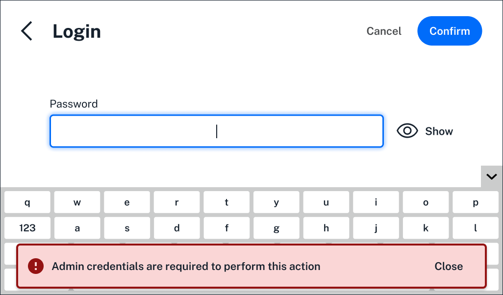

Opentrons Flex Compliance-Ready software introduces several new, irreversible features when installed on your Flex. This section covers: 

* The different user [roles](../features/features.md#roles) that can access your compliance-ready Flex and Opentrons App. 
* The types of [protocol run records](../features/records.md) a compliance-ready Flex generates.
* When and where [documentation](../features/documentation.md) is required while using your Flex. 
* Available [settings](../features/settings.md) to further customize your compliance-ready Flex.

On this page, read about roles, protocol run records, and additional features like the Flex's encryption key, optional devices, and the additional data protection compliance-ready software enables.

<!--------

TODO and comments: 
- differentiate between protocol RUN RECORDS and protocol LOG FILES. we use both and we need to be crystal clear about what the intended difference is. is a protocol run record contained in the APP or ODD and the log file is the larger .zip file that is downloaded and exported?? 
- organization note: I added the run records section to this larger page - even if these are totally separate from log files; I (so far) don't have enough to say to give this its own page.

----->

## Roles

Three kinds of users can operate your compliance-ready Flex. During software installation and activation, an Opentrons-trained representative will create accounts that fit into each role. 

| **Role** | **Permissions** | 
| :--------|---------------- |
| **Service** | <ul><li>Required for software activation</li><li>Used for maintenance, service, or to restore locked accounts</li></ul> |
| **Administrator** | <ul><li>Full system access</li><li>Can configure Flex settings and protocols</li><li>Day-to-day operation of the Flex</li></ul> |
| **User** | <ul><li>Day-to-day operation of the Flex</li></ul> |
 
During software installation, you'll be able to create multiple administrator accounts that will have full access to the Flex. These accounts can configure [settings](../features/settings.md) and the day-to-day user's experience, send verified protocols to the Flex, and view and export audit logs. 

User accounts can run verified protocols and view audit logs. By default, they won't be able to add protocols to the Flex, export audit logs, or change settings. In addition, users are blocked from completing actions that require admin credentials. 

<figure class="screenshot" markdown>
  
  <figcaption>Users can't log in to the Flex touchscreen when administrator credentials are required.</figcaption>
</figure>

One administrator account should be designated as a recovery account during software installation. Be sure to write and save these account details in a safe place in case you're ever locked out of the system. 

If your lab loses access to all administrator accounts, Opentrons offers an on-site recovery service. An Opentrons-trained representative will use a service account to restore access and preserve existing audit logs via a physical serial port.

<!--------

TODO: 
- how would all admin account access be lost? forgot password and locked after a certain amount of attempts? do we have a default number of attempts and is it customizable? 
- how many admin accounts can a lab set up? any limits anywhere? 
- confirm the differences between users and administrators, and which of these can be customized by admins (for example, the designs show actions requiring admin credentials: to update robots, to send protocols to the robot, and to SIGN protocol run records)...can they always export audit logs? is this admins only? 
- confirm whether the recovery account is a separate account or a designated admin account

----->

## Run records and files

## Encryption key

Full compliance-ready software activation requires an encryption key to confirm your Flex's identity. The key is a three-word string generated by the Flex and entered into the Opentrons App during setup. You'll also need the encryption key if the robot's certificate expires. 

To find the encryption key, click **View the robot-generated key** in your robot's settings on the Flex touchscreen or the Opentrons App. 

<figure class="screenshot" markdown>
  
  <figcaption>.</figcaption>
</figure>

Your Flex will generate a new key every 30 seconds.

<!--------

TODO: 
- link relevant sections
- insert side by side images as needed
- can you view the encryption key from the app or ODD? 
- confirm that it is "View the robot-generated key" in the build and not just designs

----->

## Devices

User actions, like setting up and running a protocol, require [documentation] on a compliance-ready Flex. To make this easier, you can use a keyboard on the Flex touchscreen or in the Opentrons App. 

<figure class="screenshot" markdown>
  
  <figcaption>.</figcaption>
</figure>

Both keyboards are available in English and in Mandarin. Change your preferred langauge in the Flex's settings. To get a better view as you type, click the arrow on the right side of the Flex touchscreen to collapse the keyboard. 

The Flex is also compatible with external keyboards via USB. When you use an external keyboard, the keyboard on the Flex touchscreen is hidden by default.

Compliance-ready Flex robots also support USB storage devices for transferring log files from the Flex to your lab's long-term storage. Connect your USB to the Flex's [front USB port]. You can read more about exporting log files [here].

<!--------

TODO: 
- link relevant sections
- insert side by side images as needed
- confirm that they keyboard is collapsible on both the Flex touchscreen and in the app
- confirm how to connect external keyboards/any compatibility issues
- link to Flex manual / System Desc / Connections / USB and auxiliary connections
----->

## Data protection

Opentrons Flex compliance-ready software includes additional features to protect data. 

### System locks 

Any action on the Flex touchscreen or connected Opentrons App requires a user login. When inactive, the touchscreen and app will lock again. Screen timeouts and other security policies can be customized in [administrator settings].

### Audit logs

Your compliance-ready Flex locally generates robot and protocol logs, including run data and user documentation. Each user action in these logs includes a cryptographically hashed timestamp.

These log files are yours, and are never viewed or stored by Opentrons. Read more about [log files] in this manual. 

<!---------

TODO: 
- the audit log sections seems weird here. maybe rework or it should go elsewhere?
- include here a section on the measures we've taken to prevent outside users interacting with the Flex: disable Jupyter and SSH access; login required for any action on the ODD/in the app, and our pyro changes to make sure only verified Python protocols are run

-------------->

