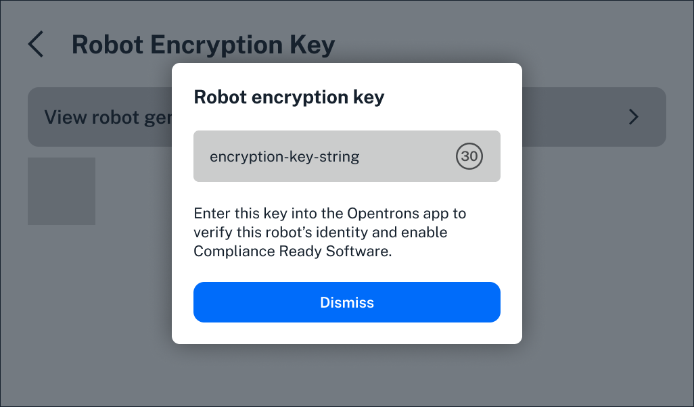

Opentrons Flex Compliance-Ready software introduces several new, irreversible features when installed on your Flex. This section covers: 

* The different user [roles](../features/features.md#roles) that can access your compliance-ready Flex and Opentrons App. 
* The types of records and files a compliance-ready Flex generates.
* When and where [documentation](../features/documentation.md) is required while using your Flex. 
* Available [settings](../features/settings.md) to further customize your compliance-ready Flex.

On this page, read about roles, records and files, and additional features like the Flex's encryption key, optional devices, and the additional data protection compliance-ready software enables.

<!--------

TODO and comments: 
- differentiate between protocol RUN RECORDS and protocol LOG FILES. we use both and we need to be crystal clear about what the intended difference is. is a protocol run record contained in the APP or ODD and the log file is the larger .zip file that is downloaded and exported?? 
- organization note: I added the run records section to this larger page - even if these are totally separate from log files; I (so far) don't have enough to say to give this its own page.

----->

## Roles

Three kinds of users can operate your compliance-ready Flex. During software installation and activation, an Opentrons-trained representative will create accounts that fit into each role. 

| **Role** | **Permissions** | 
| :--------|---------------- |
| **Service** | <ul><li>Required for software activation</li><li>Used for maintenance, service, or to restore locked accounts</li></ul> |
| **Administrator** | <ul><li>Full system access</li><li>Can configure Flex settings and protocols</li><li>Day-to-day operation of the Flex</li></ul> |
| **User** | <ul><li>Day-to-day operation of the Flex</li></ul> |
 
During software installation, you'll be able to create multiple administrator accounts that will have full access to the Flex. These accounts can configure [settings](../features/settings.md) and the day-to-day user's experience, send verified protocols to the Flex, and view and export audit logs. 

User accounts can run verified protocols and view audit logs. By default, they won't be able to add protocols to the Flex, export audit logs, or change settings. In addition, users are blocked from completing actions that require admin credentials. 

<figure class="screenshot" markdown>
  
  <figcaption>Users can't log in to the Flex touchscreen when administrator credentials are required.</figcaption>
</figure>

One administrator account should be designated as a recovery account during software installation. Be sure to write and save these account details in a safe place in case you're ever locked out of the system. 

If your lab loses access to all administrator accounts, Opentrons offers an on-site recovery service. An Opentrons-trained representative will use a service account to restore access and preserve existing audit logs via a physical serial port.

<!--------

TODO: 
- how would all admin account access be lost? forgot password and locked after a certain amount of attempts? do we have a default number of attempts and is it customizable? 
- how many admin accounts can a lab set up? any limits anywhere? 
- confirm the differences between users and administrators, and which of these can be customized by admins (for example, the designs show actions requiring admin credentials: to update robots, to send protocols to the robot, and to SIGN protocol run records)...can they always export audit logs? is this admins only? 
- confirm whether the recovery account is a separate account or a designated admin account

----->

## Run records and files

All Flex robots locally generate data files when idle, when running a protocol, or when performing robot actions like homing the gantry. [Without compliance-ready software](../../../flex/docs/advanced-operation/log-files.md), users normally don't need to access these files, but have the option to download all logs as a `.zip` file.

A compliance-ready Flex generates more files and run records to preserve audit-ready information:

* **Diagnostic files**: Logs to view calibration data or provide to Opentrons Support for troubleshooting.
* **Compliance-ready files**: Logs capturing every user action with a precise timestamp, legal name and user ID, and documentation for the action.
* **Protocol run records**: Record of every protocol run with the date and run status (completed, canceled, or failed).

These records and files are yours to store, and are never viewed or stored by Opentrons. Read more about viewing, downloading, and managing [files](../files.md) in this manual.

<!----------

TODO and comments: 
- first place I differentiate between the file types. 

----->

## Encryption key

Full compliance-ready software activation requires an encryption key to confirm your Flex's identity. The key is a three-word string generated by the Flex and entered into the Opentrons App during setup. You'll also need the encryption key if the robot's certificate expires. 

In Flex settings on the touchscreen or in the Opentrons App, first click **Robot encryption key**, then choose **View encryption key**.

<figure class="screenshot" markdown>
  
  <figcaption>The robot-generated encryption key changes every 30 seconds.</figcaption>
</figure>

Your Flex will generate a new key every 30 seconds.

<!--------

TODO: 
- any differences between app and ODD?
- can update this png myself for a more realistic encryption key later

----->

## Devices

User actions, like setting up and running a protocol, require [documentation](../features/documentation.md) on a compliance-ready Flex. To make this easier, you can use a keyboard on the Flex touchscreen or in the Opentrons App. 

<figure class="screenshot" markdown>
  
  <figcaption>Use the keyboard to enter documentation on the Flex touchscreen.</figcaption>
</figure>

Both keyboards are available in English and in Mandarin. Change your preferred langauge in the Flex's settings. Click the gray arrow on the right side of the Flex touchscreen to collapse the keyboard. 

To use a keyboard in the Opentrons App, connect an external keyboard using your Flex [front USB port](../../../flex/docs/system-description/connections.md#usb-and-auxiliary-connections). When you use an external keyboard, the keyboard on the Flex touchscreen is hidden by default

Compliance-ready Flex robots also support USB storage devices for transferring records and files from the Flex to your lab's long-term storage. Connect your USB to the Flex's [front USB port]. Read more about downloading files [here](../files.md#downloading-files).

<!--------

TODO: 
- insert side by side images if needed (for Opentrons App)
- is the keyboard collapsible in the Opentrons App? if you have an external keyboard connected?
- confirm how to connect external keyboards/any compatibility issues
----->

## Data protection

Opentrons Flex compliance-ready software includes additional features to protect and preserve your data. 

### Verified users

Any action on the Flex touchscreen or connected Opentrons App requires a user login. When inactive, the touchscreen and app will lock again. Screen timeouts and other security policies can be customized in [administrator settings](../features/settings.md).

## System lockdown

Flex features that allow access outside of the touchscreen or Opentrons App, like [Jupyter notebook](../../../flex/docs/advanced-operation/jupyter-notebook.md) and [SSH command line operation](../../../flex/docs/advanced-operation/command-line.md), are permanently disabled in compliance-ready software.

System lockdown to prevent any unauthorized use also means that Python protocols must be verified and sent to the Flex by users with permission. Only Python files that complete this process can be run on the Flex.

### Files

Your compliance-ready Flex locally generates robot and protocol logs to preserve audit-ready information. Every data point includes: 

* cryptographically hashed timestamps.
* unique electronic user IDs and signatures.

To avoid accidentally deleting these files before appropriately storing them, compliance-ready software includes two checkpoints before you'll be able to delete files.

<!---------

TODO: 
- beef up the pyro section here... after discussion with Casey and Alex next week
- make sure two checkpoints is accurate... users must 1) tap the run record or user action log, or select all 2) users must choose to delete 3) users must choose AGAIN that they'd like to delete, and choose this over an option to download

-------------->

