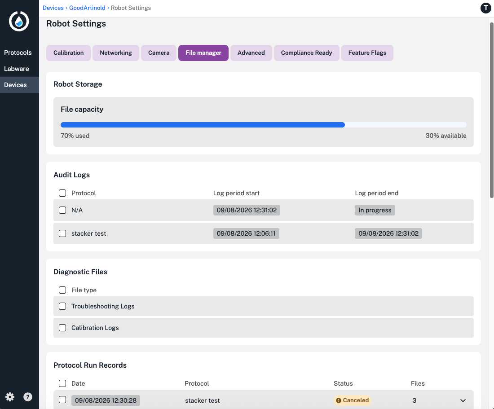
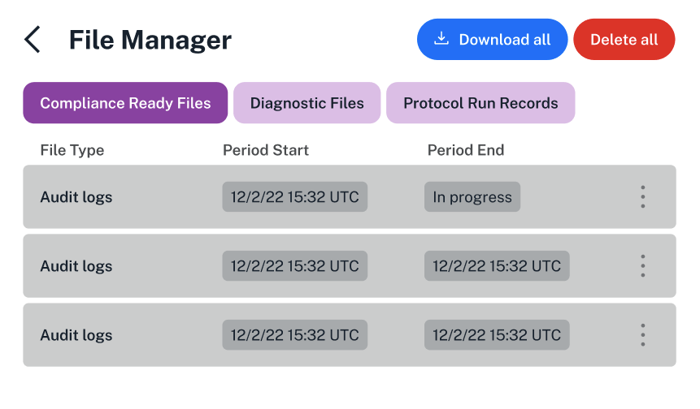
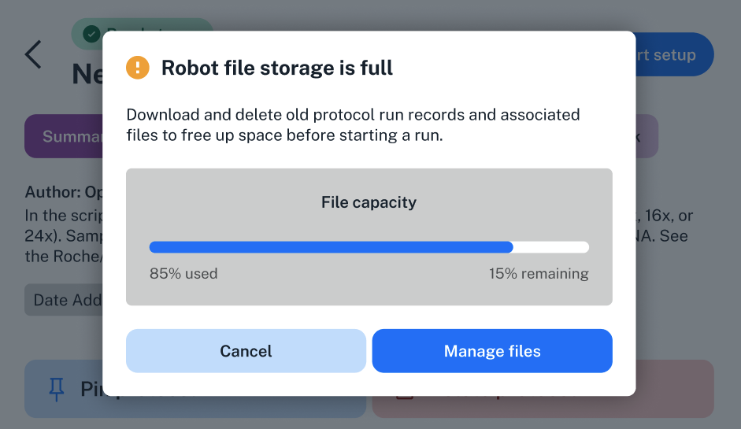
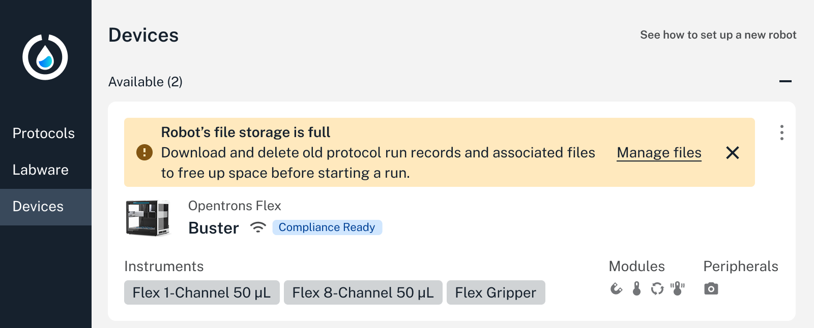
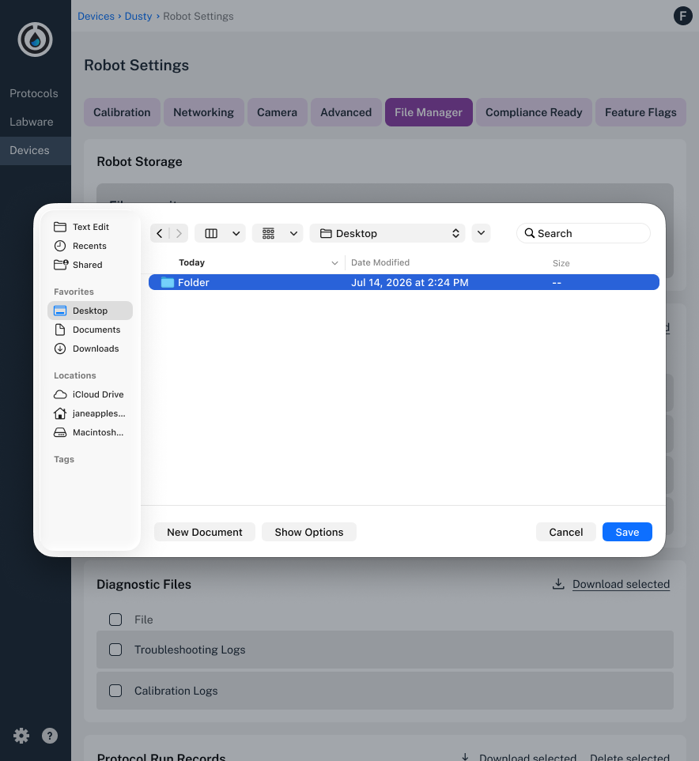
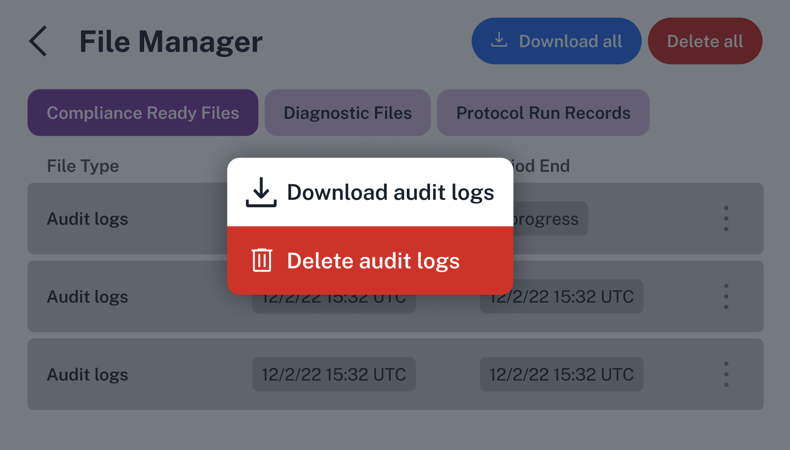
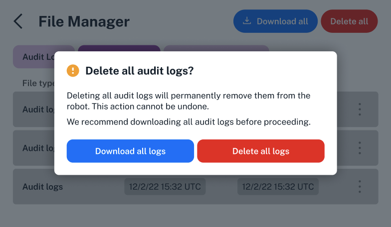
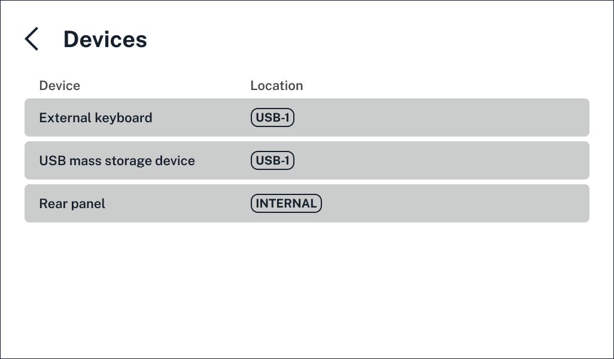

 ---
title: "Accessing files"
description: "Using the file manager to view, manage, and download files locally generated by the Flex."
---

All Flex robots locally generate files to store information about robot actions, protocols, and system downtime. Compliance Ready Software makes some key changes to these files.

This section covers the types of files on your compliance ready Flex and how to access and manage them.

<!---------
TODO and comments: 
- link to relevant section for files in the flex manual
---->

## File types

On any Flex, you can view the time and date of your recent protocol runs. Compliance Ready Software adds two specific file types, *audit logs* and *protocol run records*, to store additional user and protocol information. 

In total, your compliance ready Flex generates three types of files:

| **Type** | **Description** | 
| :--------|---------------- |
| **Audit logs** | <ul><li>Contain user actions and documentation.</li></li><li>Grouped together by a *period*, or the amount of time since your last file download.</li></ul> |
| **Diagnostic files** | <ul><li>Includes troubleshooting logs and calibration logs.</li><li>May be needed when working with Opentrons Support.</li></ul> |
| **Protocol run records** | <ul><li>Contain the name, date, and status (completed, canceled, or failed) for each protocol run.</li></ul> |

Your Flex can store all three file types for up to 20 recent protocol runs. It's your lab's responsibility to manage these files, including downloading and storing in a secure location.

<!---------

TODO and comments: 
- do we need more of an example for each?
- audit logs are .JSON files 
- how do the protocol run records and log period line up? like how do users make sure that they export the right sets of files together? what if you export the user action period and miss exporting the protocol that was included in that period? not that this is our responsibility, but I should probably talk about it?
- 20 most recent runs correct for BOTH file types? not likely? doesn't this not make sense for CRS files, as there would be more user actions for a protocol that is 200 steps vs one thats 20? 
- link italicized terms to the glossary, and somehow link diagnostic files too

---->

## Accessing files

You'll access each file type using the *file manager* in either the Opentrons App or on the Flex touchscreen.

In the Opentrons App, choose the **File manager** tab in your Flex's settings page. Here, you'll be able to see the robot's current storage capacity and available files from each category.

<figure class="screenshot" markdown>
  
  <figcaption>Access the file manager in your compliance ready Flex's setting page.</figcaption>
</figure>

On the Flex touchscreen, tap **Settings**, then choose **File Manager** from the list of options. Tap each tab to view audit logs, diagnostic files, or protocol run records.

<figure class="screenshot" markdown>
  
  <figcaption>Download audit logs from the Flex touchscreen.</figcaption>
</figure>

<!---------

TODO and comments: 
- don't love using accessing files for the overall title and an H2. is bad. coming back to this
- link italicized terms to glossary
---->

## File storage

You'll use the file manager in the Opentrons App or on the Flex touchscreen to download and delete files from your Flex.

You can choose to download these files after every run, or wait for the Flex to remind you. 

<figure class="screenshot" markdown>
  
  <figcaption>Tap to manage files on the Flex's touchscreen when storage is full.</figcaption>
</figure>

You'll see reminders in the Opentrons App or on the Flex touchscreen to download files when the Flex nears its storage capacity.

<figure class="screenshot" markdown>
  
  <figcaption>The Opentrons App includes a reminder of the Flex.</figcaption>
</figure>

While storage is full, you won't be able to send or start new protocols on the Flex.

## Download and delete files

You have the option to download files immediately after [signing](complete.md) for a protocol run, or later.

In the file manager in the Opentrons App, you can click to expand each protocol run record and see the files that are included: the `.py` protocol file, a run log, labware offset data, and any images or CSV files generated during the protocol run. 

When you're ready to download, click the check boxes on the left to select individual files of any type for download.

<figure class="screenshot" markdown>
  
  <figcaption>Select individual or all files for download.</figcaption>
</figure>

The app packages your selected files as a `.zip` file for download. You can use compliance ready [settings](admin.md) to choose a default location for file downloads from the Opentrons App, or choose a location in your computer's files each time. 

<figure class="screenshot" markdown>
  
  <figcaption>Choose a location for your files to download to.</figcaption>
</figure>

After downloading and safely storing in your lab's storage location, select files and choose **Delete selected**.

On the Flex touchscreen, choose the file type you'd like to manage. Then, choose which files to download: 

* Tap **Download all** in the top right.
* Tap the three-dot menu on the right for an individual file, then choose whether to download or delete.

<figure class="screenshot" markdown>
  
  <figcaption>Download audit logs from the Flex touchscreen.</figcaption>
</figure> 

Both the Opentrons App or Flex touchscreen, shown below, include a reminder to make sure you're ready to delete files.

<figure class="screenshot" markdown>
  
  <figcaption>Make sure all files are downloaded and safely stored before deleting.</figcaption>
</figure> 

If you'd like to download files using the Flex touchscreen, you'll need to attach an external storage device.

<figure class="screenshot" markdown>
  
  <figcaption>View attached external devices on the Flex touchscreen.</figcaption>
</figure> 

Your compliance ready Flex supports USB storage devices via the front USB port.

<!---------

TODO and comments: 
- link to USB port section of Flex manual
- shorten first image in this section; doesn't need to be this long
- repeat text about 20 most recent runs correct for BOTH file types? 
- maybe differentiate here between run history... just a list of runs and doesn't contain the same relevant information, but can still be confusing as far as download options go (it's also not in the file manager)
- AND to ticket for regular flex changes here (have an image in extra images)
- if I have text about how log periods "line up," that needs to go here...just an in general mention of log period too? 
- for now, I've cut viewing files. just going to add this entire section when we have a log viewer.
- "The app packages your selected files as a `.zip` file for download." TRUE??
- do you tap the three dot menu, or tap and hold for an individual file from the ODD? 
- you have to choose an external device from the odd? every time? 
-------------->