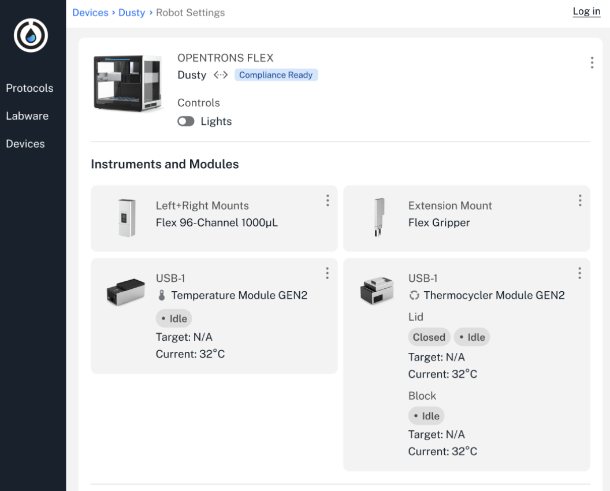
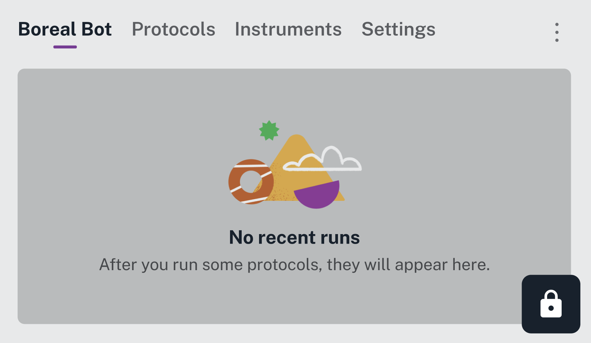

Once activated, Opentrons Flex Compliance Ready Software becomes a permanent part of your Flex robot. It fundamentally changes the day-to-day experience for users in your lab.

This section takes a look at using Compliance Ready Software, from logging in, documenting actions, and running protocols to accessing protocol files.

You'll start by logging in. Compliance Ready Software restricts access to both your Flex and the Opentrons App to prevent unauthorized access.

If your lab uses more than one Opentrons robot, you can still use the same Opentrons App to control them. You'll be blocked from completing actions, like running protocols, changing module status, or updating robot settings, for any compliance ready Flex robots. Until you're logged in, you'll only be able to view some information in the Opentrons App, like the Flex's status or list of protocols.

<figure class="screenshot" markdown>
  
  <figcaption>View your Flex's status and attached instruments, modules, and devices before login.</figcaption>
</figure>

<!---------

TODO and comments: 
- took this pre-login image from designs and updated some dummy text in figma. should double check that this isn't missing a "compliance ready" badge next to the flex's name "Dusty"
-------------->

Your Flex touchscreen will appear locked until you log in.

<figure class="screenshot" markdown>
  
  <figcaption>You'll need to log in to interact with the Flex touchscreen.</figcaption>
</figure>

Any interaction with either screen will prompt you to log in to an account. 

<figure class="screenshot" markdown>
  
  <figcaption>Log in on the Flex touchscreen using the built-in keyboard.</figcaption>
</figure>

When logged in on the Flex touchscreen or in the Opentrons App, the user's icon is displayed in the upper right. 