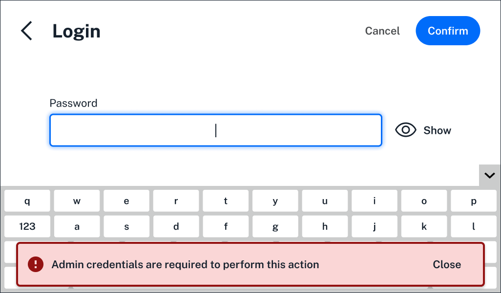

Three kinds of users can operate a compliance ready Flex. During software installation and activation, an Opentrons-trained representative will create accounts that fit into each role.

| **Role** | **Permissions** | 
| :--------|---------------- |
| **Service** | <ul><li>Required for software activation</li><li>Used for maintenance, service, or to restore locked accounts</li></ul> |
| **Administrator** | <ul><li>Full system access</li><li>Can change Flex system settings</li><li>Can add, remove, and manage protocols</li><li>Day-to-day operation of the Flex</li></ul> |
| **User** | <ul><li>Day-to-day operation of the Flex</li><li>By default, can't add, remove, or manage protocols</li></ul> |
 
Your lab can set up multiple administrator accounts that will have full access to the Flex. These accounts can configure [administrator settings](admin.md) and the day-to-day user's experience. By default, they can also send protocols to the Flex, and view and download [files](using/files.md). 

User accounts can run protocols already on the Flex and view files. By default, they won't be able to send protocols to the Flex, and they can't customize settings. In addition, users are blocked from completing actions that require administrator credentials. 

<figure class="screenshot" markdown>
  
  <figcaption>Administrator credentials are required for the action the user is logging in to complete.</figcaption>
</figure>

<!-----

TODO: need to check whether regular users are barred from downloading files and be clearer about the differences between IMPORTING a protocol to the app and SENDING IT to the Flex.

----->
## Account Recovery

Your Opentrons-trained representative will help you set up a *recovery account* with an automatically generated username and password. Be sure to save these account details in a safe place in case you're ever locked out of the system. 

All Compliance Ready Software accounts will be locked after a number of failed login attemts. An administrator can [customize](admin.md) this number. If your lab loses access to **all** administrator accounts, follow these steps: 

1. Log in using your lab's **recovery account**. This account should only be used for emergency login, never regular use.
2. Contact Opentrons for a paid, on-site *recovery service*. An Opentrons-trained representative will use a service account to restore access and preserve existing audit logs via a physical serial port.