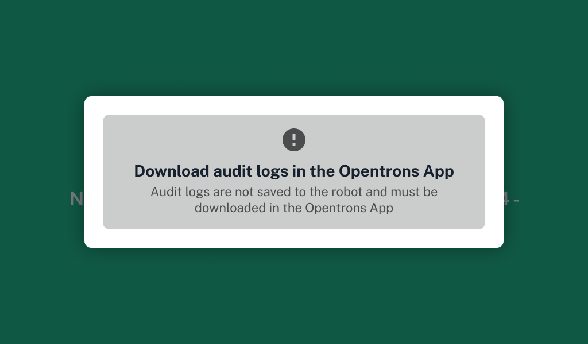
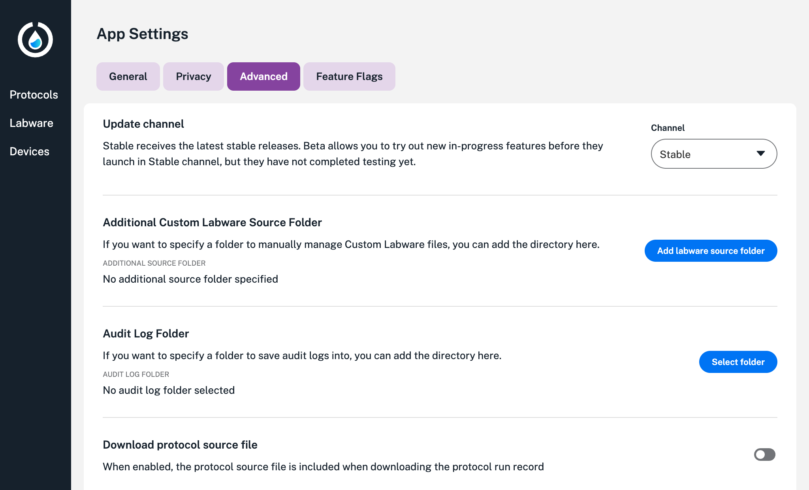

During Opentrons Flex Compliance Ready Software activation, an Opentrons-trained representative can help you change settings to customize your day-to-day experience.

Adminstrator accounts have the option to change these settings again later. For more, see the full list of [administrator settings](admin.md).

## Download files after a run

All Flex robots have a limited storage capacity for the [files](using/files.md) they generate. To save space, compliance ready Flex robots will not save audit logs to the robot by default.

This means that after each protocol run, all users will be prompted to download audit logs in the Opentrons App.

<figure class="screenshot" markdown>

<figcaption>By default, you'll need to download audit logs from the Opentrons App immediately after a protocol run.</figcaption>
</figure>

Administrators can change this setting:

1. Log in to your compliance ready Flex and click the three-dot menu on the right to access your robot's settings.
2. Select the **Compliance Ready** tab. 
3. Under **Audit log requirements**, toggle on and off the **Require downloading audit logs in the Opentrons App at the end of a protocol run** setting.
4. Document your reason for updating this setting.

## Download folder

When you require users to download audit logs from the Opentrons App, you'll can also configure the app to download all logs to a default storage location. 

<figure class="screenshot" markdown>

</figure>
<figcaption>Choose a storage location for your files.</figcaption>

Click the :material-cog: in the lower left to access **App settings**. Select the **Advanced** tab and click **Select folder** to choose a storage location from your computer's directory.

If robot settings, like your Flex's name, are ever changed, you may need to repeat this process.

!!! note
    There's more than one way to save your files. You can attach a [USB](devices.md) and move the files to a computer yourself from the Flex touchscreen.