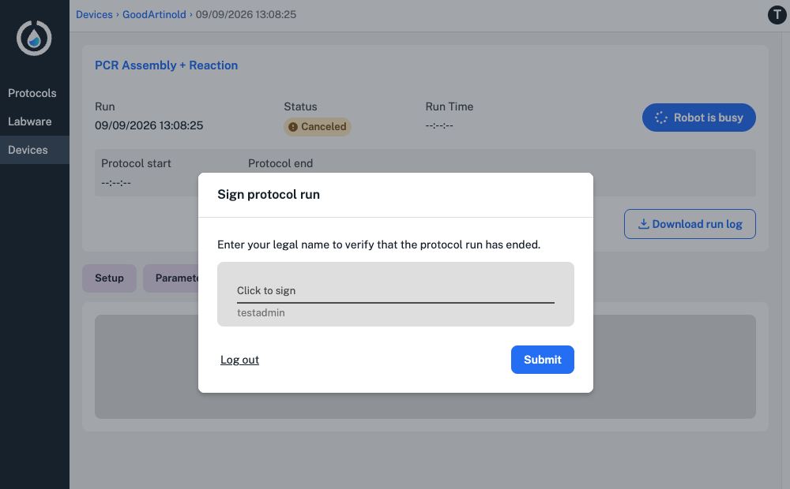

When a protocol is complete, you'll need to sign for the run in the Opentrons App or on the Flex touchscreen. Signing for a run is the final checkpoint to completing a protocol run, and adds your legal name and user ID to every user action captured for the protocol.

!!! note
    By default, only administrator accounts can sign for a protocol run in the Opentrons App. Use Compliance Ready Software settings to: 

    * Allow any user to sign for a protocol run.
    * Allow users to sign for protocol runs in either the app or on the Flex touchscreen.

<figure class="screenshot" markdown>
  
  <figcaption>Sign for a protocol run in the Opentrons App.</figcaption>
</figure>

After signing, your Flex will prompt you to download audit logs. Audit logs are [files](files.md) the Flex generates containing data like responsible users, timestamps, and documentation for every robot action. 

These files are not saved to the Flex and must be downloaded after signing for your protocol run. You'll see a prompt to download in the Opentrons App, and on the Flex touchscreen if you've chosen to download files from [both places](../settings.md#file-downloads).

<figure class="screenshot" markdown>
  
  <figcaption>Download audit logs from the Flex touchscreen.</figcaption>
</figure>

When you're finished, end your session on the Flex by swiping down on the touchscreen or clicking the account icon in the top right to log out.

You can download additional protocol files before you log out, or in your next session. 

<!---------

TODO and comments: 
- confirm that users don't need to check the view actions list before signing 
-------------->