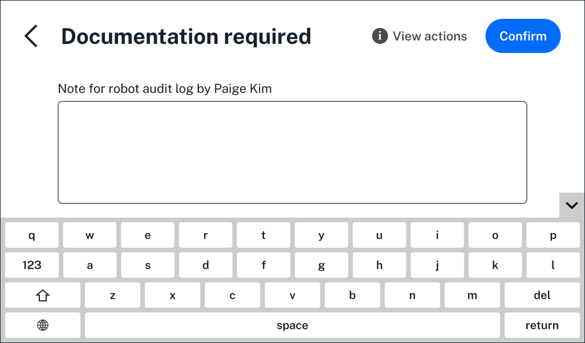
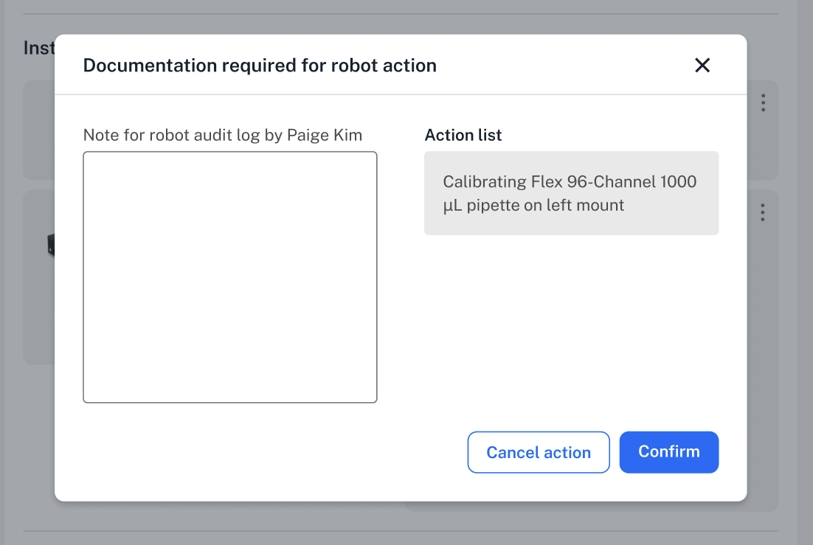
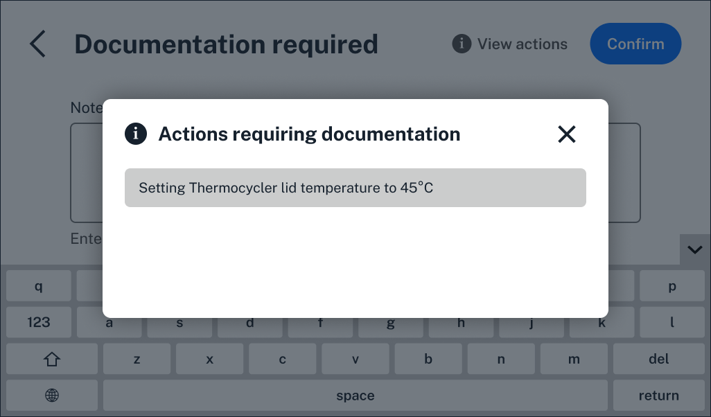

Required *documentation* is an important part of Opentrons Flex Compliance Ready Software.  Whenever administrators and users make changes to modules, set up a protocol, detach a pipette, or run a protocol, they'll need to document their reason for doing so. 

Their documentation, along with their name and user ID, become a part of the [files](files.md) your compliance ready Flex generates.

This section covers how users will add documentation. For a full list of user actions that require documentation, see the [Documented Actions](../actions.md) appendix.

!!! note
    Opentrons Flex Compliance Ready Software adds required documentation checkpoints to the Opentrons App and Flex touchscreen. Users should follow their lab's own procedures to add sufficient documentation.

## Adding documentation

Opentrons Flex Compliance Ready Software adds checkpoints to prompt all users to document nearly every robot and protocol action they complete on the robot. A "Documentation required" screen opens on both the Opentrons App and Flex touchscreen after completing actions like pipette calibration or protocol setup, and blocks users from moving forward until they've added their text.

On the Flex touchscreen, users can use the on-screen, collapsible keyboard to add text on the touchscreen.

<figure class="screenshot" markdown>
  
  <figcaption>Add documentation on the Flex touchscreen.</figcaption>
</figure>

!!! note
    The Flex touchscreen's on-screen keyboard includes features to make it easier for your lab to add documentation:

       * Tap the gray arrow on the right side to collapse the keyboard.
       * Double tap text to cut, copy, or paste.
   
    Flex also supports an [external keyboard](../devices.md), attached via USB, to type documentation.

Since documentation is required for the action, you can't bypass this screen. If you didn't mean to complete this action, you can always tap the back arrow in the upper left.

Users can also add text in the Opentrons App. Here, you'll also see a [list of actions](#viewing-actions) requiring documentation on the right. Read more in the section below.

<figure class="screenshot" markdown>
  
  <figcaption>Add documentation on the Flex touchscreen.</figcaption>
</figure>

Click **Cancel action** if you didn't mean to complete the action.

You'll see the same screen on the Flex touchscreen and in the Opentrons App every time you need to add documentation, no matter which step you're on.

When you're finished, click **Confirm** to save your text and move on.

## Viewing actions

While working on the bench, you'll see several prompts to add documentation in the same workflow. In the Opentrons App, you'll always see a list of actions requiring documentation in the same place you enter documentation.

On your Flex itself, the "Documentation required" screen fills the entire touchscreen. In case you've stepped away or simply forgot which action you started, you can tap **View Actions** in the upper right.

<figure class="screenshot" markdown>
  
  <figcaption>Add documentation on the Flex touchscreen.</figcaption>
</figure>

## Documentation Settings

Administrators can customize documentation settings in the Opentrons App. Click the three-dot menu to the right of your robot's name to access **Robot Settings**. Then, choose the **Compliance Ready** tab. Under **Audit log requirements**, administrators can update settings:  

*  **Require documentation for robot actions**: on by default.
*  **Minimum length of documentation for robot actions**: default of 20 characters.

If you choose to no longer require documentation for robot actions, the user ID for the currently logged in user will still be attached to every user action in the protocol and included in the audit log. However, the Opentrons App and Flex touchscreen will never prompt users to enter documentation. Users without appropriate credentials will still be blocked from completing certain actions and updating settings.

See the complete list of administrator-customizable [settings](../admin.md) for more.