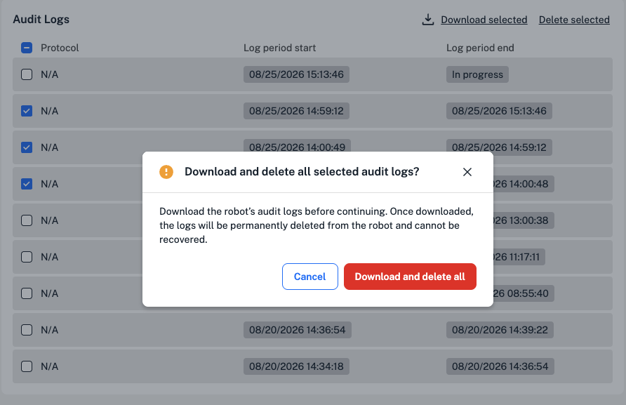

All Flex robots locally generate files to store information about robot actions, protocols, and system downtime. Compliance Ready Software makes some key changes to these files.

This section covers the types of files on your compliance ready Flex and how to access and manage them.

## File types

On any Flex, you can view the time and date of your recent protocol runs. Compliance Ready Software adds two specific file types, *audit logs* and *protocol run records*, to store additional user and protocol information. 

In total, your compliance ready Flex generates three types of files:

| **Type** | **Description** | 
| :--------|---------------- |
| **Audit logs** | <ul><li>Contain user actions and documentation.</li></li><li>Grouped together for download by a period.</li></ul> |
| **Diagnostic files** | <ul><li>Includes troubleshooting logs and calibration logs.</li><li>May be needed when working with Opentrons Support.</li></ul> |
| **Protocol run records** | <ul><li>Contain the name, date, and status (completed, canceled, or failed) for each protocol run.</li><li>By default, automatically deleted when the maximum of 20 run records are stored on the Flex.</li></ul> |

Flex generates a protocol run record for each individual protocol run. If you run a PCR protocol 10 times, you'll have 10 different protocol run records. 

Audit logs are grouped in a *period*. Log periods end after the Flex completes each protocol run or whenever the Flex boots, like after a robot software update.

The files your Flex generates are never viewed or stored by Opentrons. It's your lab's responsibility to manage these files, including downloading and storing in a secure location.

## File manager

You'll access each file type using the *file manager* in either the Opentrons App or on the Flex touchscreen.

In the Opentrons App, select the **File manager** tab in your Flex's robot settings page. Here, you'll be able to see the robot's current storage capacity and available files from each category.

<figure class="screenshot" markdown>
  
  <figcaption>Access the file manager in your compliance ready Flex's setting page.</figcaption>
</figure>

On the Flex touchscreen, tap **Settings**, then choose **File Manager** from the list of options. Select each tab to view audit logs, diagnostic files, or protocol run records.

<figure class="screenshot" markdown>
  
  <figcaption>Download audit logs from the Flex touchscreen.</figcaption>
</figure>

## File storage

You'll use the file manager in the Opentrons App or on the Flex touchscreen to download and delete files from your Flex.

By default, the Flex doesn't store audit logs locally—you'll need to download them from the Opentrons App after each run to save space. Administrators can change this [setting](../settings.md#download-files-after-a-run).

You can also choose to download protocol run records and diagnostic files after every run, or wait for the Flex to remind you. 

<figure class="screenshot" markdown>
  
  <figcaption>Tap to manage files on the Flex's touchscreen when storage is full.</figcaption>
</figure>

You'll see reminders on the Flex touchscreen and in the Opentrons App to download files when the Flex nears its storage capacity.

<figure class="screenshot" markdown>
  
  <figcaption>The Opentrons App includes a reminder of the Flex's storage.</figcaption>
</figure>

While storage is full, you won't be able to send or start new protocols on your Flex.

## Download and delete files

All users can download files, including audit logs, from your compliance ready Flex, even before logging in to Compliance Ready Software. However, you'll need to log in to delete files. Only administrators can delete files.

Your files download as: 

* **Audit logs**: A folder for each download, containing a `.zip` file with .JSON files for each log period.
* **Diagnostic files**: An individual .JSON file for calibration logs or a `.zip` file for troubleshooting logs.
* **Protocol run records**: A `.zip` file for each run record.

By default, protocol run records are automatically deleted when the Flex's storage reaches its maximum of 20 run records. Administrators can change this [setting](../admin.md).

This section takes a look at downloading and deleting files in the Opentrons App and on the Flex touchscreen.

### Opentrons App

In the file manager in the Opentrons App, click the check boxes for individual files in each section. Then, click at the top of each section to **Download selected** or **Delete selected**. Deleting files is irreversible, so the Opentrons App includes a reminder before you start.

<figure class="screenshot" markdown>
  
  <figcaption>Download and delete selected audit logs.</figcaption>
</figure>

In the app's file manager, you can also click the arrow on the right to expand each protocol run record and see the files that are included: 

* the Python protocol file. 
* A protocol run log. 
* Labware offset data.
* Any images or CSV files generated during the protocol run.

You can use compliance ready [settings](../admin.md) to choose a default location for file downloads from the Opentrons App, or choose a location in your computer's files each time. 

<figure class="screenshot" markdown>
  
  <figcaption>Choose a location for your files to download to.</figcaption>
</figure>

### Flex touchscreen

If you'd like to download files using the Flex touchscreen, you'll need to attach an external storage device.

<figure class="screenshot" markdown>
  
  <figcaption>View attached external devices on the Flex touchscreen.</figcaption>
</figure> 

Your compliance ready Flex supports USB storage devices via the [front USB port](../../flex/system-description/connections.md#usb-and-auxiliary-connections).

On the Flex touchscreen, choose the file type you'd like to manage. Then, choose which files to download: 

* Tap **Download all** in the top right.
* Tap the three-dot menu on the right for an individual file, then choose whether to download or delete.

<figure class="screenshot" markdown>
  
  <figcaption>Download audit logs from the Flex touchscreen.</figcaption>
</figure> 

!!! note
     Remember that by default, your Flex does not store audit logs locally to save space. Administrators can update this [setting](../settings.md#download-files-after-a-run) to download these files from the Flex touchscreen.

Like the Opentrons App, the Flex touchscreen includes a reminder to make sure you're ready to delete files.

<figure class="screenshot" markdown>
  
  <figcaption>Make sure all files are downloaded and safely stored before deleting.</figcaption>
</figure> 