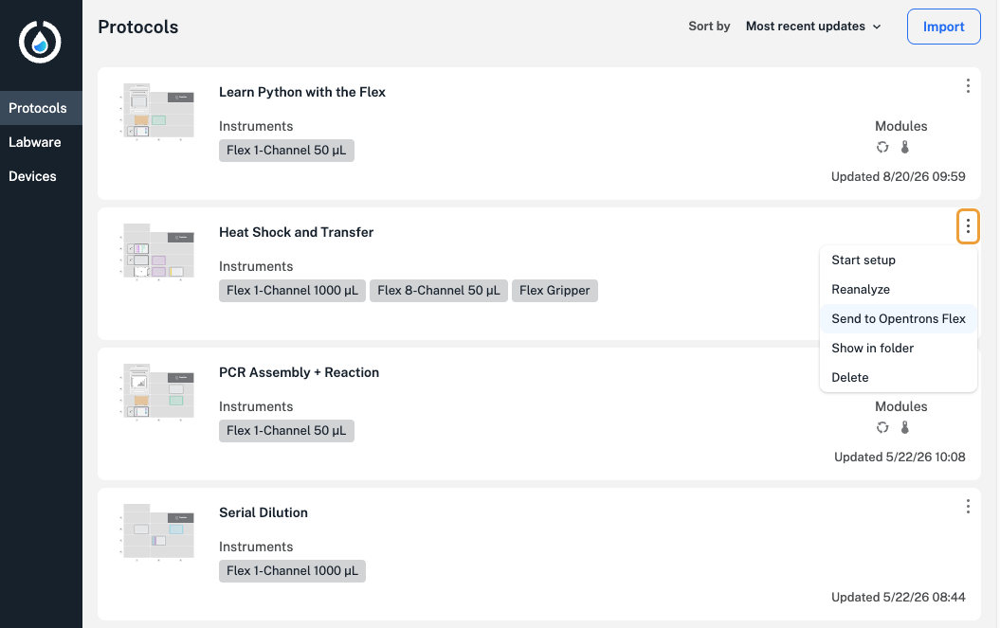
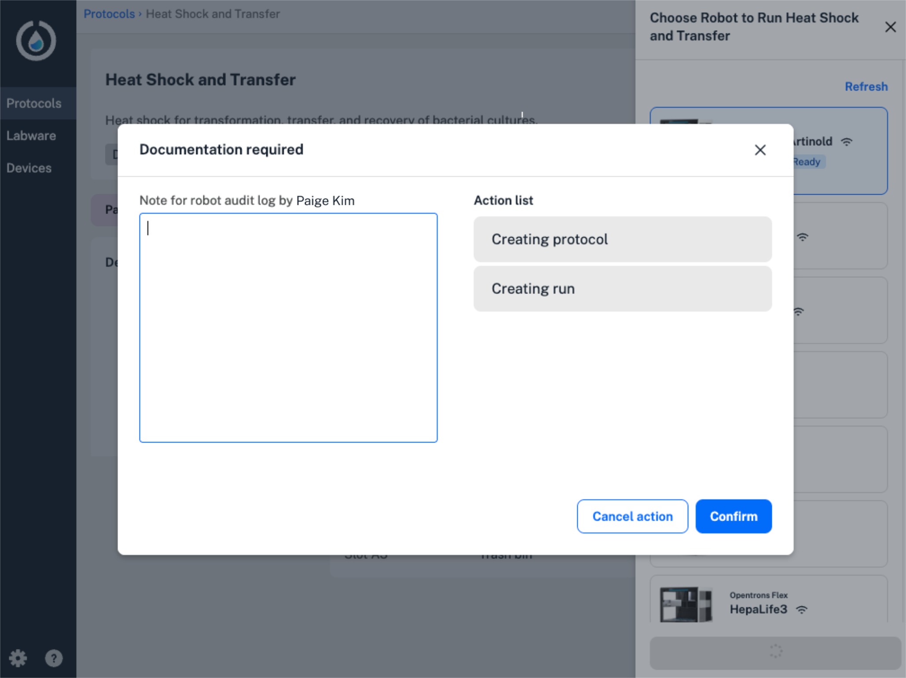
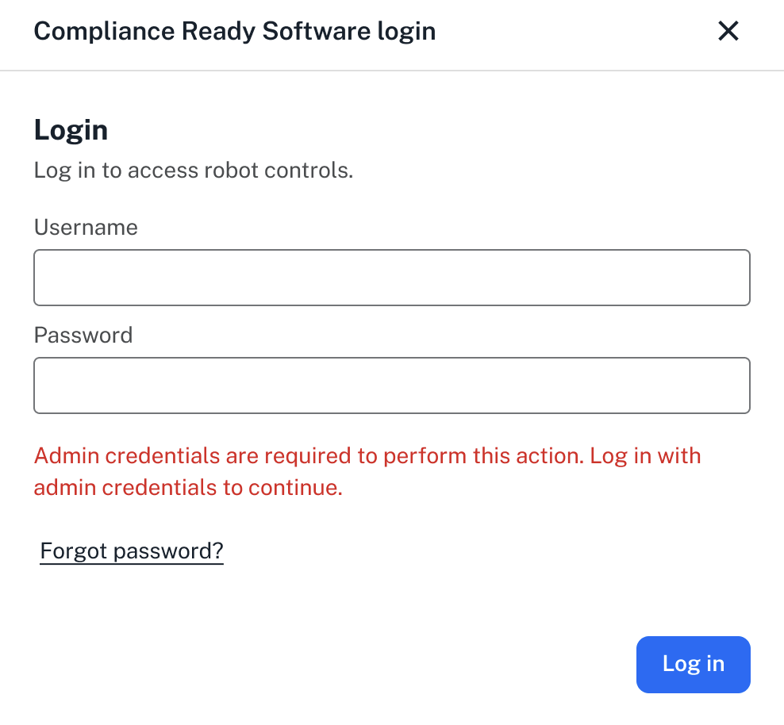
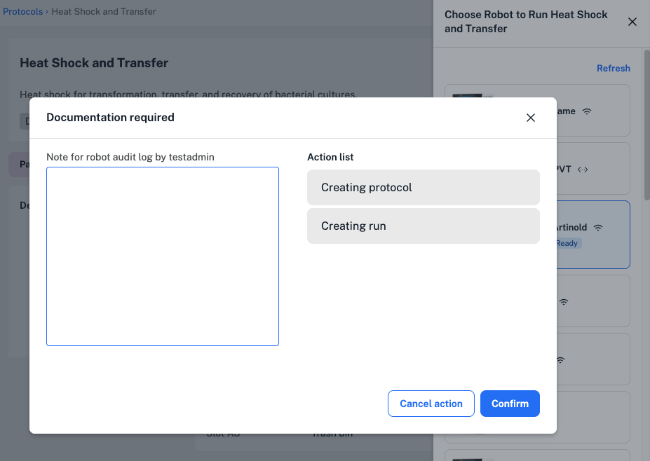
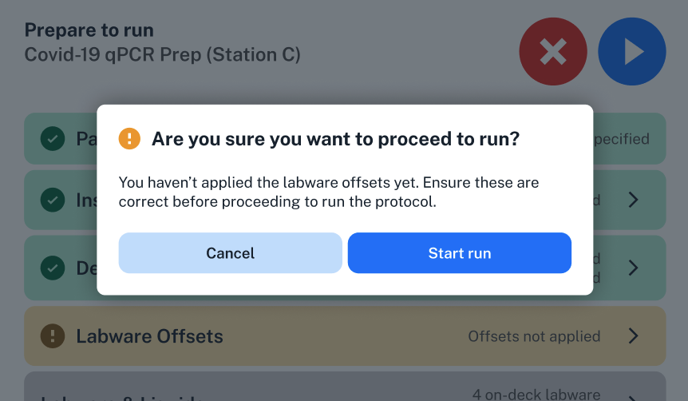
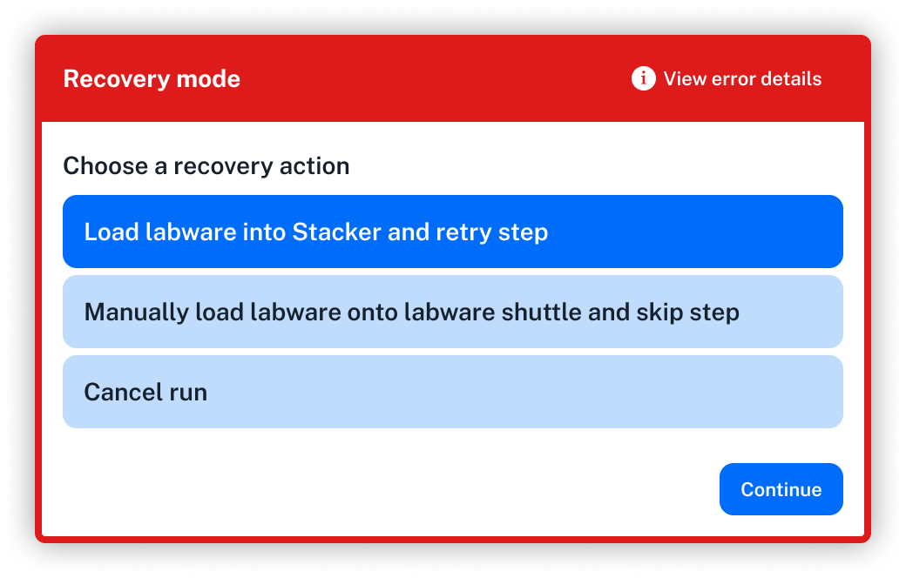

Opentrons Flex Compliance Ready Software requires users to document their reason for setting up and running protocols, including completing steps like error recovery during a protocol run.

This section includes examples that users might see while using a compliance ready Flex. For a full list of user actions that require documentation, see the [Documented Actions](../actions.md) appendix.

## Sending protocols

By default, users can only run protocols sent to your compliance ready Flex by an administrator. 
 
Any user can import any valid Python protocol into the Opentrons App, and they'll appear in the **Protocols** tab on the left. There are two ways to send one of these protocols to your Flex: 

* Click the three-dot menu on any protocol card and select **Send to Opentrons Flex**. 
* Click the protocol, then choose **Start setup** and your compliance ready Flex. 

<figure class="screenshot" markdown>
  
  <figcaption>Click to send a protocol to your compliance ready Flex.</figcaption>
</figure>

For either method, the Opentrons App will prompt administrators to document their reason for sending the protocol to the Flex. 

<figure class="screenshot" markdown>
  
  <figcaption>Click to send a protocol to your compliance ready Flex.</figcaption>
</figure>

Since users can't send protocols to the Flex by default, their accounts will be blocked from sending a protocol using either method.

<figure class="screenshot" markdown>
  
  <figcaption>By default, users are blocked from sending protocols to the Flex.</figcaption>
</figure>

Administrators can change this setting to allow users to send protocols to your compliance ready Flex: 

1. Log in to Compliance Ready Software in the Opentrons App. 
2. Use the three-dot menu at the right to access robot settings for your Flex. 
3. Select the **Compliance Ready** tab. 
4. Under **Actions requiring admin credentials**, toggle the **Require admin credentials to send protocols to this robot** setting.

!!! note
    Because Compliance Ready Software limits protocol runs to those chosen by verified users, [Quick Transfer protocols] are disabled on your compliance ready Flex.

## Setting up a protocol

After logging in on the Flex touchscreen or in the Opentrons App, you'll be able to start setting up a protocol.

Click or tap the **Protocols** tab to view all protocols loaded on the Flex. Remember that by default, your compliance ready Flex can only run Python protocols [sent to the Flex](#sending-protocols) by an administrator.

After choosing any runtime parameters and clicking **Start setup**, your Flex will prompt you to document your reason for setting up the protocol.

<figure class="screenshot" markdown>
  
  <figcaption>Add documentation before beginning protocol setup.</figcaption>
</figure>

You'll need to continue adding documentation at several points during protocol setup, including:

* Attaching, detaching, or calibrating pipettes or hardware, like modules.
* Updating or confirming deck placements, including labware and liquids.
* Changing a module's state, like opening a labware latch or setting temperature.
* Applying [labware offsets](../../flex/touchscreen/protocol-setup.md#labware-offsets) or starting a Labware Position Check.
* Updating protocol run settings, like camera and image preferences.

Although you can begin a protocol run on the Flex before some setup steps are complete, you'll need to document your reason for doing so. 

<figure class="screenshot" markdown>
  
  <figcaption>Your Flex includes a warning before running a protocol without applying labware offsets.</figcaption>
</figure>

In this example, you can still begin the protocol run. You'll see a warning on the Flex touchscreen and, if you tap **Start run**, you'll need to document a separate action—starting the run without applying labware offsets. 

If you need to make changes to the Flex or an attached instrument or module before you begin setup, you'll also need to add documentation for those actions. 

## Running a protocol

When you're finished setting up your protocol, tap **Start run** in the top right to begin. You'll need to document your reason for every action:

* Beginning or canceling a protocol run.
* Pausing the protocol.
* Completing a manual action, like moving labware, during a protocol.
* Tapping **Capture image** during the protocol.
* Starting and completing error recovery during a protocol run.

Your Flex won't complete actions like these until you enter documentation. For example, if you need to pause your protocol, the Flex will only pause after you click **Confirm** on the "Documentation required" screen. 

Remember that you can use the [Emergency Stop Pendant] to quickly stop all robot motion, but that this action will cancel your current protocol run. You'll be required to document your reason for using the E-stop, and you won't be able to resume the protocol.  

In some cases, you'll be prompted to document multiple actions after they occur, like in error recovery or robot calibration. 

First, the Opentrons App or Flex touchscreen will prompt you to add documentation when you choose from the available recovery actions:

* Start or complete [error recovery](../../flex/touchscreen/protocol-run.md#error-recovery).
* Retry or skip the step causing the error. 
* Cancel the protocol run.

As you complete multi-step actions like pipette calibration, Labware Position Check, or error recovery, the [list of actions](documentation.md#view-actions) can be cumulative—on a single screen, you might be prompted to add documentation for starting error recovery, choosing to retry the step, and successfully completing error recovery.

<figure class="screenshot" markdown>
  
  <figcaption>You'll need to add documentation during error recovery.</figcaption>
</figure>