# Modules

Opentrons Flex integrates with a number of Opentrons hardware modules. All modules are peripherals that occupy deck slots, and most are controlled by the robot over a USB connection.

This chapter describes the functions and physical specifications of modules that are compatible with the Opentrons Flex system, as well as how to attach and calibrate them. For further details on module setup and use, consult the manuals for the individual modules. For details on integrating modules into your protocols, see the [Protocol Designer section][protocol-designer] of the Protocol Development chapter or the online [Python Protocol API documentation](https://docs.opentrons.com/v2/).

## Supported modules

Opentrons Flex is compatible with four types of on-deck Opentrons modules:

- The **Heater-Shaker Module** provides on-deck heating and orbital shaking. The module can be heated to 95 °C, and can shake samples from 200 to 3000 rpm.

- The **Magnetic Block** is a passive device that holds labware close to its high-strength neodymium magnets. The OT-2 Magnetic Module GEN1 and GEN2, which actively move their magnets up and down relative to labware, are not supported on Opentrons Flex.

- The **Temperature Module** is a hot and cold plate module that is able to maintain steady state temperatures between 4 and 95 °C.

- The **Thermocycler Module** provides on-deck, fully automated thermocycling, enabling automation of upstream and downstream workflow steps. Thermocycler GEN2 is fully compatible with the gripper. Thermocycler GEN1 cannot be used with the gripper, and is therefore not supported on Opentrons Flex.

Some modules originally designed for the OT-2 are compatible with Flex, as summarized in the table below. A checkmark indicates compatibility, and an X indicates incompatibility.

| Device type and generation      | OT-2 | Flex |
|---------------------------------|:----:|:----:|
| Heater-Shaker Module GEN1       |  ✓   |  ✓   |
| Magnetic Module GEN1            |  ✓   |  ×   |
| Magnetic Module GEN2            |  ✓   |  ×   |
| Magnetic Block GEN1             |  ×   |  ✓   |
| Temperature Module GEN1         |  ✓   |  ×   |
| Temperature Module GEN2         |  ✓   |  ✓   |
| Thermocycler Module GEN1        |  ✓   |  ×   |
| Thermocycler Module GEN2        |  ✓   |  ✓   |
| HEPA Module                     |  ✓   |  ×   |

## Module caddy system

Compatible modules are designed to fit into caddies that occupy space below the deck. This system allows labware on top of modules to remain closer to the deck surface, and it also allows for below-deck cable routing so the deck stays tidy during your protocol runs.

<figure class="side-by-side" markdown>
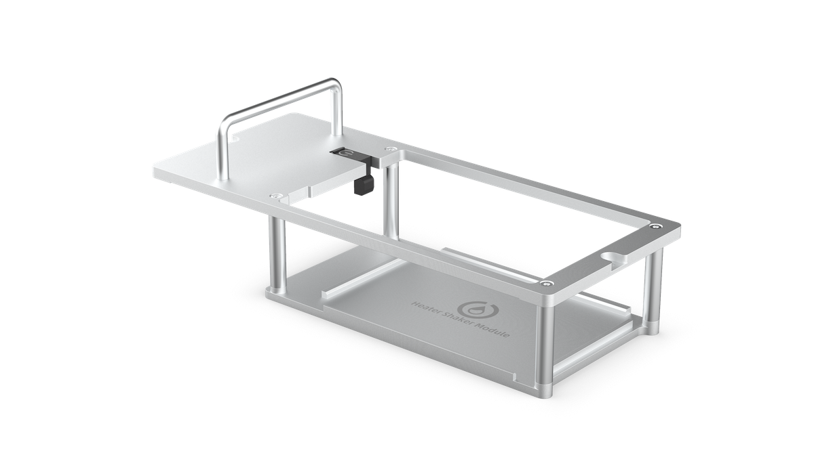
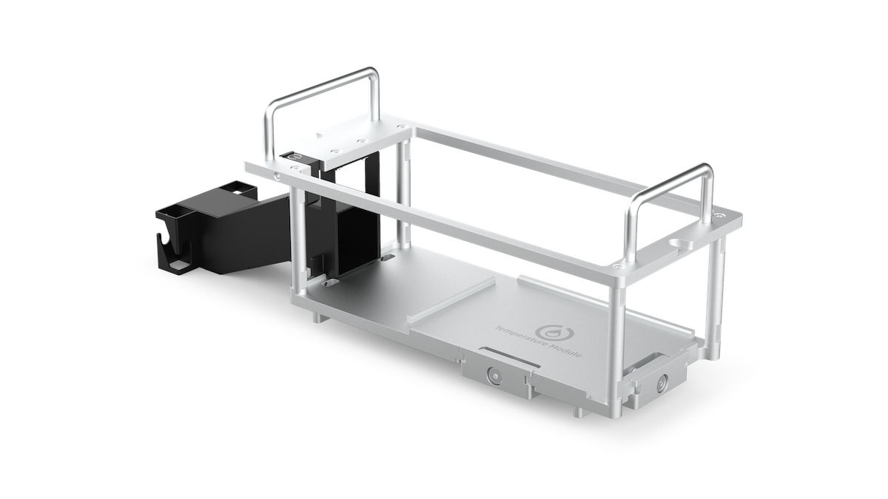
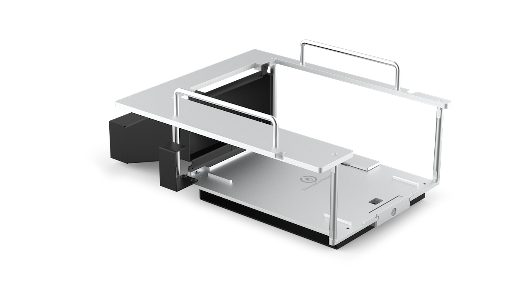
<figcaption>
Caddies for the Heater-Shaker, Temperature, and Thermocycler Modules.
</figcaption>
</figure>

To fit a module into the deck surface, it must first be placed into the corresponding module caddy. Each type of compatible module has its own caddy design that aligns the module and labware precisely with the surrounding deck. (The exception is the Magnetic Block, which does not require power or USB cable routing and thus sits directly on the deck surface.) Caddies for modules that occupy a single slot can be placed anywhere in column 1 or 3; the Thermocycler can only be placed in slots A1 and B1 simultaneously.

In general, to install a module caddy:

1.  Remove any deck slots from the location where the module will go.

2.  Seat the module into its caddy and tighten its anchors.

3.  Route the module power and USB cables through the side covers, up through the empty deck slot, and attach them to the module.

4.  Seat the module caddy into the slot and screw it into place.

For exact installation instructions, consult the Quickstart Guide or Instruction Manual for the specific module. Cable connections and method of attachment to the caddy vary by module.

## Module calibration

When you first install a module on Flex, you need to run automated positional calibration. This process is similar to positional calibration for instruments, and ensures that Flex moves to the exact correct locations for optimal protocol performance. During calibration, Flex will move to locations on a module calibration adapter, which looks similar to the calibration squares that are part of removable deck slots.

<figure class="side-by-side" markdown>
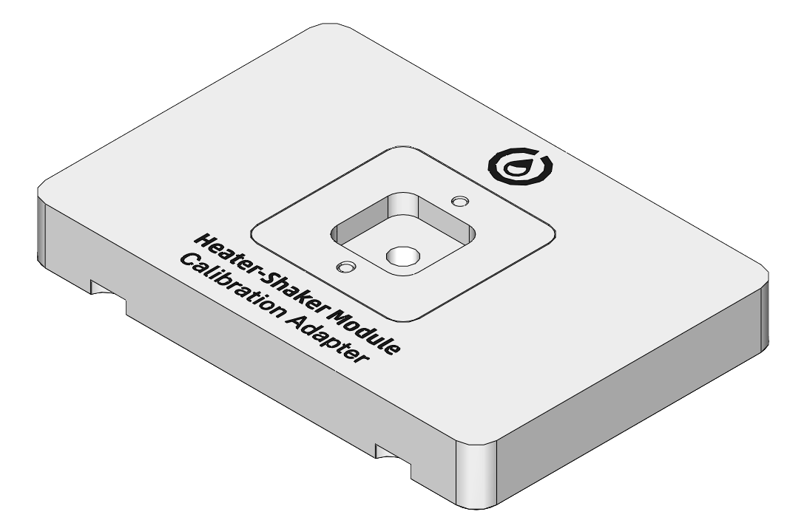
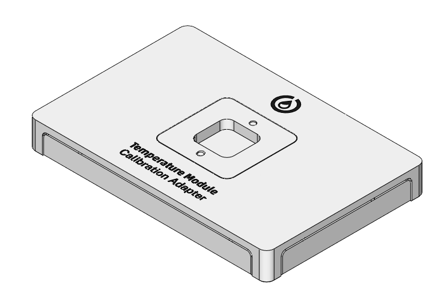
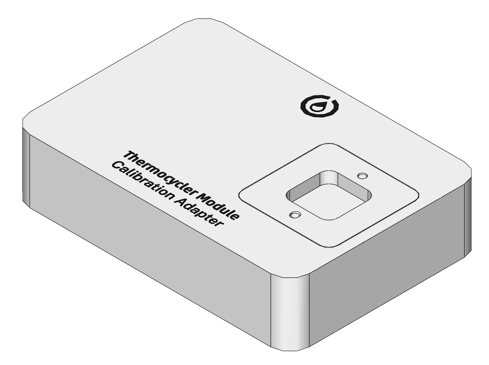
<figcaption>
Calibration adapters for the Heater-Shaker, Temperature, and
Thermocycler Modules.
</figcaption>
</figure>

Module calibration is required for all modules that install via a caddy: the Heater-Shaker, Temperature, and Thermocycler Modules. The Magnetic Block doesn't require calibration, and is ready for use as soon as you place it on the deck.

### When to calibrate modules

Flex automatically prompts you to perform calibration when you connect and power on a module that doesn't have any stored calibration data. (You can dismiss this prompt, but you won't be able to run protocols with the module until you calibrate it.)

Once you've completed calibration, Flex stores the calibration data and module serial number for future use. Flex won't prompt you to recalibrate unless you delete the calibration data for that module in the robot settings. You can freely power your module on and off, or even move it to another deck slot, without needing to recalibrate. If you want to recalibrate, you can begin the process at any time from the module card in the Opentrons App. (Recalibration is not available from the touchscreen.)

### How to calibrate modules

Instructions on the touchscreen or in the Opentrons App will guide you through the calibration procedure. In general the steps are:

1.  Gather the required equipment, including the module calibration adapter and pipette calibration probe.

2.  Place the calibration adapter on the module surface and ensure that it is completely level. Some modules may require you to fasten the adapter to the module.

3.  Attach the calibration probe to a pipette.

4.  Flex will automatically move to touch certain points on the calibration adapter and save these calibration values for future use.

Once calibration is complete and you've removed the adapter and probe, the module will be ready for use in protocols.

At any time, you can view and manage your module calibration data in the Opentrons App. Go to **Robot Settings** for your Flex and click on the **Calibration** tab.

## Heater-Shaker Module GEN1

### Heater-Shaker features

#### Heating and shaking

The Heater-Shaker provides on-deck heating and orbital shaking. The
module can be heated to 95 °C, with the following temperature profile:

- Temperature range: 37–95 °C

- Temperature accuracy: ±0.5 °C at 55 °C

- Temperature uniformity: ±0.5 °C at 55 °C

- Ramp rate: 10 °C/min

The module can shake samples from 200 to 3000 rpm, with the following
shaking profile:

- Orbital diameter: 2.0 mm

- Orbital direction: Clockwise

- Speed range: 200–3000 rpm

- Speed accuracy: ±25 rpm

The module has a powered labware latch for securing plates to the module
prior to shaking.

#### Thermal adapters

A compatible thermal adapter is required for adding labware to the Heater-Shaker. Currently available Thermal Adapters include:

<figure markdown>
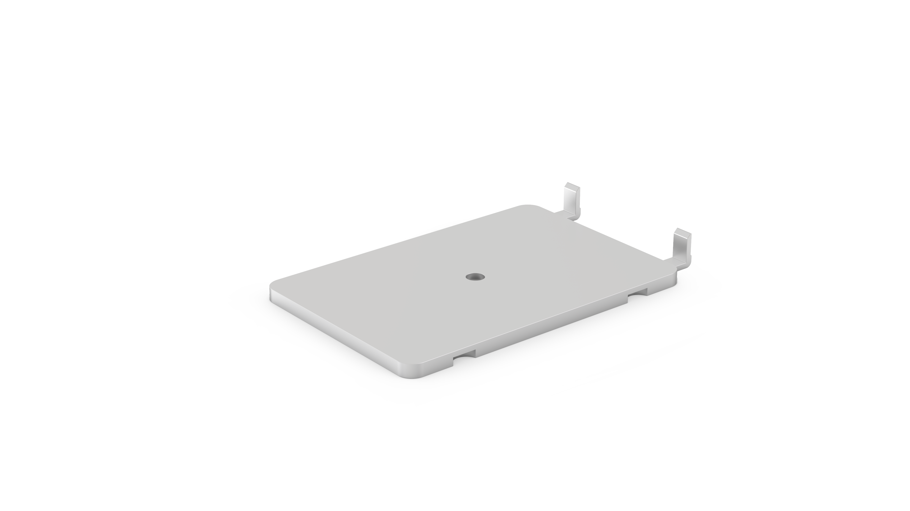
<figcaption>Universal Flat Adapter </figcaption>
</figure>

<figure markdown>

<figcaption>PCR Adapter</figcaption>
</figure>

<figure markdown>
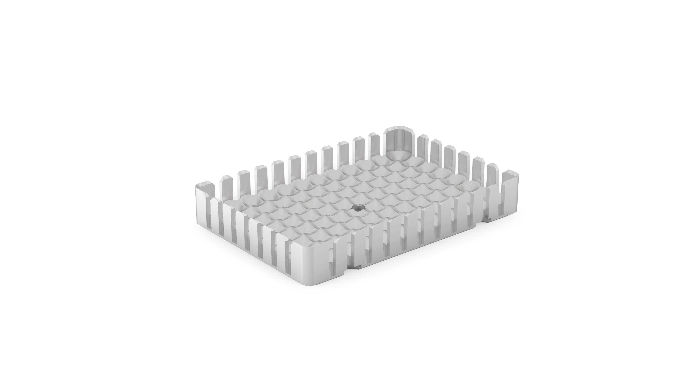
<figcaption>Deep Well Adapter</figcaption>
</figure>

<figure markdown>

<figcaption>96 Flat Bottom Adapter</figcaption>
</figure>

You can purchase adapters directly from Opentrons:

- [Universal Flat Adapter](https://opentrons.com/products/universal-flat-adapter/)
- [PCR Adapter](https://opentrons.com/products/pcr-adapter/)
- [Deep Well Adapter](https://opentrons.com/products/deep-well-adapter/)
- [96 Flat Bottom Adapter](https://opentrons.com/products/96-flat-bottom-adapter/)

#### Software control

The Heater-Shaker is fully programmable in Protocol Designer and the Python Protocol API. The Python API additionally allows for other protocol steps to be performed in parallel while the Heater-Shaker is active. See [Non-blocking commands](https://docs.opentrons.com/v2/modules/heater_shaker.html#non-blocking-commands) in the API documentation for details on adding parallel steps to your protocols.

Outside of protocols, the Opentrons App can display the current status of the Heater-Shaker and can directly control the heater, shaker, and labware latch.

### Heater-Shaker specifcations

| **Specification**               | **Details**  |
|---------------------------------|--------------|
| **Dimensions**                  | 152 × 90 × 82 mm (L/W/H)                                                   |
| **Weight**                      | 1.34 kg                                                                    |
| **Module power input**          | 36 VDC, 6.1 A                                                              |
| **Power adapter input**         | 100–240 VAC, 50/60 Hz                                                      |
| **Mains supply voltage fluctuation** | ±10%                                                                  |
| **Overvoltage**                 | Category II                                                                |
| **Power consumption**           | Idle: 3 W Typical: <ul><li>Shaking: 4–11 W</li><li>Heating: 10–30 W</li><li>Heating and shaking: 10–40 W</li></ul>Maximum: 125–130 W |
| **Environmental conditions**    | Indoor use only                                                            |
| **Ambient temperature**         | 20–25 °C                                                                   |
| **Relative humidity**           | Up to 80%, non-condensing                                                  |
| **Altitude**                    | Up to 2,000 m above sea level                                              |
| **Pollution degree**            | 2                                                                          |

## Magnetic Block GEN1
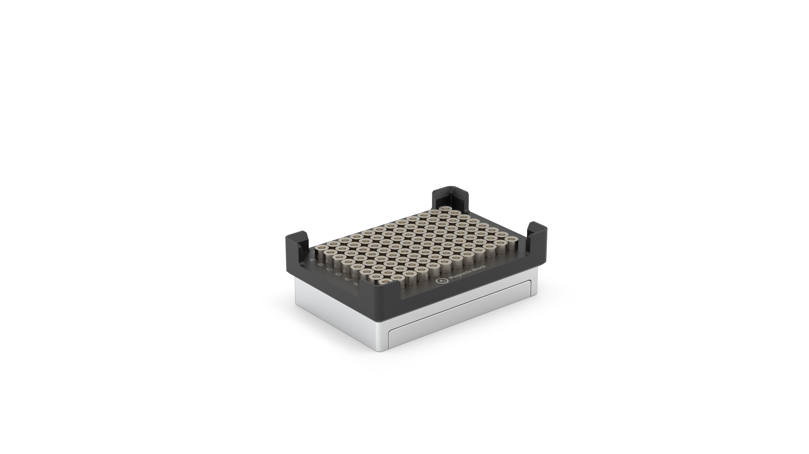

### Magnetic Block features

The Opentrons Magnetic Block GEN1 is a magnetic 96-well plate holder. Magnetic blocks are used in protocols that rely on magnetism to pull particles out of suspension and retain them in well plates during wash, rinse, or other elution procedures. For example, automated NGS preparation; purifying genomic and mitochondrial DNA, RNA, or proteins; and other extraction procedures are all use cases that can involve magnetic blocks.

#### Magnetic components

The Magnetic Block is unpowered, does not contain any electronic components, and does not move magnetic beads up or down in solution. The wells consist of 96 high-strength neodymium ring magnets fixed to a spring-loaded bed, which helps maintain tolerances between the block and pipettes while running automated protocols.

#### Software control

The Magnetic Block GEN1 is fully programmable in Protocol Designer and the Python Protocol API.

Outside of protocols, however, the touchscreen and the Opentrons App *are not* aware of and *cannot* display the current status of the Magnetic Block GEN1. This is an unpowered module. It does not contain electronic or mechanical components that can communicate with the Flex robot. You "control" the Magnetic Block via protocols that use the Opentrons Flex Gripper to add and remove labware from this module.

### Magnetic Block specifications

| **Specification**       | **Details**                     |
|--------------------------|---------------------------------|
| **Dimensions**           | 136 × 94 × 45 mm (L/W/H)       |
| **Weight**               | 1.13 kg                        |
| **Module power**         | None, module is unpowered      |
| **Magnet grade**         | N52 neodymium                  |
| **Environmental conditions** | Indoor use only           |
| **Ambient temperature**  | 20–25 °C                       |
| **Relative humidity**    | 30–80%, non-condensing         |
| **Altitude**             | Up to 2000 m above sea level   |
| **Pollution degree**     | 2                              |

## Temperature Module GEN2

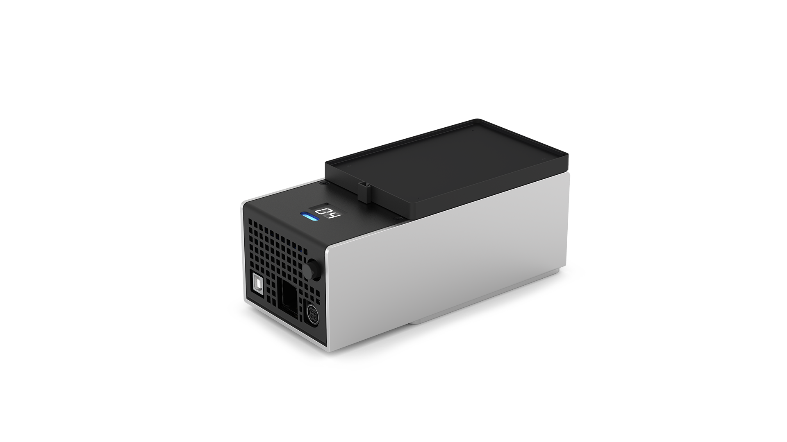

### Temperature Module features

#### Heating and cooling

The Opentrons Temperature Module GEN2 is a hot and cold plate module. It is often used in protocols that require heating, cooling, or temperature changes. The module can reach and maintain temperatures ranging from 4 °C to 95 °C within minutes, depending on the module's configuration and contents.

#### Thermal blocks

To hold labware at temperature, the module uses aluminum thermal blocks. The module comes with 24- well and 96-well thermal blocks. The Temperature Module caddy comes with a deep well block and a flat bottom block designed for use with the Flex Gripper. The blocks hold 1.5 mL and 2.0 mL tubes, 96-well PCR plates, PCR strips, deep well plates, and flat bottom plates.

!!! note
    Note: The module also ships with a flat bottom block for the OT-2. Do not use the OT-2 block with Flex. The flat bottom block for Flex has the words “Opentrons Flex” on its top surface. The one for OT-2 does not.

<figure markdown>
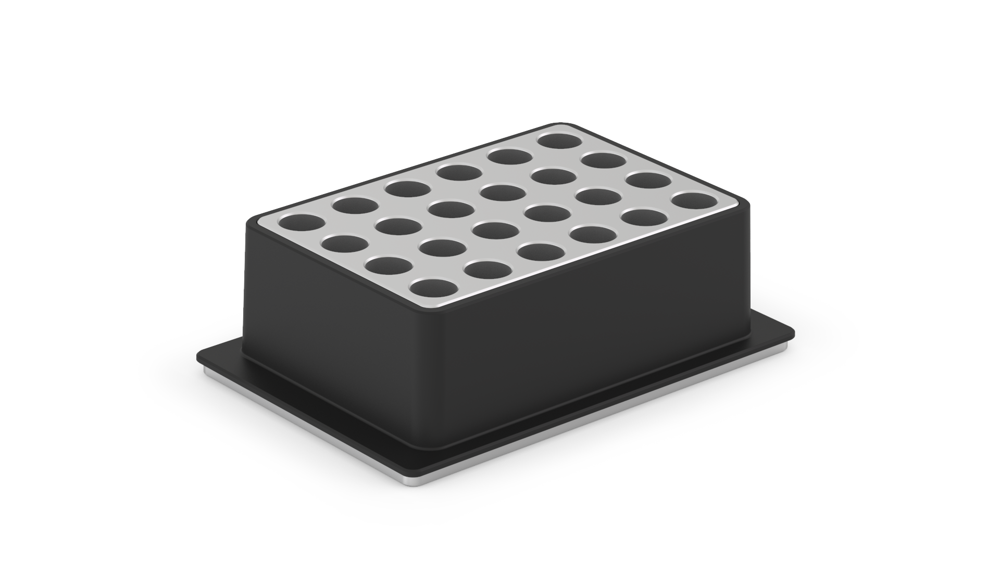
<figcaption>24-well thermal block </figcaption>
</figure>

<figure markdown>
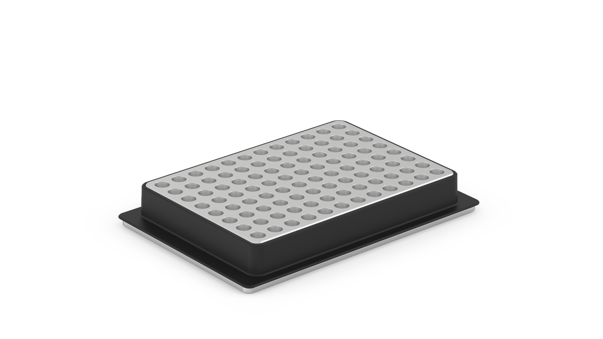
<figcaption>96-well thermal block</figcaption>
</figure>

<figure markdown>
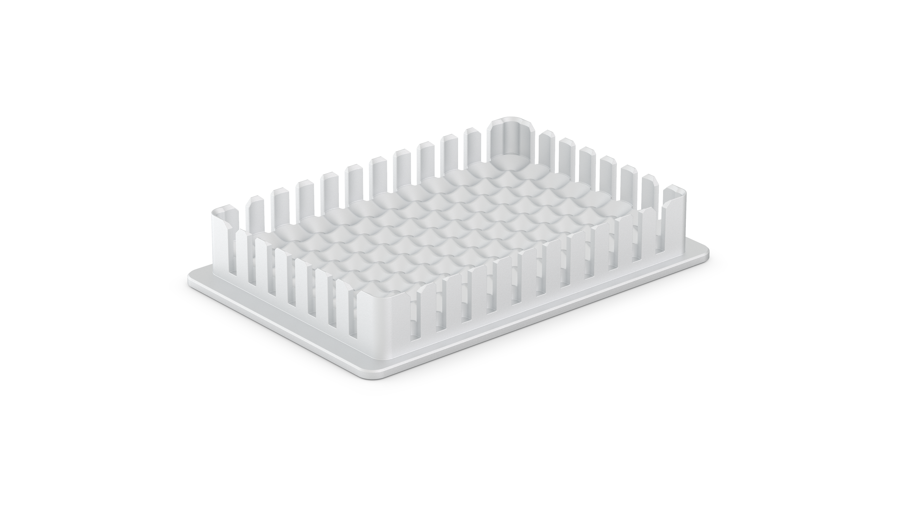
<figcaption>Deep well thermal block</figcaption>
</figure>

<figure markdown>
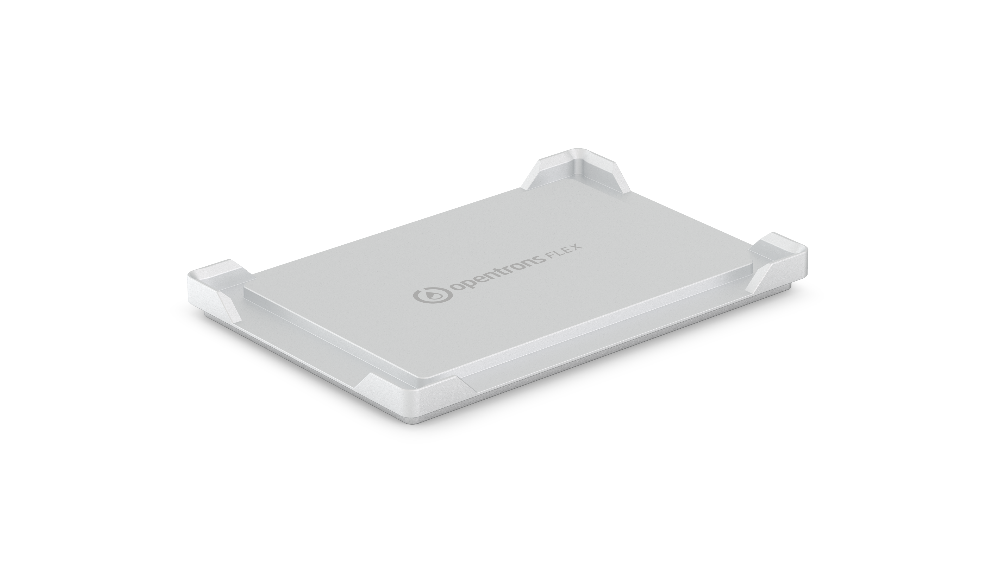
<figcaption>Flat bottom thermal block for Flex</figcaption>
</figure>

#### Software control

The Temperature Module is fully programmable in Protocol Designer and the Python Protocol API.

Outside of protocols, the Opentrons App can display the current status of the Temperature Module and can directly control the temperature of the surface plate.

### Temperature Module specifcations

| **Specification**               | **Details**                                                                 |
|----------------------------------|-----------------------------------------------------------------------------|
| **Dimensions**                  | 194 × 90 × 84 mm (L/W/H)                                                   |
| **Weight**                      | 1.5 kg                                                                    |
| **Module power**                | <ul><li>Input: 100–240 VAC, 50/60 Hz, 4.0 A</li><li>Output: 36 VDC, 6.1 A, 219.6 W max</li></ul> |
| **Environmental conditions**    | Indoor use only                                                            |
| **Ambient temperature**         | <22 °C (recommended for optimal cooling)                                  |
| **Relative humidity**           | Up to 60%, non-condensing                                                  |
| **Altitude**                    | Up to 2000 m above sea level                                               |
| **Pollution degree**            | 2                                                                          |

## Thermocycler Module GEN2

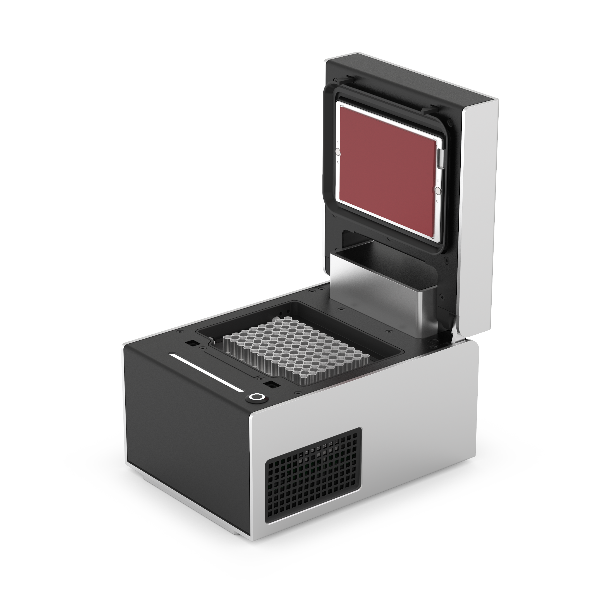

### Thermocycler features

The Opentrons Thermocycler Module GEN2 is a fully automated on-deck thermocycler, providing hands-free PCR in a 96-well plate format. Its heated lid and disposable seal fit tightly over the plate, ensuring efficient sample heating and minimal evaporation.

#### Heating and cooling

The Thermocycler's block can heat and cool, and its lid can heat, with the following temperature profile:

- Thermal block temperature range: 4–99 °C

- Thermal block maximum heating ramp rate: 4.25 °C/s from GEN2 ambient to 95 °C

- Thermal block maximum cooling ramp rate: 2.0 °C/s from 95 °C to ambient

- Lid temperature range: 37–110 °C

- Lid temperature accuracy: ±1 °C

The automated lid can be opened or closed as needed during protocol execution.

#### Thermocycler profiles

The Thermocycler can execute *profiles*: automatically cycling through a sequence of block temperatures to perform heat-sensitive reactions.

#### Rubber automation seals

The Thermocycler comes with rubber automation seals to help reduce evaporation. Each seal must be sterilized before use and can be used for several runs. [Replacement seals](https://opentrons.com/products/gen2-thermocycler-seals) come in packages of 10, which you can purchase directly from Opentrons.

#### Software control

The Thermocycler is fully programmable in Protocol Designer and the
Python Protocol API.

Outside of protocols, the Opentrons App can display the current status
of the Thermocycler and can directly control the block temperature, lid
temperature, and lid position.

### Thermocycler specifcations

| **Specification**                | **Details**                                      |
|----------------------------------|--------------------------------------------------|
| **Dimensions (lid open)**        | 244.95 × 172 × 310.1 mm (L/W/H)                  |
| **Dimensions (lid closed)**      | 244.95 × 172 × 170.35 mm (L/W/H)                 |
| **Weight (including rear duct)** | 8.4 kg                                           |
| **Power adapter voltage**        | 100–240 V at 50/60 Hz                            |
| **Power adapter current**        | 8.5–5 A                                          |
| **Overvoltage**                  | Category II                                      |
| **Environmental conditions**     | Indoor use only                                  |
| **Ambient temperature**          | 20–25 °C (ideal); 2–40 °C (acceptable)           |
| **Relative humidity**            | 30–80%, non-condensing                           |
| **Altitude**                     | Up to 2000 m above sea level                     |
| **Ventilation requirements**     | At least 20 cm / 8 in between the unit and a wall|
