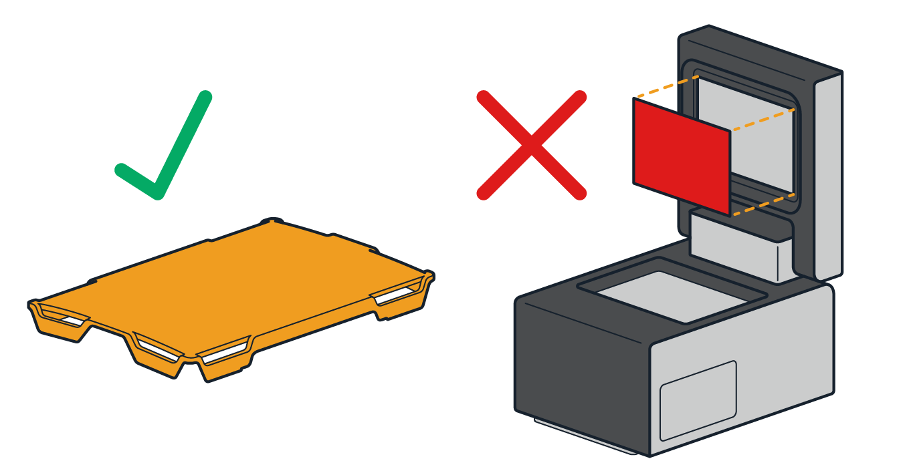

# Thermocycler Module GEN2

!!! info "Additional Documentation"
    For complete instructions on module installation and use, see the [Thermocycler Module Instruction Manual](../../../thermocycler/).

## Thermocycler features

The Opentrons Thermocycler Module is a fully automated on-deck thermocycler designed for hands-free PCR in a 96-well plate format. It is compatible with the Flex Gripper, other deck-mounted hardware, and is fully supported in the Opentrons App and Python API. When used with a reusable rubber seal or single-use PCR plate lid, the module's heated lid provides a tight seal that helps ensure efficient sample heating and minimizes evaporation, crucial for reliable and repeatable experimental results.

### Heating and cooling

The Thermocycler's block can heat and cool, and its lid can heat, with the following temperature profile:

- Thermal block temperature range: 4–99 °C

- Thermal block maximum heating ramp rate: 4.25 °C/s from GEN2 ambient to 95 °C

- Thermal block maximum cooling ramp rate: 2.0 °C/s from 95 °C to ambient

- Lid temperature range: 37–110 °C

- Lid temperature accuracy: ±1 °C

The automated lid can be opened or closed as needed during protocol execution.

### Thermocycler profiles

The Thermocycler can execute *profiles*: automatically cycling through a sequence of block temperatures to perform heat-sensitive reactions.

### Thermocycler lid seals

The Thermocycler works with two different plate seals to help protect your samples. These are the the [Opentrons Tough PCR Auto-sealing Lid](https://opentrons.com/products/opentrons-flex-tough-auto-sealing-lids-20-count) and reuseable [rubber automation seals](https://opentrons.com/products/gen2-thermocycler-seals).

| Lid Type | Description |
|----|----|
| Opentrons Tough PCR Auto-sealing Lid | These sterile, single-use PCR plate lids help prevent cross-contamination and evaporation during Thermocycler incubation periods. The lids are Gripper-compatible and can be stacked directly on the deck or placed in a special deck riser. |
| Rubber Automation Seal | These are adhesive-backed ethylene propylene diene monomer (EPDM) seals you manually apply to the Thermocycler lid. Rubber seals can be reused up to 20 times; however, unlike the Opentrons Tough Auto-sealing Lid, they are not sterile. The seals must be cleaned and sanitized before each use. |

!!!warning
    Do not use the Opentrons Tough Auto-sealing PCR Lid and a rubber automation seal on the Thermocycler at the same time. This combination prevents the module's lid from closing properly, which can cause temperature control problems and mechanical damage. Always remove the rubber seal before running protocols that use the disposable PCR lid.
    

### Software control

The Thermocycler is fully programmable in Protocol Designer and the
Python Protocol API.

Outside of protocols, the Opentrons App can display the current status
of the Thermocycler and can directly control the block temperature, lid
temperature, and lid position.

## Thermocycler specifications

| Specification                    | Details                                          |
|----------------------------------|--------------------------------------------------|
| **Dimensions (lid open)**        | 244.95 × 172 × 310.1 mm (L/W/H)                  |
| **Dimensions (lid closed)**      | 244.95 × 172 × 170.35 mm (L/W/H)                 |
| **Weight (including rear duct)** | 8.4 kg                                           |
| **Power adapter voltage**        | 100–240 V at 50/60 Hz                            |
| **Power adapter current**        | 8.5–5 A                                          |
| **Overvoltage**                  | Category II                                      |
| **Environmental conditions**     | Indoor use only                                  |
| **Ambient temperature**          | 20–25 °C (ideal); 2–40 °C (acceptable)           |
| **Relative humidity**            | 30–80%, non-condensing                           |
| **Altitude**                     | Up to 2000 m above sea level                     |
| **Ventilation requirements**     | At least 20 cm / 8 in between the unit and a wall|
