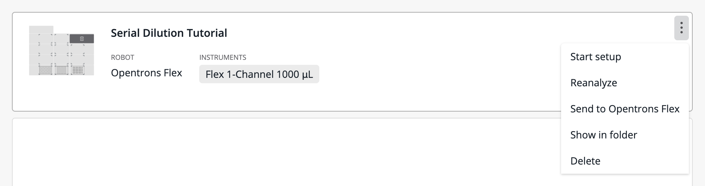
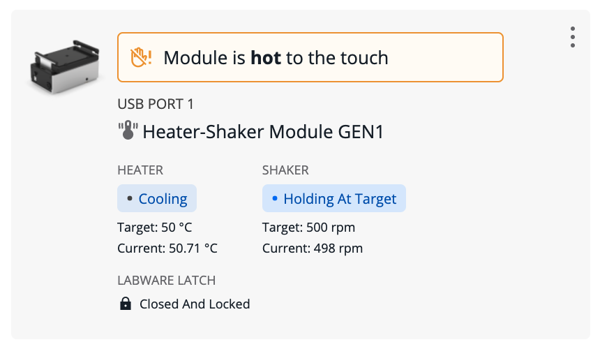

# Opentrons App

You can perform most functions of Flex either from the [touchscreen](../touchscreen/) or from a computer running the Opentrons App. This section covers using the app for features that are not available on the touchscreen.

## App installation

Download the Opentrons App at <https://opentrons.com/ot-app/>. The app requires Windows 10, macOS 10.10, or Ubuntu 12.04 or later. The app may run on other Linux distributions, but Opentrons does not officially support them.

### Windows

The Windows version of the Opentrons App is packaged as an installer. To use it:

- Open the .exe file you downloaded from opentrons.com.

- Follow the instructions in the installer. You can install the app for a single user or all users of the computer.

The app opens automatically once installed. Grant the app security or firewall permissions, if prompted, to make sure it can launch and communicate with Flex over your network.

### macOS

The macOS version of the Opentrons App is packaged as a disk image. To use it:

1.  Open the .dmg file you downloaded from opentrons.com. A window for the disk image will open in Finder.

2.  Drag the Opentrons icon onto the Applications icon in the window.

3.  Double-click on the Applications icon.

4.  Double-click on the Opentrons icon in the Applications folder.

Grant the app security or firewall permissions, if prompted, to make sure it can launch and communicate with Flex over your network.

### Ubuntu

The Ubuntu version of the Opentrons App is packaged as an AppImage. To use it:

1.  Move the .AppImage file you downloaded from opentrons.com to your Desktop or Applications folder.

2.  Right-click the .AppImage file and choose **Properties**.

3.  Click the **Permissions** tab. Then check **Allow executing file as a program**. Close the Properties window.

4.  Double-click the .AppImage file.

!!! note
    Do not use third-party AppImage launchers with the Opentrons App. They may interfere with app updates. Opentrons does not support using third-party launchers to control Opentrons robots.

## Transferring protocols to Flex

Every protocol will begin as a file on your computer, regardless of what method of [protocol development](../protocols/) you use. You need to import the protocol into the Opentrons App and then transfer it to your Flex. When transferring a protocol, you can choose to begin run setup immediately or later.

### Import a protocol

When you first launch the Opentrons App, you will see the Protocols screen. (Click **Protocols** in the left sidebar to access it at any other time.) Click **Import** in the top right corner to reveal the Import a Protocol pane. Then click **Choose File** and find your protocol in the system file picker, or drag and drop your protocol file into the well.

The Opentrons App will analyze your protocol as soon as you import it. *Protocol analysis* is the process of taking the JSON object or Python code contained in the protocol file and turning it into a series of commands that the robot can execute in order. If there are any errors in your protocol file, or if you're missing custom labware definitions, a warning banner will appear on the protocol's card. Correct the errors and re-import the protocol. If there are no errors, your protocol is ready to transfer to Flex.

<figure class="screenshot" markdown>

<figcaption>Actions available in the three-dot menu (⋮) for imported protocols.</figcaption>
</figure>

!!! note
    In-app protocol analysis is only a preliminary check of the validity of your protocol. Protocol analysis will run again on the robot once you transfer the protocol to it. It's possible for analysis to fail in the app and succeed on the robot, or vice versa. Analysis mismatches may occur when your app and robot software versions are out of sync, or if you have customized the Python environment on your Flex.

### Run immediately

Click the three-dot menu (⋮) on your protocol and choose **Start setup**. Choose a connected and available Flex from the list to transfer the protocol and begin run setup immediately. The run setup screen will appear both in the app and on the touchscreen, and you can continue from either place.

If you stay in the app, expand the sections under the Setup tab and follow the instructions in each one: Robot Calibration, Module Setup (if your protocol uses modules), Labware Position Check (recommended), and Labware Setup. Then click :material-play-circle: **Start run** to to begin the protocol.

If you move to the touchscreen, follow the steps in the [Run Setup section][run-setup] above.

### Run later

Click the three-dot menu (⋮) on your protocol and choose **Send to Opentrons Flex**. Choose a connected and available Flex from the list to transfer the protocol. A message indicating a successful transfer will pop up both in the app and on the touchscreen. To set up your protocol, you need to move to the touchscreen and follow the steps in the [Run Setup section][run-setup] above.

## Module status and controls

Use the Opentrons App to view the status of modules connected to your Flex and control them outside of protocols. Click **Devices** and then click on your Flex to view its robot details page. Under Instruments and Modules, there is a card for each attached module. The card shows the type of module, what USB port it is connected to, and its current status.

<figure markdown>

<figcaption>Module card for the Heater-Shaker Module.</figcaption>
</figure>

!!! note
    The Magnetic Block does not have a card in Instruments and Modules, since it is unpowered and does not connect to Flex via USB.

Click the three-dot menu (⋮) on the module card to choose from available commands. You can always choose **About module** to see the firmware version and serial number of the module. (This information is very useful when contacting Opentrons Support!) The other commands depend on the type of the module and its current status:

| Module type    | Commands |
| -------------- | -------- |
| **Heater-Shaker** | <ul><li>Set module temperature / Deactivate heater</li><li>Open labware latch / Close labware latch</li><li>Test shake / Deactivate shaker</li></ul> |
| **Temperature**   | <ul><li>Set module temperature / Deactivate module</li></ul>                            |
| **Thermocycler**  | <ul><li>Set lid temperature / Deactivate lid</li><li>Open lid / Close lid</li><li>Set block temperature / Deactivate block</li></ul> |

## Recent protocol runs

The robot details page lists up to 20 recent protocol runs. This provides additional information compared to the touchscreen, which only shows the most recent run for each unique protocol.

Each entry in the recent protocol runs list includes the protocol name, its timestamp, whether the run was canceled or completed, and the duration of the run. Click the disclosure triangle next to any run to show its associated labware offset data. Click the three-dot menu (⋮) for related actions:

- **View protocol run record:** Show the protocol run screen as it appeared when the protocol ended (succeeded, failed, or was canceled), including all performed steps.

- **Rerun protocol now:** The same as choosing **Start setup** on the corresponding protocol.

- **Download run log:** Save to your computer a JSON file containing information about the protocol run, including all performed steps.

- **Delete protocol run record:** Delete all information about this protocol run from Flex, including labware offset data. When you choose this option, it's as though the protocol run never happened.

!!! note
    If you need to maintain a comprehensive record of all runs performed on your Flex, you must use the **Download run log** feature to save this information to your computer.

Flex *will not* retain information about more than 20 runs on the robot. Proceeding to the Run Setup screen generates an entry in the list and counts towards the maximum of 20 runs, even if you never begin the protocol.
