# Software and Operation

There are multiple ways to control Opentrons Flex, depending on the needs of your lab. You can perform most functions either from the touchscreen or from a computer running the Opentrons App. This chapter will focus primarily on touchscreen operation, and will only cover features of the Opentrons App that are not possible on the touchscreen. It will also outline advanced control features, such as running Python code using the Jupyter Notebook server or from the command line of Flex.

One major difference between touchscreen and app operation is the software's relationship to the robot. The touchscreen is integrated, and therefore only controls the Flex robot that it's physically a part of. In contrast, the Opentrons App can control any number of Opentrons robots connected to the computer that's running the app. Using both pieces of software is required to set up Flex and run your first protocol, but it's up to you to decide the balance of how you will control Flex in your daily workflow.

## Touchscreen operation

You can use the touchscreen to control Flex whenever the robot is on. If your robot is on and the touchscreen is off, tap it once to wake the screen.

### Robot dashboard

<figure class="screenshot" markdown>
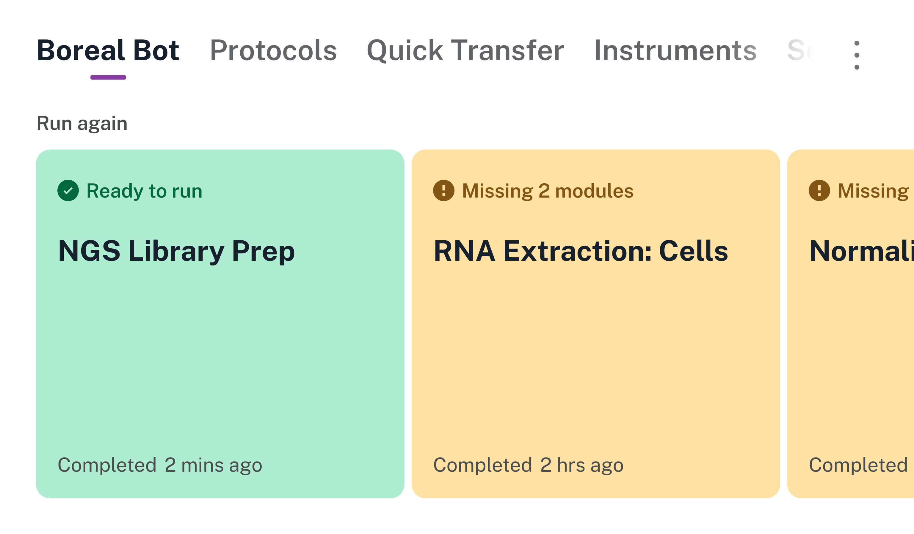
</figure>

The dashboard is the main screen for the robot, accessible by tapping the robot's name in the top left corner of the touchscreen.

The dashboard provides quick access to recently run protocols. It displays protocols as large cards in a horizontal carousel. Green cards show protocols that are ready to run. Orange cards show protocols that require hardware setup or have a deck configuration conflict. The dashboard can display up to eight previously run protocols.

From the dashboard you can also perform actions that apply to the robot as a whole, rather than a particular protocol. Access these actions by tapping the three-dot (⋮) menu:

- **Home gantry:** Move the gantry to its home position at the back right of the working area.

- **Restart robot:** Perform a soft restart of the robot.

- **Deck configuration:** Manage deck fixture locations.

- **Lights on/off:** Toggle the LED lights that illuminate the working area.

The top navigation on the dashboard provides access to the other main screens: All Protocols, Quick Transfer, Instruments, and Settings. Next we'll look at how to manage protocols on the All Protocols screen

### Protocol management

The All Protocols screen is an interactive list of all protocols that you've stored on Opentrons Flex. (Sending a protocol to Flex requires the Opentrons App. See the [Transferring Protocols to Flex section][transferring-protocols-to-flex] below for details on that process.)

There are two sections of the All Protocols screen:

- Pinned protocols: Large cards in a horizontal carousel at the top of the screen.

- Other protocols: A vertical list at the bottom of the screen.

<figure class="screenshot" markdown>
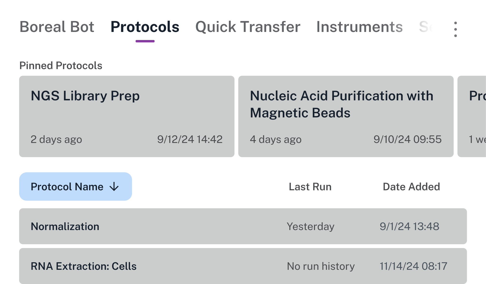
</figure>

Regardless of which section a protocol is in, its card or list entry includes information about when it was last run and when it was added to this robot.

!!! note
    Flex can store a maximum of 20 unique protocols. It automatically deletes older protocols to maintain this limit. Use the Opentrons App if you need to manage a larger number of protocols.

#### Pin a protocol

Long press on a protocol and tap **Pin protocol** to move it to the pinned protocols section. Conversely, long press a pinned protocol and tap **Unpin protocol** to remove it from the section.

<figure class="screenshot" markdown>
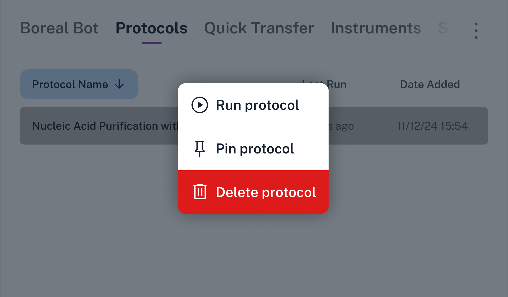
</figure>

You can pin up to eight protocols. When you hit the maximum, you'll need to unpin a protocol before pinning another one.

#### Sort protocols

Tap any of the three headers — Protocol Name, Last Run, or Date Added — to sort the All Protocols section.

Tap once to sort protocols in ascending order (A to Z for names, oldest to newest for dates). Tap again to reverse the sort order. The current sort criterion is highlighted in blue and the current sort order is indicated by an upward or downward arrow.

#### Delete a protocol

Long press on a protocol and tap **Delete protocol** to delete it directly from the All Protocols screen. Flex will prompt you for confirmation that you want to delete the protocol file and all of its run history.

<figure class="screenshot" markdown>
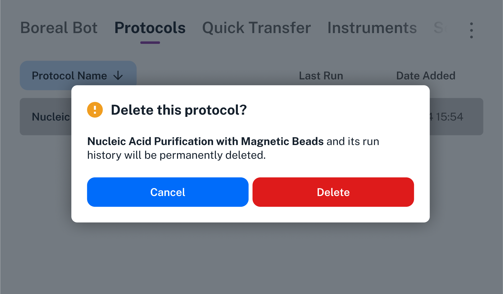
</figure>

!!! warning
    Run history is *not recoverable* after you delete a protocol on Flex. The protocol file itself is also not recoverable, although you may be able to resend the protocol to Flex if you've kept a copy of it on a computer.

### Protocol details

Tap on any protocol to view its detail screen. This screen displays all of the types of information included in the protocol file, as well as common protocol actions. An indicator at the top left of the screen shows whether the protocol is ready to run, or whether you need to perform additional setup.

#### Summary tab

<figure class="screenshot" markdown>
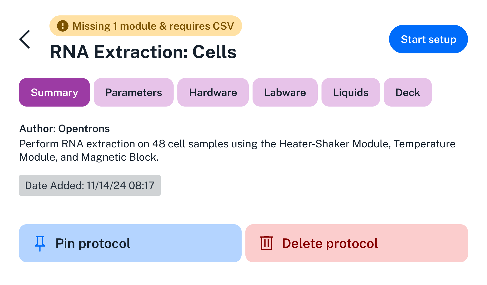
</figure>

The Summary tab shows:

- **Protocol name:** For protocols with very long names, tap to toggle between the full and truncated name.

- **Author:** Who created the protocol.

- **Description:** For protocols with long descriptions, scroll to read the full text.

- **Date added:** Timestamp when Flex received the protocol file.

#### Parameters tab

<figure class="screenshot" markdown>
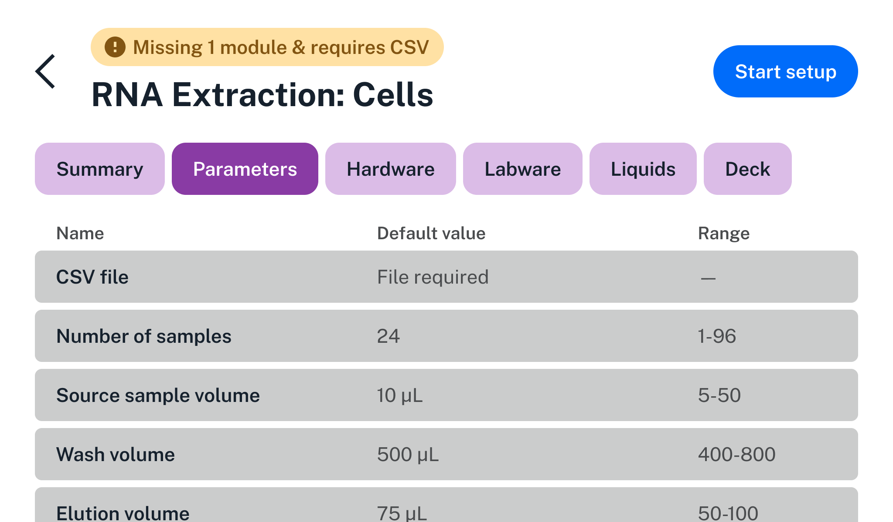
</figure>

The Parameters tab lists all of the runtime parameters that you can configure from the touchscreen while setting up the protocol. The Default Value column shows the value that the protocol will use if you don't change it. The Range column shows the maximum and minimum, list of choices, or number of choices depending on the parameter type.

!!! note
    Runtime parameters are only available in Python protocols that define their names, descriptions, and possible values. See [Runtime Parameters](https://docs.opentrons.com/v2/runtime_parameters.html) in the Python API documentation for information on defining parameters and using their values. JSON protocols do not currently support this feature.

#### Hardware tab

<figure class="screenshot" markdown>
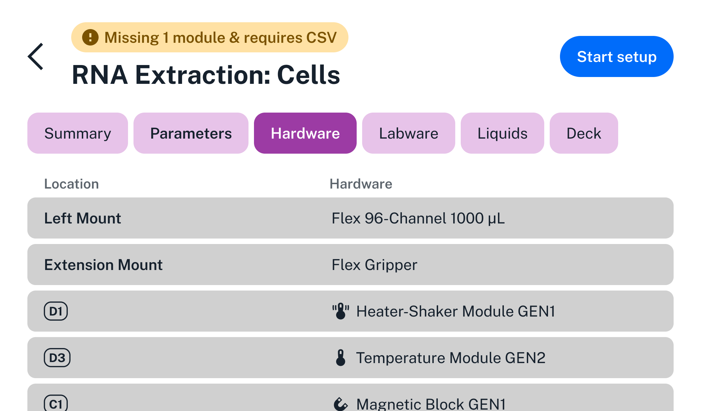
</figure>

The Hardware tab is a list of all instruments, modules, and fixtures used in the protocol. The Location column tells you where the hardware needs to be attached to Flex. For instruments, location can be the left pipette mount, right pipette mount, both mounts (for the 96-channel pipette), or the extension mount (for the gripper). For modules and fixtures, the location is the deck slot or slots that the item occupies.

#### Labware tab

<figure class="screenshot" markdown>
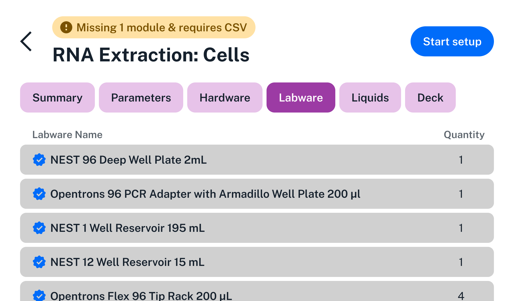
</figure>

The Labware tab is a list of all labware used in the protocol. It shows the names and quantities of labware. It does not show their locations, since labware can be moved, added, or removed from the deck during the course of a protocol. Use the Deck tab to see initial positions of labware.

Opentrons-verified labware is indicated with a blue checkmark.

#### Liquids tab

<figure class="screenshot" markdown>
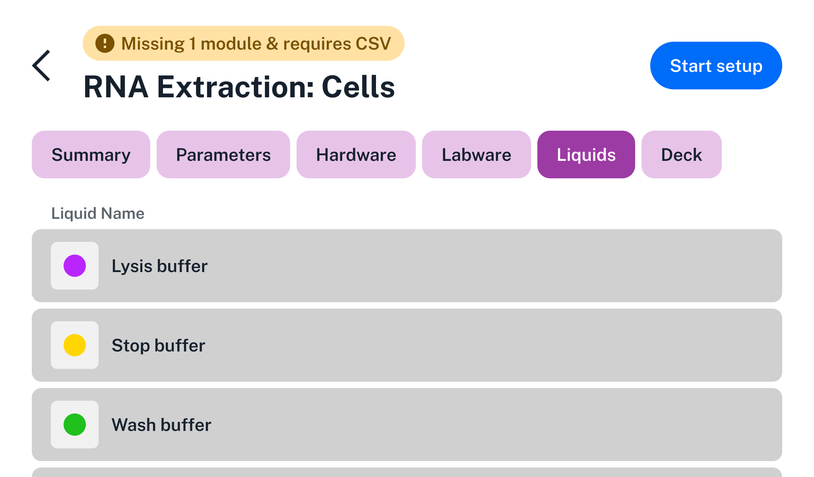
</figure>

The Liquids tab lists all liquids to be loaded into labware at the start of the protocol. It shows the color code of the liquid (as assigned by the protocol author), the liquid name, and the total volume of liquid used across all wells. Use the Deck tab to see well-by-well initial positions of liquids.

#### Deck tab

<figure class="screenshot" markdown>
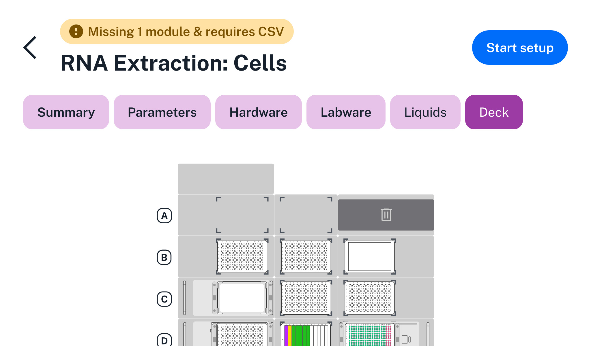
</figure>

The Deck tab shows a visual map of the deck at the beginning of the protocol.

For an interactive view that provides more information about the contents of each deck slot, tap **Start setup**, then tap **Labware**, and then tap **Map View**. There you can tap on any labware to see its type and custom label (if set by the protocol).

#### Action buttons

On any of the protocol detail tabs, three action buttons are available:

- **Start setup** (top right)

- **Pin protocol** (bottom left)

- **Delete protocol** (bottom right)

Next we'll look at the steps for setting up and performing a protocol run.

### Run setup

When you start setup for a protocol, you'll see the "Prepare to run" screen, which summarizes all of the requirements for the protocol.

<figure class="screenshot" markdown>
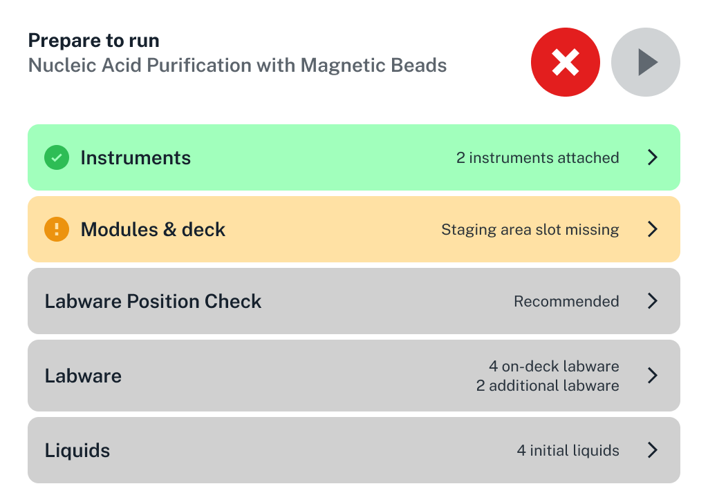
<figcaption>All sections of the "Prepare to run" screen. On the touchscreen, scroll the list to see all sections.</figcaption>
</figure>

If hardware is not connected or calibrated, you will see a warning icon (exclamation point) and the row will be highlighted in orange. If all requirements are met, you will see a checkmark and the row will be highlighted in green.

Tap any row with a right arrow to show more information for that category. (The one exception is tapping Labware Position Check, which begins that process. See the Labware Position Check section below for more details.)

| Category   | Description |
|------------|------------|
| Instruments    | See if all instruments are attached to the correct mounts and calibrated. Tap <b>Attach</b> or <b>Calibrate</b> to set up any that aren't. |
| Parameters     | See the names, descriptions, and default values of runtime parameters for the protocol. Tap a parameter to edit its value. See the Runtime Parameters section below for more details. |
| Hardware       | See the locations and connection statuses of hardware on the deck. <ul><li>Tap :fontawesome-solid-circle-info: <b>Setup Instructions</b> to get detailed instructions.</li><li>Tap <b>Map View</b> to switch to a visual layout of hardware positions.</li></ul> |
| Labware        | See the locations of labware. Each labware lists its initial deck location, and icons indicate labware that are on top of modules. Tap <b>Map View</b> to switch to a visual layout of labware positions. |
| Liquids        | See the types and total volumes of liquids. Tap any liquid name to expand a list of well-by-well volumes. In turn, tap an individual volume row to show a visual layout of its location within labware. |

On any category screen, return to the "Prepare to run" screen by tapping the back arrow in the top left.

### Runtime parameters

Runtime parameters customize protocols during setup, letting you adjust
pipette types, mount positions, aspirate/dispense volumes, labware
types, and more—all without writing a new protocol.

{width="12.135416666666666in"
height="7.322916666666667in"}

Tap a configurable parameter to modify it. Different types of
touchscreen controls are used for different parameter types.

- **Boolean:** Tap the parameter to toggle its value between On and Off.

- **String and numeric choices:** Choose from a menu of possible values.

- **Numeric range:** Use the onscreen keypad to enter a value within the
  acceptable range.

- **CSV:** Choose from a file picker.

#### Using CSV data

Flex looks for CSV files in the root directory of an attached USB drive
or files that were used in a previous run of the same protocol. You can
connect a USB drive to any open USB port on Flex, but we recommend using
the port below the touchscreen. As shown here, this protocol has no CSV
files saved on this robot, but there are several on an attached USB
drive. Tap the desired CSV file to use its data into your protocol.

When working with CSV files, keep in mind that:

- The touchscreen truncates file names that are longer than 52
  characters. You can still upload files with names that exceed the
  limit.

- The USB drive must use a file system that's readable by the robot.
  FAT32, NTFS, and ext4 file systems are supported. The HFS+ and APFS
  file systems are not.

- You must leave the USB drive attached until you start the run, or Flex
  won't be able to access the CSV data that you chose.

#### Confirming runtime parameters

Parameter and CSV file selections are still editable until you tap
**Confirm values**. Modifications become read-only after that. To make
further adjustments, you'll have to cancel the protocol run and start
over.

### Labware Position Check

Opentrons recommends performing Labware Position Check before your
protocol run. This process fine- tunes the positioning of instruments,
relative to specific types of labware in specific slots on the deck. The
results of Labware Position Check are saved as labware offsets, which
are measured to the nearest 0.1

mm\. You can apply saved labware offsets to future runs of the same
protocol (or other protocols that use the same labware in the same
positions) to save time.

Labware Position Check guides you through these steps:

1.  Attach the calibration probe to the pipette.

2.  Clear the deck of labware, but leave modules in place.

3.  Place a specific type of labware in a specific deck slot.

4.  Align the probe to the labware using the on-screen jog controls.
    Then confirm the position.

5.  Repeat steps 3 and 4 for each labware--slot combination used in your
    protocol.

6.  Review and save your new labware offset data.

7.  Remove the calibration probe from the pipette.

8.  {width="10.59375in"
    height="5.510416666666667in"}

Jog controls used in Labware Position Check. Use larger jump sizes to
move the pipette quickly, but beware of crashing the pipette into
labware.

{width="11.239583333333334in"
height="6.0625in"}

Summary of new labware offsets ready to be applied to a protocol.

When you run Labware Position Check for the first time, the pipette will
start at its default position for all labware (X 0.0 Y 0.0 Z 0.0). On
subsequent runs, the pipette will start at the previously saved offset
locations. This lets you quickly confirm offset data before every
protocol run.

**Note:** The pipette will always start at the default position if you
turn off Apply Labware Offsets in the robot settings.

### Run progress

Once everything is set up, begin your run by tapping the play button ▶
on the "Prepare to run" screen. Flex will begin the protocol and you'll
see the Running screen.

The Running screen gives you quick access to stop and play/pause
controls, in case you need to intervene in your protocol. On the default
view, these controls are large and only the current step of the protocol
is shown.

{width="11.322916666666666in"
height="6.25in"}

Swipe from right to left to see an alternative view with smaller
controls and more protocol steps. The current step will always be at the
top of the list.

{width="11.322916666666666in"
height="6.25in"}

Starting in robot software version 8.0.0, if something unexpected
happens during the protocol run, Flex will pause and give you the option
to enter error recovery mode. In earlier versions, Flex cancels the run
when an error occurs.

### Error recovery

Flex error recovery allows you to continue a protocol run even when
problems arise.

{width="11.333333333333334in"
height="6.645833333333333in"}

Tap **Launch recovery mode** to see options for the particular type of
error that has occurred. Instead of just canceling the protocol and
forcing a restart, this feature gives you a chance to correct problems
like replacing a damaged tip or filling an empty well. Even if you have
to cancel a protocol run, error recovery will let you preserve liquids
in the pipette and control where tips are dropped. After all, an
occasional mistake or problem shouldn't end a procedure with the loss of
expensive reagents or valuable samples.

Flex provides a protocol recovery path for the following error
conditions.

**Error type Description Recovery options**

+-----------------------+-----------------------+----------------------+
| No liquid detected    | Occurs when a pipette |                      |
+-----------------------+-----------------------+----------------------+
|                       | - Manually refill     |                      |
|                       |   well and skip to    |                      |
|                       |   the next step.      |                      |
|                       |                       |                      |
|                       | encounters an empty   |                      |
|                       | well                  |                      |
+-----------------------+-----------------------+----------------------+
|                       | - Ignore the error    |                      |
|                       |   and skip to the     |                      |
|                       |   next step.          |                      |
|                       |                       |                      |
|                       | and expects a liquid  |                      |
|                       | to be                 |                      |
+-----------------------+-----------------------+----------------------+
|                       | - Cancel protocol     |                      |
|                       |   run.                |                      |
|                       |                       |                      |
|                       | present.              |                      |
+-----------------------+-----------------------+----------------------+
| Pipette overpressure  | Occurs when pressure  | For aspiration:      |
+-----------------------+-----------------------+----------------------+
|                       | inside the pipette    |                      |
|                       | exceeds               |                      |
+-----------------------+-----------------------+----------------------+
|                       | - Retry with new      |                      |
|                       |   tips.               |                      |
|                       |                       |                      |
|                       | the normal range      |                      |
|                       | while                 |                      |
+-----------------------+-----------------------+----------------------+
|                       | - Cancel protocol     |                      |
|                       |   run.                |                      |
|                       |                       |                      |
|                       | aspirating or         |                      |
|                       | dispensing            |                      |
+-----------------------+-----------------------+----------------------+
|                       | liquid.               | For dispense:        |
+-----------------------+-----------------------+----------------------+
|                       |                       |                      |
+-----------------------+-----------------------+----------------------+
|                       | - Skip to the next    |                      |
|                       |   step with the same  |                      |
|                       |   tips.               |                      |
|                       |                       |                      |
|                       | Caused by clogged,    |                      |
|                       | bent,                 |                      |
+-----------------------+-----------------------+----------------------+
|                       | - Skip to the next    |                      |
|                       |   step with new tips. |                      |
|                       |                       |                      |
|                       | or sealed tips.       |                      |
+-----------------------+-----------------------+----------------------+
| - Cancel protocol     | A catch-all category  |                      |
|   run.                | for                   |                      |
|                       |                       |                      |
| General errors        |                       |                      |
+-----------------------+-----------------------+----------------------+
|                       | - Retry step.         |                      |
|                       |                       |                      |
|                       | other errors.         |                      |
+-----------------------+-----------------------+----------------------+
|                       |                       | - Skip to next step. |
+-----------------------+-----------------------+----------------------+

- Cancel protocol run.

You can view the status of a finished protocol and review any resolved
errors on the run completion screen.

### Run completion

At the end of your protocol, a large "Run completed" or "Run failed"
message will take over the touchscreen. These color-coded messages match
the LED status bar at the top of the robot and are visible at a
distance.

{width="8.854166666666666in"
height="5.1875in"}

{width="8.854166666666666in"
height="5.1875in"}

Tap anywhere on either of these screens to go to the run summary screen,
which shows information about the protocol run time and next steps. The
summary screen always gives you the options to **Return to dashboard**
or have the protocol **Run again**. If the run failed, you can also
**View error details** and begin the troubleshooting process.

{width="8.0625in"
height="4.5in"}{width="8.0625in"
height="4.5in"}

### Quick transfer

Quick transfer is a touchscreen-only feature that lets you create, save,
and run simple procedures that move liquid from a source to a
destination, all without creating a protocol or writing code. Available
starting in robot software version 8.0.0, this feature is ideal for
preparing labware you need to use in other, more complex procedures. For
example, you can use quick transfers to:

- Provision well plates with a reagent, buffer, or other liquid.

- Consolidate liquid from many wells to one well.

- Distribute liquid from a single well to multiple wells.

- Move culture to growth media or to prepare it for long-term storage.

There are two sections of the quick transfer screen:

- Pinned transfers: Large cards on a horizontal carousel. You can pin 8
  cards, maximum.

- Saved transfers: A vertical list at the bottom of the screen. Flex can
  save a maximum of 20 quick transfers. You have to delete older quick
  transfers to maintain this limit.

- {width="5.46875in"
  height="3.1875in"}

The remainder of this section goes through quick transfer features in
detail.

#### Creating a quick transfer

From the Quick Transfer tab on the touchscreen, tap **+ Quick
transfer.** This starts a guided setup. Follow the instructions on the
screen. You can run, save, pin, or delete the transfer when finished.

#### Deck slots and hardware requirements

Quick transfers require a Flex pipette, a tip rack in slot B2, source
labware in slot C2, and destination labware in slot D2. For tip
disposal, quick transfer relies on the robot's to determine where the
trash bin or waste chute is on the deck. It shows the trash bin in slot
A3 if no trash container is configured. You cannot use the gripper,
modules, and custom labware in a quick transfer.

{width="4.3125in"
height="3.3645833333333335in"}

If everything is set up correctly, you'll move on to selecting pipettes
and tips.

#### Pipettes and tips

Creating a quick transfer involves selecting a pipette and appropriate
tips. Quick transfer can use any

1-, 8-, or 96-channel pipette that's attached to the robot. When
selecting a pipette tip, try to match the tip to a pipette of the same
capacity or larger. For best performance, use the smallest tips that can
hold the amount of liquid you need to aspirate.

#### Labware

Quick transfer works with most of the labware in the . It omits labware
from the source and destination menus when those items are incompatible
with the selected pipette. For example, only the 1-channel pipette can
aspirate or dispense from tube racks. If you select a multi-channel
pipette, quick transfer won't let you choose a tube rack as a source or
destination.

#### Well selection

Well selection depends upon the pipette and labware you're using. When
using a 1-or 8-channel pipette and a 96-well plate, you select
individual wells by tapping or tapping and dragging on the touchscreen.
Or, when using multi-channel pipettes and high-density well plates,
quick transfer provides button controls that let you select columns and
well groups instead of individual wells.

For example, these controls let you select wells and columns with an
8-channel pipette and a 384-well plate.

{width="14.458333333333334in"
height="7.083333333333333in"}

And these controls let you select wells and columns with a 96-channel
pipette and 384-well plate.

{width="14.197916666666666in"
height="5.927083333333333in"}

Quick transfer checks your pipette, source, and destination choices to
prevent incompatible combinations. If you make a mistake while selecting
wells, or want to start over, tap **Reset** to clear your selections.

After making instrument and well selections, you'll set the transfer
volume and give your new quick transfer a name.

#### Transfer volumes and name

You'll set the amount of liquid to transfer (in μL) after specifying the
source and destination wells. You'll also have a chance to name the
transfer after setting the transfer volume. A good, concise name helps
you find a quick transfer in a list of saved or pinned transfers and
indicates what it does.

#### Advanced settings

These are available after you name a quick transfer and before you save
it. If some settings are familiar to you that's because they're the same
as those offered in Protocol Designer. Advanced settings are optional;
select any that you need or just save or run the transfer.

**Setting Description**

Aspirate and dispense Set how quickly the pipette will aspirate or
dispense, in μL/s. flow rates

Pipette path Choose how the pipette moves between wells. Options
include:

- single transfer (1 well to 1 well)

- multi-aspirate (many wells to 1 well)

- multi-dispense (1 well to many wells)

Tip position Change where in the well the pipette aspirates or
dispenses. By default, the robot positions the tip 1 mm from the bottom
center of a well.

Pre-wet tip Pre-wet the pipette tip by aspirating and dispensing ⅔ of
the tip's maximum volume.

Mix Aspirate and dispense repeatedly from a single location. Used to mix
the contents of a well together.

Delay Adds a timed delay (in seconds) before an aspirate or dispense
action.

Touch tip Move the pipette so the tip touches the wall of a well. Used
to help knock off any droplets that might cling to the pipette's tip.
Not supported on all labware.

Air gap When used during aspiration, draw in extra air after the liquid.
When used during dispense, draw in extra air before moving to the trash
container to dispose of the tip. Used to prevent liquid from leaking out
of the pipette tip.

Blowout Blow an extra amount of air through the tip to clear it. The
pipette can blow out into the trash bin, source well, or destination
well.

Change tip Replace the tip at the start of the transfer, before every
aspirate, or per source well.

#### Managing transfers

Click **Create Transfer** when you're satisfied with your transfer
settings. After creating a quick transfer, you can run, save, or delete
it.

- Flex saves a maximum of 20 transfers in a vertical list under the
  Quick Transfer tab.

- Long press a saved transfer to run it, pin it, or delete it. Flex pins
  a maximum of 8 quick transfers.

- Long press a pinned transfer to run it, un-pin it (returns it to the
  saved list), or delete it.

{width="5.760416666666667in"
height="3.4375in"}

### Instrument management

The Instruments screen is an interactive list of all instruments that
you've connected to your Flex. The list is organized by mount: left
pipette mount, right pipette mount, and extension mount.

{width="6.75in"
height="2.5833333333333335in"}

For an empty mount, tap anywhere on the row to begin the process of
attaching an instrument.

For an occupied mount, the row lists its current contents. Tap anywhere
on the row to get more details about the instrument, detach it, or
recalibrate it.

{width="9.833333333333334in"
height="5.395833333333333in"}

- **Last Calibrated:** The date and time of the instrument's most recent
  calibration.

- **Firmware Version:** The version of the firmware running on the
  instrument. Flex automatically updates instrument firmware whenever
  the instrument is attached, depending on the robot system version.

- **Serial Number:** A unique identifier for the instrument. If you are
  having problems with an instrument, Opentrons Support will want to
  know the serial number.

#### Attach an instrument

Choose an empty mount and then choose the type of instrument to install.
Then connect and secure the instrument using its captive mounting
screws. For more details, follow the instructions on the touchscreen or
see the of the Installation and Relocation chapter.

Exact installation steps depend on the instrument you choose and the
current setup of your robot. For example, if you have an 8-channel
pipette already attached and you attempt to install the 96-channel
pipette on the other mount, the touchscreen will give you instructions
for detaching the 8-channel so the 96-channel can occupy both mounts.

#### Detach an instrument

Choose an attached instrument that you want to detach. Then loosen the
instrument's captive mounting screws and remove it from the gantry. For
more details, follow the instructions on the touchscreen. Exact removal
steps depend on the instrument you choose and the current setup of your
robot.

#### Recalibrate an instrument

Choose an attached instrument that you want to recalibrate. Then connect
the instrument's calibration probe or pin and begin the automated
calibration process. For more details, follow the instructions on the
touchscreen or see the of the Installation and Relocation chapter.

**Note:** The new calibration data will overwrite any previous
calibration data for that instrument.

### Robot settings

The Settings screen lists all the ways you can customize the behavior of
your Flex.

{width="9.354166666666666in"
height="14.197916666666666in"}All settings available on Flex. On the
touchscreen, scroll the list to see all the settings.

Although they are presented in a single list, they roughly break down
into four categories.

##### SETUP

All of these settings are covered when you . However, you can change
them at any time.

- **Network Settings:** View the status of or set up a Wi-Fi, Ethernet,
  or USB connection. Multiple connections can be active simultaneously.

- **Robot Name:** Change the name of your Flex. The robot name appears
  on the touchscreen dashboard and in the Opentrons App.

- **Robot System Version:** See the current version of the robot
  software or check for updates. If Flex has already automatically
  checked for updates and found one, this item will have an "Update
  available" badge in the settings list.

##### DISPLAY

Control how Flex displays information to meet the needs of your lab and
users.

- **Status Light:** Turn on or off the strip of color lights on the
  front of the robot.

- **Touchscreen Sleep:** Set how long the touchscreen should remain on
  when idle. The default is for the display to never go to sleep. When
  the screen is asleep, tap it once to wake it.

- **Touchscreen Brightness:** Set the screen's brightness to one of six
  levels by tapping **−** or **+**.

##### PRIVACY

Choose what data you want Flex to share with Opentrons. This information
is always anonymized and we only use it to improve our products.

Flex records what it's doing in several log files that are stored on the
robot. These logs are grouped into two categories for privacy opt-in
purposes:

- **Robot Logs:** Data about robot server activities, executed API
  commands, and interactions with attached modules.

- **Display Usage:** Data about how the touchscreen draws its graphics.

If you opt out of automatic data sharing, you can still for your own use
or to manually send them to Opentrons Support for troubleshooting.

**Note:** There are separate privacy controls in the Opentrons App.
Turning sharing on or off from the touchscreen only affects data
collected and sent by the robot. Your laptop or desktop computer will
still automatically share data if this feature is enabled in the
Opentrons App.

##### ADVANCED

You shouldn't need these settings for everyday operation, but they may
be useful for troubleshooting or testing pre-release features.

- **Apply Labware Offsets:** Choose whether to use saved offset data
  from Labware Position Check in subsequent protocol runs. This setting
  is on by default. Opentrons recommends running Labware Position Check
  before every run, and applying previous labware offsets at the
  beginning of Labware Position Check can make the process quicker.

- **Device Reset:** Batch delete certain types of information from the
  robot, such as calibrations, run history, or protocols.

- **Home Gantry on Restart:** By default, the gantry moves to its home
  position any time you turn on Flex. Only disable this behavior if you
  have a reason that the gantry must remain stationary after powering
  on.

- **Update Channel:** Choose whether to receive stable or beta software
  updates.

- **Developer Tools:** Enable additional tools and features designed for
  developers. Not recommended unless instructed by Opentrons Support.

### Deck configuration

Deck configuration tells your Flex what fixtures are attached to the
deck, in what locations. You need to inform the robot about installed
fixtures because they're unpowered attachments. They do not contain
electronic or mechanical components that communicate with the robot.
Flex won't know what's attached and where it is until you configure deck
fixtures via the touchscreen or Opentrons App.

Mapping fixtures to deck slots allows the robot to find discrepancies
between the hardware used in a protocol and what it thinks is attached
to the deck. Flex detects potential conflicts between the hardware setup
of a protocol and the robot's current deck configuration (see below).

Running protocols with proper deck configuration helps avoid collisions
among the various components installed on the robot.

For more information on which fixtures you can configure in which slots,
see the in the System Description chapter.

#### Adding and removing fixtures

To add deck fixtures via the touchscreen:

1.  Tap the three-dot (**⋮**) menu and then tap **Deck configuration**.
    This opens the interactive deck map.

2.  Tap a blue deck slot that you want to configure. This opens the
    fixture menu.

3.  From the fixture menu, select the item you want to add.

4.  Tap a fixture to add it to the deck.

5.  Tap **Confirm**.

Click the **X** on a fixture on the deck map to remove it from the deck
configuration.

{width="12.4375in"
height="6.947916666666667in"}

A Flex configured with a staging area slot in D3, and no other fixtures.

You can also configure the deck in the Opentrons App, on the robot
details page for your Flex.

#### Resolving deck conflicts

Flex displays orange warning prompts when setting up a protocol run that
conflicts with the current deck configuration. To resolve the conflict:

1.  Tap the prompt for more information on what the protocol specifies,
    compared to the current deck configuration.

2.  Inspect the hardware configuration of your Flex and attach, move, or
    remove the deck fixtures or modules as needed.

3.  Tap **Update deck** to clear the conflict warning.

Alternatively, you can modify your protocol to fit your current deck
configuration, and then resend it to your Flex.

Your Flex won't run a protocol until you resolve all deck conflict
warnings.

{width="14.822916666666666in"
height="8.6875in"}

This protocol requires a Heater-Shaker in slot D3, but the deck
configuration indicates that the waste chute is in that location.

#### Fixture statuses

The following table defines the statuses the robot generates when it
compares its configured deck fixtures to your protocol.

**Status Description**

**Configured** A fixture is specified in the correct location. Always
verify that the fixture is physically attached before running the
protocol.

**Location conflict** A deck slot is configured with a fixture different
from the fixture specified in your protocol (e.g., the protocol
specifies a waste chute, but deck slot D3 is occupied by a staging area
slot).

**Not configured** A fixture required by your protocol is missing from
the deck configuration (e.g., the protocol requires a staging area slot
but that fixture is not configured in the specified location).

The following table defines the deck configuration statuses the robot
generates when it compares its attached instruments and attached modules
to its deck configuration and your protocol.

**Attach pipette** A required pipette is not attached.

**Calibrate** A module needs calibration. It is in the right location
and connected to the robot.

**Calibrate pipette** An attached pipette requires calibration.

**Connected** Modules are connected, calibrated, and in the right
locations. Configuration status is good.

**Location conflict** A module location conflicts with a deck fixture.

**Not connected** The module is not connected to the robot or is powered
off. Once connected, there will be no location conflict.

## Opentrons App

### App installation

Download the Opentrons App at . The app requires Windows 10, macOS
10.10, or Ubuntu 12.04 or later. The app may run on other Linux
distributions, but Opentrons does not officially support them.

##### WINDOWS

The Windows version of the Opentrons App is packaged as an installer. To
use it:

- Open the .exe file you downloaded from opentrons.com.

- Follow the instructions in the installer. You can install the app for
  a single user or all users of the computer.

The app opens automatically once installed. Grant the app security or
firewall permissions, if prompted, to make sure it can launch and
communicate with Flex over your network.

##### MACOS

The macOS version of the Opentrons App is packaged as a disk image. To
use it:

1.  Open the .dmg file you downloaded from opentrons.com. A window for
    the disk image will open in Finder.

2.  Drag the Opentrons icon onto the Applications icon in the window.

3.  Double-click on the Applications icon.

4.  Double-click on the Opentrons icon in the Applications folder.

Grant the app security or firewall permissions, if prompted, to make
sure it can launch and communicate with Flex over your network.

##### UBUNTU

The Ubuntu version of the Opentrons App is packaged as an AppImage. To
use it:

1.  Move the .AppImage file you downloaded from opentrons.com to your
    Desktop or Applications folder.

2.  Right-click the .AppImage file and choose **Properties**.

3.  Click the **Permissions** tab. Then check **Allow executing file as
    a program**. Close the Properties window.

4.  Double-click the .AppImage file.

**Note:** Do not use third-party AppImage launchers with the Opentrons
App. They may interfere with app updates. Opentrons does not support
using third-party launchers to control Opentrons robots.

### Transferring protocols to Flex

Every protocol will begin as a file on your computer, regardless of what
method of you use. You need to import the protocol into the Opentrons
App and then transfer it to your Flex. When transferring a protocol, you
can choose to begin run setup immediately or later.

##### IMPORT A PROTOCOL

When you first launch the Opentrons App, you will see the Protocols
screen. (Click **Protocols** in the left sidebar to access it at any
other time.) Click **Import** in the top right corner to reveal the
Import a Protocol pane. Then click **Choose File** and find your
protocol in the system file picker, or drag and drop your protocol file
into the well.

The Opentrons App will analyze your protocol as soon as you import it.
*Protocol analysis* is the process of taking the JSON object or Python
code contained in the protocol file and turning it into a series of
commands that the robot can execute in order. If there are any errors in
your protocol file, or if you're

missing custom labware definitions, a warning banner will appear on the
protocol's card. Correct the errors and re-import the protocol. If there
are no errors, your protocol is ready to transfer to Flex.

{width="19.135416666666668in"
height="4.864583333333333in"}

Actions available in the three-dot menu (**⋮**) for imported protocols.

**Note:** In-app protocol analysis is only a preliminary check of the
validity of your protocol. Protocol analysis will run again on the robot
once you transfer the protocol to it. It's possible for analysis to fail
in the app and succeed on the robot, or vice versa. Analysis mismatches
may occur when your app and robot software versions are out of sync, or
if you have customized the Python environment on your Flex.

##### RUN IMMEDIATELY

Click the three-dot menu (**⋮**) on your protocol and choose **Start
setup**. Choose a connected and available Flex from the list to transfer
the protocol and begin run setup immediately. The run setup screen will
appear both in the app and on the touchscreen, and you can continue from
either place.

If you stay in the app, expand the sections under the Setup tab and
follow the instructions in each one: Robot Calibration, Module Setup (if
your protocol uses modules), Labware Position Check (recommended), and
Labware Setup. Then click ▶ **Start run** to to begin the protocol.

If you move to the touchscreen, follow the steps in the above.

##### RUN LATER

Click the three-dot menu (**⋮**) on your protocol and choose **Send to
Opentrons Flex**. Choose a connected and available Flex from the list to
transfer the protocol. A message indicating a successful transfer

will pop up both in the app and on the touchscreen. To set up your
protocol, you need to move to the touchscreen and follow the steps in
the above.

### Module status and controls

Use the Opentrons App to view the status of modules connected to your
Flex and control them outside of protocols. Click **Devices** and then
click on your Flex to view its robot details page. Under Instruments and
Modules, there is a card for each attached module. The card shows the
type of module, what USB port it is connected to, and its current
status.

{width="8.645833333333334in"
height="4.916666666666667in"}

Module card for the Heater-Shaker Module.

Click the three-dot menu (**⋮**) on the module card to choose from
available commands. You can always choose **About module** to see the
firmware version and serial number of the module. (This information is
very useful when contacting Opentrons Support!) The other commands
depend on the type of the module and its current status:

**Module type Commands**

**Heater-Shaker** Set module temperature/Deactivate heater

Open labware latch/Close labware latch Test shake/Deactivate shaker

**Temperature** Set module temperature/Deactivate module

**Thermocycler** Set lid temperature/Deactivate lid

Open lid/Close lid

Set block temperature/Deactivate block

### Recent protocol runs

The robot details page lists up to 20 recent protocol runs. This
provides additional information compared to the touchscreen, which only
shows the most recent run for each unique protocol.

Each entry in the recent protocol runs list includes the protocol name,
its timestamp, whether the run was canceled or completed, and the
duration of the run. Click the disclosure triangle next to any run to
show its associated labware offset data. Click the three-dot menu
(**⋮**) for related actions:

- **View protocol run record:** Show the protocol run screen as it
  appeared when the protocol ended (succeeded, failed, or was canceled),
  including all performed steps.

- **Rerun protocol now:** The same as choosing **Start setup** on the
  corresponding protocol.

- **Download run log:** Save to your computer a JSON file containing
  information about the protocol run, including all performed steps.

- **Delete protocol run record:** Delete all information about this
  protocol run from Flex, including labware offset data. When you choose
  this option, it's as though the protocol run never happened.

**Note:** If you need to maintain a comprehensive record of all runs
performed on your Flex, you must use the **Download run log** feature to
save this information to your computer.

Flex *will not* retain information about more than 20 runs on the robot.
Proceeding to the Run Setup screen generates an entry in the list and
counts towards the maximum of 20 runs, even if you never begin the
protocol.

## Advanced operation

### Jupyter Notebook

Flex runs a server on port 48888, which you can connect to with your web
browser. Use Jupyter to individually run discrete chunks of Python code,
called *cells*. This is a convenient environment for writing and
debugging protocols, since you can define different parts of your
protocol in different notebook cells, and run a single cell at a time.

Access your robot's Jupyter Notebook either:

- In the Opentrons App. Go to **Devices** \> your robot \> **Robot
  Settings** \> **Advanced** and then click **Launch Jupyter Notebook**.

- In your web browser. Navigate directly to http://\<robot-ip\>:48888,
  replacing \<robot-ip\> with the local IP address of your Flex.

For more details on using Jupyter, including preparing executable cells
of code and running them on a robot, see the of the Python Protocol API
documentation.

### Command-line operation over SSH

You can work with your Flex through a Secure Shell (SSH) terminal
connection. Terminal access lets you or perform advanced tasks, such as
customizing the Python environment on the robot. Protocols that
reference external files on disk (apart from custom labware definition
files) must be run from the command line.

SSH keys are required to connect to Flex and issue commands from a
terminal. Setup requires a bash or

zsh shell with openssh installed.

Follow these steps to authenticate to your Flex via SSH:

1.  Open a terminal on your computer and type ssh-keygen -f robot_key
    ecdsa.

2.  Create a passphrase when prompted. A passphrase is not required, but
    you should always create one. This process generates a file,
    robot_key.pub.

3.  Find the robot_key.pub file and copy it to the root of a USB-A flash
    drive.

**Note:** The flash drive must have a single partition formatted with a
file system readable by the embedded Linux system on Flex. FAT32, NTFS,
and ext4 file systems are supported. The macOS HFS+ and APFS file
systems are not. (macOS can read and write to FAT-formatted drives.)

1.  Eject the drive and connect it to an open USB-A port on your Flex.
    Make sure that it is the only drive attached to your Flex, or the
    key file may not be accessible.

2.  On your computer, type the following command in your terminal.
    Replace ROBOT_IP with the local IP address of your Flex.

curl \\

\--location \--request POST \\
'http://ROBOT_IP:3195/server/ssh_keys/from_local'

The command is successful if you get a 201 response with a message
indicating how many keys were added. The command failed if you get a 404
response.

1.  After successfully adding the key, type the following command.
    Again, replace ROBOT_IP with the local IP address of your Flex.

ssh -i robot_key root@ROBOT_IP

The connection works if you see an ASCII art version of the Opentrons
logo. You can now browse the Flex file system and issue commands from
the terminal.
