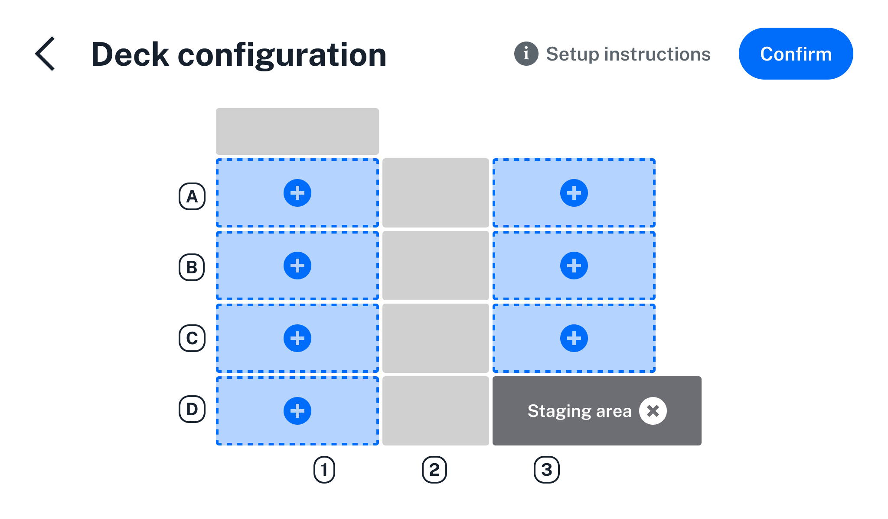
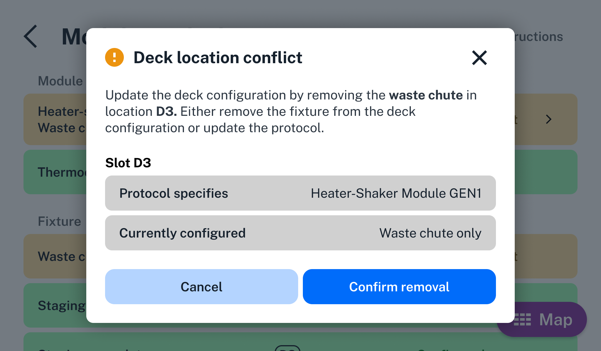

# Deck Configuration

Deck configuration tells your Flex what fixtures are attached to the deck, in what locations. You need to inform the robot about installed fixtures because they're unpowered attachments. They do not contain electronic or mechanical components that communicate with the robot. Flex won't know what's attached and where it is until you configure deck fixtures via the touchscreen or Opentrons App.

Mapping fixtures to deck slots allows the robot to find discrepancies between the hardware used in a protocol and what it thinks is attached to the deck. Flex detects potential conflicts between the hardware setup of a protocol and the robot's current deck configuration (see [Resolving Deck Conflicts][resolving-deck-conflicts] below).

Running protocols with proper deck configuration helps avoid collisions
among the various components installed on the robot.

For more information on which fixtures you can configure in which slots,
see the [Deck Fixtures section][deck-fixtures] in the System Description chapter.

## Adding and removing fixtures

To add deck fixtures via the touchscreen:

1.  Tap the three-dot (⋮) menu and then tap **Deck configuration**. This opens the interactive deck map.

2.  Tap a blue deck slot that you want to configure. This opens the fixture menu.

3.  From the fixture menu, select the item you want to add.

4.  Tap a fixture to add it to the deck.

5.  Tap **Confirm**.

Click the :octicons-x-circle-fill-16: on a fixture on the deck map to remove it from the deck configuration.

<figure class="screenshot" markdown>

<figcaption>A Flex configured with a staging area slot in D3, and no other fixtures.</figcaption>
</figure>

You can also configure the deck in the Opentrons App, on the robot details page for your Flex.

## Resolving deck conflicts

Flex displays orange warning prompts when setting up a protocol run that conflicts with the current deck configuration. To resolve the conflict:

1.  Tap the prompt for more information on what the protocol specifies, compared to the current deck configuration.

2.  Inspect the hardware configuration of your Flex and attach, move, or remove the deck fixtures or modules as needed.

3.  Tap **Update deck** to clear the conflict warning.

Alternatively, you can modify your protocol to fit your current deck configuration, and then resend it to your Flex.

Your Flex won't run a protocol until you resolve all deck conflict warnings.

<figure class="screenshot" markdown>

<figcaption>This protocol requires a Heater-Shaker in slot D3, but the deck
configuration indicates that the waste chute is in that location.</figcaption>
</figure>

## Fixture statuses

The following table defines the statuses the robot generates when it
compares its configured deck fixtures to your protocol.

| Status              | Description |
|---------------------|-------------|
| **Configured**          | A fixture is specified in the correct location. Always verify that the fixture is physically attached before running the protocol. |
| **Location conflict**   | A deck slot is configured with a fixture different from the fixture specified in your protocol (e.g., the protocol specifies a waste chute, but deck slot D3 is occupied by a staging area slot). |
| **Not configured**      | A fixture required by your protocol is missing from the deck configuration (e.g., the protocol requires a staging area slot but that fixture is not configured in the specified location). |

The following table defines the deck configuration statuses the robot generates when it compares its attached instruments and attached modules to its deck configuration and your protocol.

| Status             | Description |
|--------------------|-------------|
| **Attach pipette**     | A required pipette is not attached.                                                                            |
| **Calibrate**          | A module needs calibration. It is in the right location and connected to the robot.                            |
| **Calibrate pipette**  | An attached pipette requires calibration.                                                                      |
| **Connected**          | Modules are connected, calibrated, and in the right locations. Configuration status is good.                   |
| **Location conflict**  | A module location conflicts with a deck fixture.                                                               |
| **Not connected**      | The module is not connected to the robot or is powered off. Once connected, there will be no location conflict.|