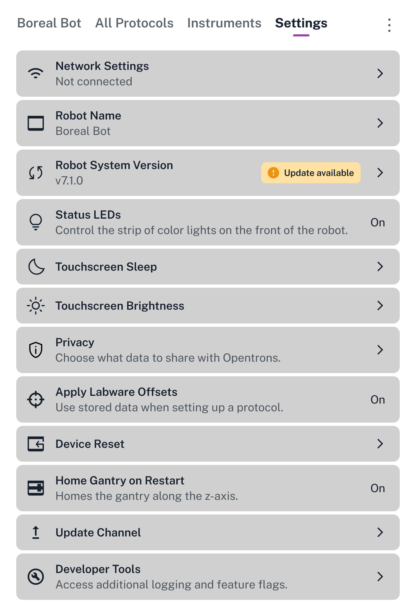

# Robot Settings

The Settings screen lists all the ways you can customize the behavior of your Flex.

<figure class="screenshot" markdown>

<figcaption>All settings available on Flex. On the touchscreen, scroll the list to see all the settings.</figcaption>
</figure>

Although they are presented in a single list, they roughly break down into four categories.

## Setup

All of these settings are covered when you [first set up your Flex][first-run]. However, you can change them at any time.

- **Network Settings:** View the status of or set up a Wi-Fi, Ethernet, or USB connection. Multiple connections can be active simultaneously.

- **Robot Name:** Change the name of your Flex. The robot name appears on the touchscreen dashboard and in the Opentrons App.

- **Robot System Version:** See the current version of the robot software or check for updates. If Flex has already automatically checked for updates and found one, this item will have an "Update available" badge in the settings list.

## Display

Control how Flex displays information to meet the needs of your lab and users.

- **Status Light:** Turn on or off the strip of color lights on the front of the robot.

- **Touchscreen Sleep:** Set how long the touchscreen should remain on when idle. The default is for the display to never go to sleep. When the screen is asleep, tap it once to wake it.

- **Touchscreen Brightness:** Set the screen's brightness to one of six levels by tapping **−** or **+**.

## Privacy

Choose what data you want Flex to share with Opentrons. This information is always anonymized and we only use it to improve our products.

Flex records what it's doing in several log files that are stored on the robot. These logs are grouped into two categories for privacy opt-in purposes:

- **Robot Logs:** Data about robot server activities, executed API commands, and interactions with attached modules.

- **Display Usage:** Data about how the touchscreen draws its graphics.

If you opt out of automatic data sharing, you can still [download your Flex log files](https://support.opentrons.com/s/article/How-to-download-the-logs-on-Opentrons-Flex) for your own use or to manually send them to Opentrons Support for troubleshooting.

!!! note
    There are separate privacy controls in the Opentrons App. Turning sharing on or off from the touchscreen only affects data collected and sent by the robot. Your laptop or desktop computer will still automatically share data if this feature is enabled in the Opentrons App.

## Advanced

You shouldn't need these settings for everyday operation, but they may be useful for troubleshooting or testing pre-release features.

- **Apply Labware Offsets:** Choose whether to use saved offset data from Labware Position Check in subsequent protocol runs. This setting is on by default. Opentrons recommends running Labware Position Check before every run, and applying previous labware offsets at the beginning of Labware Position Check can make the process quicker.

- **Device Reset:** Batch delete certain types of information from the robot, such as calibrations, run history, or protocols.

- **Home Gantry on Restart:** By default, the gantry moves to its home position any time you turn on Flex. Only disable this behavior if you have a reason that the gantry must remain stationary after powering on.

- **Update Channel:** Choose whether to receive stable or beta software updates.

- **Developer Tools:** Enable additional tools and features designed for developers. Not recommended unless instructed by Opentrons Support.
