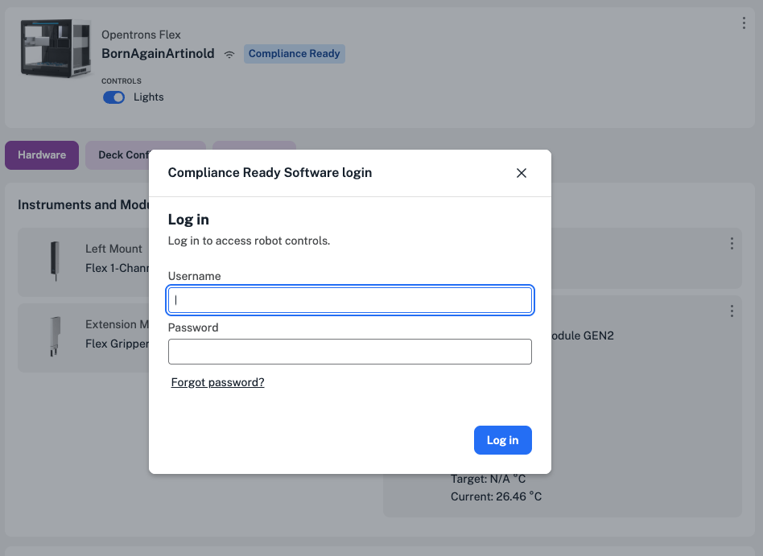
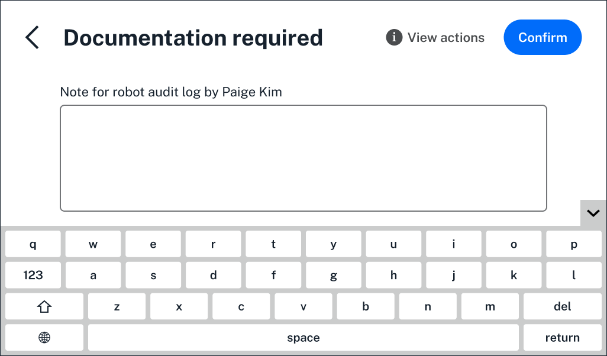
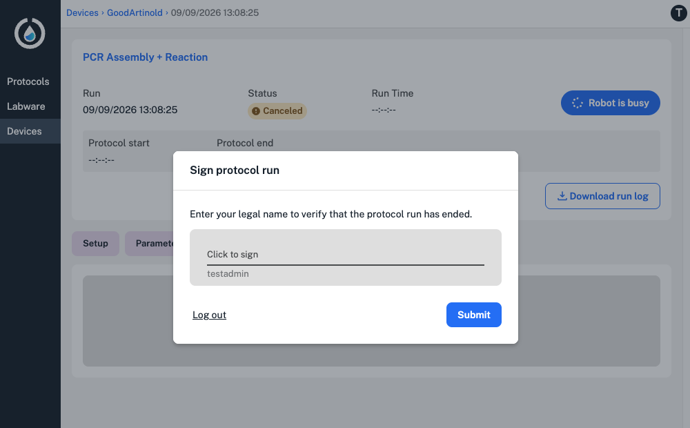

[Opentrons Flex Compliance Ready Software](https://opentrons.com/compliance-ready-software) is an additional feature installed on your Flex. The price of the software includes installation, activation, and training by an Opentrons-trained representative during an onsite visit. 

This section covers the basics. For more, see the [Compliance Ready Software Manual](../../compliance-ready-software/index.md)

## About Compliance Ready Software 

Installing Opentrons Flex Compliance Ready Software permanently enables features on your Flex for 21 CFR part 11–ready operation. The software:

* Captures every user action with timestamps, documentation, and robot-generated records and files. 
* Verifies user access, including required logins and different permissions for administrators and users. 
* Changes how you interact with your Flex across the Opentrons App and Flex touchscreen.

Because the software restricts actions like running protocols to specific users in your lab, enabling Compliance Ready Software means that you'll lose access to some of the other advanced operations covered in this section of the manual, like [Jupyter notebook access](jupyter-notebook.md) and [SSH command line operation](command-line.md). 

## Using Compliance Ready Software 

When Compliance Ready Software is enabled on your Flex, every user in your lab will need an account: 

* **Administrator** accounts have full system access, including day-to-day operation, sending protocols to the Flex, and updating Compliance Ready Software settings. 
* **User** accounts have access for day-to-day operation on the Flex and, by default, can only run protocols administrators send to the Flex. 

To use your compliance ready Flex, including setting up and running protocols, all users will need to start by logging in on the Opentrons App or the Flex touchscreen. 

<figure class="screenshot" markdown>

<figcaption>Log in on the Opentrons App to use your compliance Ready Flex.</figcaption>
</figure>

User actions, like adding a module, detaching a pipette, or running a protocol on your compliance ready Flex all require documentation. 

This documentation, along with the responsible user's legal name and user ID, become a part of the files your Flex generates. 

<figure class="screenshot" markdown>

<figcaption>Add documentation for a Flex action, like setting up a protocol, on the touchscreen.</figcaption>
</figure>

A user, like an administrator, needs to sign for every completed protocol run in the Opentrons App or on the Flex touchscreen. 

<figure class="screenshot" markdown>

<figcaption>Click to sign for a completed protocol run in the Opentrons App.</figcaption>
</figure>

Then, users can use the file manager to download files from the Flex and Opentrons App, including audit logs. These are files generated by compliance ready Flex robots, and include data like responsible users, timestamps, and documentation for every robot action.

Have questions about our offered controls or tools? Get in touch with [Opentrons](https://opentrons.com/contact).
