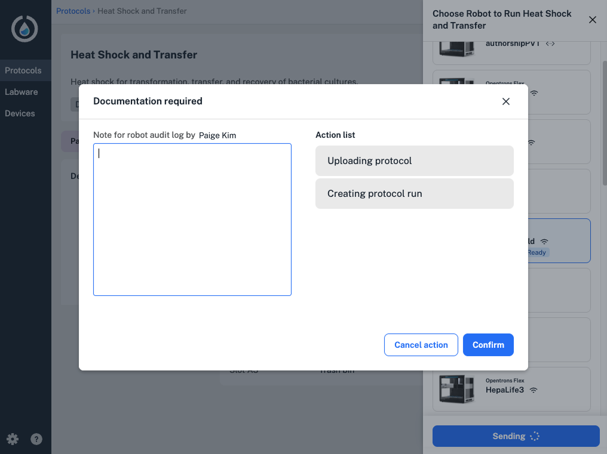

Opentrons Flex Compliance Ready Software enables features on your Flex for 21 CFR part 11–ready operation. The software: 

* Captures every user action with timestamps, required documentation, and robot-generated records and files. 
* Verifies user access, including required logins and different permissions for administrators and users. 

The software is permanently installed during on your Flex on-site by a trained Opentrons representative. Because Compliance Ready Software is designed to secure your Flex in your lab, some features like [Jupyter notebook access](jupyter-notebook.md), [command line operation](command-line.md), and [Quick Transfer protocols](../touchscreen/quick-transfer.md) are permanently disabled once the software is activated.

This section takes a look at using Compliance Ready Software in your lab. For more, see the [Compliance Ready Software manual](../../compliance-ready-software/index.md). 
 
## Logging in

Compliance Ready Software restricts access to your Flex in both the touchscreen and the Opentrons App. 

Team members that use the robot in your lab are assigned an administrator or user account and will need to log in in the app or on the touchscreen to set up and run protocols, change a module's status, and more. 

<figure class="screenshot" markdown>

<figcaption>The Opentrons App prompts users to log in.</figcaption>
</figure>

## Documenting actions

All users of your compliance ready Flex will be required to document their reason for completing robot actions like: 

* Setting up or running a protocol.
* Attaching, detaching, or calibrating pipettes or modules. 
* Updating robot settings, including software updates. 

A "Documentation required" screen will appear in the Opentrons App or on the Flex touchscreen. 

Users won't be able to bypass this screen, and the Flex won't complete the action until users enter documentation and click **Confirm**. 

<figure class="screenshot" markdown>

<figcaption>Add documentation on the Flex touchscreen. Tap the gray arrow on the right to collapse the keyboard</figcaption>
</figure>

## Running a protocol 

Sending, setting up, and running protocols on the Flex all require documentation in Opentrons Flex Compliance Ready Software.

<figure class="screenshot" markdown>

<figcaption>Sending a protocol and starting setup requires documentation in the Opentrons App.</figcaption>
</figure>

Users can be prompted to enter documentation on the Flex touchscreen or in the Opentrons App at several points during protocol setup or a run: 

* Updating or confirming deck placements, including labware and liquids.
* Changing a module's state, like opening a labware latch or setting temperature. 
* Applying labware offsets or starting a Labware Position Check.
* Pausing or canceling a protocol run. 
* Completing a manual action, like moving labware, during a protocol run.
* Starting and completing error recovery during a protocol run.

See the full list of actions requiring documentation in the [Compliance Ready Software Manual](../../compliance-ready-software/actions.md). 

## Completing a protocol 

When a protocol finishes running, an administrator wil need to sign for the run in the Opentrons App or on the Flex touchscreen. 

Signing for a run is the final checkpoint to completing the protocol run, and adds the administrator's legal name and user ID to every action captured in the protocol. 

<figure class="screenshot" markdown>

<figcaption>Sign for a protocol run in the Opentrons App.</figcaption>
</figure>

After signing, your compliance ready Flex will prompt you to download audit logs, files containing data like responsible users, timestamps, and required documentation for every robot action. 

Ready to hear more? Get in touch with [Opentrons](opentrons.com/contact).

