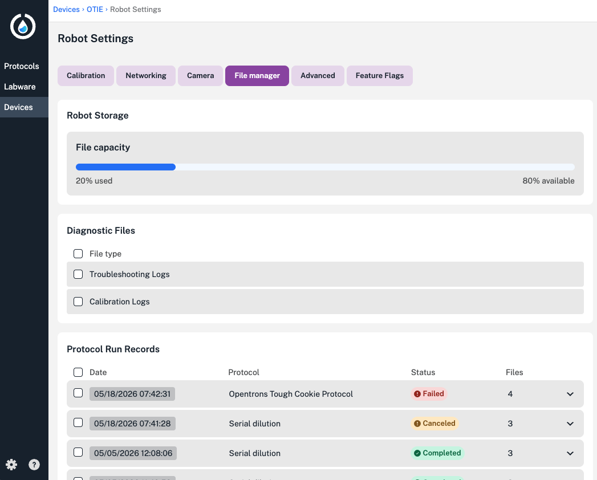
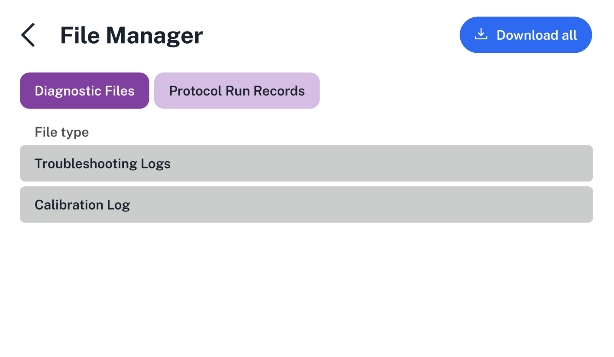
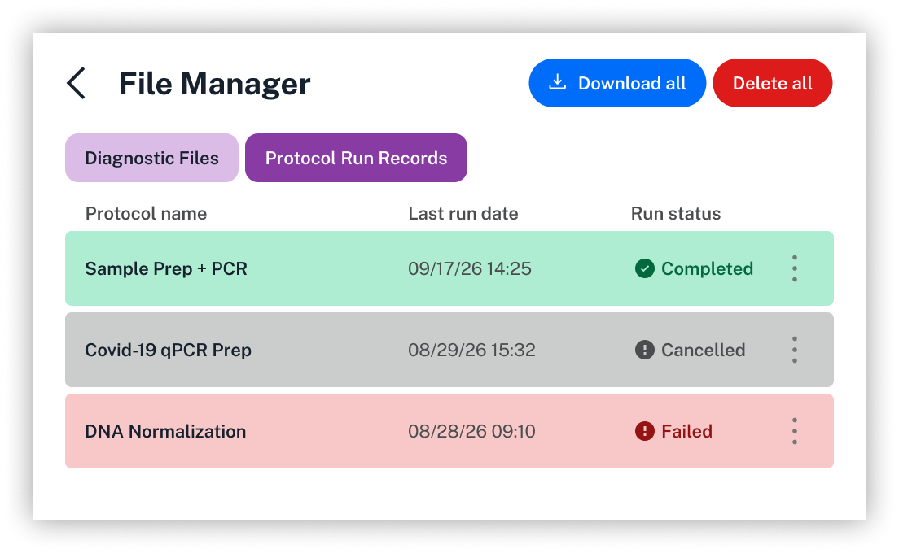

All Flex robots generate diagnostic files that record movements and system processes. During normal operation, there's no need to download or examine these files. However, if a failure or malfunction occurs, Opentrons Support may request these files, as they provide detailed information that helps identify and resolve problems with the robot. 

This article describes the types of diagnostic files your Flex generates and explains how to download and manage them using the file manager.

## Understanding Flex diagnostic files

In an idle state or during a protocol run, your Flex constantly writes data to several different files. Each type of file tracks data generated by different parts of the robot and its attachments. 

You can access these files from the [file mananger](#managing-flex-files), where you'll be able to download two types of files: troubleshooting logs or calibration logs. 

The following table summarizes the data captured in each file.

| Diagnostic file | Description |
|---|---|
| API | <ul><li>Troubleshooting log</li><li>The `api.log` records all movement and system activities performed by the robot.</li></ul> |
| Audit server | <ul><li>Troubleshooting log</li><li>The `audit_server.log` records the robot's audit log periods for Opentrons Flex Compliance Ready Software.</li></ul> |
| Auth server | <ul><li>Troubleshooting log</li><li>The `auth_server.log` records authentication processes on your Flex for Compliance Ready Software.</li></ul> |
| CAN Bus | <ul><li>Troubleshooting log</li><li>The `can_bus.log` records communications among the robot's motor controller boards.</li></ul> |
| Kernel | <ul><li>Troubleshooting log</li><li>The `kernel.log` records operating system data, like connected devices and network connections.</li></ul> |
| Remote access | <ul><li>Troubleshooting log</li><li>The `remote_access.log` records whether remote access is allowed, including activity in Jupyter notebook or through a SSH connection.</li></ul> |
| Serial | <ul><li>Troubleshooting log</li><li>The `serial.log` records communication between a Flex and its attached instruments and modules.</li></ul> |
| Server | <ul><li>Troubleshooting log</li><li>The `server.log` records the HTTP requests (e.g., `GET`, `POST`, `DELETE`) sent adn received by the robot server.</li></ul> |
| Touchscreen | <ul><li>Troubleshooting log</li><li>The `touchscreen.log` records the status of the front display panel.</li></ul> |
| Update server | <ul><li>Troubleshooting log</li><li>The `update_server.log` records activity related to robot software system updates.</li></ul> |
| Calibration | <ul><li>Calibration log</li><li>A `.JSON` file, named with your robot's name.</li><li>Contains pipette calibration data.</li></ul> |

The records in these log files can be difficult to interpret and understand but they're valuable for troubleshooting purposes. If you ever need to download the log files, the following instructions will step you through that process.

!!! note
    Some of the files listed above, like `auth_server.log`, `audit_server.log`, and `remote_access.log` are especially relevant on robots with Opentrons Flex Compliance Ready Software installed. 
    
    Compliance ready Flex robots also generate additional files called audit logs. Read more about these logs and they information they contain in the [Compliance Ready Software manual](../../compliance-ready-software/using/files.md#file-types).

## Downloading Flex files

To download your robot's diagnostic files from the Opentrons App:

1. Click **Devices** and locate the robot that you want the logs from.

2. For your selected robot, click the three-dot menu ( ⋮ ) and then click **Robot settings**.

3. Click the **File manager** tab to download and manage files.

4. Choose the type of file you need to download. You’ll be prompted to choose a save location when the log files are ready to download.

To download your robot's diagnostic files from the Flex touchscreen:

1. Tap the **Settings** tab and choose **File manager**. 

2. Choose a tab at the top of the screen: **Diagnostic files** or **Protocol Run Records**. 

3. Choose the files you'd like to download. You'll need to attach a USB device to your Flex to save files to. 

!!! note
     Flex produces a single `.zip` file that contains the troubleshooting logs. The file name includes the robot’s name followed by `_logs.zip`. For example, if your robot is called “Flex1," the log file will be named `Flex1_logs.zip`.

     Calibration logs are downloaded as a single .JSON file.

To read the logs, double-click the downloaded `.zip` file to decompress it. The individual logs will expand into a new folder in the same location as the downloaded file. Any text editor should be able to open these `.log`. and `.JSON` files.

## Managing Flex files

You can access the Flex file manager in the Opentrons App or on the Flex touchscreen. 

On your robot's details page in the Opentrons App, click the three-dot menu ( ⋮ ) and choose **Robot settings**. Click the **File manager** tab to download and manage files. 

<figure class="screenshot" markdown>

<figcaption>View file capacity and download or delete diagnostic files and protocol run records.</figcaption>
</figure>

Click the boxes on the left to select files or file types for download. From the file manager, you can download diagnostic files or protocol run records, which contain specific data for each individual protocol run.

The file manager also includes a look at robot storage, which is limited to data from 20 recent protocol runs. When you select protocol run records, you can choose between downloading and deleting those files. Your Flex will automatically delete protocol run records when it reaches its storage capacity. 

On the Flex touchscreen, tap the **Settings** tab, then choose **File manager** from the list of options.

Choose between the **Diagnostic Files** and **Protocol Run Records** tabs.

<figure class="screenshot" markdown>

<figcaption>Choose between diagnostic files and protocol run records.</figcaption>
</figure>

In the **Protocol Run Records** tab, use the three-dot menu ( ⋮ ) to download an individual file or tap **Download all** at the top of the screen. 

<figure class="screenshot" markdown>

<figcaption>Tap to download an individual protocol run record, or all of them.</figcaption>
</figure>

Just like in the Opentrons App, you can download protocol run records individually or all at once. You'll need to attach a USB drive to your Flex to download files directly from the touchscreen.