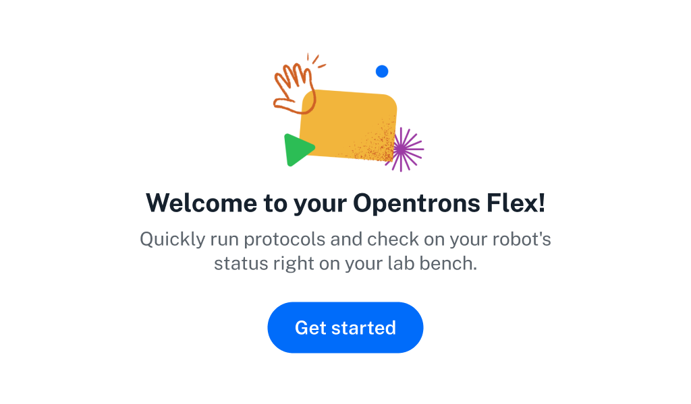
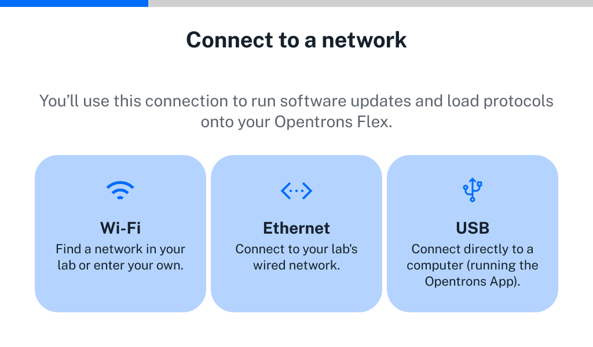
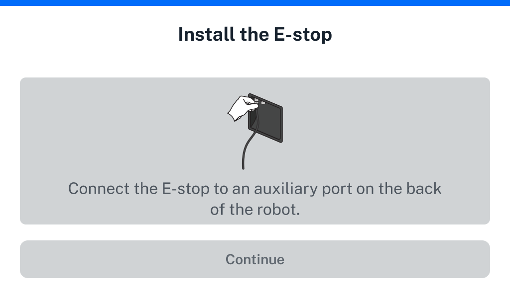
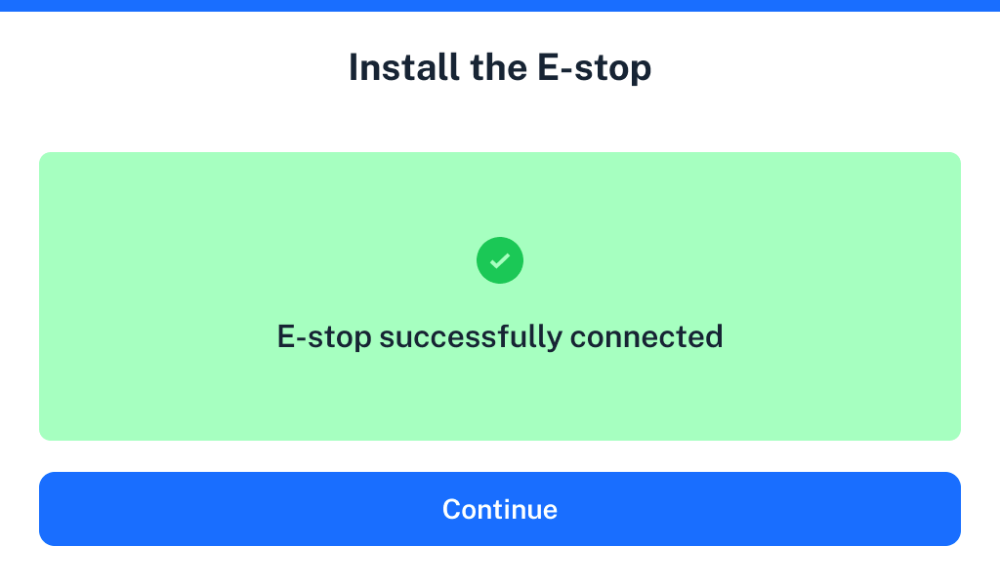

Perform basic setup on the touchscreen before connecting any other hardware to your Flex. The robot will guide you through connecting to your lab network, updating to the latest software, and personalizing Flex by giving it a name.

## Power on

When you power on Flex, the Opentrons logo will appear on the touchscreen. After a few moments, it will show the "Welcome to your Opentrons Flex" screen.

<figure class="screenshot" markdown>

<figcaption>The Opentrons Flex welcome screen. You should only see this screen when you start your Flex for the first time.</<figcaption>
</figure>

## Connect to a network or computer

Follow the prompts on the touchscreen to get your robot connected so it can check for software updates and receive protocol files. There are three connection methods: Wi-Fi, Ethernet, and USB.

!!! note
    Always use the best available internet connection with your Flex. Avoid congested networks or wireless networks with poor signal, as this can affect the robot update and startup processes. 
    
    Opentrons recommends using an Ethernet connection for initial setup.

<figure class="screenshot" markdown>

<figcaption>Network connection options. You need to have internet connectivity to set up Flex.</figcaption>
</figure>

### Ethernet (recommended)

Connect your Flex to a network switch, hub, or router with an Ethernet cable. Making this initial connection via Ethernet cable ensures the robot has a stable internet connection to download any required software or *firmware* updates. After the Flex has updated and restarted, you can then switch to a wireless network if desired.

### Wi-Fi

Use the touchscreen to connect to Wi-Fi networks that are secured with WPA2 Personal authentication (most networks that only require a password to join fall under this category).

!!! tip 
    - **Use Ethernet first**: As noted above, using Ethernet for the first connection makes setup and software updates more reliable. After updating, you can then connect the robot to a wireless network.
    - **Avoid "guest" Wi-Fi**: These networks may be congested and not provide enough security for your Flex.
    - **No captive portals**: Flex does not support captive portals (networks that don't have a password but load a webpage to authenticate users after connecting). Captive portals are commonly found in hotels, airports, or other public locations.

You can also connect to an open Wi-Fi network, but this is not recommended.

!!! warning
    Connecting to an open Wi-Fi network will allow anyone in range of the network signal to control your Opentrons Flex robot without authentication.

If you need to connect to a Wi-Fi network that uses enterprise authentication (including "eduroam" and similar academic networks that require a username and password), first connect to the Opentrons App by Ethernet or USB to complete initial setup. Then connect to the enterprise Wi-Fi network in the networking settings for your Flex. To access the networking settings:

1.  Click **Devices** in the left sidebar of the Opentrons App.

2.  Click the three-dot menu (⋮) for your Flex and choose **Robot Settings**.

3.  Click the **Networking** tab.

Select your network from the dropdown menu or choose "Join other network..." and enter its SSID. Choose the enterprise authentication method that your network uses. The supported methods are:

- EAP-TTLS with TLS

- EAP-TTLS with MS-CHAP v2

- EAP-TTLS with MD5

- EAP-PEAP with MS-CHAP v2

- EAP-TLS

Each of these methods requires a username and password, and depending on your exact network configuration may require certificate files or other options. Consult your facility's IT documentation or contact your IT manager for details of your network setup.

### USB 

Connect the provided USB A-to-B cable to the robot's USB-B port and an open port on your computer. Use a USB B-to-C cable or a USB A-to-C adapter if your computer does not have a USB-A port.

To proceed with setup, the connected computer must have the Opentrons App installed *and running*. For details on installing the Opentrons App, see the [App Installation section][app-installation].

!!! note "Note for Linux Users"
    If the Opentrons App shows “Not connected via USB” on Ubuntu, open a terminal and give your user account permission to access the robot’s USB port.

    1. From the terminal, run `sudo usermod -a -G dialout $USER`
    2. Log out of your Linux account entirely (or restart your computer) and log back in for the change to take effect.

## Install software updates

Now that you've connected to a network or computer, the robot can check for software and firmware updates and download them if needed. If there is an update, it may take a few minutes to install. Once the update is complete, the robot will restart.

## Attach Emergency Stop Pendant

Connect the included Emergency Stop Pendant (E-stop) to an auxiliary port (AUX-1 or AUX-2) on the back of the robot.

<figure class="screenshot side-by-side" markdown>

<figcaption>Before and after connecting the Emergency Stop Pendant.</figcaption>
</figure>

Attaching and enabling the E-stop is *mandatory* for attaching instruments and running protocols on Flex. For more information on using the E-stop during robot operation, see the [When to Use the E-stop section][when-to-use-the-e-stop].

## Give your robot a name

Naming your robot lets you easily identify it in your lab environment. If you have multiple Opentrons robots on your network, make sure to give them unique names. Once you've confirmed your robot's name, you'll be taken to your Opentrons Flex Dashboard. Likely the next step you'll want to take is [attaching instruments](instruments.md).
