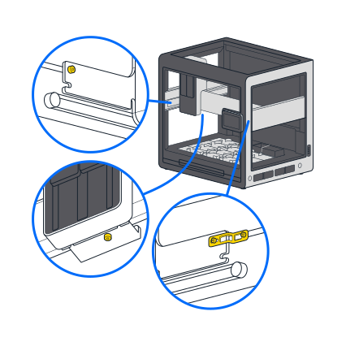

This section provides advice and instructions about how to move your Opentrons Flex robot over short and long distances.

## Short moves

A short move spans a range of distances from "let's just move it over a little bit" to across the lab, down the hall, or another floor in your building. In these cases, you can move your Flex by hand. Transporting it on a hand cart is also a good option.

!!! warning
    Flex weighs 88.5 kg (195 lbs). As a result, moving or lifting it requires a team with sufficient personnel to ensure safe handling.

Reattach the lift handles to move your Flex to a new, nearby location. Lifting and carrying the Flex by its handles is the right way to move the robot short distances. Remove the handles and store them in the User Kit after the move is complete. To prevent damaging the robot, always use the lift handles to pick it up and move it. Do not grab the frame to lift or move your robot.

## Long-distance moves

A long-distance move transports your Flex off the grounds of your university, facility, or institution. Across town, to a new city, state, province, or country are all examples of a long-distance move. In this case, you'll need to pack the Flex to protect it from the elements, shocks, and rough movements that may occur while in transit.

If you've kept the shipping crate and internal supports that came with your Flex, you can repackage it in these materials for a long-distance move. Follow the [unboxing steps](unboxing.md) in reverse order to prepare your Flex for a long-distance move. Basically, you should:

- Disconnect the power and network cable, if attached.

- Remove all attached hardware and labware.

- Reattach the deck plates.

- Lock the gantry (see the [General Moving Advice section][general-moving-advice] below).

- Remove and store the window panels.

If you kept the original crate:

- Reattach the shipping frame to the Flex and secure it to the pallet base using the L-brackets.

- Add padding and reassemble the shipping crate.

If you don't have the original crate and related material, contact a reputable shipping company. They can manage the packing, transportation, and delivery process for you.

## General moving advice

### Disconnect power and network cables

Before moving your Flex, don't forget to:

- Turn off the power and unplug it from the power supply.

- Disconnect the Ethernet or USB cable, if used.

### Lock the gantry

Before moving your Flex, reinsert the locking screws to hold the gantry in place. The gantry locking points are located:

- On the left side rail near the front of the robot.

- Underneath the vertical gantry arm.

- On the right side rail near the front of the robot. Locking this part of the gantry requires the small orange bracket and two locking screws.

### Home the gantry

You may not want to lock the gantry if you're only moving the robot to a nearby location. If you decide not to lock it, at least use the touchscreen or the Opentrons App to send the gantry to its home position before powering it down.

To home the gantry via the touchscreen, tap the three-dot menu (⋮) and then tap **Home gantry**. 

To home the gantry via the Opentrons App:

- Click **Devices**.

- Click on your Flex in the device list.

- Click the three-dot menu (⋮) and then click **Home gantry**.

### Remove modules

In-deck modules and other attachments add extra weight to your Flex. They also affect the robot's center of gravity, which can make it feel "tippy" when lifting it. To help lighten and balance the robot, remove any attached instruments and labware before you pick it up.

### Reinstall deck slots

We recommend reattaching the deck slots for a long-distance move. Securing the slots in their original locations helps prevent accidental loss.

Reattaching the deck slots for short moves around the lab is optional.

### Post-move recalibration

You should recalibrate any instruments and modules after reinstalling them. For more details on [module calibration](../modules/calibration.md), see the Modules chapter.

## Final thoughts about moving

Your Flex is a sturdy and well-built machine, but it is also a precise scientific instrument designed to exacting tolerances. As a result, you should treat it with care when relocating it within your local work area or sending it across the country. This means following the guidance provided here *and* using your own common sense about how to transport an expensive piece of laboratory equipment. Bottom line: when moving your Flex, err on the side of caution and extra padding.

If you have questions or concerns about relocating your Flex, contact us at <support@opentrons.com>.
