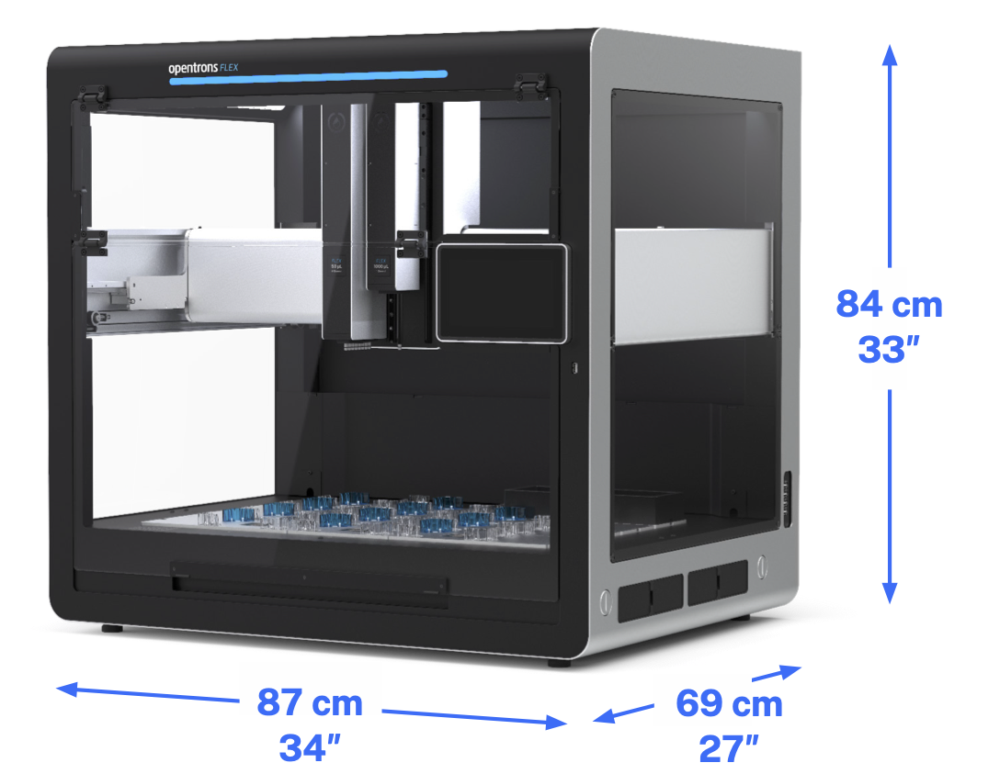
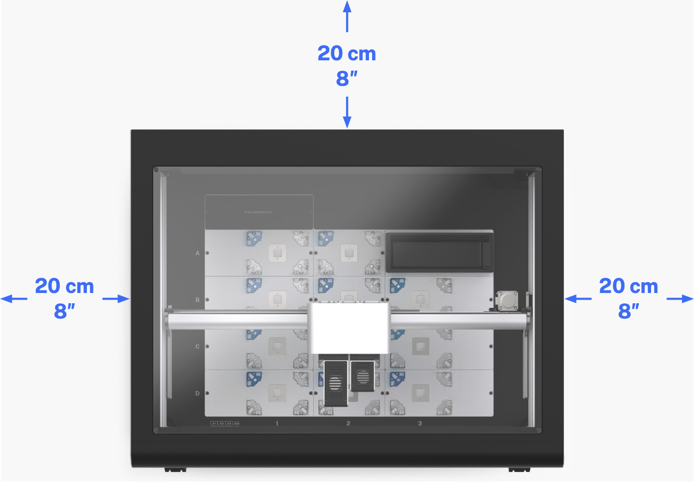

Before setting up Opentrons Flex, make sure that your installation site meets all of the requirements in this section. And follow all of the safety guidance here and throughout the installation instructions.

## Where to place Opentrons Flex

Space is a valuable commodity in almost every lab. Your Flex is going to need some—but not too much, as it's designed to fit on half of a standard lab bench. Make sure that you have a space that meets the following criteria.

- **Bench surface:** Stationary, sturdy, level, water-resistant surface. Tables or benches with wheels (even locking wheels) are not recommended. Flex moves quickly and has a lot of mass, which can shake or imbalance lightweight or movable tables.

- **Weight bearing:** The robot weighs 88.5 kg (195 lb). Moving or lifting it requires a team with sufficient personnel to ensure safe handling. Place the robot on a surface that can readily support its weight plus the weight of any modules, labware, liquids, or other lab equipment to be used in your applications.

- **Operating space:** The robot's base dimensions are 87 cm W x 69 cm D x 84 cm H (about 34" x 27" x 33"). Flex needs 20 cm (8") of side and back clearance for cables, USB connections, and to dissipate exhaust from modules that heat and cool.

!!! warning
    *Do not* position the sides or back of the Flex flush against a wall.

<figure markdown>

<figcaption>Opentrons Flex base dimensions.</figcaption>
</figure>

<figure markdown>

<figcaption>Top view of Opentrons Flex, showing minimum side and back clearance.</figcaption>
</figure>

## Power consumption { #power-consumption-flex }

Opentrons Flex should be connected to a wall outlet at or near the bench location where you install it. Only connect Flex to circuits that can accommodate its peak power draw:

- **Input power:** 36 VDC, 6.1 A

- **Idle consumption:** 30–40 W

- **Typical consumption:** 40–120 W

- **Peak consumption:** Up to 250 W

| Power Consumption Type | Description |
| :--------------------- | :---------- |
| Idle                   | The amount of power the robot uses while on and inactive (not running a protocol). Flex does not have a low-power sleep or standby mode.                                                                                                                               |
| Typical                | The average power the robot and attached instruments use when running a protocol. Different protocols and instruments can cause variations within the typical power consumption range. This range does not account for separately powered modules used in protocols. |
| Peak                   | The highest instantaneous power draw. For example, during fast gantry acceleration, or other high-energy movements, the robot can draw more power and exceed typical power consumption values. The peak consumption value may also be useful for estimating current handling capacity (and circuit breaker selection) for an AC circuit that powers multiple robots. |

Along with the conditions described above, total power consumption also depends on:

- The amount and type of movement executed during a protocol.

- The amount of time the robot spends idle.

- The status lights of the robot.

- How many instruments are attached.

!!! note 
    Always account for other electronics that consume power on the same circuit, including Flex modules with their own power supplies. For example, the Thermocycler Module has a peak power consumption (630 W) that is much greater than the Flex robot itself. If necessary, consult the manager of your facility to make sure it meets your equipment's peak power requirements.

## Environmental conditions { #environmental-conditions-flex }

Environmental conditions for recommended use, acceptable use, and storage vary:

|                 | Recommended for system operation | Acceptable for system operation | Storage and transportation |
| :---------------------- | :----------------------------------- | :---------------------------------- | :----------------------------- |
| **Ambient temperature** | +20 to +25 °C                        | +2 to +40 °C                        | −10 to +60 °C                  |
| **Relative humidity** | 40–60%, non-condensing            | 30–80%, non-condensing (below 30 °C) | 10–85%, non-condensing (below 30 °C) |
| **Altitude** | Approximately 500 m above sea level | Up to 2000 m above sea level    | Up to 2000 m above sea level |

Opentrons has validated the performance of Opentrons Flex in the conditions recommended for system operation, and operation in those conditions should provide optimal results. Flex is safe to use in conditions acceptable for system operation, but results may vary. Do not power on or use Flex in conditions outside of those bounds. The storage and transportation conditions only apply when the robot is completely disconnected from power and other equipment.

## Network ports

Flex requires an internet connection for initial setup. After setup, it's possible to run Flex without a network connection, although some features of Flex and the Opentrons App expect local area network access over certain ports.

Network ports are software-defined connections between devices on a network. Each numbered port handles data for a specific network protocol or service. Flex uses these ports for services like software updates, file transfers, or to accept command-line instructions from a terminal.

The following table lists the network ports used by Flex, along with their function. All listed ports use TCP, except for port 5353, which uses UDP.

| Port number | Description |
| :---------- | :---------- |
| **22** | Used to make a Secure Shell (SSH) connection. See [Command-line operation over SSH](../advanced-operation/command-line.md). | **80** | Used for HTTP traffic. |
| **443** | Used for HTTPS traffic. The Opentrons App uses this port to check for and download software updates. |
| **1883** | Used for [MQTT messages](https://mqtt.org). Flex sends realtime notifications to the Opentrons App using MQTT. This reduces network traffic and shortens delays within the app, compared to polling. |
| **5353** | Used for Multicast DNS ([mDNS or zero-configuration networking](https://en.wikipedia.org/wiki/Zero-configuration_networking)). The Opentrons App relies on mDNS to find Flex robots on a network. |
| **31950** | Used by the robot server for [HTTP API commands](https://docs.opentrons.com/http/api_reference.html). |
| **48888** | Used for the built-in [Jupyter Notebook server](../advanced-operation/jupyter-notebook.md), which you can connect to with your web browser. |

If you're having trouble with these services, consult your facility's IT documentation or contact your IT manager for assistance with your network setup.