Congratulations! Your Opentrons Flex has arrived and you've prepared a space for it in your lab. Let's open that monster crate, remove the robot, and prepare it for operation. The information in this section provides a parts list and instructions that walk you through the steps required to get the Flex unboxed, set up, and ready for use. We've divided the setup procedure into three parts:

- [Part 1][part-1-remove-the-crate] covers disassembling the crate.

- [Part 2][part-2-release-the-flex] covers detaching the Flex from the crate and moving it to a final assembly location.

- [Part 3][part-3-final-assembly-and-power-on] covers final assembly and powering on the robot for the first time.

## Effort and time required

You'll want to ask for assistance with unboxing, lifting, moving, and assembling the robot. You'll need to budget about 30 minutes to an hour for this effort.

!!! warning
    Flex weighs 88.5 kg (195 lbs). As a result, moving or lifting it requires a team with sufficient personnel to ensure safe handling.

## Crate and packing material

Unpacking a Flex gives you an awesome robot, but you're also left with several large crate panels along with assorted shipping components and padding. While you could discard this material, we encourage you to keep these items if storage space is available. The packaging is reusable, which helps prepare your Flex for shipping if you ever need to send it somewhere else (e.g., to a conference or a new facility) in the future.

## Product elements

The Flex ships with the components listed below. Pipettes, the gripper, and modules come in separate packaging from the main Flex crate, even if you purchased them together as a workstation.

<figure markdown>
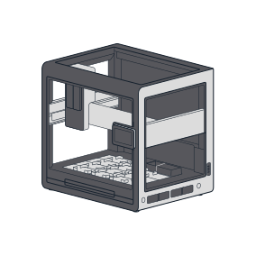
<figcaption>(1) Opentrons Flex robot</figcaption>
</figure>

<figure markdown>
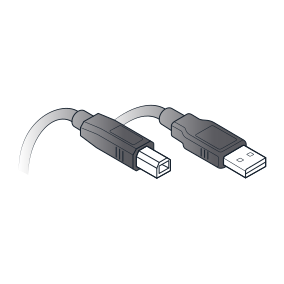
<figcaption>(1) USB cable</figcaption>
</figure>

<figure markdown>
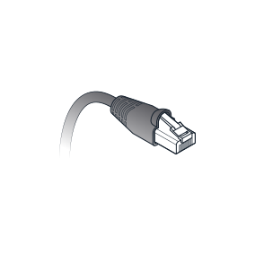
<figcaption>(1) Ethernet cable</figcaption>
</figure>

<figure markdown>
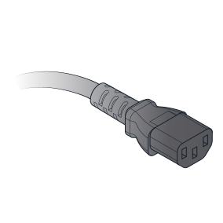
<figcaption>(1) Power cable</figcaption>
</figure>

<figure markdown>

<figcaption>(5) L-keys

(12 mm hex, 1.5 mm hex, 
2.5 mm hex, 3 mm hex, 
T10 Torx)
</figcaption>
</figure>

<figure markdown>
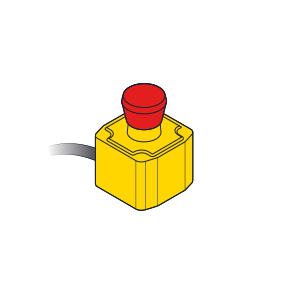
<figcaption>(1) Emergency Stop Pendant</figcaption>
</figure>

<figure markdown>
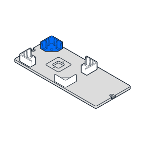
<figcaption>(1) Deck slot with labware clips</figcaption>
</figure>

<figure markdown>
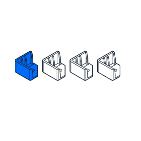
<figcaption>(4) Spare labware clips</figcaption>
</figure>

<figure markdown>
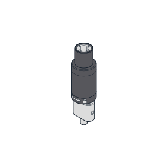
<figcaption>(1) Pipette calibration probe</figcaption>
</figure>

<figure markdown>

<figcaption>(4) Carrying handles and caps</figcaption>
</figure>

<figure markdown>

<figcaption>(1) Top window panel</figcaption>
</figure>

<figure markdown>
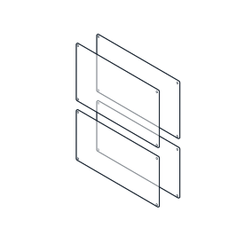
<figcaption>(4) Side window panels</figcaption>
</figure>

<figure markdown>
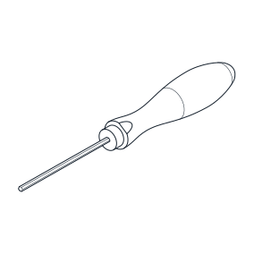
<figcaption>(1) 2.5 mm hex screwdriver</figcaption>
</figure>

<figure markdown>
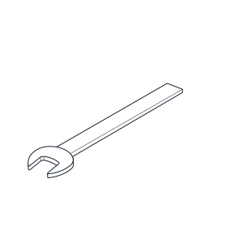
<figcaption>(1) 19 mm wrench</figcaption>
</figure>

<figure markdown>

<figcaption>(16 + spares) Window screws

(M4x8 mm flat head)

</figcaption>
</figure>

<figure markdown>
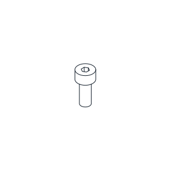
<figcaption>(10) Spare deck slot screws

(M4x10 mm socket head)

</figcaption>
</figure>

<figure markdown>
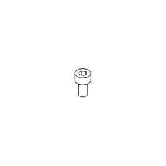
<figcaption>(12) Spare deck clip screws

(M3x6 mm socket head)

</figcaption>
</figure>

## Part 1: Remove the crate

Opentrons ships your Flex in a sturdy plywood crate. The shipping crate uses hook and latch clamps to secure the top, side, and bottom panels together. Using latches, instead of nails or screws, means you won't need a crowbar (or a lot of force) to disassemble the crate, and you can reassemble it later, if needed.

!!! note 
    Crate edges can get roughed up during shipping. You may want to use work gloves to protect your hands from wood splinters.

To release the latches, flip the latch tab up and turn it to the left (counterclockwise). This action moves the clamp arm out of its corresponding retaining bracket. You can then flip the latch arm away from the crate.

1. Unlock the eight latches holding the top to the sides.

    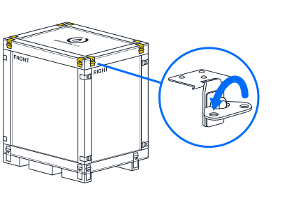

2. Remove the top panel after releasing the latches.

3. Cut open the blue shipping bag, remove these items from the padding, and set them aside:

    - User Kit
    
    - Power, Ethernet, and USB cables
    
    - Emergency Stop Pendant

    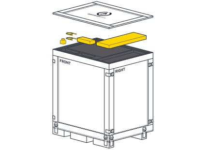

4. Remove the top piece of foam padding. The padding protects the installed top window panel.

5. Unlock the remaining 16 latches holding the side panels to each other and the base of the crate.

6. Remove the side panels and set them aside.

    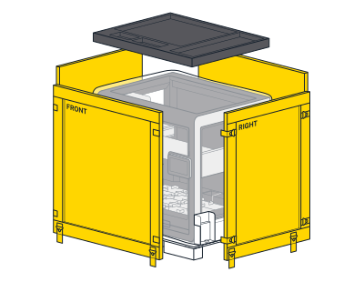

## Part 2: Release the Flex

After completing the steps in Part 1, you should now see a robot that's in a protective bag and attached to orange steel mounting components. The bag encloses the robot and protects it from the outside environment. Steel brackets secure the robot to the bottom of the crate. Two shipping frames support the robot, distributing its weight evenly, and keeping it rigid so it doesn't warp during shipping.

Continue to unpack the Flex and get it off the crate base.

7. Using the 19 mm wrench from the User Kit, unbolt the brackets from the crate bottom. You can discard the brackets, or save them for future use.

    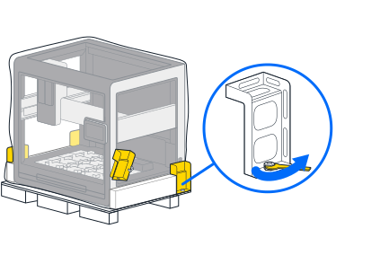

8. Pull or roll the shipping bag all the way down to expose the entire robot.

    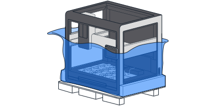

9. Using a team with sufficient personnel to move the Flex safely, grab the handholds in the orange shipping frames on either side of the base, lift the robot off the crate, and set it down on the floor.

    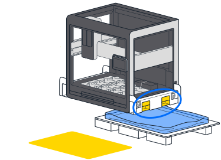

10. Using the 12 mm hex L-key from the User Kit, remove the four bolts holding the shipping frames to the Flex. Save or discard the frames and bolts.

    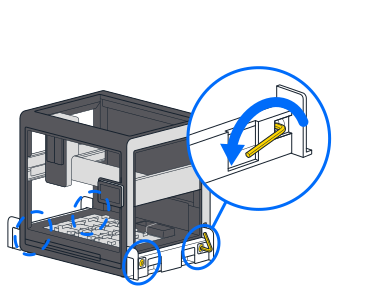

11. Remove the four aluminum handles from the User Kit. Screw the handles into the same locations that held the 12 mm shipping frame bolts.

    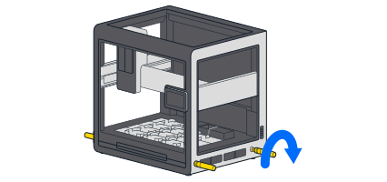

12. Using a team with sufficient personnel to move the Flex safely, lift it by its *carrying handles* and move it to a workbench for final assembly.

    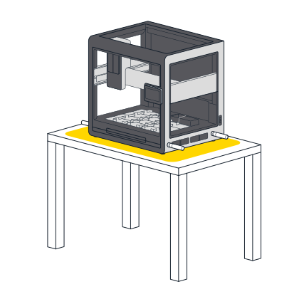

## Part 3: Final assembly and power on

After moving the Flex to a temporary work area, or its permanent home, it's time to put the finishing touches on your new robot.

13. If you have moved the robot to its final, working location, remove the carrying handles and replace them with the *finishing caps*. The caps close the handle openings in the frame and give the robot a clean appearance. Return the handles to the User Kit for storage.

    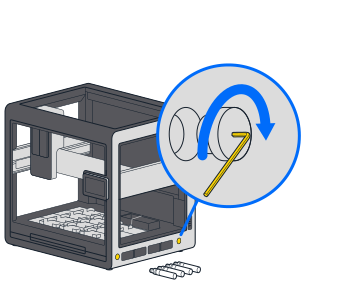

14. Using the 2.5 mm screwdriver from the User Kit, remove the locking screws from the gantry. These screws prevent the gantry from moving while in transit. The gantry locking screws are located:

    - On the left side rail near the front of the robot.
    
    - Underneath the vertical gantry arm.
    
    - On the right side rail near the front of the robot in an orange bracket. There are two screws here.

    

    The gantry moves easily by hand after removing all the shipping screws.

15. Cut and remove the two rubber bands that hold the trash bin in place during shipping.

16. Attach the power cord to Flex and plug it into the wall outlet. Make sure the deck area is free of obstructions. Flip the power switch on the back left of the robot. Once powered on, the gantry moves to its home location and the touchscreen displays additional configuration instructions.

    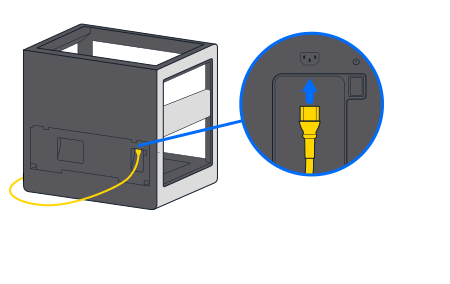

Now that your Flex is out of the box and ready to go, continue to the [First Run section](first-run.md).
