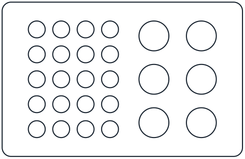

Every labware you use on Flex requires a _labware definition_ that contains all the information Flex needs to work with the labware. This includes information about the physical shape of the labware, how pipettes and the gripper should interact with it, and what the labware should be called on the touchscreen and in the Opentrons App.

The Flex robot software and Opentrons App include the labware definitions for everything available in the [Opentrons Labware Library](https://labware.opentrons.com/). 

Custom labware is labware that's not listed in the Opentrons Labware Library. You can use other common or unique labware items with the Flex by accurately measuring and recording the characteristics of that object and saving that data in a JSON file. When imported into the app, the Flex and the Python Protocol API use that JSON data to interact with your labware. Opentrons provides tools and services, which we'll examine below, to help you use the Flex with custom labware. 

!!! note
    While you cannot create custom labware within the Python Protocol API, you can use custom labware with the available API methods. However, you need to define your custom labware first and import it into the Opentrons App. Then your custom labware is available to the Python API and the robot.

## Custom Labware Creator 

The [Custom Labware Creator](https://labware.opentrons.com/create/) is a no-code, web-based tool that uses a graphical interface to help you create a labware definition file. Labware Creator produces a JSON labware definition file that you import into the Opentrons App. After that, your custom labware is available to the Flex robot and the Python API. 

You can use the Custom Labware Creator if your labware meets the following criteria:

- Wells and tubes are uniform and identical.
- All rows are evenly spaced (the space between rows is equal).
- All columns are evenly spaced (the space between columns is equal).
- The labware fits perfectly in one deck slot.

| Layout {style="width: 200px;"} | Description |
| ------ | ----------- |
|  | :material-check-bold:{ .opentrons-blue } **Regular**  All columns are evenly spaced and all rows are evenly spaced. Columns do not need to have the same spacing as rows. |
|  | :material-check-bold:{ .opentrons-blue } **Regular**  The grid does not have to be in the center of labware.  |

For other labware, consider the Custom Labware Service, outlined below. Or you can reference the complete *JSON schema* to create a labware definition from scratch, although this is not recommended.

## Custom Labware Service 

Get in touch with us if the labware you'd like to use isn't available in the library, if you can't create your own definitions, or because a custom item includes different shapes, sizes, or other irregularities described below. 

- Well or tube shapes vary.
- Rows are not evenly spaced.
- Columns are not evenly spaced.
- The labware is smaller than one deck slot (requires adapter) or spans multiple deck slots.

| Layout {style="width: 200px;"} | Description |
| ------ | ----------- |
|  | :octicons-x-12:{ .grey } **Irregular**  Rows are evenly spaced but **columns are not evenly spaced.**  |
|  | :octicons-x-12:{ .grey } **Irregular**  Columns/rows are evenly spaced but **wells are not identical.** |
|  | :octicons-x-12:{ .grey } **Irregular**  There is **more than one grid.** |

If you need help creating custom labware definitions, contact Opentrons Support (<support@opentrons.com>). They will work to design custom labware definitions based on your requirements. This is a fee-based service.

## JSON labware schema 

A JSON file is the blueprint for Opentrons standard and custom labware. This file contains and organizes labware data according to the design specifications set by the default schema. 

A schema is a framework for organizing data. It sets the rules about what information is required or optional and how it’s organized in the JSON file. If you’re interested, take a moment to review [our labware schema](https://github.com/Opentrons/opentrons/blob/edge/shared-data/labware/schemas). For an actual example, see the definition for the [Opentrons 96 PCR Adapter](https://github.com/Opentrons/opentrons/blob/edge/shared-data/labware/definitions/2/opentrons_96_pcr_adapter/1.json). The following table lists and defines the items in the Opentrons labware schema.

| Property {style="width: 25%;"} | Data type | Definition                                   |
| :------------------ | :-------- | :------------------------------------------- |
| `schemaVersion`     | Number    | Schema version used by a labware. The current version is `2`. |
| `version`           | Integer   | An incrementing integer that identifies the labware version. Minimum version is `1`. |
| `namespace`         | String    | See `safeString` in the JSON definitions section below. |
| `metadata`          | Object    | Properties used for search and display. Accepts only:<ul><li>`displayName` (String): An easy-to-remember labware name.</li><li>`displayCategory`: Labels used in the UI to categorize labware. See `displayCategory` in the JSON definitions section below.</li><li>`displayVolumeUnits` (String): Labels used in the UI to indicate volume. Must be either `µL`, `mL`, or `L`.</li></ul> |
| `brand`             | Object    | Information about the labware manufacturer or those products the labware is compatible with. |
| `parameters`        | Object    | Internal parameters that describe labware characteristics. Accepts only:<ul><li>`format` (String): Determines labware compatibility with multichannel pipettes. Must be one of `96Standard`, `384Standard`, `trough`, `irregular`, or `trash`.</li><li>`quirks` (Array): Strings describing labware behavior. See the [Opentrons 96 Deep Well Adapter](https://github.com/Opentrons/opentrons/blob/03cd0336c6051c05fa66088fabec426c7b751a85/shared-data/labware/definitions/2/opentrons_96_deep_well_adapter_nest_wellplate_2ml_deep/1.json#L1108) definition.</li><li>`isTiprack` (Boolean): Indicates if labware is a tip rack (`true`) or not (`false`).</li><li>`tipLength` (Number): Required if labware is a tip rack. Specifies tip length (in mm), from top to bottom, as indicated in technical drawings or as measured with calipers.</li><li>`tipoverlap` (Number): Required if labware is a tip rack. Specifies how far tips on a tip rack are expected to overlap with the pipette's nozzle. Defined as tip length minus the distance between the bottom of the pipette and the bottom of the tip. The robot's calibration process may fine-tune this estimate.</li><li>`loadName`: Name used to reference a labware definition (e.g., `opentrons_flex_96_tiprack_50_ul`).</li><li>`isMagneticModuleCompatible` (Boolean): Indicates if labware is compatible with the Magnetic Module.</li><li>`magneticModuleEngageHeight`: How far the Magnetic Module will move its magnets when used with this labware. See `positiveNumber` in the JSON definitions section below.</li></ul> |
| `ordering`          | Array     | An array that tracks how wells should be ordered on a piece of labware. See the [Opentrons 96 PCR Adapter](https://github.com/Opentrons/opentrons/blob/8569e32d2d918abb1f232f48a7b28385021215fd/shared-data/labware/definitions/2/opentrons_96_pcr_adapter/1.json#L2) example. |
| `cornerOffset`<wbr>`FromSlot` | Object    | Used for labware that spans multiple deck slots. Offset is the distance from the left-front-bottom corner of the slot to the left-front-bottom corner of the labware bounding box. Accepts only:<ul><li>`x` (number)</li><li>`y` (number)</li><li>`z` (number)</li></ul> For labware that does not span multiple slots, these values should be zero. See `positiveNumber` in the JSON definitions section below. |
| `dimensions`        | Object    | Outer dimensions (in mm) of a piece of labware. Accepts only:<ul><li>`xDimension` (length)</li><li>`yDimension` (width)</li><li>`zDimension` (height)</li></ul> See the [Opentrons 96 PCR Adapter](https://github.com/Opentrons/opentrons/blob/8569e32d2d918abb1f232f48a7b28385021215fd/shared-data/labware/definitions/2/opentrons_96_pcr_adapter/1.json#L26) example. |
| `wells`             | Object    | An unordered object of well objects, including position and dimensions. Each well object's key is the well's coordinates, which must be an uppercase letter followed by a number, e.g., A1, B1, H12. Each well object accepts the following properties:<ul><li>`depth` (Number): The distance (in mm) between the top and bottom of the well. For tip racks, depth is ignored in favor of `tipLength`, but the values should match.</li><li>`x` (Number): Location of the center-bottom of a well in reference to the left of the labware.</li><li>`y` (Number): Location of the center-bottom of a well in reference to the front of the labware.</li><li>`z` (Number): Location of the center-bottom of a well in reference to the bottom of the labware.</li><li>`totalLiquidVolume` (Number): Total well, tube, or tip volume in µL.</li><li>`xDimension` (Number): Length of a rectangular well.</li><li>`yDimension` (Number): Width of a rectangular well.</li><li>`diameter` (Number): Diameter of a circular well.</li><li>`shape` (String): Either `rectangular` or `circular`. If `rectangular`, specify `xDimension` and `yDimension`. If `circular`, specify `diameter`.</li></ul>For a circular well example, see the [Opentrons 96 PCR Adapter](https://github.com/Opentrons/opentrons/blob/8569e32d2d918abb1f232f48a7b28385021215fd/shared-data/labware/definitions/2/opentrons_96_pcr_adapter/1.json#L31). For a rectangular well example, see the [NEST 96 Deep Well Plate 2mL](https://github.com/Opentrons/opentrons/blob/8569e32d2d918abb1f232f48a7b28385021215fd/shared-data/labware/definitions/2/nest_96_wellplate_2ml_deep/2.json#L35). For dimension, depth, and volume, see `positiveNumber` in the JSON definitions section below. |
| `groups`            | Array     | Logical well groupings for metadata and display purposes. Changes in groups do not affect protocol execution. Each item in the array accepts: <ul><li>`wells` (Array): An array of wells (e.g., `["A1", "B1", "C1"]`) that share the same metadata. Array elements are strings.</li><li>`metadata` (Object): Metadata specific to a grid of wells. Accepts only:</li><ul><li>`displayName` (String): Human-readable name for the well group.</li><li>`displayCategory`: Labels used to categorize well groups. See `displayCategory` in the JSON definitions section below.</li><li>`wellBottomShape` (String): Bottom shape of a well. Available shapes are `flat`, `u`, or `v` only.</li></ul><li>`brand`: Brand information for the well group. See `brandData` in the JSON definitions section below.</li></ul> |
| `allowedRoles`      | Array     | Defines an item's role or purpose. If the `allowedRoles` field is missing from a definition, an item is treated as `labware`. Possible array items are only the following strings: <ul><li>`labware` (standard labware items)</li><li>`adapter` (items designed to hold labware)</li><li>`fixture` (items that are affixed to the deck)</li><li>`maintenance` (items not used in normal protocol runs)</li></ul> |
| `stackingOffset`<wbr>`WithLabware` | Object    | For labware that can stack on top of another piece of labware. Used to determine z-height (labware z height + adapter z height - overlap). See `coordinates` in the JSON definitions section below. |
| `stackingOffset`<wbr>`WithModule` | Object    | For labware that can stack on top of a module. Used to determine z-height (module labware offset z + labware z - overlap). See `coordinates` in the JSON definitions section below. |
| `gripperOffsets`    | Object    | Offsets added when calculating the coordinates the gripper should go to when picking up or dropping other labware on this labware. Includes a `default` object that includes two properties: <ul><li>`pickUpOffset`: Offset added to calculate the pick-up coordinates of labware placed on this labware.</li><li>`dropOffset`: Offset added to calculate the drop-off coordinates of labware placed on this labware.</li></ul> See `coordinates` in the JSON definitions section below. |
| `gripForce`         | Number    | Measured in newtons, this is the force which the gripper uses to grasp labware. Recommended values are between 5 and 16. |
| `gripHeightFrom`<wbr>`LabwareBottom` | Number    | Recommended z-axis height, from the labware bottom to the center of the gripper pads. |

## JSON labware definitions 

| Property {style="width: 25%;"}       | Data type | Definition                                   |
| :-------------- | :-------- | :------------------------------------------- |
| `positiveNumber` | Number    | Minimum: 0.                      |
| `brandData`     | Object    | Information about branded items. Accepts only: <ul><li>`brand` (String): Brand/manufacturer's name.</li><li>`brandId` (Array): OEM part numbers or IDs.</li><li>`links` (Array): Manufacturer URLs. Array items are strings.</li></ul> |
| `displayCategory` | String    | Must be one of: <ul><li>`tipRack`</li><li>`tubeRack`</li><li>`reservoir`</li><li>`trash`</li><li>`wellPlate`</li><li>`aluminumBlock`</li><li>`adapter`</li><li>`other`</li><li>`lid`</li></ul> |
| `safeString`    | String    | A string safe to use for load names and namespaces. Lowercase letters, numerals, periods, and underscores only. |
| `coordinates`   | Object    | Coordinates that specify a distance or position along the x-, y-, and z-axes. Accepts only: <ul><li>`x` (number)</li><li>`y` (number)</li><li>`z` (number)</li></ul> |