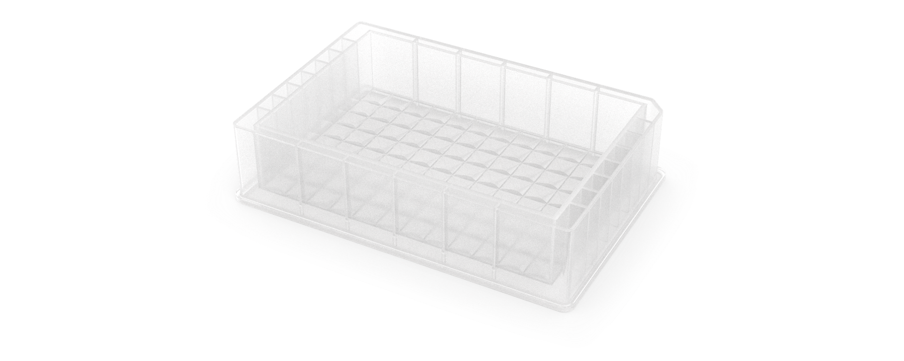
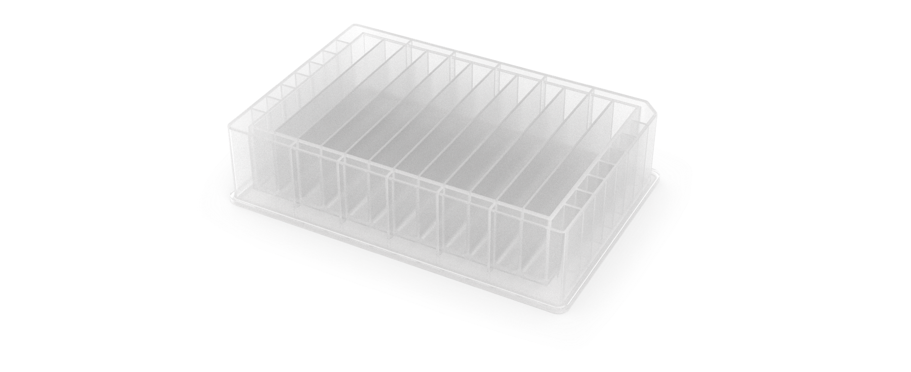
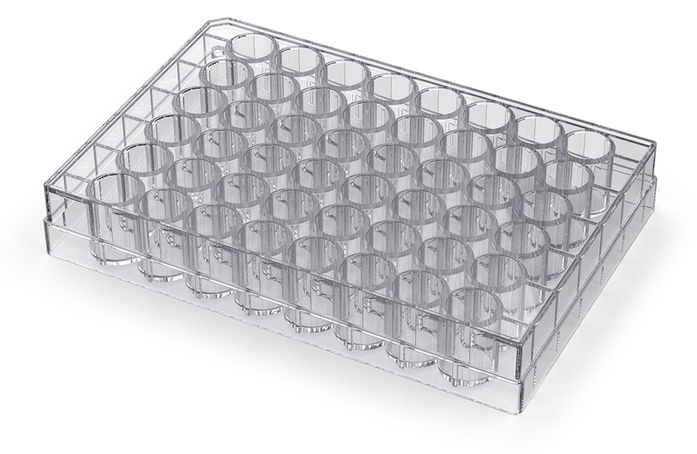
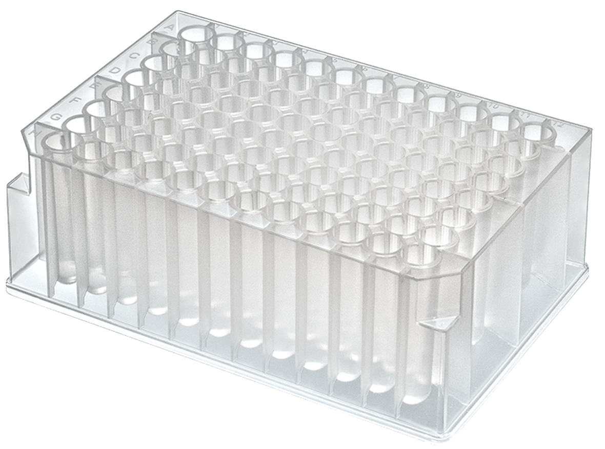
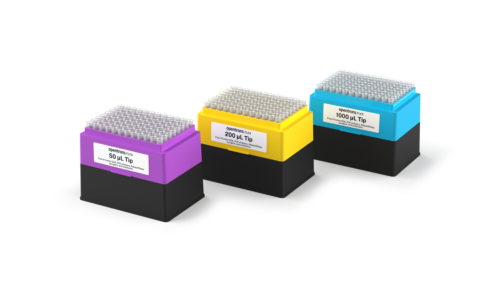
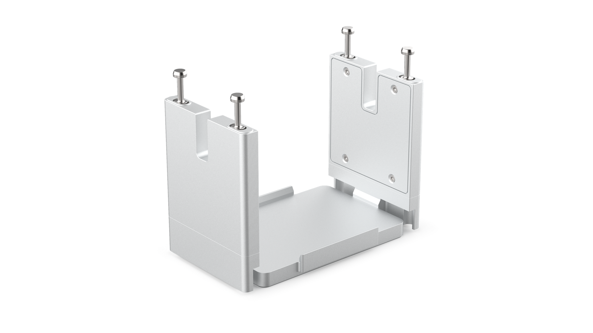
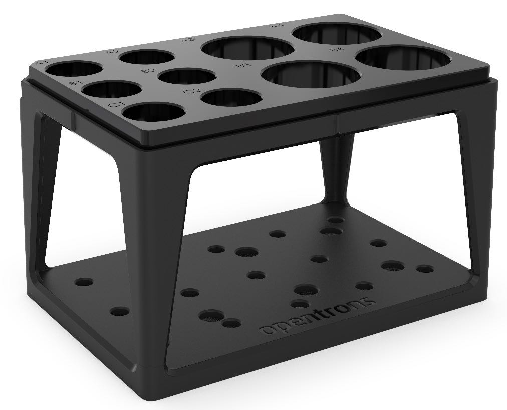
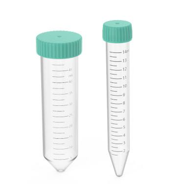
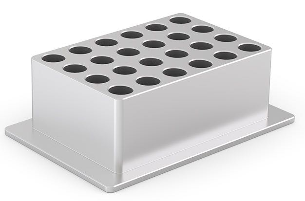
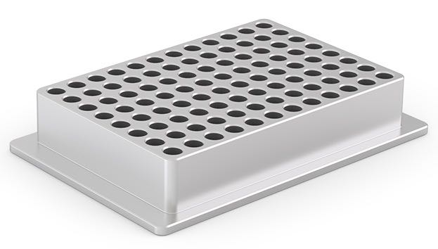

This section covers the different types of labware included in the Opentrons Labware Library for use with Flex. 

## Reservoirs 

Opentrons Flex works by default with single-well and multi-well reservoirs. [Reservoirs on the Opentrons Labware Library](https://labware.opentrons.com/?category=reservoir) are automation-ready right out of the box.

<figure class="side-by-side" markdown>

</figure>

### Custom reservoirs

Labware Library currently only includes reservoirs in 1-well and 12-well configurations, although other well configurations are possible.

Try creating a custom labware definition with the [Opentrons Labware Creator](https://labware.opentrons.com/create/) if a reservoir you'd like to use isn't listed in the Labware Library. A custom definition combines all the dimensions, metadata, shapes, volumetric capacity, and other information in a JSON file. The Opentrons Flex needs this information to understand how to work with your custom labware. See the [Labware Definitions section][labware-definitions] for more information. 

## Well plates 

The Opentrons Flex works by default with well plates in a variety of well configurations. This category includes standard depth and deep well plates, with various well bottom shapes. [Well plates on the Opentrons Labware Library](https://labware.opentrons.com/?category=wellPlate) are automation-ready right out of the box. 

<figure class="side-by-side" markdown>

</figure>

### Plates with fewer than 96 wells

The Labware Library includes plates with 12, 24, and 48 wells. Due to the grid configuration and spacing of the wells on these plates, they are only usable with 1-channel pipettes.

### 96-well plates 

The Labware Library includes many 96-well plates, including Opentrons and third-party plates. The 8-channel and 96-channel Flex pipettes are optimized to work with the 8×12 well grid on these plates. 8-channel pipettes in their full nozzle configuration pipette in an entire column of wells, and the 96-channel pipette in its full configuration pipettes to every well on the plate.

For a full example of a 96-well plate, reference the [Opentrons Tough 96 Well Plate 200 µL PCR Full Skirt definition](https://github.com/Opentrons/opentrons/blob/edge/shared-data/labware/definitions/2/opentrons_96_wellplate_200ul_pcr_full_skirt/3.json) on GitHub.

### 384-well plates 

The Labware Library includes 384-well plates for applications that require greater well density or smaller liquid quantities. The 8-channel and 96-channel Flex pipettes are optimized to work with the 16×24 well grid on these plates. 8-channel pipettes in their full nozzle configuration pipette in alternating wells within a column. The 96-channel pipette in its full configuration pipettes to one quarter of the wells on the plate (alternating in both dimensions, starting from well A1, A2, B1, or B2).

### Custom well plates

Try using the Opentrons Labware Creator to make a custom labware definition if a well plate you'd like to use isn't listed in the Labware Library. A custom definition combines all the dimensions, metadata, shapes, volumetric capacity, and other information in a JSON file. The Opentrons Flex reads this information to understand how to work with your custom labware. See the [Labware Definitions section][labware-definitions] for more information. 

## Lids

Opentrons Flex works by default with lids that fit on top of certain other labware to protect their contents. Labware Library contains lids that fit on well plates, as well as lids that are packaged with and fit on top of Opentrons Flex tip racks.

For a full example of a well plate lid, reference the [Opentrons Tough PCR Auto-Sealing Lid definition](https://github.com/Opentrons/opentrons/blob/edge/shared-data/labware/definitions/2/opentrons_tough_pcr_auto_sealing_lid/1.json) on GitHub. Importantly, the definition lists the other types of labware that the lid fits on.

## Tips and tip racks 

Opentrons Flex tips come in 50 µL, 200 µL, and 1000 µL sizes. These are clear, non-conducting polypropylene tips that are available with or without filters. They're packaged sterile in racks that hold 96 tips and are free of DNase, RNase, protease, pyrogens, human DNA, endotoxins, and PCR inhibitors. Racks also include lot numbers and expiration dates. 

### Tip racks 

Unfiltered and filtered tips are bundled into a rack that consists of a reusable base plate, a mid-plate that holds 96 tips, and a lid. 

To help with identification, the tip rack mid-plates are color coded based on tip size: 

- 50 µL: magenta 
- 200 µL: yellow 
- 1000 µL: blue 

When ordering or reordering, tips and racks come in two different packaged configurations: 

- **Racks:** Consist of separately shrink-wrapped tip racks (base plate, mid-plate with tips, and lid). Racked configurations are best when cleanliness is paramount, to avoid cross-contamination, or when your protocols don't allow for base plate or component reuse. 
- **Refills:** Consist of one complete tip rack (base plate, mid plate with tips, and lid) and individual tip containers. Refill configurations are best when your protocols allow for base plate or component reuse. 

### Tip-pipette compatibility 

Flex pipette tips work with all single- and multi-channel Opentrons Flex 50 µL and 1000 µL pipettes. Flex pipette tips are designed for the Opentrons Flex pipettes. Flex tips are not backwards compatible with Opentrons OT-2 pipettes, nor can you use OT-2 tips on Flex pipettes. 

Flex pipettes only accept tips with capacities less than or equal to the pipette capacity. 

| Pipette capacity | Compatible tips             |
| :--------------- | :-------------------------- |
| 1–50 µL          | 50 µL tips only             |
| 5–1000 µL        | 50 μL, 200 μL, and 1000 µL tips |

For best performance, use the smallest tips that can hold the amount of liquid you need to aspirate. See [Pipette specifications][pipette-specifications] for examples. 

Other industry-standard tips may work with Flex pipettes, but this is not recommended. To ensure optimum performance, you should only use Opentrons Flex tips with Flex pipettes. 

### Tip rack adapter 

The 96-channel pipette requires an adapter to attach a full rack of tips properly. During the attachment procedure, the pipette moves over the adapter, lowers itself onto the mounting pins, and pulls tips onto the pipettes by lifting the adapter and tip rack. 

!!! note
    Only use the tip rack adapter when picking up a full rack of tips at once. Place tip racks directly on the deck when picking up fewer tips. 

!!! warning
    Pinch point hazard. Keep hands away from the tip rack adapter while the pipette is attaching pipette tips. 

The tip rack adapter is compatible with the Opentrons Flex Gripper. You can use the gripper to place fresh tip racks on the adapter or to pick up and move used tip racks into the waste chute. 

## Tubes and tube racks 

<figure class="side-by-side" markdown>

</figure>

The [Opentrons 4-in-1 Tube Rack system](https://opentrons.com/products/4-in-1-tube-rack-set) works with the Opentrons Flex by default. [Tube rack combinations on the Opentrons Labware Library](https://labware.opentrons.com/?category=tubeRack) are automation-ready right out of the box. 

The Opentrons 4-in-1 tube rack supports a wide variety of tube sizes, singly or in different size (volume) combinations. These include a: 

- 6-tube rack for 50 mL tubes. 
- 10-tube combination rack for four 50 mL tubes and six 15 mL tubes. 
- 15-tube rack for 15 mL tubes. 
- 24-tube rack for 0.5 mL, 1.5 mL, or 2 mL tubes 

The 24-tube rack supports both snap cap and screw cap tubes.

### Custom tube rack labware 

Try creating a custom labware definition using the [Opentrons Labware Creator](https://labware.opentrons.com/create/) if a tube and rack combination you'd like to use isn't listed on Labware Library. A custom definition combines all the dimensions, metadata, shapes, volumetric capacity, and other information in a JSON file. The Opentrons Flex reads this information to understand how to work with your custom labware. See the [Labware Definitions section][labware-definitions] for more information. 

## Aluminum blocks 

Aluminum blocks ship with the Temperature Module GEN2 and can be purchased separately as a [three-piece set](https://opentrons.com/products/aluminum-block-1-5-2-0ml-tubes). The set includes a flat bottom plate, a 24-well block, and a 96-well block. 

The Opentrons Flex uses aluminum blocks to hold sample tubes and well plates on the Temperature Module or directly on the deck. When used with the Temperature Module, the aluminum blocks can keep your sample tubes, PCR strips, or plates at a constant temperature between 4 °C and 95 °C. 

### Flat bottom plate 

The flat bottom plate for Flex ships with the Temperature Module's caddy and is compatible with various ANSI/SLAS standard well plates. This flat plate differs from the plate that ships with the Temperature Module itself or the separate three-piece set. It features a wider working surface and chamfered corner clips. These features help improve the performance of the Opentrons Flex Gripper when moving labware onto or off of the plate. 

!!! note
    You can tell which flat bottom plate you have because the one for Flex has the words "Opentrons Flex" on its top surface. The one for OT-2 does not. 

### 24-well aluminum block 

<figure markdown>
{style="width: 65%"}
</figure>

The 24-well block is used with individual sample vials. For example, it accepts sample vials that: 

- Have V-shaped or U-shaped bottoms. 
- Secure contents with snap cap or screw cap closures. 
- Hold liquid in capacities of 0.5 mL, 1.5 mL, and 2 mL. 

### 96-well aluminum block 

<figure markdown>
{style="width: 65%"}
</figure>

The 96-well block supports a wide variety of well plate types. For example, it accepts: 

- Well plates designed with V-shaped bottoms, U-shaped bottoms, or flat bottoms. 
- Well plates designed with 100 µL or 200 µL wells. 
- Generic PCR strips. 

### Custom aluminum block combinations

Labware Creator can't define new aluminum blocks. For placing tubes in the 24-well block, it can create combination labware definitions that comprise the aluminum block and the tubes. For placing custom plates on the 96-well adapter, define the custom plate with the stacking offset information required for seating the plate on top of the block. See the [Labware Definitions section][labware-definitions] for more information.  
