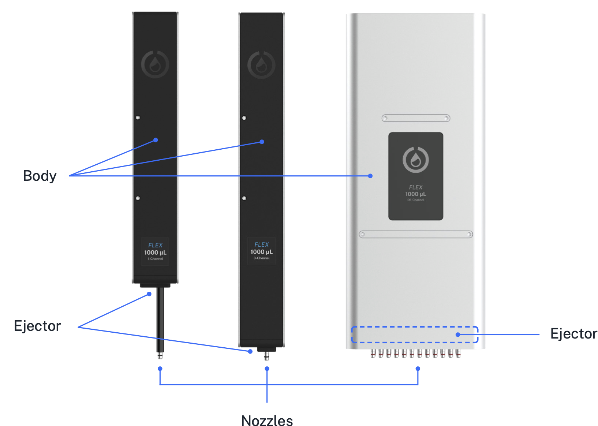
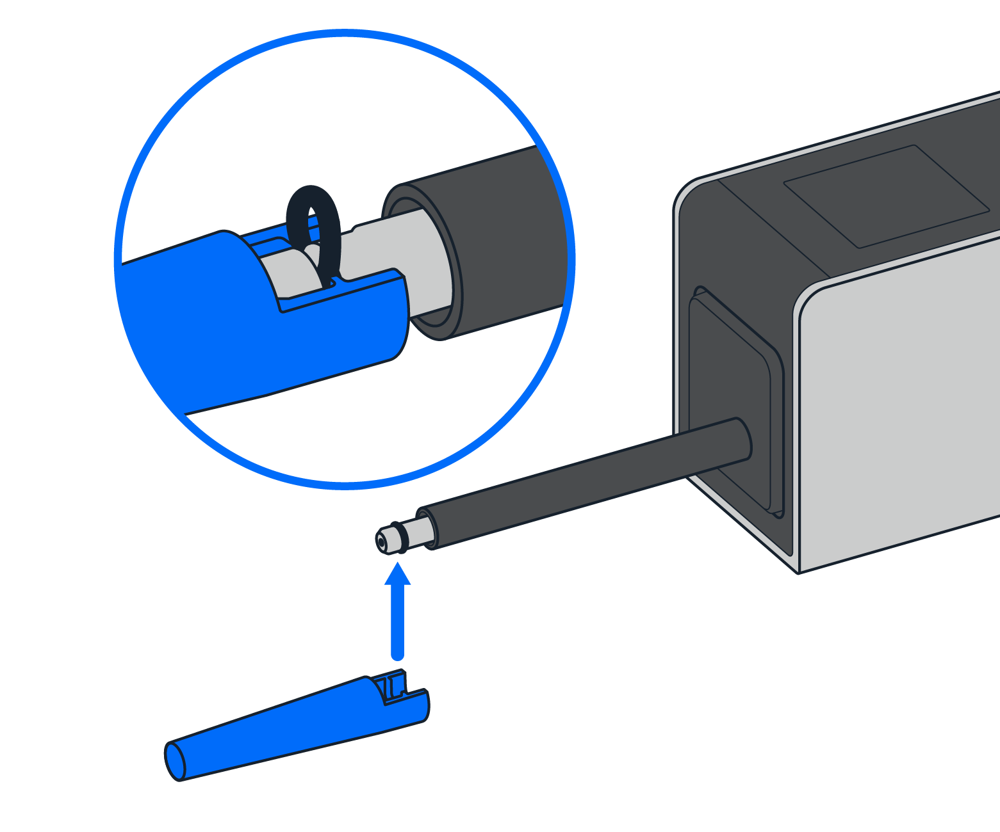
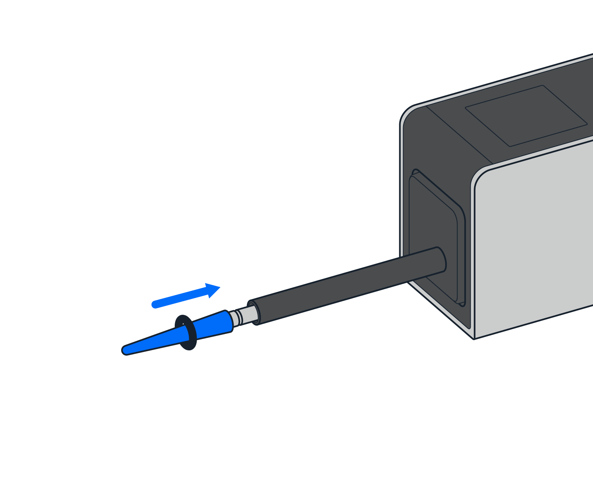
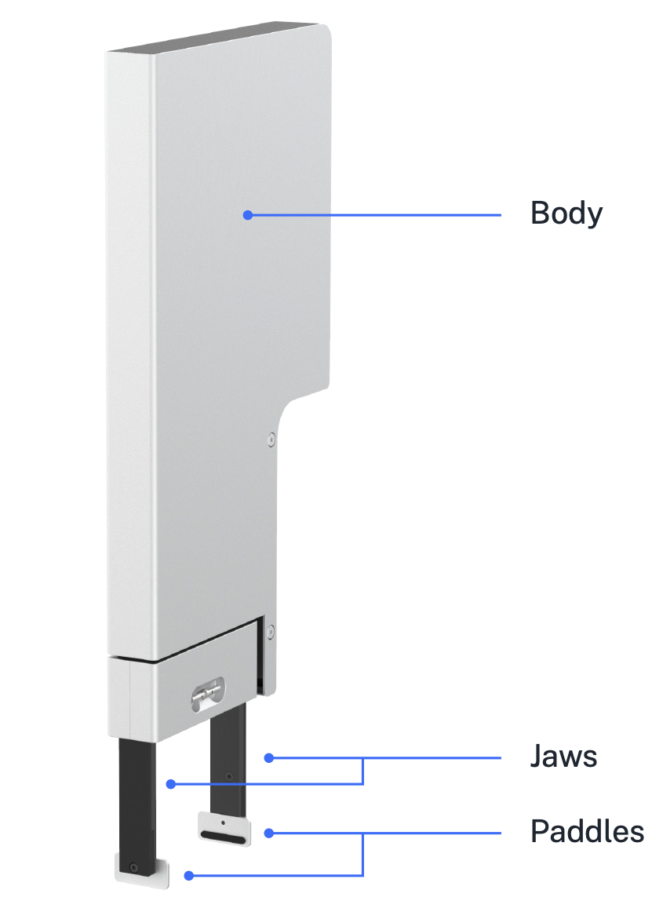
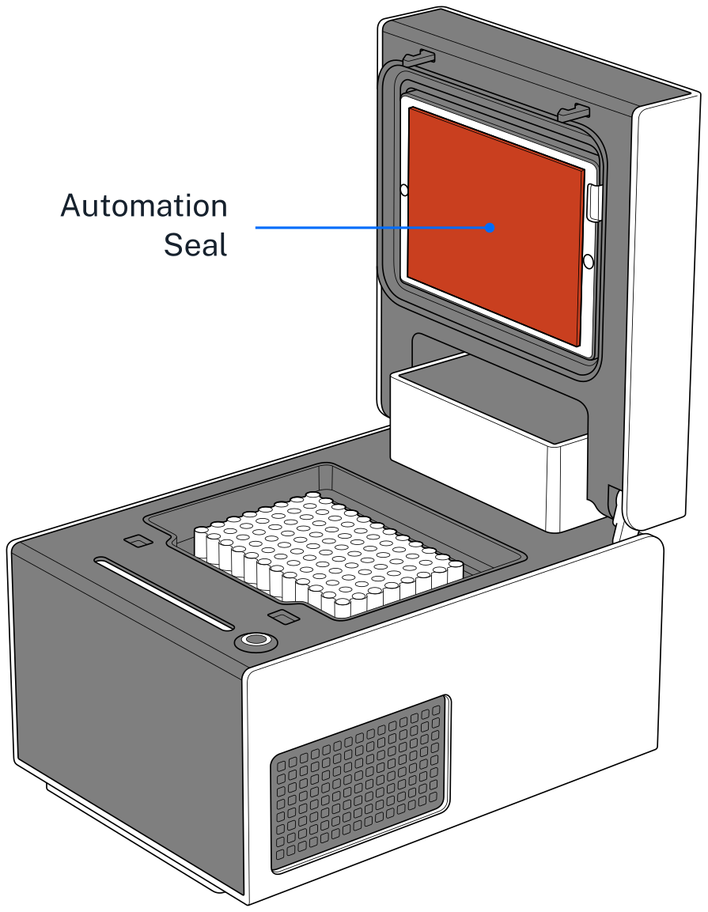

Routine cleaning helps keep Flex free of contaminants that can affect your protocols. Cleaning also gives you a chance to inspect the robot for wear and damage. You should review this section for information, instructions, and resources about how to clean your Flex, pipettes, gripper, modules, and other hardware.

If you have any questions about cleaning your Flex and its related components, contact the support team at <support@opentrons.com>.

## Before you begin

Flex is an electrically powered mechanical device. As a good practice, [turn off the power](../touchscreen/dashboard.md#dashboard-settings) before you start cleaning it and before reaching inside the enclosure. You may even want to unplug the robot as well. These are simple safety steps you can take to make the robot inoperable until you're finished.

Along with turning the power off, remove any instruments, modules, and labware before cleaning the robot. Removing attached items gives you more room to work and provides better access to the deck, gantry, and other spaces.

### What you can clean

You can wipe off all the visible and easily accessible surfaces of your Flex. This includes the exterior and interior frame, touchscreen, windows, gantry, and deck. The Flex does not have any internal parts that you need to open or disassemble for this level of maintenance. If you can see it, you can clean it. If you can't see it, don't clean it.

### Cleaning solutions

The following table lists the chemicals you can use to clean your Flex. Diluted alcohol and distilled water are our recommended cleaning solutions, but you can refer to this list for other cleaning options. You can also use these chemicals to clean modules, pipettes, and other attached hardware.

!!! warning
    *Do not use acetone.* The robot, pipettes, and modules are made from materials that acetone can damage or dissolve.

| Solution | Recommendations |
|----|----|
| **Alcohol** | Includes ethyl/ethanol, isopropyl, and methanol. Dilute to 70% for cleaning. Do not use 100% alcohol. |
| **Bleach** | Dilute to 10% (1:10 bleach/water ratio) for cleaning. Do not use 100% bleach. |
| **Distilled water** | You can use distilled water to clean or rinse your robot. |

## Frame and window panel cleaning

To clean the exterior and interior frame and window panels of your Flex:

1. Dampen a soft, clean cloth or paper towel with a cleaning solution.
2. Gently wipe off the exposed and easily accessible surface areas.
3. Rinse off any remaining residue using a cloth dampened with distilled water.
4. Let the robot air dry.

## Deck cleaning

To clean the deck, deck slots, and trash bin:

1. Dampen a soft, clean cloth or paper towel with a cleaning solution.
2. Gently wipe off the deck, deck slots, and trash bin. You can remove the deck slots and trash bin for easier access.
3. Rinse off any remaining residue using a cloth dampened with distilled water.
4. Let the deck pieces air dry. Replace any items that you removed for cleaning.

## Gantry cleaning

To clean the gantry:

1. Dampen a soft, clean cloth or paper towel with a cleaning solution.
2. Gently wipe off the horizontal and vertical gantry surfaces, and side rails.
3. Rinse off any remaining residue using a cloth dampened with distilled water.
4. Let the gantry air dry.

## Waste chute cleaning

To clean the waste chute:

1. Remove the waste chute from its deck plate adapter.
2. Dampen a soft, clean cloth or paper towel with a cleaning solution.
3. Gently wipe down the exterior of the chute. The interior is powder-coated steel, so you can clean it with mild detergents or surfactants.
4. Rinse off any remaining residue using a cloth dampened with distilled water.
5. Let the waste chute air dry.
6. Reattach the waste chute to its deck plate adapter.

## Pipette cleaning

To clean a 1-, 8-, or 96-channel pipette:

1. Remove the pipette from the gantry.
2. Dampen a soft, clean cloth or paper towel with a cleaning solution.
3. Gently wipe down the following parts:
    - Body
    - Ejector
    - Nozzles
4. Rinse off any remaining residue using a cloth dampened with distilled water.
5. Let the pipette air dry.
6. Reattach the pipette to the gantry. When prompted, recalibrate the pipette (optional, but recommended).

!!! warning
    - *Do not* disassemble Flex pipettes for cleaning or attempt to clean their internal electronic components.
    - *Do not* put Flex pipettes in an autoclave. The high temperatures, pressures, and steam used inside an autoclave can damage the electronics, circuit boards, small electric motors, and other sensitive components.

## Pipette decontamination

The routine cleaning steps described above may not clean your pipette if it becomes contaminated with substances like nucleic acids, proteins, or radioactive material. When a pipette becomes contaminated, try the decontamination steps described in this section. You can also contact support if your pipette gets contaminated and these cleaning procedures do not work.

#### Outside of the pipette

Refer to the following table for recommended cleaning methods, by contamination type.

| Contaminant  | Cleaning recommendation |
|--------------|-------------------------|
| **Aqueous solutions**   | Rinse the contaminated parts with distilled water or 70% ethanol and air dry at 15.5 °C (60 °F).         |
| **Nucleic acids**       | Clean the contaminated parts in a glycine/HCl buffer (pH 2) for 10 minutes, rinse with distilled water, and air dry. |
| **Organic solvents**    | Allow the solvent to evaporate on its own or immerse the pipette *nozzle only* in a detergent, rinse with distilled water, and air dry. |
| **Proteins**            | Clean the contaminated parts with a detergent, rinse with distilled water, and air dry. *Do not* use alcohol. That will set the proteins. |
| **Radioactive materials** | Place the pipette nozzle in a solution like Decon 90, rinse with distilled water, and air dry.         |

#### Inside the pipette

Filtered pipette tips help prevent contaminating the barrel or inside of the pipette. But, you cannot disassemble the barrel if it becomes contaminated. If the inside of your pipette gets contaminated, the following steps may help remove the contamination:

1. Remove the pipette from the gantry.
2. Inject a small amount of cleaning solution into the barrel using a manual pipette or syringe.
3. Gently shake the pipette to swirl the cleaning solution.
4. Rinse with distilled water.
5. Let the pipette air dry.
6. Reattach the pipette to the gantry. When prompted, recalibrate the pipette (optional, but recommended).

## Pipette O-ring replacement

You can replace the O-rings on Flex 1- and 8-channel pipettes if they become worn or broken. Each pipette ships with a set of replacement O-rings and a special two-piece tool to help with this procedure.

You should not try to change the O-rings on a 96-channel pipette. The limited clearance between nozzles can make replacement difficult and may damage the instrument. Contact Opentrons Support if you believe the O-rings on your 96-channel pipette are worn or damaged and need to be replaced.

!!!note
    Flex and OT-2 pipette O-rings are not interchangeable.

Follow these instructions to replace the O-rings on your Flex 1- and 8-channel pipettes:

1.  Attach the O-ring removal tool to the pipette nozzle.

  {width="50%"}

2.  Rotate and pull gently to remove the O-ring. The O-ring may break during removal, which is common.

3.  Place the wide base of the O-ring installation tool against the pipette nozzle and roll the new O-ring onto the nozzle.

  {width="50%"}

## Pipette tip cleaning

Flex pipette tips are disposable items. You can autoclave and reuse them if your protocol allows it. For best results, we recommend using clean, fresh tips. Discard pipette tips after you no longer need them. You can purchase [replacement tips](https://opentrons.com/products/categories/tips-&-labware) directly from Opentrons.

## Gripper cleaning

To clean the gripper:

1. Remove the gripper from the gantry.
2. Dampen a soft, clean cloth or paper towel with a cleaning solution.
3. Gently wipe down the following parts:
    - Gripper body
    - Jaws
    - Paddles
4. Rinse off any remaining residue using a cloth dampened with distilled water.
5. Let the gripper air dry.
6. Reattach the gripper to the gantry. When prompted, recalibrate the gripper (optional, but recommended).

{width="50%"}

!!! warning
    - *Do not* disassemble the gripper for cleaning or attempt to clean its internal electronic components.
    - *Do not* put the gripper in an autoclave. The high temperatures, pressures, and steam used inside an autoclave can damage the electronics, circuit boards, small electric motors, and other sensitive components.

### Gripper paddles

The gripper paddles are wear items that require periodic replacement. When cleaning the gripper, inspect the rubber pads for tears, nicks, or other wear. Replace the paddles as needed with the two spares (included with the gripper). If you need additional gripper paddles, contact Opentrons Support at <support@opentrons.com>.

!!! note
    Aggressive cleaning chemicals may reduce the lifetime of the rubber pads on the gripper paddles.

## Module cleaning

You can clean the surfaces of any of your Flex modules. The general procedure is the same for all supported modules: Heater-Shaker, Magnetic Block, Temperature, and Thermocycler.

Be sure to turn the module's power off before cleaning it. You can clean the top surfaces of modules while they're installed in a deck slot. However, for better access, you may want to:

- Remove the caddy and module from the deck slot.
- Remove the module from the caddy.
- Disconnect any USB or power cables (if you're cleaning a powered module).

!!! warning
    - *Do not* disassemble modules for cleaning or attempt to clean their internal electronic components.
    - *Do not* put Flex modules in an autoclave. The high temperatures, pressures, and steam used inside an autoclave can damage the electronics, circuit boards, small electric motors, and other sensitive components.

### General module cleaning

Once you've prepared the module for cleaning:

1. Dampen a soft, clean cloth or paper towel with a cleaning solution.
2. Gently wipe off the module's surfaces.
3. Rinse off any remaining residue using a cloth dampened with distilled water.
4. Let the module air dry.

### Thermocycler seals

To set up the Thermocycler with a clean seal:

1. Affix a seal to the Thermocycler lid (if one isn't attached already).
2. Wipe the seal with a 1:10 diluted bleach solution.
3. Rinse the seal with molecular biology grade water.
4. Let the seal air dry.

{width="50%"}

## Autoclaving labware

Opentrons doesn't recommend re-using autoclaved labware with a Flex. The heat and pressure may cause items to warp or shrink, even if they're considered "autoclave safe." While autoclaved labware may be acceptable for quick, proof-of-concept testing, it's always better to use fresh labware for production runs, which helps ensure the best results. You can find Flex-compatible labware in the [Opentrons Labware Library](https://labware.opentrons.com/) and on the [Tips & Labware section](https://opentrons.com/products/categories/tips-&-labware) of our website.
