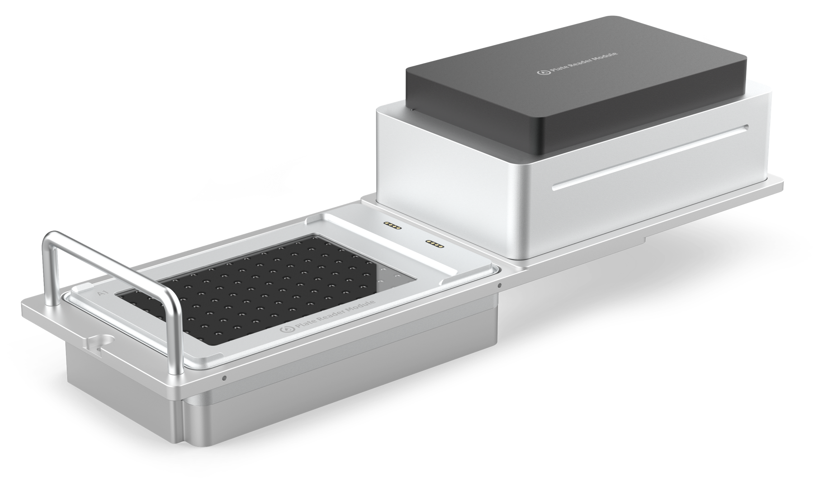

# Absorbance Plate Reader Module

!!! info "Additional Documentation"
    For complete instructions on module installation and use, see the Absorbance Plate Reader Instruction Manual.

## Plate reader features

The Opentrons Absorbance Plate Reader Module is a deck-mounted, fully automated spectrophotometer. It uses light absorbance to determine sample concentrations. This module is ideal for a broad array of applications, including protein quantification, sample normalization, cell viability assays, and bacterial growth monitoring. The plate reader is designed for indoor laboratory research and other non-in-vitro diagnostic analyses.

!!!note
    The Opentrons Flex Absorbance Plate Reader Module may currently not be offered, used or put on the market in any European Patent Convention States due to a third-party patent application.

### Measurement capabilities

The plate reader uses 96 separate detection units for rapid sample analysis. The detection units use light in the 400–700 nanometer (nm) range to determine sample concentrations.

### Gripper compatibility

The Opentrons Flex Gripper is required when using the plate reader. The gripper is needed to move labware and the plate reader's lid, onto and off the module.

### Deck placement

The plate reader fits in deck slots A3–D3 only. It comes preinstalled in a caddy, which helps secure the unit to the deck. This module does not require calibration, but you can run Labware Position Check on any installed labware.

### Software control

The plate reader is fully programmable in Protocol Designer and the Python Protocol API.

## Plate reader specifications

<table>
    <tr>
        <th>Specification</th>
        <th>Description</th>
    </tr>
    <tr>
        <td><strong>Dimensions</strong></td>
        <td>155.3 mm L x 95.5 mm W x 57 mm H</td>
    </tr>
    <tr>
        <td><strong>Weight</strong></td>
        <td>~790 g</td>
    </tr>
    <tr>
        <td><strong>Module power</strong></td>
        <td>
            <ul>
                <li>Input: USB 5 VDC, 3 A</li>
                <li>Consumption: 2.5 W</li>
                <li>Fuse: 1 A (very fast acting)</li>
            </ul>
        </td>
    </tr>
    <tr>
        <td><strong>Detection</strong></td>
        <td>
            <ul>
                <li>Hardware: 96 photodiodes</li>
                <li>Wavelengths: The plate reader emits light in the visible spectrum at 450 nm (blue), 562 nm (green), 600 nm (orange) and 650 nm (red).</li>
            </ul>
        </td>
    </tr>
    <tr>
        <td><strong>Measurement methods</strong></td>
        <td>
            <ul>
                <li>Method: Absorbance</li>
                <li>Techniques: Endpoint and kinetic</li>
                <li>Range: 0–4.0 OD</li>
                <li>Resolution: 0.001 OD</li>
            </ul>
        </td>
    </tr>
    <tr>
        <td><strong>Accuracy</strong></td>
        <td>The maximum deviation between the determined value and the true value.  At 405 nm:
            <ul>
                <li>≤ 1.5% + 0.010 OD from 0.0–2.0 OD</li>
                <li>≤ 3% + 0.010 OD from 2.0–3.0 OD</li>
            </ul>At or above 450 nm:
            <ul>
                <li>≤ 1% + 0.010 OD from 0.0–2.0 OD</li>
                <li>1.5% + 0.010 OD from 2.0–3.0 OD</li>
            </ul>
        </td>
    </tr>
    <tr>
        <td><strong>Linearity</strong></td>
        <td>The maximum deviation between the true and determined increase of the value.  At 405 nm:
            <ul>
                <li>≤ 1.5% from 0.0–2.0 OD</li>
                <li>≤ 3% 2.0–3.0 OD</li>
            </ul>At or above 450 nm:
            <ul>
                <li>≤ 1% from 0.0–2.0 OD</li>
                <li>≤ 1.5% from 2.0–3.0 OD</li>
            </ul>
        </td>
    </tr>
    <tr>
        <td><strong>Reproducibility</strong></td>
        <td>The maximum deviation between the determined values when the measurement is repeated directly. 
            <ul>
                <li>≤ 0.5% + 0.005 OD from 0.0–2.0 OD</li>
                <li>≤ 1% + 0.010 OD from 2.0–3.0 OD</li>
            </ul>
        </td>
    </tr>
</table>
