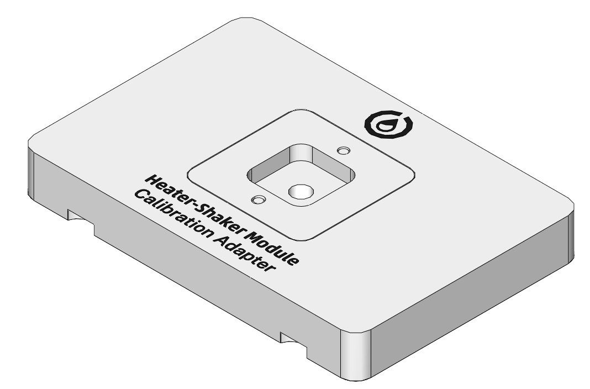
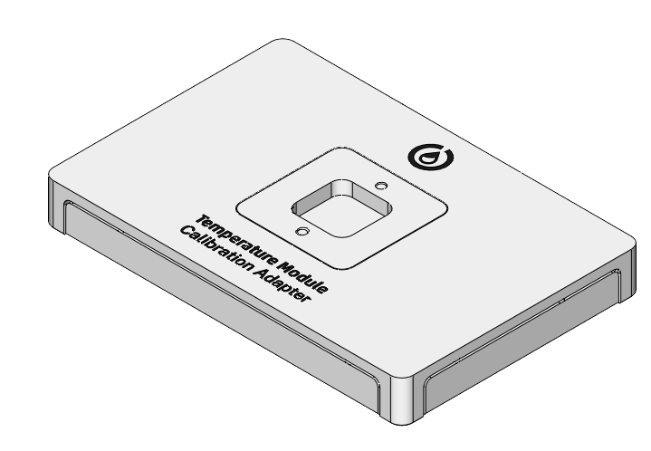
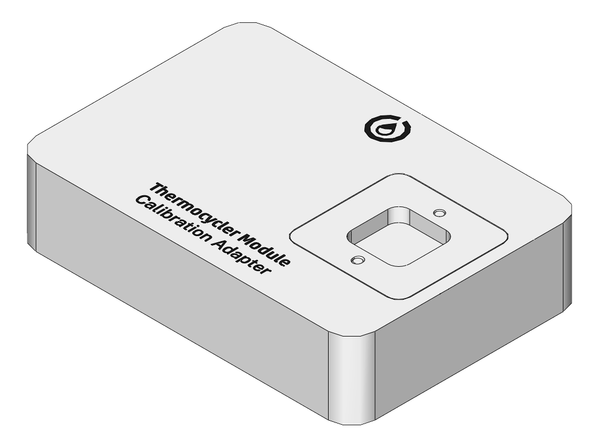

When you first install a module on Flex, you need to run automated positional calibration. This process is similar to positional calibration for instruments, and ensures that Flex moves to the exact correct locations for optimal protocol performance. During calibration, Flex will move to locations on a *module calibration adapter*, which looks similar to the calibration squares that are part of removable deck slots.

<figure class="side-by-side" markdown>

<figcaption>
Calibration adapters for the Heater-Shaker, Temperature, and
Thermocycler Modules.
</figcaption>
</figure>

Calibration is required for some modules that use a separate caddy, specifically the Heater-Shaker, Temperature, and Thermocycler Modules.

Other modules do not require calibration and are ready for use upon installation. These include the Absorbance Plate Reader Module (which ships preinstalled in its caddy), the HEPA/UV Module, and the Magnetic Block.

## When to calibrate modules

Flex automatically prompts you to perform calibration when you connect and power on a module that doesn't have any stored calibration data. (You can dismiss this prompt, but you won't be able to run protocols with the module until you calibrate it.)

Once you've completed calibration, Flex stores the calibration data and module serial number for future use. Flex won't prompt you to recalibrate unless you delete the calibration data for that module in the robot settings. You can freely power your module on and off, or even move it to another deck slot, without needing to recalibrate. If you want to recalibrate, you can begin the process at any time from the module card in the Opentrons App. (Recalibration is not available from the touchscreen.)

## How to calibrate modules

Instructions on the touchscreen or in the Opentrons App will guide you through the calibration procedure. In general the steps are:

1.  Gather the required equipment, including the module calibration adapter and pipette calibration probe.

2.  Place the calibration adapter on the module surface and ensure that it is completely level. Some modules may require you to fasten the adapter to the module.

3.  Attach the calibration probe to a pipette.

4.  Flex will automatically move to touch certain points on the calibration adapter and save these calibration values for future use.

Once calibration is complete and you've removed the adapter and probe, the module will be ready for use in protocols.

At any time, you can view and manage your module calibration data in the Opentrons App. Go to **Robot Settings** for your Flex and click on the **Calibration** tab.
